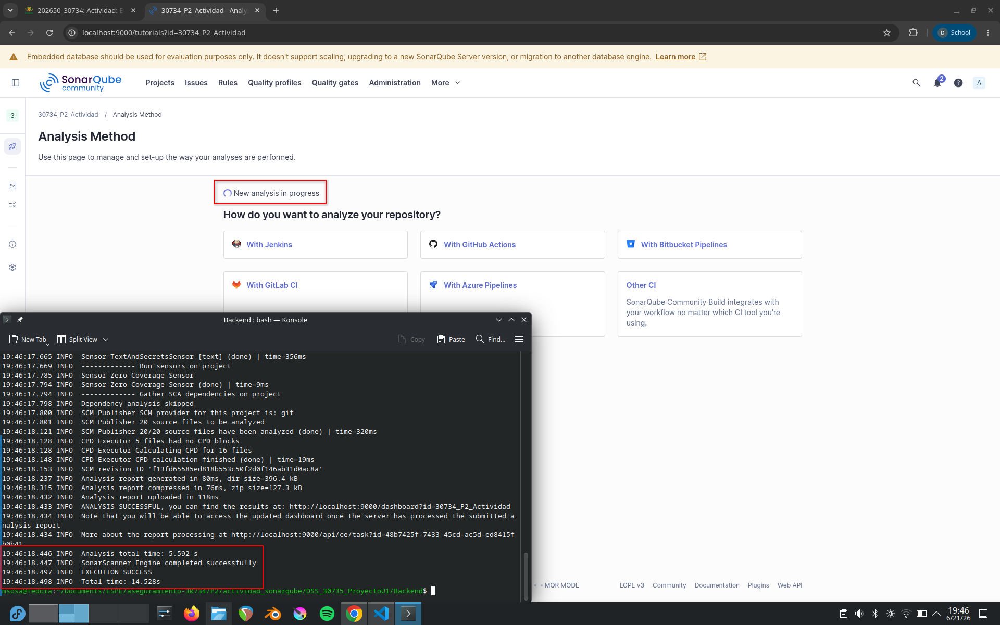
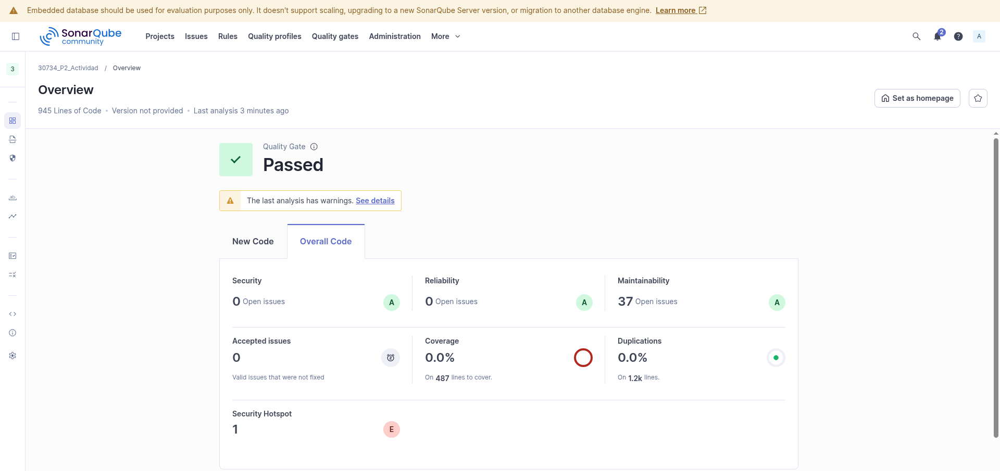
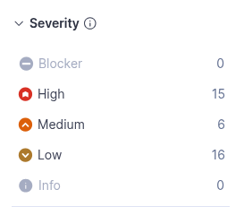
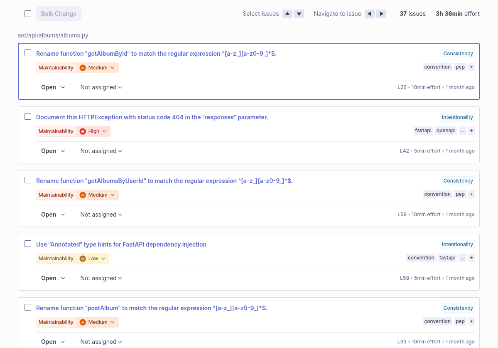

# Introducción

Desde la creación del software, han existido diferentes vulenrabilidades dependiendo la calidad y seguridad del software.
Esto ha llevado al desarrollo de software inseguro por mucho tiempo, especialmente en sus inicios.
Sin embargo, con el gran uso y avance de la tecnología y la gran cantidad de datos confidenciales que se procesan a día de hoy para operaciones totalmente necesarias, es que se ha enfocado en desarrollar ciertas normativas para poder conocer qué tan seguro y efectivo puede ser el proyecto desarrollado.

En esta actividad, se realizará un análisis mediante una herramienta de uso libre denominada _SonarQube_ para revisar aquellos incidentes frecuentes que limitan la efectividad y escalabilidad del código.

De parte del proyecto, [SecureFrame Gallery](https://github.com/IMarcusDev/DSS_30735_ProyectoU1) es una aplicación web segura para la gestión de una galería pública de imágenes. El núcleo del proyecto es la detección automatizada de esteganografía en archivos subidos por usuarios, combinada con un flujo de aprobación por roles y controles de seguridad aplicados en todas las capas del SDLC.

## Metodología Aplicada

En base al proyecto, la metodología utilizada fue _DevSecOps_ y _Left Shift_, las cuales integran prácticas de seguridad desde las primeras etapas del ciclo de vida del software.

# Revisión

Para la revisión del proyecto, se utilizará únicamente la sección del _backend_, la cual es más propensa a generar fallos de mantenimiento.

Dentro de la figura \ref{sq_summary} se visualiza un resumen general del análisis del proyecto.
En este se pueden apreciar ciertas métricas que, se espera en un proyecto empresarial, deberían mantenerse con una valoración de **A** y una cantidad de incidentes de 0 o cercana a 0.

En las figuras \ref{sq_issues} y \ref{sq_issues1}, se pueden apreciar el número de errores existentes dentro del código, sean estos de mantenibilidad como de seguridad.
Estos, además, están catalogados dentro de la calidad del software a la que comprometan, en este caso, todas comprometen a la mantenibilidad del proyecto.

## Índice de Calidad

Un dato importante a destacar es que la cantidad de líneas de código analizadas dentro del proyecto es de **945** líneas de código analizadas.

Las fórmulas utilizadas para medir el indice de calidad de un proyecto de software en base a la severidad de sus incidentes es: 

$$ \text{Índice de Calidad} = 100 - \text{Reglas Incumplidas} $$

$$ \text{Reglas Incumplidas} = 100 * \frac{\sum_{n = 1}^{5} \text{Número de Errores}_i * \text{Puntuación Error}_i}{\text{Número Líneas Código}} $$

La tabla siguiente muestra la calificación del índice de calidad que debería tener el proyecto por cada incidente:

| Severidad | Calificación |
|:---:|:---:|
| Blocker | 10 |
| High | 4 |
| Medium | 3 |
| Low | 1 |
| Info | 0 |

: Calificación de Incidente dependiendo su Severidad

Num Errores | Tipo Error | Total | 
:---:|:---:|:---:|
0 | Blocker | $ 0 * 10 = 10 $ |
15 | High | $ 15 * 4 = 60 $ |
6 | Medium | $ 6 * 3 = 18 $ |
16 | Low | $ 16 * 1 = 16 $ |
0 | Info | 0 |

: Total de Calificación por Incidente

Ahora, el proceso del cálculo del índice de calidad haciendo uso de las fórmulas mencionadas anteriormente sería:

$$ \text{Reglas Incumplidas} = 100 * \frac{(10 + 60 + 18 + 16 + 0)}{945} = 11.01\% $$

$$ \text{Indice de Calidad} = 100 - 11.01 = 88.99\% $$

Para el proyecto _SecureFrame Gallery_, el índice de calidad calculado para la sección del _backend_ es de $88.99\%$.

# Acciones de Mejora

1. Revisar los métodos y funciones que presentan una alta complejidad ciclomática, aplicando principios de refactorización para dividir responsabilidades y mejorar la legibilidad. Esto facilitará el mantenimiento y reducirá la probabilidad de introducir errores durante futuras modificaciones.

2. Establecer guías de desarrollo basadas en buenas prácticas y realizar revisiones de código periódicas mediante *pull requests*. Esto permitirá detectar problemas de mantenibilidad antes de que lleguen a producción y mantener una calidad uniforme en todo el proyecto.

3. Debido a que los errores de severidad *High* representan la mayor contribución al índice de calidad negativo, se recomienda priorizar su resolución. La corrección de estos incidentes tendrá el mayor impacto en la mejora de la calidad general del proyecto.

4. Desarrollar pruebas unitarias e integrales para los módulos críticos del backend, especialmente aquellos relacionados con autenticación, autorización y procesamiento de archivos. Una mayor cobertura de pruebas ayuda a detectar fallos tempranamente y reduce riesgos durante el despliegue.

5. Incorporar la ejecución automática de _SonarQube_ dentro del proceso de Integración Continua (CI/CD), definiendo *Quality Gates* que impidan la integración de cambios cuando se detecten vulnerabilidades o problemas de mantenibilidad por encima de los umbrales establecidos.
