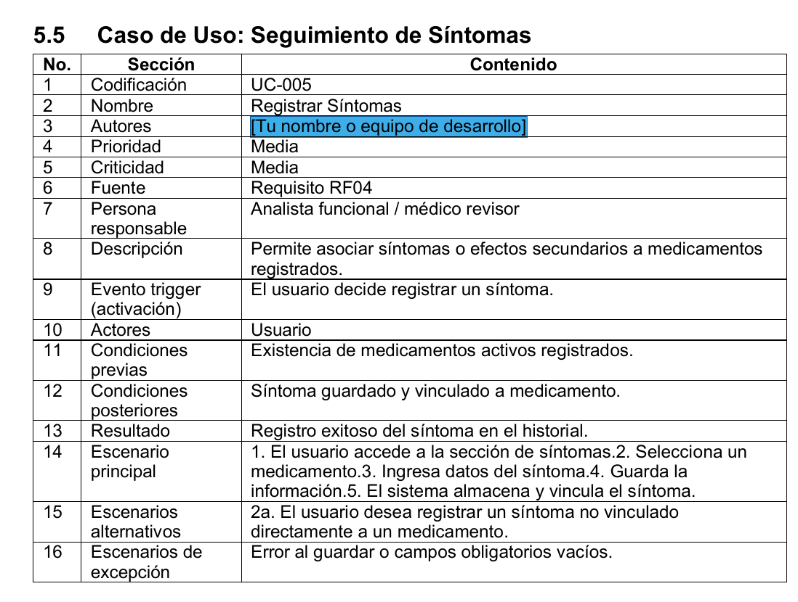
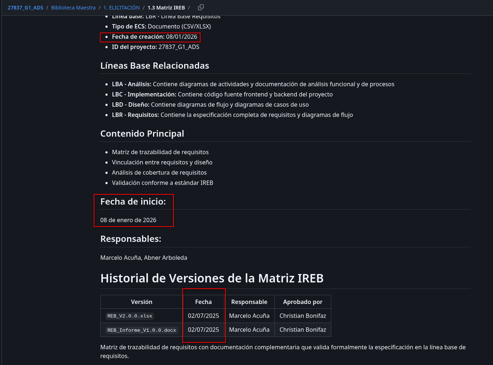
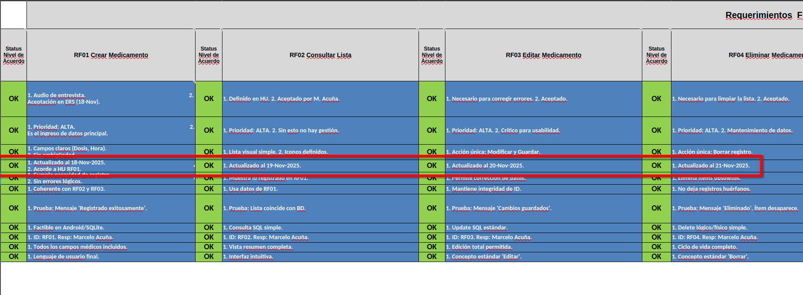
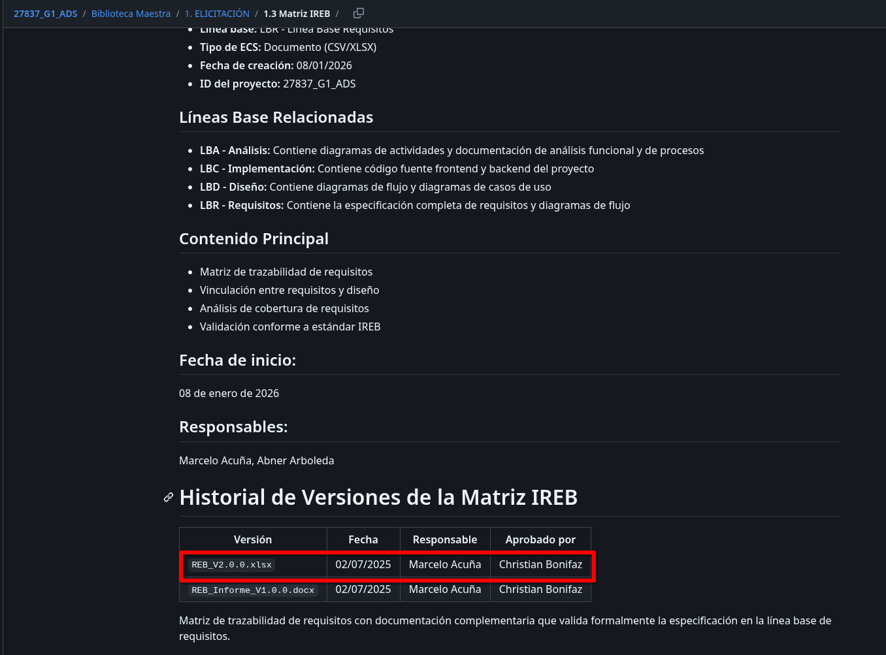
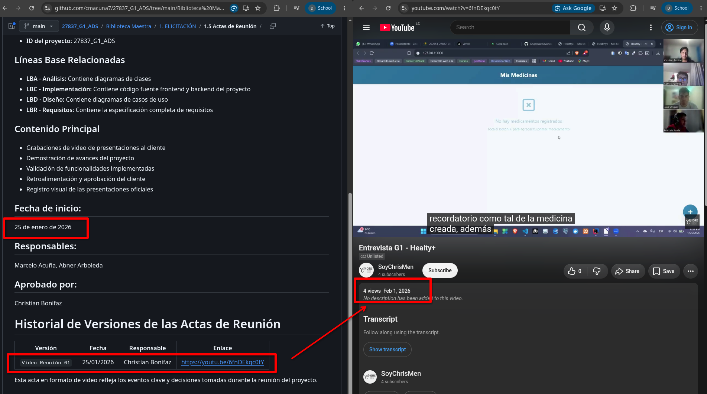
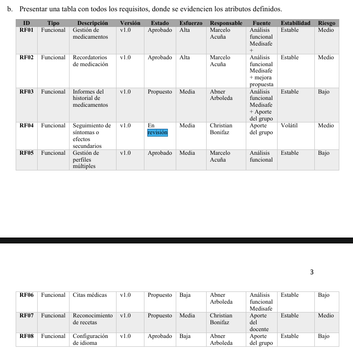

**04-I. Checklist de Auditoría SQA — Versión Individual**

**4.1 Control Documental**

Código del documento: PLA-SQA-CHK-001-I

Versión: 1.0

Fecha de emisión: 26/07/2026

Proyecto/Organización: Auditoría interna SQA al proyecto Healthy+

Auditor (integrante): Mateo Sosa

Área / Fase auditada: Planificación y Requisitos

Elaborado por: Mateo Sosa

Revisado por: Marcos Escobar (Auditor Líder)

**4.2 Historial de Cambios**

| **Versión** | **Fecha** | **Descripción del cambio** |
| --- | --- | --- |
| 1.0 | 26/07/2026 | Creación inicial del checklist individual. |

**4.3 Planificación Individual**

Registro de las actividades asignadas al integrante según el cronograma del Plan del Equipo de Auditoría (PLA-AUD-001).

| **Fecha** | **Actividad planificada** | **Artefacto / Evidencia a revisar** | **Estado** |
| --- | --- | --- | --- |
| 26/07/2026 | Auditar la Especificación de Requisitos del Sistema (ERS/SRS) y la Línea Base de Requisitos (LBR). | Documento ERS/SRS, Línea Base de Requisitos (LBR), registro de cambios y control de versiones. | Completado |
| 26/07/2026 | Verificar la trazabilidad entre los requisitos acordados y los artefactos de análisis y diseño. | Matriz de trazabilidad de requisitos, casos de uso, diagramas UML (clases, secuencia, actividades), modelo de dominio. | Completado  |
| 26/07/2026 | Evaluar la completitud, la consistencia, la claridad y la vigencia de los documentos de elicitación. | Actas de reuniones, historias de usuario, entrevistas, cuestionarios, documentos de elicitación y especificación de requisitos. | Completado |

**4.4 Objetivo**

Evaluar de forma ordenada y documentada el cumplimiento de los controles de aseguramiento de calidad correspondientes al área asignada al integrante, e identificar conformidades, no conformidades y oportunidades de mejora que alimenten el checklist consolidado.

**4.5 Alcance**

Este checklist individual aplica exclusivamente a los ítems del área o fase auditada por el integrante. Los ítems no relacionados con su especialización se marcan como "No aplica".

**4.6 Checklist del Área Auditada**

Se incluyen únicamente las preguntas relevantes al área del integrante. Cada ítem debe respaldarse con evidencia objetiva en la observación.

| **Nro.** | **Pregunta** | **Cumple** | **No cumple** | **No aplica** | **Observación / Evidencia** |
| --- | --- | --- | --- | --- | --- |
| 1 | ¿La Especificación de Requisitos del Sistema (ERS/SRS) documenta de forma completa los requisitos funcionales y no funcionales del sistema? | X |  |  | No es posible confirmar exactamente si se documentó de forma completa los requisitos sin el cliente, por lo que se utilizó la [documentación de la ISO 25010](./27837_G1_ADS/Diseno_SW_Estandares_ISO_IEC_1606_25010/Diseno_SW_Estandares_ISO_IEC_1606_25010_V2.0.pdf). |
| 2 | ¿La Línea Base de Requisitos (LBR) cuenta con control de versiones y aprobación formal? | | X |  | La LBR no contiene la versión final. Se evidencia en el anexo de la LBR (véase la figura \ref{ers_matriz_requisitos}) que hay requisitos por aprobar y en revisión, pero en el acta de reunión ya está el producto completo. |
| 3 | ¿Todos los requisitos poseen un identificador único que facilite su gestión y seguimiento? | X |  |  | Cada requisito cuenta con un código único con formato (RFXX.X, RNFXX.X, CUXX.X) que permite su referencia en la documentación del proyecto. |
| 4 | ¿Existe una matriz de trazabilidad que relacione los requisitos con los artefactos de análisis y diseño? | X |  |  | [La matriz de trazabilidad](./27837_G1_ADS/Biblioteca%20Maestra/1.%20ELICITACIÓN/1.3%20Matriz%20IREB/REB_V2.0.0.xlsx) no presenta versionamiento, véase la figura \ref{ireb_version}. Además, las fechas presentadas son inconsistentes, sean dentro de la matriz (véase la figura \ref{ireb}) y en la fecha registrada de inicio y creación con la versión existente (véase la figura \ref{ireb_fecha}). |
| 5 | ¿Los requisitos se encuentran redactados de forma clara, consistente y sin ambigüedades? |  | X |  | La revisión detectó inconsistencias en autores, demostrando que ciertos requisitos no fueron completamente escritos. Véase la figura \ref{img1}. |
| 6 | ¿Los documentos de elicitación se encuentran actualizados? |  | X |  | Debido al mal versionamiento de los archivos encontrados en la Biblioteca Maestra y la ausencia de respaldos de lo requerido po el cliente, no es posible conocer si los documentos están actualizados completamente. |
| 6 | ¿Los documentos de elicitación reflejan los acuerdos alcanzados con los interesados? | X |  |  | [La reunión con el cliente](https://www.youtube.com/watch?v=6fnDEkqc0tY) muestra las capacidades del proyecto, además de la satisfacción del usuario. |
| 7 | ¿Existe evidencia de revisión y validación de los requisitos por parte de los interesados o responsables del proyecto? | X |  |  | [La reunión con el cliente](https://www.youtube.com/watch?v=6fnDEkqc0tY) presenta una revisión del funcionamiento del aplicativo, además de su confirmación sobre el proyecto. |

**4.7 Resumen del Área**

* Ítems evaluados: 8
* Ítems conformes: 6
* Ítems no conformes: 2
* Observaciones u oportunidades de mejora: El mayor problema que atravesó el equipo fue el versionamiento final de los archivos. Dado que muchas veces se encontraron archivos únicamente con su versión final y no con versiones pasadas para comprobar la trazabilidad de los documentos de elicitación, es difícil conocer cómo se ha ido desarrollando el proyecto.

**4.8 Cierre**

Este checklist individual se entrega al Auditor Líder con las evidencias objetivas registradas, para su integración en el checklist consolidado F-SQA-01.

**4.9 Anexos**

