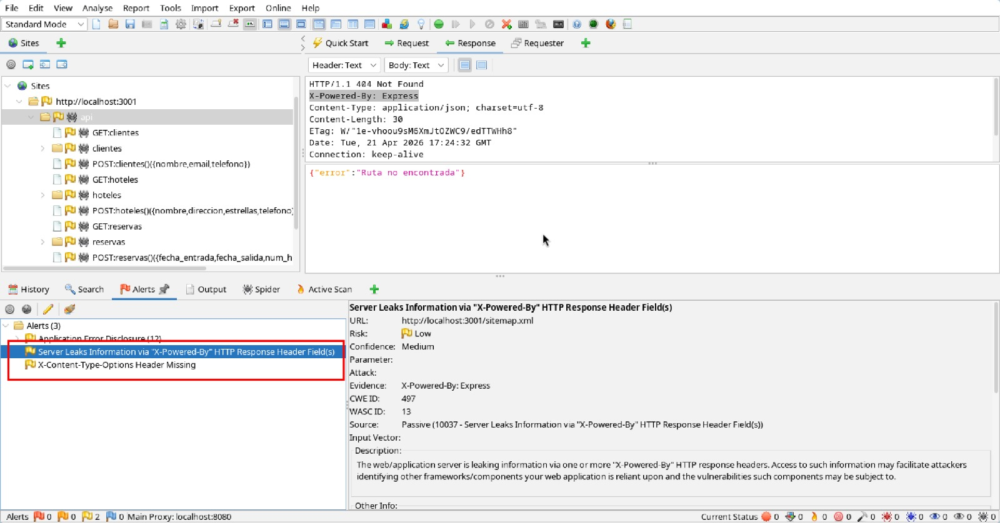
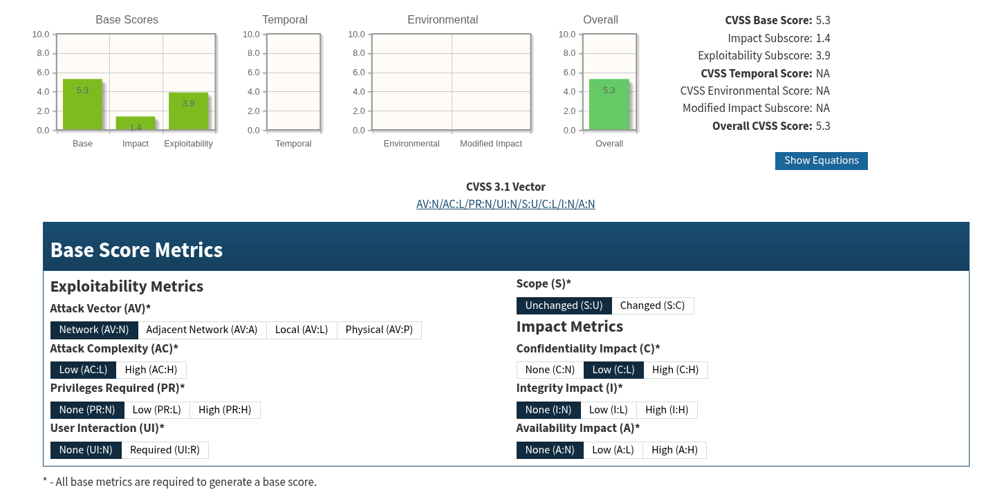
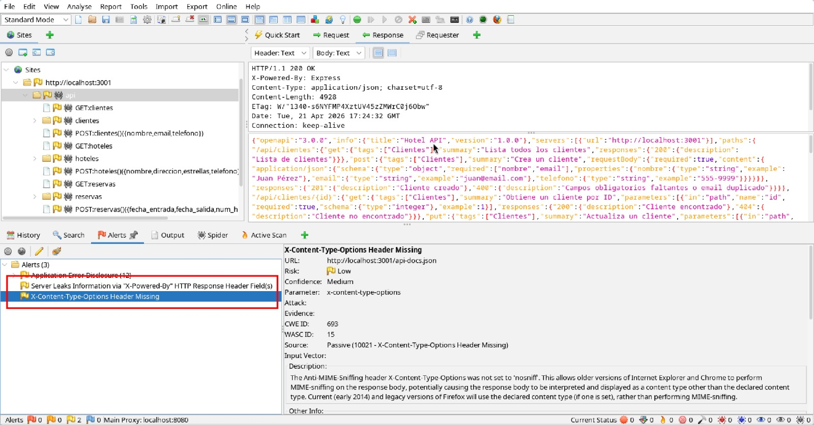
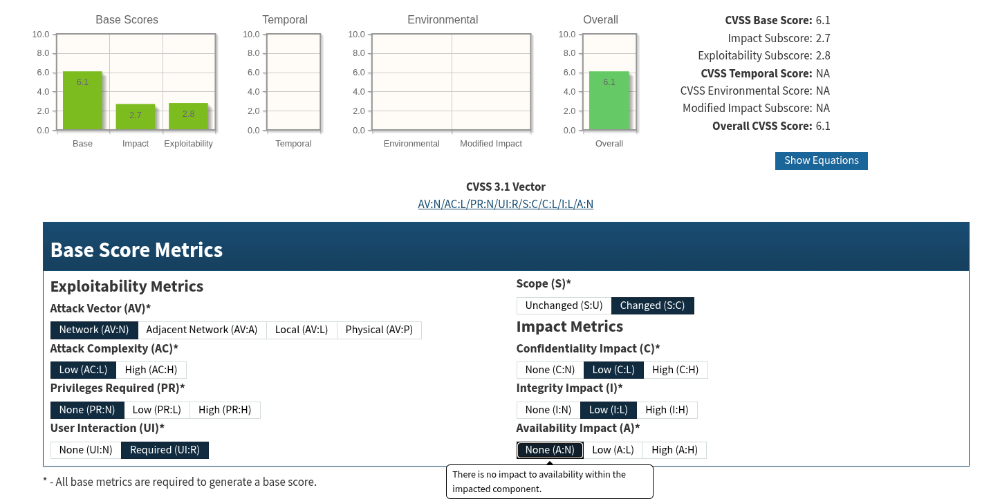

# 1: Server Leaks Information

## CWE

### Categoría

CWE-497

### Descripción

Los productos basados ​​en red, como las aplicaciones web, suelen ejecutarse sobre un sistema operativo o un entorno similar. Cuando el producto se comunica con terceros, se espera que los detalles del sistema subyacente permanezcan ocultos, como las rutas de los archivos de datos, otros usuarios del sistema operativo, los paquetes instalados, el entorno de la aplicación, etc. Esta información del sistema puede ser proporcionada por el propio producto o estar oculta en mensajes de diagnóstico o depuración. La información de depuración ayuda a un atacante a comprender el sistema y a elaborar un plan de ataque.

Una exposición de información ocurre cuando los datos del sistema o la información de depuración salen del programa a través de un flujo de salida o una función de registro, lo que los hace accesibles a terceros no autorizados. Aprovechando otras vulnerabilidades, un atacante podría provocar errores; la respuesta a estos errores puede revelar información detallada del sistema, además de otras consecuencias. Un atacante puede usar mensajes que revelen tecnologías, sistemas operativos y versiones de productos para optimizar el ataque contra vulnerabilidades conocidas en dichas tecnologías. Un producto puede utilizar métodos de diagnóstico que proporcionan detalles de implementación importantes, como rastreos de pila, como parte de su mecanismo de manejo de errores.

## CVSS

## CVE

No existe un CVE específico para esta vulnerabilidad, pues dependerá del lenguaje y tecnologías utilizadas para ello.

- CVE-2025-7381
- CVE-2000-0649

## Mitigación

Las aplicaciones de producción nunca deben usar métodos que generen detalles internos, como rastreos de pila y mensajes de error, a menos que dicha información se registre directamente en un archivo de registro que no sea visible para el usuario final. Todo el texto de los mensajes de error debe codificarse como entidad HTML antes de escribirse en el archivo de registro para protegerse contra posibles ataques de secuencias de comandos entre sitios (XSS) dirigidos al usuario que visualiza los registros.

# 2: X-Content-Type-Options Header Missing

## CWE

### Categoría

CWE-693

### Descripción

Esta vulnerabilidad abarca tres situaciones distintas. Un mecanismo de protección «ausente» se produce cuando la aplicación no define ningún mecanismo contra un tipo específico de ataque. Un mecanismo de protección «insuficiente» puede ofrecer cierta protección —por ejemplo, contra los ataques más comunes—, pero no protege contra todos los ataques previstos. Por último, un mecanismo «ignorado» se produce cuando existe un mecanismo disponible y en uso activo dentro del producto, pero el desarrollador no lo ha implementado en alguna ruta del código.

## CVSS

## CVE

CVE-2019-19089

## Mitigación

Para mitigar esta vulnerabilidad, es necesario implementar un enfoque de seguridad por defecto mediante el uso de frameworks estandarizados o middleware que apliquen controles defensivos y uniformes en toda la arquitectura. Además, integre auditorías de código exhaustivas y análisis estático automatizado en su ciclo de desarrollo para garantizar consistentemente que ninguna ruta de ejecución omita o ignore estas protecciones.
