# Introducción a los SGSI

## Definición

Un Sistema de Gestión de Seguridad de la Información (SGSI) es un conjunto
estructurado de políticas, procedimientos y controles diseñados para identificar,
gestionar y mitigar los riesgos asociados a la información dentro de una
organización. Su objetivo central es preservar la **Tríada CIA**:

Confidencialidad
: solo acceden a la información quienes están autorizados.

Integridad
: la información es exacta y no ha sido alterada sin autorización.

Disponibilidad
: la información es accesible cuando se necesita.

Según la norma ISO/IEC 27001:2022 — el estándar internacional de referencia —,
un SGSI es *"un enfoque sistemático para establecer, implementar, operar,
monitorear, revisar, mantener y mejorar la seguridad de la información de una
organización"* (ISO/IEC, 2022). Este enfoque es aplicable a cualquier tipo de
organización, independientemente de su tamaño o sector.

## Objetivos principales

1. Proteger los activos de información frente a amenazas internas y externas.
2. Garantizar la continuidad operativa ante incidentes de seguridad.
3. Asegurar el cumplimiento de leyes, regulaciones y contratos aplicables.
4. Generar confianza en clientes, socios y partes interesadas.

## Beneficios clave

| Beneficio | Descripción |
|---|---|
| Reducción de riesgos | Identifica vulnerabilidades antes de que sean explotadas |
| Cumplimiento normativo | Facilita el cumplimiento de RGPD, HIPAA, leyes de datos locales |
| Ventaja competitiva | La certificación ISO 27001 diferencia a la organización en el mercado |
| Mejora continua | El ciclo PHVA garantiza evolución constante del sistema |
| Confianza institucional | Demuestra compromiso formal con la protección de datos |

# Normas de referencia

El SGSI se sustenta en la **familia de normas ISO/IEC 27000**, que proporciona
un marco internacionalmente reconocido para la gestión de la seguridad de la
información (ISO/IEC, 2022).

## ISO/IEC 27001:2022 — Norma principal (certificable)

Es la norma que establece los **requisitos obligatorios** para implantar un SGSI.
Su estructura sigue el ciclo de mejora continua **PHVA** (Planificar, Hacer,
Verificar, Actuar). Fue actualizada en octubre de 2022, reorganizando sus
controles en 4 temas principales y añadiendo 11 controles nuevos relacionados
con inteligencia de amenazas, seguridad en la nube y continuidad de negocio
(ISO/IEC, 2022).

## ISO/IEC 27002:2022 — Guía de buenas prácticas

Complementa a la 27001 proporcionando guía de implementación para cada uno de
sus 93 controles de seguridad. No es certificable, pero es el manual técnico
de referencia para los controles (ISO/IEC, 2022).

## Otras normas relevantes de la familia ISO 27000

| Norma | Enfoque |
|---|---|
| **ISO/IEC 27000** | Vocabulario y definiciones del marco |
| **ISO/IEC 27005** | Gestión del riesgo de seguridad de la información |
| **ISO/IEC 27017** | Seguridad específica para servicios cloud |
| **ISO/IEC 27018** | Protección de datos personales en la nube |
| **ISO/IEC 27701** | Extensión del SGSI para gestión de privacidad (RGPD) |

# Componentes clave de un SGSI

## Gestión de riesgos

Es el núcleo del SGSI. Consiste en identificar activos de información (bases de
datos, sistemas, documentos), identificar amenazas y vulnerabilidades, calcular
el nivel de riesgo y decidir qué controles aplicar (ISO/IEC, 2022). El proceso
sigue cuatro pasos:

1. **Identificación** del activo y su valor para la organización.
2. **Análisis** de amenazas y vulnerabilidades asociadas.
3. **Evaluación** del riesgo (probabilidad × impacto).
4. **Tratamiento**: aceptar, mitigar, transferir o evitar el riesgo.

## Políticas de seguridad

Son los documentos formales que establecen las reglas y responsabilidades en
materia de seguridad. Deben ser aprobadas por la alta dirección y comunicadas
a todo el personal. Ejemplos: política de contraseñas, política de acceso remoto,
política de clasificación de la información, política de uso aceptable de TI.

## Controles de acceso

Garantizan que solo los usuarios autorizados acceden a los sistemas que necesitan
para su función (principio de mínimo privilegio). Incluyen autenticación
multifactor (MFA), gestión de identidades (IAM), y revisión periódica de
privilegios. Alineados con ISO 27002:2022, control 8.2 y 8.5.

## Formación y sensibilización

El factor humano es la principal causa de incidentes de seguridad. El SGSI
exige programas de capacitación continua para que el personal identifique
amenazas como phishing, ingeniería social y manejo inadecuado de datos.
La concienciación debe ser periódica y adaptada al rol de cada empleado.

## Auditorías y mejora continua

El SGSI requiere auditorías internas periódicas para verificar que los controles
funcionan y revisiones por la dirección para evaluar el desempeño global.
Cuando se detectan no conformidades, se aplican acciones correctivas.
Este proceso materializa el ciclo PHVA y distingue al SGSI de una simple
política de seguridad estática.

# Caso de estudio

## Descripción de la organización

**Notion Labs, Inc.** es una empresa estadounidense de software fundada en 2016
con sede en San Francisco, California. Desarrolla y comercializa Notion, una
plataforma SaaS de productividad y gestión del conocimiento que combina notas,
bases de datos, wikis, gestión de proyectos e inteligencia artificial en una
sola herramienta colaborativa. A 2024, Notion cuenta con más de **35 millones
de usuarios** en todo el mundo, incluyendo empresas como Figma, Pixar, Nike y
miles de startups. Sus datos se almacenan en infraestructura cloud de
**Amazon Web Services (AWS)** y cuenta con un modelo de suscripción por planes:
Free, Plus, Business y Enterprise (Notion Labs, Inc., 2024a).

Notion es un caso de estudio especialmente relevante porque maneja datos
corporativos altamente sensibles (roadmaps de producto, contratos, credenciales
de acceso, datos de clientes) y ha tenido que construir un SGSI robusto para
mantener la confianza de sus clientes empresariales (Metomic, 2024; Super.so, 2024).

## Principales riesgos de seguridad informática que enfrenta

\begin{table}[H]
\centering
\renewcommand{\arraystretch}{1.4}
\begin{tabularx}{\linewidth}{>{\centering\arraybackslash}p{0.4cm} >{\bfseries}p{2.8cm} >{\RaggedRight\arraybackslash}X >{\centering\arraybackslash}p{2cm} >{\centering\arraybackslash}p{1.8cm}}
\toprule
\textbf{\#} & \textbf{Riesgo} & \textbf{Descripción} & \textbf{Probabilidad} & \textbf{Impacto} \\
\midrule

1 & Mala Configuración de permisos &
Páginas o bases de datos con acceso público accidental que exponen información sensible.
Gartner estima que el 99\% de las brechas en la nube serán causadas por misconfiguraciones
del cliente para 2025 (Metomic, 2024). & Alto & Crítico \\

2 & Robo de credenciales / phishing &
El 86\% de las brechas de datos involucran credenciales comprometidas.
Sin MFA, cualquier contraseña filtrada da acceso completo al workspace (Frank, 2025). & Alto & Crítico \\

3 & Exposición de metadatos vía API &
Vulnerabilidad reportada en 2022: páginas públicas exponían emails de editores
a través de endpoints internos de la API sin autenticación, utilizables para phishing masivo
(Cyber Technology Insights, 2026). & Medio & Alto \\

4 & CVE-2024-23743 / CVE-2024-23745 &
Vulnerabilidades en la versión macOS de Notion que permitían ejecución de código mediante
flags no estándar (RunAsNode) y el ataque Dirty NIB en el Web Clipper (CVEDetails, 2024). & Bajo & Alto \\

5 & Integraciones de terceros inseguras &
El 98\% de las organizaciones tienen relación con terceros que han sufrido brechas.
Integraciones mal configuradas pueden dar acceso no autorizado a todos los archivos (Metomic, 2024). & Medio & Alto \\

6 & Prompt injection en Notion AI &
Con agentes AI en Notion 3.0 (2025), un PDF malicioso puede contener instrucciones ocultas
que extraigan datos confidenciales del workspace y los exfiltren externamente (Schneier, 2025). & Bajo & Crítico \\

\bottomrule
\end{tabularx}
\caption{Principales riesgos de seguridad informática de Notion}
\label{tab:riesgos_notion}
\end{table}

## Controles y políticas implementadas bajo ISO 27001:2022

### Autenticación Multifactor (MFA) y SSO obligatorios

Notion ofrece verificación en dos pasos (2FA) para todos los usuarios y,
en planes Business y Enterprise, permite implementar **SAML SSO** conectando
con proveedores de identidad corporativos como Okta, Azure AD o Google Workspace.
Esto centraliza la gestión de identidades y permite revocar accesos
inmediatamente cuando un empleado deja la empresa (Notion Labs, Inc., 2024b).
Alineado con: **ISO 27002:2022, control 8.5** (Autenticación segura).

### Cifrado de datos en tránsito y en reposo

Notion cifra todos los datos en reposo con **AES-256** y en tránsito con
**TLS 1.2+**. Al operar sobre AWS, se aprovechan los mecanismos de cifrado
nativos de la plataforma cloud. Sin embargo, Notion **no implementa
cifrado de extremo a extremo** (E2E) por diseño, ya que esto limitaría
funciones como la búsqueda en tiempo real y la colaboración
(Notion Labs, Inc., 2024a).
Alineado con: **ISO 27002:2022, control 8.24** (Uso de criptografía).

### Gestión de accesos con mínimo privilegio (RBAC)

Notion permite asignar roles granulares por workspace, página y base de datos:
Propietario, Editor, Comentador y Lector. En Enterprise, los administradores
pueden crear **grupos de usuarios** para gestionar accesos colectivamente,
revisar permisos trimestralmente y recibir alertas ante comparticiones externas
no autorizadas. La revisión periódica de accesos es obligatoria bajo
ISO 27001:2022 (Notion Labs, Inc., 2024b).
Alineado con: **ISO 27002:2022, control 8.2** (Derechos de acceso privilegiado).

### Data Loss Prevention (DLP) mediante integraciones

Notion no incluye DLP nativo, pero en el plan Enterprise permite integrar
soluciones especializadas como **Polymer DLP** o **Strac DLP**, que escanean
el workspace en tiempo real detectando y redactando automáticamente información
sensible (números de tarjeta, datos de salud PHI, credenciales expuestas,
PII de clientes) (Notion Labs, Inc., 2024b; Polymer HQ, 2024).
Alineado con: **ISO 27002:2022, control 8.12** (Prevención de fuga de datos).

### Auditorías internas y programa de bug bounty

Notion es auditado anualmente por terceros independientes para mantener sus
certificaciones. Adicionalmente, cuenta con un **programa de bug bounty** a
través de HackerOne, donde investigadores de seguridad pueden reportar
vulnerabilidades de forma responsable a cambio de recompensas (Frank, 2025). Las
vulnerabilidades CVE-2024-23743 y CVE-2024-23745 fueron identificadas
y corregidas mediante este programa (CVEDetails, 2024).
Alineado con: **ISO 27002:2022, controles 8.8 y 5.7** (Gestión de
vulnerabilidades técnicas e inteligencia de amenazas).

### Formación y sensibilización del equipo interno

Notion exige capacitación en seguridad para sus empleados y publica guías
de mejores prácticas para administradores de workspace empresariales
(Notion Labs, Inc., 2024b). El principal vector de riesgo documentado no es
técnico sino humano: misconfiguraciones, uso de contraseñas débiles y
compartición accidental de páginas con datos sensibles (Frank, 2025).
Alineado con: **ISO 27002:2022, control 6.3** (Concienciación, educación
y formación en seguridad).

## Certificaciones obtenidas

Notion ha alcanzado las siguientes certificaciones de seguridad y privacidad,
demostrando la madurez de su SGSI (Notion Labs, Inc., 2024a):

| Certificación | Alcance |
|---|---|
| **ISO/IEC 27001:2022** | Sistema de Gestión de Seguridad de la Información |
| **ISO/IEC 27701** | Sistema de Gestión de Privacidad de la Información |
| **ISO/IEC 27017** | Controles de seguridad para servicios cloud |
| **ISO/IEC 27018** | Protección de datos personales en la nube |
| **SOC 2 Type 2** | Controles de seguridad, disponibilidad y confidencialidad (AICPA) |
| **HIPAA** | Cumplimiento para datos de salud (requiere Business Associate Agreement) |
| **PCI DSS** | Manejo seguro de datos de pago |

## Resultados y beneficios obtenidos

Acceso al mercado enterprise
: las certificaciones ISO 27001 y SOC 2 Type 2 son requisito obligatorio para contratar con clientes corporativos y gubernamentales. Sin ellas, Figma, Nike o Pixar no podrían usar Notion para gestión de información sensible (Notion Labs, Inc., 2024a).

Respuesta acelerada a vulnerabilidades
: el programa de bug bounty permitió identificar y parchear CVE-2024-23743 y CVE-2024-23745 antes de que fueran explotadas masivamente, reduciendo el tiempo de exposición (CVEDetails, 2024).

Reducción del riesgo de fuga de datos
: la integración con soluciones DLP en workspaces Enterprise añade una capa de detección automática que compensa la ausencia de cifrado E2E y la debilidad inherente en la configuración de permisos por parte del usuario (Polymer HQ, 2024).

Cumplimiento normativo global
: las certificaciones ISO 27017 e ISO 27018 permiten a Notion operar con clientes europeos bajo RGPD y con proveedores de salud bajo HIPAA, expandiendo significativamente su mercado potencial (PMG-SSI, 2026).

# Conclusiones

El caso de Notion ilustra uno de los retos centrales de la seguridad informática
en la era SaaS: **la responsabilidad compartida**. La plataforma puede tener las
mejores certificaciones del mundo — ISO 27001, SOC 2, HIPAA — pero si los
administradores del workspace configuran mal los permisos, comparten páginas
públicamente sin querer o no habilitan MFA, el SGSI de Notion no puede proteger
esos datos.

Este principio, documentado por Gartner y conocido como el **modelo de
responsabilidad compartida en la nube**, establece que el proveedor es
responsable de la infraestructura, pero el cliente es responsable de cómo
usa y configura el servicio (PMG-SSI, 2026). En ese sentido, implementar un SGSI
interno alineado con ISO 27001 no solo aplica al proveedor SaaS, sino también a
cada organización que adopta herramientas cloud como Notion.

La gestión de seguridad informática no es un estado que se alcanza, sino
un proceso continuo de revisión, mejora y adaptación ante nuevas amenazas.
El surgimiento de los agentes de IA en Notion 3.0 y los ataques de prompt
injection demuestran que los riesgos evolucionan constantemente (Schneier, 2025),
y un SGSI maduro basado en ISO 27001 es la mejor estructura para anticiparlos.

# Referencias

- CVEDetails. (2024). *CVE-2024-23743 — Notion macOS code execution*.
  https://www.cvedetails.com/cve/CVE-2024-23743/

- Cyber Technology Insights. (2026). *Notion Data Exposure Reveals Editor
  Emails on Public Pages*.
  https://cybertechnologyinsights.com/data-privacy/notion-data-exposure-reveals-editor-emails-on-public-pages/

- Frank, M. (2025). *How Secure Is Notion? 11 Mistakes You Must Avoid*.
  https://matthiasfrank.de/en/notion-security/

- ISO/IEC. (2022). *ISO/IEC 27001:2022 — Information security management
  systems — Requirements*. https://www.iso.org/es/norma/27001

- Metomic. (2024). *Is Notion Secure? A Guide to Common Security Risks*.
  https://www.metomic.io/resource-centre/is-notion-secure

- Notion Labs, Inc. (2024a). *Notion Security & Compliance*.
  https://www.notion.com/security

- Notion Labs, Inc. (2024b). *Security practices — Notion Help Center*.
  https://www.notion.com/help/security-and-privacy

- PMG-SSI. (2026). *ISO 27001 y otros estándares para garantizar la
  seguridad en la nube*.
  https://www.pmg-ssi.com/2026/03/garantizar-la-seguridad-en-la-nube/

- Polymer HQ. (2024). *Is Notion secure? What you need to know about
  Notion vulnerabilities*.
  https://www.polymerhq.io/blog/is-notion-secure-what-you-need-to-know-about-notion-vulnerabilities/

- Schneier, B. (2025). *Abusing Notion's AI Agent for Data Theft*.
  Security Boulevard.
  https://securityboulevard.com/2025/09/abusing-notions-ai-agent-for-data-theft/

- Super.so. (2024). *Is Notion Secure? A Complete Look at Safety Features*.
  https://super.so/blog/is-notion-secure
