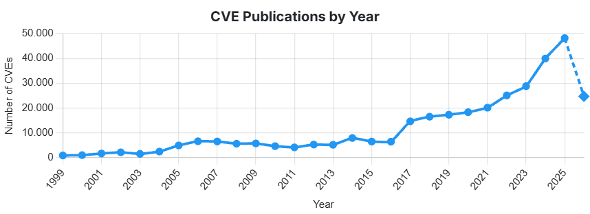

# Introducción y Estudio de Vulnerabilidades

## Introducción

En la era en la que estamos viviendo, es imposible no percatarse del Software.
El software está en todas partes.
Se ejecuta en autos, dispositivos móviles, servicios financieros, etc.
Es incluso responsable de transmitir información muy confidencial mediante programas que se conectan al internet.

Sin embargo, también es la era de la guerra de la información, ciberterrorismo y delincuencia informática.
Los terroristas, el crimen organizado y otros delincuentes se dirigen a
toda la gama de sistemas intensivos en software y, a través del
ingenio humano que salió mal, están teniendo éxito en ganar la
entrada a estos sistemas.

En el proceso de desarrollo, por lo general, no se controlan ni minimizan las vulnerabilidades que muchas veces son explotadas por atacantes.
Y es que los defectos de seguridad y vulnerabilidades son comunes.
Pero pueden representar un muy alto riesgo si son explotados por ataques maliciosos.

Existen fuentes como [CVE](https://cve.icu/) que han registrado y documentado todos los años el número de vulnerabilidades detectadas.
Por dar algunos ejemplos:

| Año | Número de Vulnerabilidades |
| --- | --- |
| 2015 | 6494 |
| 2016 | 6449 |
| 2017 | 14642 |
| 2018 | 16510 |
| 2019 | 17305 |

## ¿Qué es la Seguridad de Software?

Se refiere al conjunto de prácticas, herramientas y metodologías empleadas para diseñar, desarrollar y mantener aplicaciones libres de vulnerabilidades o defectos que puedan ser explotados por agentes maliciosos.

Su objetivo es proteger los sistemas contra amenazas, asegurar que se comporten de manera predecible ante ataques y preservar los datos manejados por las aplicaciones.

## Importancia de la Seguridad en el Software

Protección de datos sensibles
: Evita el acceso no autorizado a información crítica.

Cumplimiento normativo
: Muchas industrias, como la financiera o de salud, deben seguir regulaciones estrictas de seguridad.

Confianza del usuario
: Los usuarios prefieren sistemas seguros para evitar fraudes y pérdida de datos.

Reducción de riesgos legales y económicos
: Las brechas de seguridad pueden implicar sanciones y pérdida de reputación.

## Vulnerabilidades y sus Costes

Una vulnerabilidad es un fallo de programación, configuración o diseño que permite, de alguna manera, a los atacantes, alterar el comportamiento
normal de una aplicación/sistema y realizar algo malicioso.

### Definiciones

[CVE (Common Vulnerabilities and Exposures)](http://cve.mitre.org)
: Sistema de catalogación pública que identifica y enumera las vulnerabilidades de seguridad conocidas.

[CVSS (Common Vulnerability Scoring System)](http://nvd.nist.gov/cvss.cfm)
: Sistema que escalona la severidad de una vulnerabilidad, proporcionando un estándar para comunicar las características y el impacto de una vulnerabilidad.

CWE (Common Weakness Enumeration)
: Estándar International y de libre uso que ofrece un conjunto unificado de debilidades o defectos de software medibles.

### Principales Causas de Aparición de Vulnerabilidades

- Mezcla de Código
- Integración de Componentes
- Pruebas de Seguridad
- Entorno de Pruebas
- Complejidad del Código
- Tamaño Excesivo
- Debilidades en la Especificación de Requisitos
- Vulnerabilidades en Componentes
- Cambios de Requisitos
- Falta de Conocimientos
- Guías de Codificación
- Tolerancia de Defectos
- Mezcla de Equipos
- Cadenas de Suministros
- Nuevas Funcionalidades
- Actualizaciones Defectuosas

### Fases del Ciclo de Vida de una Vulnerabilidad

1. Descubrir
2. Utilización
3. Verificación
4. Solución
5. Difusión
6. Medidas
7. Corrección
8. Búsqueda
9. Actualizar

### Clasificación de Vulnerabilidades

[MITRE Top 25](http://cwe.mitre.org/top25/)
: Contiene los mayores errores de programación que puede causar vulnerabilidades en el software.

SANS Top 20
: Hola

OWASP Top 10
: Hola

WASC Threat Clasification v2.0
: Hola

## Gestión de Riesgos de Seguridad del Software

La Gestión de Riesgos busca identificar, analizar y mitigar riesgos operativos que puedan afectar los activos y servicios de la organización.
Esta debe seguir una metodología formal, asegurando así un proceso completo.
Si se materializan los riesgos que no se identificaron en el análisis, podría haber un grave caso dentro de la organización.

Dato
: Algo dado, sin significado por sí mismo.

Información
: El contexto de los datos, la respuesta a la pregunta.

Conocimiento
: La decisión que se puede tomar con respecto a la información.

La norma **ISO 27000** reconoce la información como un activo esencial para cualquier organización.
La información enfrenta riesgos y amenazas que deben gestionarse técnica y gerencialmente para reducir la vulnerabilidad.

### Sistema de Gestión de Seguridad Informática (SGSI)

Es un proceso sistemático, protocolizado y manejado por todos los miembros de la empresa que permite la confiabilidad, integridad y disponibilidad de la información de la misma.
Sirve principalmente para analizar los riesgos de seguridad a los que pueda enfrentarse una organización.

Se compone de cuatro procesos básicos:

1. Planificación
2. Realización
3. Verificación
4. Actuación / Ejecución

## Propiedades del Software Seguro y Resiliente

### Esenciales

Deben existir en la seguridad de cualquier sistema, pues contribuyen fuertemente a la seguridad de la aplicación.

Confidencialidad
: Los datos deben ser privados.

Integridad
: Los datos no deben ser modificados.

Disponibilidad
: Los datos deben estar disponibles en todo momento.

Autenticación
: Verifica la identidad de los usuarios.

Autorización
: Define acciones o recursos a los que puede acceder el usuario.

Auditoría
: Registra las actividades realizadas.

### Complementarias

Fiabilidad
: Capacidad del software de funcionar de la forma esperada en todas las situaciones a la que estará expuesto.

Trazabilidad
: Capacidad que garantiza la posibilidad de imputar las acciones relacionadas en un software a su origen.

Robustez
: Capacidad de resistencia a los ataques realizados por los agentes maliciosos.

Resiliencia
: Capacidad de aislar, contener y limitar los daños ocasionados por fallos causados por la explotación de una vulnerabilidad y recuperarse.

Tolerancia
: Capacidad del software para tolerar los errores y fallos que resultan de ataques con éxito

# Amenazas a la Seguridad del Software

## Introducción

Una vulnerabilidad es un fallo o debilidad de un sistema de información que pone en riesgo la seguridad de la misma.
Es una de las principales causas por las que una empresa puede sufrir un ataque
informático contra sus sistemas.

Los ciberdelincuentes se aprovechan de estas vulnerabilidades para entrar en sistemas importantes y realizar actividades ilícitas.

Una amenaza, por otra parte, es el agente que aprovecha una vulnerabilidad para atacar o invadir un sistema.
Este sistema puede ser informático como de cualquier otro ámbito.
Surgen en su gran mayoría de ataques externos, pero también es posible que sean ataques internos.

Específicamente, es la explotación de una vulnerabilidad o fallo que se utiliza para afectar la operatividad de un sistema con la intención de sacar algún provecho.

### Amenazas Externas

Provienen completamente de fuera de la organización.
Escapan por completo del control de TI.
Entre ellas, se pueden encontrar:

- Virus
- Gusanos
- Troyanos

### Amenazas Internas

Se dan dentro de la misma organización.
Pueden ser parcialmente controladas por TI.

### Mecanismos de Prevención

- Mantenimiento de Equipos
- Validaciones
- Contraseñas Seguras y sus Políticas
- Cuidado con Documentos de Remitentes Desconocidos
- Actualizaciones de Software de Equipos y Dispositivos

## Amenazas a Nivel de Hardware

Aunque pueda parecer que el hardware sea seguro y limpio, realmente no está exento de cualquier vulnerabilidad.
Muchas de las amenazas existentes son indetectables y, en la gran mayoría de los casos, un equipo infectado a nivel de hardware puede no ser reparable.

### RAM

La mayor amenaza para el hardware es la seguridad de la **DDR DRAM**, pues no puede solucionarse mediante parches de seguridad.

Una vulnerabilidad detectada se denomina _Rowhammer_ y se enfoca en interferir chips soldados entre sí, ya que cada vez se sueldan más cerca.

### Disco Duro

El firmware que controla los discos duros contiene elementos que se pueden piratear, permitiendo que estos sean dañados de una forma irreparable o, si fuese la excepción, con un malware imposible de eliminar.

Sin embargo, estos ataques son demasiado caros de realizar y ejecutar.

### Interfaz USB

Existe una vulnerabilidad crítica, _BadUSB_, que permite inyectar código malicioso dentro del controlador de USB, el cual es indetectable para los antivirus.

Tal es el punto que expertos aconsejan no utilizar los puertos USB para eliminar estos riesgos.

### Thunderbolt

Existe una vulnerabilidad que afecta a la conexión del cable Thunderbolt y un PoC que permite explotar los módulos auxiliares de inicio desde dispositivos externos conectados a través de ese cable y hacerse con el equipo infectado.

### BIOS

Una vulnerabilidad de la Interfaz Extensible de Firmware (UEFI) permite sobreescribir dentro de la _BIOS_ sin que se pueda hacer nada.

## Amenazas a Nivel de Código

Malware
: Abarca vulnerabilidades que van desde un virus informático hasta _adware_.

SQL Injection
: Involucra Ceclaraciones SQL maliciosas que se inyectan en los campos de entrada del usuario, permitiendo a los atacantes obtener acceso al backend o la base de datos.

Interception
: Se captura datos que los usuarios envían para luego utilizarlos para su propio beneficio.

Cross-Site Scription (XSS)
: Líneas de código JavaScript malicioso se inyectan en una página para dirigirse a los usuarios de dicha web, manipulando scripts del lado del cliente.

Ataques de contraseñas
: Se prueban diferentes combinaciones con herramientas o diccionarios hasta que las encuentran.

Desbordamiento de Buffer
: El software desborda la capacidad del buffer, logrando que se sobrescriban las ubicaciones de memoria adyacentes.

## Amenazas a Nivel de Diseño

El diseño inseguro involucra los riesgos relacionados con el diseño y las fallas arquitectónicas que se incorporan desde el comienzo del desarrollo del software.

$$ \text{Diseño Inseguro} \neq \text{Implementación Insegura} $$

### Vulnerabilidades Encontradas

+-----------+--------------------------------------------------------------+
| CWE       | Descripción                                                  |
+===========+==============================================================+
| CWE-73    | Control externo del nombre o la ruta del archivo             |
+-----------+--------------------------------------------------------------+
| CWE-209   | Generación de mensaje de error que contiene información      |
|           | confidencial                                                 |
+-----------+--------------------------------------------------------------+
| CWE-213   | Exposición de información sensible debido a políticas        |
|           | incompatibles                                                |
+-----------+--------------------------------------------------------------+
| CWE-256   | Almacenamiento desprotegido de credenciales                  |
+-----------+--------------------------------------------------------------+
| CWE-257   | Almacenamiento de contraseñas en un formato recuperable      |
+-----------+--------------------------------------------------------------+
| CWE-266   | Asignación incorrecta de privilegios                         |
+-----------+--------------------------------------------------------------+
| CWE-501   | Violación de límites de confianza                            |
+-----------+--------------------------------------------------------------+
| CWE-522   | Credenciales insuficientemente protegidas                    |
+-----------+--------------------------------------------------------------+

### Métodos de Prevención

- Establecer y utilizar una biblioteca de patrones de diseño seguro
- Utilizar el modelado de amenazas para la autenticación crítica, el control de acceso, la lógica empresarial y los flujos clave (Threat Modeling Process)
- Integrar el lenguaje y los controles de seguridad en las historias de los usuarios

## Amenazas a Nivel de Arquitectura

La Arquitectura de Software se refiere a “las estructuras de un sistema, compuestas de elementos con propiedades visibles de forma externa y las relaciones que existen entre ellos”.

Capa de Datos
: Las amenazas pueden acceder a la información dentro de las bases de datos.

Capa de Lógica
: Las amenazas pueden ejecutarse en los lenguajes de programación o entornos de ejecución.

Capa de Presentación
: Las amenazas pueden dirigirse a las interfaces de usuario, afectando la experiencia de uso.

### Ejemplos de Amenazas

Cracker
: Persona con conocimientos avanzados de informática que vulnera sistemas de seguridad para obtener acceso no autorizado.

Criminal Informático
: Individuo o grupo que utiliza medios digitales para cometer delitos como fraude, robo de información o extorsión.

Terrorista
: Actor que emplea ataques cibernéticos para generar miedo, afectar infraestructuras críticas o causar daños políticos y sociales.

Espionaje Industrial
: Obtención ilegal de información confidencial de una empresa con fines competitivos o económicos.

Insiders
: Empleados, contratistas o usuarios internos que abusan de sus privilegios para filtrar, modificar o destruir información.

### Mitigación de Amenazas

+----------------------------------------------------------+----------------------------------+
| Solución                                                 | Tecnología                       |
+==========================================================+==================================+
| Prevención de fuga de información                        | DLP                              |
+----------------------------------------------------------+----------------------------------+
| Protección de datos en nubes públicas                    | Office365/GSuite Protection      |
+----------------------------------------------------------+----------------------------------+
| Doble factor de autenticación                            | Tokens                           |
+----------------------------------------------------------+----------------------------------+
| Cifrado de portales Web                                  | HTTPS                            |
+----------------------------------------------------------+----------------------------------+
| Cifrado de datos                                         | Encryption Disk                  |
+----------------------------------------------------------+----------------------------------+
| Protección de servicios con acceso desde internet        | NGIPS/IPS                        |
+----------------------------------------------------------+----------------------------------+
| Interconexión segura entre oficinas                      | VPN                              |
+----------------------------------------------------------+----------------------------------+
| Mitigación de ataques de DDoS                            | Anti-DDoS                        |
+----------------------------------------------------------+----------------------------------+
| Protección contra sitios web maliciosos                  | URL-Filter                       |
+----------------------------------------------------------+----------------------------------+
| Protección contra sitios web maliciosos                  | Secure DNS                       |
+----------------------------------------------------------+----------------------------------+
| Red de invitados segura                                  | Antimalware                      |
+----------------------------------------------------------+----------------------------------+
| Protección de dispositivos móviles                       | MDM                              |
+----------------------------------------------------------+----------------------------------+
| Protección contra correos electrónicos maliciosos        | E-Mail Protection                |
+----------------------------------------------------------+----------------------------------+
| Protección contra dispositivos de almacenamiento         | Antimalware                      |
| removibles                                               |                                  |
+----------------------------------------------------------+----------------------------------+
| Protección de aplicaciones web                           | Web Application Firewall         |
+----------------------------------------------------------+----------------------------------+
| Parcheo virtual de servidores                            | Virtual Patch                    |
+----------------------------------------------------------+----------------------------------+
| Protección de bases de datos                             | Data Base Firewall               |
+----------------------------------------------------------+----------------------------------+

# Plan Estratégico

## Seguridad y Resiliencia a lo Largo del Ciclo de Vida de Desarrollo de Software (SDLC)

El ciclo de vida de desarrollo del software (SDLC) es un marco que se utiliza para desarrollar, implementar y mantener el software.

1. Análisis
2. Planeación
3. Diseño
4. Desarrollo
5. Pruebas
6. Despliegue
7. Mantenimiento

El pequeño problema es que la seguridad se desarrolla en la fase 5, una etapa demasiado avanzada del proceso, limitándose únicamente al análisis y pruebas de intrusión.

La implementación de procesos de seguridad eficaces requiere que los equipos tomen las medidas de protección desde las primeras etapas del desarrollo del software y en cada una de ellas.

+--------+----------------------------+--------------------------------------------------------------------------+
| Nº     | Etapa del SDLC             | Medida de Seguridad                                                      |
+========+============================+==========================================================================+
| 1      | Planificación              | Se identifican riesgos y amenazas de seguridad para reducir posibles     |
|        |                            | impactos sobre la organización.                                          |
+--------+----------------------------+--------------------------------------------------------------------------+
| 2      | Análisis de requisitos     | Se incluyen requisitos de seguridad y cumplimiento normativo dentro del  |
|        |                            | proyecto.                                                                |
+--------+----------------------------+--------------------------------------------------------------------------+
| 3      | Diseño                     | La arquitectura del sistema considera controles de seguridad y modelos   |
|        |                            | de amenazas desde el inicio.                                             |
+--------+----------------------------+--------------------------------------------------------------------------+
| 4      | Desarrollo                 | Se aplican prácticas de programación segura y herramientas de análisis   |
|        |                            | para reducir vulnerabilidades.                                           |
+--------+----------------------------+--------------------------------------------------------------------------+
| 5      | Documentación              | Se documentan los controles y procesos de seguridad para auditorías y    |
|        |                            | revisiones futuras.                                                      |
+--------+----------------------------+--------------------------------------------------------------------------+
| 6      | Pruebas                    | Se realizan revisiones de código y pruebas de seguridad para detectar    |
|        |                            | fallos o vulnerabilidades.                                               |
+--------+----------------------------+--------------------------------------------------------------------------+
| 7      | Implementación             | Se verifica que el entorno y las configuraciones de despliegue sean      |
|        |                            | seguras.                                                                 |
+--------+----------------------------+--------------------------------------------------------------------------+
| 8      | Mantenimiento              | Se supervisa el sistema continuamente y se corrigen vulnerabilidades o   |
|        |                            | incidentes detectados.                                                   |
+--------+----------------------------+--------------------------------------------------------------------------+

## Directrices de Seguridad Adicionales

### ISO/IEC 27002:2022 - Seguridad de la Información

ISO/IEC 27002:2022
: Seguridad de la información, ciberseguridad y protección de la privacidad

El estándar cuenta con controles que se detallan desde la cláusula 5 hasta la 8 y se denominan temas.
Los controles se clasifican como:

Físicos
: Si se trata de objetos físicos.

Propiedades de seguridad de la información
: Confiabilidad, Disponibilidad e Integridad.

Personas
: Si se refieren a individuos.

Tecnológicos
: Si se trata de tecnología.

### ISO 27034 - Seguridad de Aplicaciones

Integra la seguridad de forma nativa en todo el ciclo de vida del desarrollo de software (SDLC) definiendo un marco normativo (ONF), un proceso de gestión (ASMP) y controles específicos (ASC).
No es certificable, pero es la guía más completa para desarrollar aplicaciones seguras desde el diseño hasta el despliegue.

### ISO 27032 - Ciberseguridad

Protege los activos en Internet, incluyendo las aplicaciones web y los datos que procesan con directrices contra amenazas como phishing, malware, DDoS, y buenas prácticas de codificación segura, gestión de identidades y respuesta a incidentes.

## Soluciones/Frameworks de seguridad de software existentes

### Autenticación y Autorización

Ayudan a gestionar usuarios, roles y permisos de forma segura.

+----------------------+--------------------------------------------------------------------------+
| Tecnología           | Descripción                                                              |
+======================+==========================================================================+
| Spring Security      | Framework para aplicaciones Java que proporciona autenticación,          |
|                      | autorización y protección contra ataques comunes.                        |
+----------------------+--------------------------------------------------------------------------+
| OAuth                | Protocolo estándar para delegación de acceso seguro, utilizado           |
|                      | principalmente en integraciones con terceros.                            |
+----------------------+--------------------------------------------------------------------------+
| JWT (JSON Web Token) | Estándar utilizado para generar y validar tokens en procesos de          |
|                      | autenticación y autorización.                                            |
+----------------------+--------------------------------------------------------------------------+
| Devise               | Framework de Ruby on Rails que facilita la implementación de             |
|                      | autenticación segura en aplicaciones web.                                |
+----------------------+--------------------------------------------------------------------------+

### Desarrollo Seguro

Incorporan prácticas seguras desde el diseño hasta la implementación.

+----------------------------------------------+--------------------------------------------------------------------------+
| Estándar / Metodología                       | Descripción                                                              |
+==============================================+==========================================================================+
| OWASP ASVS                                   | Estándar de validación de seguridad de aplicaciones que guía la          |
|                                              | implementación de controles de seguridad.                                |
+----------------------------------------------+--------------------------------------------------------------------------+
| Microsoft SDL (Security Development          | Proceso estructurado que integra prácticas de seguridad en cada fase     |
| Lifecycle)                                   | del desarrollo de software.                                              |
+----------------------------------------------+--------------------------------------------------------------------------+
| SAFECode                                     | Conjunto de recursos y herramientas orientadas a aplicar buenas          |
|                                              | prácticas de seguridad en el desarrollo.                                 |
+----------------------------------------------+--------------------------------------------------------------------------+

### Análisis de Seguridad

Detectan vulnerabilidades en el código y dependencias.

+--------------------------------------+--------------------------------------------------------------------------+
| Herramienta                          | Descripción                                                              |
+======================================+==========================================================================+
| OWASP Dependency-Check               | Identifica bibliotecas y dependencias vulnerables dentro de proyectos.   |
+--------------------------------------+--------------------------------------------------------------------------+
| SonarQube con plugins de seguridad   | Analiza el código fuente y detecta posibles problemas de seguridad.      |
+--------------------------------------+--------------------------------------------------------------------------+
| Snyk                                 | Detecta y ayuda a mitigar vulnerabilidades en dependencias de código     |
|                                      | abierto.                                                                 |
+--------------------------------------+--------------------------------------------------------------------------+
| Checkmarx                            | Plataforma de análisis estático utilizada para identificar fallos y      |
|                                      | vulnerabilidades en el código.                                           |
+--------------------------------------+--------------------------------------------------------------------------+

### Protección contra Amenazas Comunes

Protegen las aplicaciones contra ataques en tiempo de ejecución.

+--------------------------+----------------------------------------------------------------------+
| Herramienta              | Descripción                                                          |
+==========================+======================================================================+
| ModSecurity              | Firewall de aplicaciones web (WAF) que detecta y mitiga amenazas.    |
+--------------------------+----------------------------------------------------------------------+
| Cloudflare               | Plataforma que ofrece protección contra ataques DDoS, WAF y          |
|                          | seguridad para aplicaciones y APIs.                                  |
+--------------------------+----------------------------------------------------------------------+
| AppArmor / SELinux       | Tecnologías de seguridad para sistemas operativos que limitan        |
|                          | privilegios y reducen riesgos en las aplicaciones.                   |
+--------------------------+----------------------------------------------------------------------+

### Cifrado y Gestión Segura de Datos

Garantizan la protección de información sensible.

+----------------------------+--------------------------------------------------------------------------+
| Herramienta / Tecnología   | Descripción                                                              |
+============================+==========================================================================+
| Bcrypt, Argon2, PBKDF2     | Algoritmos utilizados para cifrar y proteger contraseñas de forma        |
|                            | segura.                                                                  |
+----------------------------+--------------------------------------------------------------------------+
| Vault (HashiCorp)          | Herramienta para la gestión segura de secretos, credenciales y claves    |
|                            | API.                                                                     |
+----------------------------+--------------------------------------------------------------------------+
| Let’s Encrypt              | Servicio que permite la generación y renovación automática de            |
|                            | certificados TLS.                                                        |
+----------------------------+--------------------------------------------------------------------------+

## Puntos de ataque y seguridad perimetral

Se trata de una primera línea de defensa destinada a proteger de intrusos tu perímetro.
En lugar de un espacio físico, se protegen las redes privadas de tu sistema informático.

### Diseño de la Red

Consiste en diseñar una red segura que integre todos los sistemas, el software y el hardware necesarios para proteger los datos.
Se realiza una auditoría de la configuración actual para identificar los puntos débiles, definiendo con precisión los límites.
Además,  se mapean las conexiones externas, se ajusta el firewall y se establecen los controles de acceso y autenticación de usuarios.

### Monitoreo Activo

El monitoreo activo permite realizar un análisis más detallado de la red, identificando vulnerabilidades y patrones de comunicación entre dispositivos, además de generar alertas en tiempo real sobre tráfico irregular o intentos de acceso fallidos para mantener una vigilancia continua 24/7.

### Zonificación de la Red

La zonificación de la red consiste en segmentar la infraestructura en diferentes zonas de seguridad, cada una con políticas y niveles de restricción específicos, permitiendo aislar áreas controladas, restringidas o seguras para evitar que una falla afecte al resto de la red.
