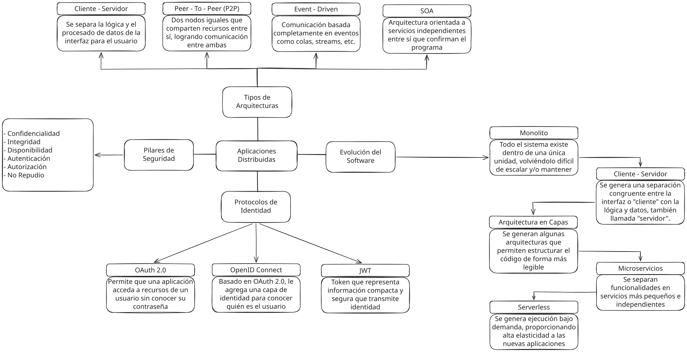

# Resumen Analítico

Para poder entender por qué ha evolucionado de la arquitectura monolítica a los microservicios, hay que entender el cómo.

Al crear los primeros programas, fueron realizados con arquitectura monolítica puesto que eran soluciones pequeñas, aquellas que no buscaban un mantenimiento constante y eran ofrecidos en sistema embebidos.
Después de eso, los desarrolladores se empiezan a percatar de las grandes posibilidades que podía ofrecer la programación, por lo que necesitaban desarrollar organizadamente, puesto que tenerlo todo en un mismo lugar incomodaba.
Luego de ello, las arquitecturas ayudan en gran forma a la organización de las aplicaciones que se desarrollan, ofreciendo estructura sofisticada para las mismas.
El concepto de arquitecturas definidas empieza a resonar y, ya que se entiende como software como un conjunto de programas, se desarrolla una forma de separar completamente procesos de las aplicaciones en forma de microservicios, ofreciéndolas como servicios intercambiables y reutilizables.
Finalmente, se desarrollan arquitecturas sin servidor, únicamente procesando aquella información en el momento deseado en vez de consumir todo el tiempo por esperar.

Revisando la historia que ha surgido, se puede entender el porqué de su evolución.
Las aplicaciones se empezaron a desarrollar para facilitar la vida de las personas, ampliando completamente su rango, por lo que tuvieron que enfocarse a expandirse.
Sin embargo, expandirse verticalmente dificultaba y arriesgaba gran parte del desarrollo, por lo que se vio con buenos ojos a la expansión horizontal, buscando organización y, con tiempo, componentes intercambiables y reutilizables.

# Propuesta Arquitectónica

***Arquitecto de Software para Startup de E-commerce***

## Arquitectura

La arquitectura que mejor se adapta a este proyecto es la de los microservicios.
Esto por la gran cantidad de productos y diversos enfoques que tendrá la aplicación.
Lo ideal sería mantener las secciones de compra, visualización y pagos en diferentes servicios.
Así, si alguno de ellos llegara a caer, no corrompería la aplicación completa.

## Seguridad

Confidencialidad
: Se busca mantener las cuentas de usuario encriptadas, sin vulnerar datos privados como contraseñas o localizaciones.

Integridad
: Los datos, sean de usuarios como de productos, deben ser completamente autónomos. No deben ser modificados por ningún otro proceso.

Disponibilidad
: Al aplicar una arquitectura por microservicios, nos aseguramos que los productos y la página web sean completamente independientes, estando disponibles en cualquier momento.

## Identidad

El usuario muchas veces no quiere escribir los mismos datos de inicio de sesión, además de que puede ocurrir que lo olvida.
Se implementaría una autenticación mediante tokens, o `JWT`.
Así, nos aseguramos que la aplicación sepa quién es el usuario que intenta ingresar sin vulnerar y volver públicos sus datos sensibles.

# Estrategia de Seguridad e Identidad

Primeramente, el usuario deberá crear una cuenta al momento de querer comprar, tal como en una tienda normalmente.
Cualquier persona puede entrar y ver los productos, pero tiene que identificarse al querer comprar algún producto.

Haciendo uso de `JWT`, el usuario se autentica correctamente cada vez que desee acceder sin tener que recurrir constantemente a la pantalla de inicio de sesión.
Todo esto además sin vulnerar sus datos, la parte más importante de todo producto software.
