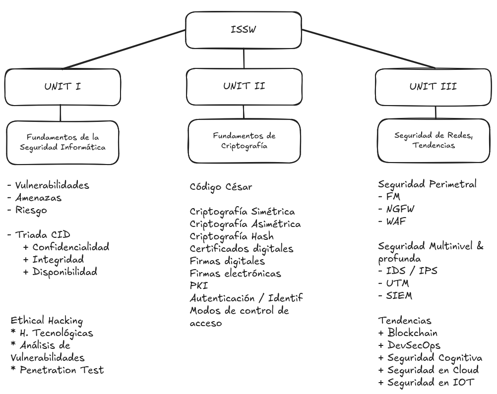

# 07 - Abr - 2026

## Objetivos de Aprendizaje

1. Presentación
2. Macro-Micro Currículum
3. **UNIDAD 1**
    - Fundamentosde la Ingeniería de la Información
4. Práctica de Laboratorio: Análisis de Tráfico entre HTTP vs. HTTPS utilizando _WireShark_ en un _VNE_

## Meditación

### Utiliza el Tiempo con Sabiduría

El tiempo es un recurso no renovable.
El tiempo de Dios es perfecto.

- Tiempo Presente
- Tiempo Pasado
- Tiempo Futuro
- **Tiempo Perdido**

## Temas de la Materia

