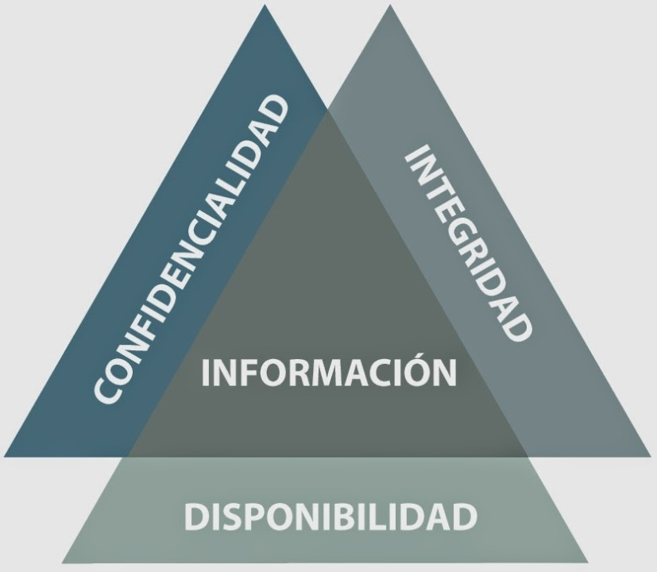

# 10 - Abril - 2026

## Objetivos de Aprendizaje

- Fundamentos de la seguridad en ingeniería
- Definiciones: seguridad informática / ciberseguridad
- Vulnerabilidades, amenazas, riesgo, incidente
- CID, no repudio, autenticación, identificación, trazabilidad, resiliencia
- Marco legal (COIP, Ley de protección de datos)
- Práctica de laboratorio N.º 2: reconocimiento pasivo

## Meditación

Sin meditación

## Seguridad de la información

## Fundamentos de la seguridad en ingeniería

La seguridad en ingeniería comprende el conjunto de principios, metodologías y controles orientados a proteger sistemas, aplicaciones e infraestructura tecnológica frente a fallos, ataques o accesos no autorizados. Dentro del desarrollo de software y sistemas distribuidos, la seguridad debe integrarse desde las primeras etapas del ciclo de vida mediante prácticas como el análisis de riesgos, diseño seguro y validación continua [@stallings2018security].

La incorporación de mecanismos de seguridad permite garantizar la continuidad operativa, proteger la información sensible y reducir el impacto de incidentes tecnológicos. Actualmente, la seguridad en ingeniería se considera un componente transversal que involucra aspectos técnicos, organizacionales y legales para asegurar la confiabilidad de los sistemas digitales [@pfleeger2015security].

## Definiciones

La seguridad informática se enfoca en la protección de sistemas computacionales, redes y datos frente a accesos indebidos, alteraciones o destrucción de la información. Su objetivo principal es preservar la confidencialidad, integridad y disponibilidad de los recursos tecnológicos mediante controles técnicos y administrativos [@whitman2018principles].

Por otro lado, la ciberseguridad abarca un enfoque más amplio orientado a la protección del ciberespacio, incluyendo redes, servicios digitales, dispositivos conectados y usuarios. Esta disciplina considera amenazas provenientes de internet, ataques cibernéticos y actividades maliciosas que puedan afectar tanto a organizaciones como a individuos [@nist2018framework].

## Vulnerabilidades, Amenazas, Riesgo, Incidente

Amenazas
: Eventos o acciones que pueden causar daño a un sistema, de forma intencional o accidental.

Vulnerabilidades
: Debilidades o fallos en un sistema que pueden ser explotados.

Riesgos
: Probabilidad de que una amenaza explote una vulnerabilidad y cause impacto.

Una vulnerabilidad es una debilidad presente en un sistema, aplicación o infraestructura que puede ser explotada para comprometer la seguridad. Las amenazas corresponden a eventos o actores capaces de aprovechar dichas debilidades para causar daño, pérdida de información o interrupción de servicios [@anderson2020security].

El riesgo representa la probabilidad de que una amenaza explote una vulnerabilidad y genere consecuencias negativas para la organización. Cuando el evento ocurre y afecta la operación o la información, se considera un incidente de seguridad. La correcta identificación y gestión de estos elementos permite establecer controles preventivos y planes de respuesta adecuados [@nist80061].

### Fases de Ethical Hacking

1. Reconocimiento (pasivo y activo)
2. Escaneo de vulnerabilidades
3. Ganar acceso
4. Mantener acceso
5. Borrar pistas

## Tríada CID

C
: Confidencialidad

I
: Integridad

D
: Disponibilidad

NR
: No repudio

ID
: Identificación (username)

AU
: Autenticación (password)

TZ
: Trazabilidad

La triada CID corresponde a los principios de confidencialidad, integridad y disponibilidad. La confidencialidad asegura que únicamente usuarios autorizados accedan a la información; la integridad garantiza que los datos no sean alterados de forma indebida; y la disponibilidad permite que los servicios y recursos estén accesibles cuando se necesiten [@stallings2018security].

Otros conceptos fundamentales incluyen el no repudio, que impide negar la autoría de una acción; la autenticación, encargada de verificar la identidad de un usuario; y la identificación, mediante la cual un usuario declara quién es. Asimismo, la trazabilidad permite registrar actividades dentro de un sistema para fines de auditoría, mientras que la resiliencia se refiere a la capacidad de recuperarse rápidamente frente a incidentes o ataques [@kim2021cybersecurity].

## Marco Legal

COIP
: Código Orgánico Integral Penal (delitos informáticos y sanciones)

En Ecuador, el marco legal relacionado con la seguridad informática incluye el Código Orgánico Integral Penal (COIP), el cual tipifica delitos informáticos como acceso no autorizado a sistemas, fraude electrónico, interceptación de datos y ataques a infraestructuras tecnológicas [@coip2021]. Estas disposiciones buscan sancionar actividades ilícitas que afecten la confidencialidad, integridad y disponibilidad de la información.

Además, la Ley Orgánica de Protección de Datos Personales establece principios y obligaciones para el tratamiento adecuado de datos personales por parte de organizaciones públicas y privadas. La normativa regula aspectos como consentimiento, almacenamiento, transferencia y seguridad de la información personal, garantizando los derechos de privacidad de los ciudadanos [@lopdp2021].
