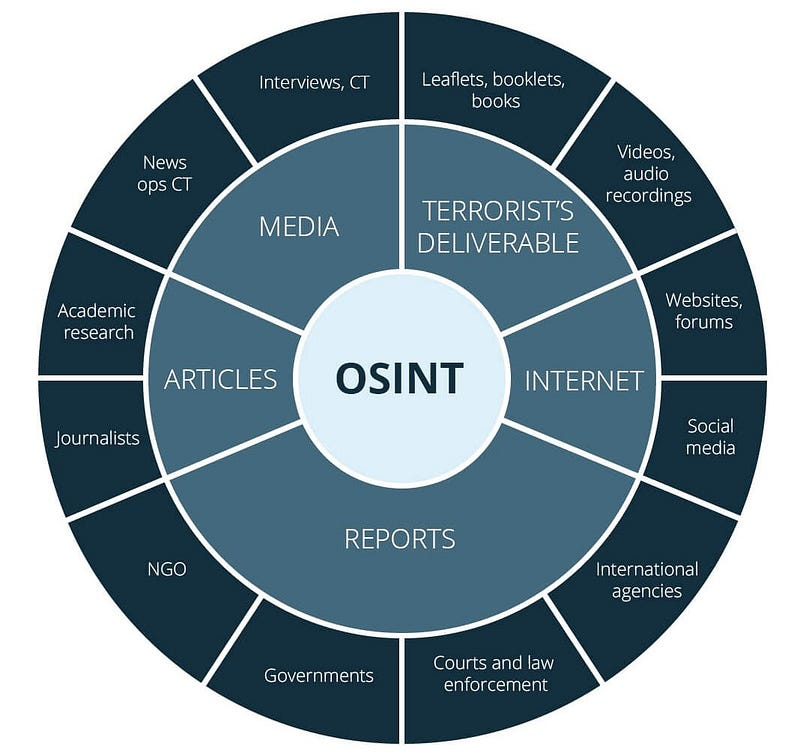

# 14 - Abril - 2026

## Objetivos de Aprendizaje

- Herramientas tecnológicas para analizar vulnerabilidades
- Reconocimiento pasivo OSINT

## Reflexión

Durante la clase se reflexionó que todos somos humanos y cometemos errores.

## Herramientas Tecnológicas

Las herramientas de análisis de vulnerabilidades permiten identificar fallos de seguridad en sistemas operativos, aplicaciones, redes y servicios expuestos. Estas plataformas automatizan procesos de detección mediante escaneos, análisis de configuraciones y evaluación de posibles debilidades que podrían ser explotadas por atacantes [@weidman2014penetration].

El uso de herramientas especializadas facilita la implementación de pruebas de seguridad preventivas y auditorías periódicas dentro de una organización. Entre las más utilizadas se encuentran soluciones para análisis de red, evaluación web, monitoreo de tráfico y pruebas de penetración [@scarfone2008guide].

| Herramienta | Tipo | Función principal | Uso común |
|---|---|---|---|
| Nmap | Escáner de red | Descubrimiento de hosts y puertos abiertos | Reconocimiento de red |
| Wireshark | Analizador de tráfico | Captura y análisis de paquetes | Monitoreo y análisis forense |
| Nessus | Escáner de vulnerabilidades | Identificación de vulnerabilidades conocidas | Auditorías de seguridad |
| Metasploit | Framework de pentesting | Explotación controlada de vulnerabilidades | Ethical hacking |
| Burp Suite | Seguridad web | Análisis y pruebas de aplicaciones web | Evaluación OWASP |
| OpenVAS | Escáner de seguridad | Detección automatizada de riesgos | Gestión de vulnerabilidades |

: Herramietnas más utilizadas para analizar vulnerabilidades

## Reconocimiento Pasivo OSINT

El reconocimiento pasivo consiste en recopilar información sobre un objetivo sin interactuar directamente con sus sistemas. Esta técnica utiliza fuentes públicas como motores de búsqueda, redes sociales, bases de datos WHOIS y registros DNS para obtener información relevante sobre dominios, infraestructura o usuarios [@mitnick2011art].

Dentro de los procesos de ciberseguridad, el reconocimiento pasivo permite identificar posibles vectores de ataque antes de realizar pruebas más profundas. Además, reduce la probabilidad de detección debido a que no genera tráfico directo hacia el objetivo analizado [@weidman2014penetration].

## Ethical Hacking

- nmap
- nikto
- Registros DNS
  - dig
  - host
  - nslookup

El ethical hacking, también conocido como hacking ético, consiste en realizar pruebas autorizadas sobre sistemas informáticos con el propósito de identificar vulnerabilidades y fortalecer la seguridad. Los profesionales encargados de estas actividades utilizan metodologías similares a las de un atacante real, pero dentro de un marco legal y controlado [@ec2018ethical].

Las pruebas de penetración incluyen fases como reconocimiento, análisis, explotación y elaboración de reportes técnicos. El objetivo principal es evaluar el nivel de exposición de una organización y proponer medidas correctivas que permitan reducir riesgos de seguridad [@ceh2021guide].

### Tipos de Registros DNS

Los registros DNS son entradas almacenadas en servidores de nombres que permiten asociar dominios con direcciones IP y otros servicios relacionados. Estos registros facilitan la localización de recursos en internet y el funcionamiento adecuado de servicios web y correo electrónico [@alzahrani2020dns].

Entre los registros más utilizados se encuentran el registro A, que relaciona un dominio con una dirección IPv4; el registro AAAA para IPv6; el registro MX para servidores de correo; el registro CNAME para alias de dominios; y el registro TXT, utilizado frecuentemente para validaciones y políticas de seguridad [@mockapetris1987dns].

| Registro | Propósito | Ejemplo |
|---|---|---|
| A | Asocia dominio con IPv4 | ejemplo.com → 192.168.1.1 |
| AAAA | Asocia dominio con IPv6 | ejemplo.com → 2001:db8::1 |
| MX | Define servidores de correo | mail.ejemplo.com |
| CNAME | Crea alias de dominio | www.ejemplo.com → ejemplo.com |
| TXT | Información adicional o validaciones | SPF, DKIM, verificaciones |
| NS | Define servidores DNS autoritativos | ns1.ejemplo.com |

: Registros y sus propósitos

## OWASP (Open Web Application Security Project)

OWASP es una organización internacional enfocada en mejorar la seguridad del software y las aplicaciones web. Proporciona documentación, herramientas y estándares abiertos para ayudar a desarrolladores y profesionales de seguridad a identificar y mitigar riesgos comunes en aplicaciones [@owasp2021top10].

Uno de sus recursos más reconocidos es el OWASP Top 10, una lista de las vulnerabilidades web más críticas, incluyendo inyección SQL, control de acceso inseguro y fallos criptográficos. Este proyecto sirve como referencia para auditorías de seguridad y buenas prácticas de desarrollo seguro [@stuttard2011web].

## OSINT (Open Source Intelligence)

OSINT corresponde al proceso de recopilación y análisis de información obtenida de fuentes públicas y abiertas. Estas fuentes incluyen redes sociales, sitios web, publicaciones académicas, registros públicos y plataformas digitales accesibles sin restricciones [@haddad2019osint].

En ciberseguridad, OSINT se utiliza para investigaciones, análisis de amenazas y reconocimiento previo a auditorías de seguridad. La información obtenida puede ayudar a identificar infraestructura tecnológica, usuarios expuestos y posibles riesgos asociados a una organización [@rao2023osint].

