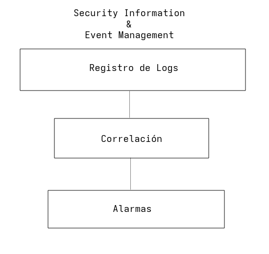

# 21 - Abril - 2026

## Objetivos de Aprendizaje

1. Herramienta Tecnológica para asegurar la triada CID
2. _Ethical Hacking_
    - Reconocimiento Pasivo
        - Google Dorks
        - Comandos Linux
    - Reconocimiento Activo
        - `nmap`
        - `enum4linux`
3. Escaneo
    - Herramientas Tecnológicas
        - `nmap --vulnerability`
        - **SIEM**
        - **UTM**
        - **NGFM**
        - **OpenXDR**
    - Equipos Organizacionales
        - **SOC**
        - **CERT/CSIRT**

## Meditación

### Fórmula de la Felicidad

$$F = M + V + CA$$

F
: Felicidad

M
: Metas

V
: Vínculos

CA
: Cualidades Afectivas

## CERT / CSIRT

Equipos de Respuesta a Incidentes Informáticos.

Servicios Proactivos, Preventivos y Correctivos

### Definiciones

CERT
: Computer Emergency Response Team

CSIRT
: Computer Security Incident Response Team

SOC
: Security Operation Center

### Actividades

- Análisis de Vulnerabilidades
- Inteligencia de Amenazas
- Operativos
    - Software Especializado
        - Shodan
    - Hardware Especializado
        - SIEM
        - UTM
        - NGFW
        - XDR

## SIEM

1. Estructura de un SIEM
2. Marcas
3. Costos
4. Funcionalidades

### Definiciones

SIEM
: Security Information & Event Management

## Herramientas Tecnológicas

| Concepto | Tipo | Función principal | Ejemplo |
|---|---|---|---|
| SOC | Organizativo | Monitoreo continuo de seguridad | Splunk |
| CSIRT | Organizativo | Respuesta a incidentes | CERT-EU |
| SIEM | Tecnológico | Recolección y correlación de logs | IBM QRadar |
| OpenXDR | Tecnológico | Detección y respuesta integrada | Integración de múltiples fuentes |
| UTM | Tecnológico | Seguridad perimetral todo-en-uno | FortiGate |
| NGFW | Tecnológico | Firewall avanzado con inspección profunda | Palo Alto Networks NGFW |
