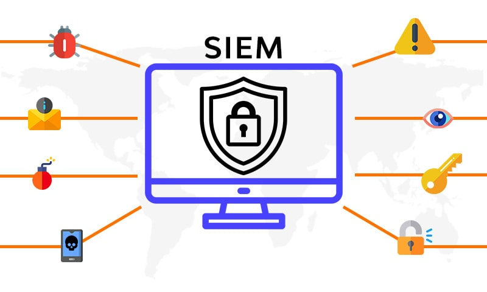
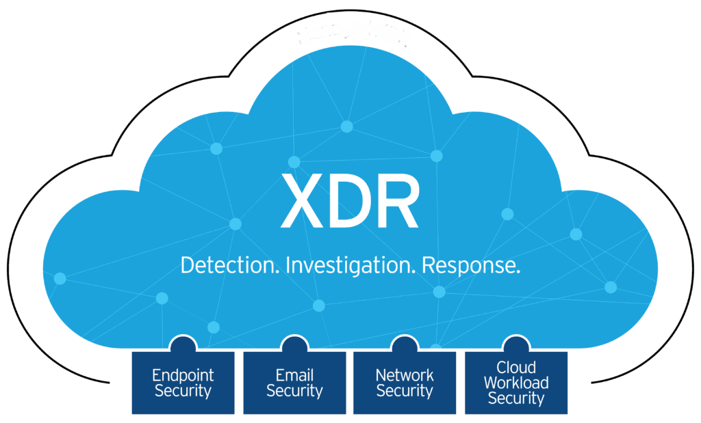
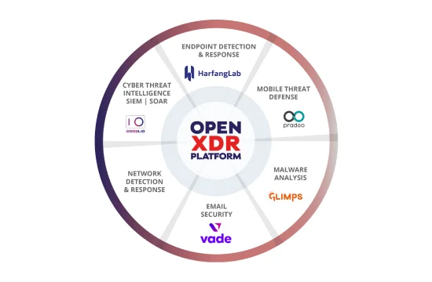

# 23 - Abril - 2026

## Objetivos de Aprendizaje

1. Requisitos Funcionales de Ciberseguridad
2. Herramientas Tecnológicas
    - SIEM
        + Funciones
        + Marcas
        + Prestaciones
    - XDR
    - OpenXDR
3. Práctica de Laboratorio

## Meditación

$$ F = RC + VP + AC + AF + GV $$

F
: Felicidad

RC
: Relaciones de Calidad

VP
: Vida con Propósito

AC
: Actitud

AF
: Actividad Física

AS
: Afán de Servicio

GV
: Generosidad de Vida

## Requisitos Funcionales de Ciberseguridad

Los requisitos funcionales de ciberseguridad definen las capacidades y controles que un sistema debe implementar para proteger la información y garantizar operaciones seguras. Estos requisitos incluyen autenticación, autorización, cifrado, monitoreo, auditoría y mecanismos de respuesta ante incidentes [@stallings2018security].

La definición adecuada de requisitos funcionales permite integrar la seguridad desde las primeras etapas del desarrollo de software y administración de infraestructura. Además, contribuye al cumplimiento normativo y a la reducción de riesgos asociados a amenazas informáticas [@nist2018framework].

## SIEM

Los sistemas SIEM (Security Information and Event Management) permiten centralizar registros de eventos y actividades provenientes de diferentes dispositivos, servidores y aplicaciones dentro de una organización. Estas plataformas facilitan el monitoreo continuo, la correlación de eventos y la detección temprana de incidentes de seguridad [@chuvakin2013logging].

La implementación de soluciones SIEM mejora la capacidad de análisis y respuesta frente a amenazas, permitiendo generar alertas automáticas, reportes de auditoría y trazabilidad sobre eventos críticos dentro de la infraestructura tecnológica [@bejtlich2013practice].

### Funciones

Las plataformas SIEM cumplen funciones relacionadas con la recolección, almacenamiento y análisis de registros de seguridad. También permiten correlacionar eventos provenientes de múltiples fuentes para detectar comportamientos sospechosos o actividades maliciosas [@kim2021cybersecurity].

Entre sus funciones principales destacan el monitoreo en tiempo real, generación de alertas, análisis forense, cumplimiento normativo y automatización de respuestas frente a incidentes de seguridad [@scarfone2008guide].

| Función | Descripción | Beneficio |
|---|---|---|
| Recolección de logs | Centraliza registros de múltiples dispositivos | Visibilidad unificada |
| Correlación de eventos | Relaciona eventos sospechosos | Detección de amenazas |
| Monitoreo en tiempo real | Supervisa actividad continuamente | Respuesta rápida |
| Generación de alertas | Notifica incidentes críticos | Prevención de ataques |
| Auditoría y reportes | Genera evidencia y trazabilidad | Cumplimiento normativo |

: Funciones de un SIEM y sus beneficios

### Marcas

Existen diferentes soluciones SIEM utilizadas en entornos empresariales y académicos. Estas plataformas varían en funcionalidades, escalabilidad y compatibilidad con diferentes infraestructuras tecnológicas [@splunk2024].

Algunas herramientas SIEM comerciales y de código abierto permiten integrar monitoreo avanzado, análisis basado en inteligencia artificial y automatización de procesos de seguridad [@ibm2024qradar].

| Marca | Tipo | Características principales |
|---|---|---|
| Splunk | Comercial | Análisis avanzado y monitoreo en tiempo real |
| IBM QRadar | Comercial | Correlación de eventos y detección de amenazas |
| ArcSight | Comercial | Gestión centralizada de eventos |
| Wazuh | Open Source | Monitoreo y análisis de seguridad |
| Elastic SIEM | Open Source | Integración con Elastic Stack |

: Marcas y características de un SIEM

### Prestaciones

Las prestaciones de un sistema SIEM dependen de su capacidad para procesar grandes volúmenes de información y detectar amenazas en tiempo real. Estas plataformas permiten mejorar la visibilidad sobre la infraestructura tecnológica y fortalecer la capacidad de respuesta ante incidentes [@chuvakin2013logging].

Entre las prestaciones más relevantes se encuentran la automatización de alertas, integración con herramientas externas, análisis de comportamiento y generación de reportes personalizados para auditorías y cumplimiento regulatorio [@bejtlich2013practice].

| Prestación | Descripción |
|---|---|
| Escalabilidad | Manejo de grandes volúmenes de eventos |
| Automatización | Respuestas automáticas ante incidentes |
| Integración | Compatibilidad con múltiples herramientas |
| Inteligencia de amenazas | Identificación de patrones maliciosos |
| Visualización | Paneles y dashboards interactivos |

: Prestaciones y descripciones de un SIEM

## XDR

XDR (Extended Detection and Response) es una tecnología de seguridad que integra información proveniente de diferentes capas de la infraestructura tecnológica, incluyendo endpoints, redes, servidores y aplicaciones. Su objetivo es mejorar la detección y respuesta frente a amenazas avanzadas mediante análisis centralizado y automatización [@paloalto2023xdr].

A diferencia de soluciones tradicionales, XDR proporciona correlación de datos entre múltiples fuentes para identificar ataques complejos y reducir tiempos de respuesta. Esto permite mejorar la eficiencia operativa de los equipos de seguridad y fortalecer la protección organizacional [@crowdstrike2023xdr].

## OpenXDR

OpenXDR es un enfoque abierto para soluciones XDR que busca integrar herramientas de diferentes fabricantes mediante estándares y APIs interoperables. Esta arquitectura facilita la comunicación entre plataformas de seguridad y permite centralizar eventos provenientes de distintos sistemas [@openxdr2024].

El modelo OpenXDR ofrece flexibilidad y escalabilidad, permitiendo a las organizaciones adaptar sus soluciones de seguridad sin depender exclusivamente de un proveedor específico. Además, mejora la capacidad de automatización y análisis de amenazas en entornos híbridos y distribuidos [@gartner2023xdr].

