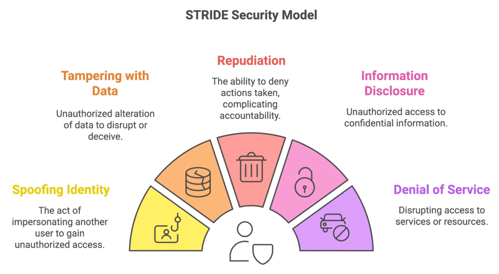

# 05 - Mayo - 2026

## Objetivos de Aprendizaje

1. Amenazas y Vulnerabilidades Más Comúnes
2. Taller: Tipos de Malware
3. Modelo **STRIDE**

## Meditación

### No al Alcohol

La meditación consistía en hacer reflexionar a los estudiantes sobre el consumo desmedido del alcohol.

La primera historia cuenta sobre un chico de la universidad politécnica que salió a jugar fútbol pero, por la mala compañía, terminó emborrachándose y, finalmente, en una calle sin salida, vomitado.

## Amenazas y Vulnerabilidades Más Comunes

Las amenazas y vulnerabilidades representan uno de los principales riesgos para la seguridad de los sistemas informáticos. Una amenaza corresponde a cualquier acción o evento capaz de comprometer la confidencialidad, integridad o disponibilidad de la información, mientras que una vulnerabilidad es una debilidad que puede ser explotada por un atacante [@stallings2018security].

La identificación de amenazas y vulnerabilidades permite implementar controles preventivos y mecanismos de mitigación adecuados. Entre los riesgos más frecuentes se encuentran ataques de malware, phishing, vulnerabilidades web, configuraciones inseguras y accesos no autorizados [@owasp2021top10].

| Amenaza / Vulnerabilidad | Descripción | Impacto principal | Ejemplo común |
|---|---|---|---|
| Malware | Software malicioso diseñado para dañar sistemas | Pérdida de información | Ransomware |
| Phishing | Suplantación de identidad mediante mensajes falsos | Robo de credenciales | Correos fraudulentos |
| Inyección SQL | Manipulación de consultas a bases de datos | Acceso no autorizado | Formularios vulnerables |
| Contraseñas débiles | Uso de claves inseguras o repetidas | Compromiso de cuentas | Password123 |
| Configuración insegura | Parámetros incorrectos en sistemas o servidores | Exposición de servicios | Puertos abiertos |
| Ataques DoS/DDoS | Saturación de recursos de red o servidores | Interrupción del servicio | Tráfico masivo |
| Vulnerabilidades de software | Errores presentes en aplicaciones | Ejecución de código malicioso | Software sin actualizar |
| Ingeniería social | Manipulación psicológica de usuarios | Robo de información | Llamadas fraudulentas |

## Modelo STRIDE

El modelo STRIDE es una metodología desarrollada por Microsoft para identificar y clasificar amenazas de seguridad en sistemas y aplicaciones. Este modelo permite analizar riesgos desde diferentes perspectivas y facilitar el diseño de controles de seguridad durante el desarrollo de software [@shostack2014threat].

STRIDE agrupa las amenazas en seis categorías: suplantación de identidad (Spoofing), alteración de información (Tampering), repudio (Repudiation), divulgación de información (Information Disclosure), denegación de servicio (Denial of Service) y elevación de privilegios (Elevation of Privilege). Estas categorías ayudan a evaluar vulnerabilidades potenciales y fortalecer la arquitectura de seguridad [@howard2006secure].

| Categoría | Descripción | Ejemplo |
|---|---|---|
| Spoofing | Suplantación de identidad | Robo de credenciales |
| Tampering | Modificación no autorizada de datos | Alteración de archivos |
| Repudiation | Negación de acciones realizadas | Eliminación de registros |
| Information Disclosure | Exposición de información sensible | Fuga de datos |
| Denial of Service | Interrupción de servicios | Saturación de servidores |
| Elevation of Privilege | Obtención de permisos elevados | Acceso administrador |

