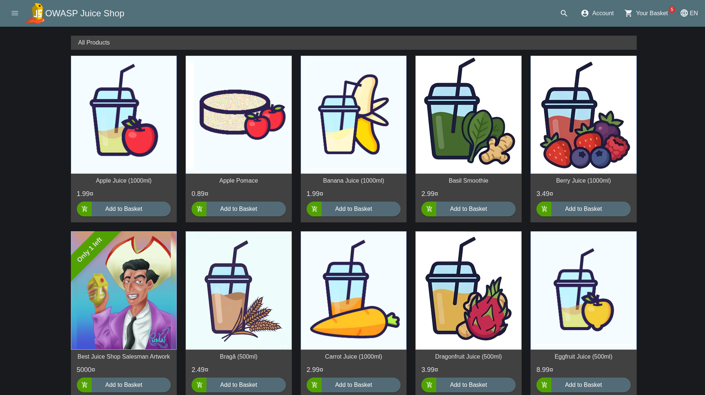
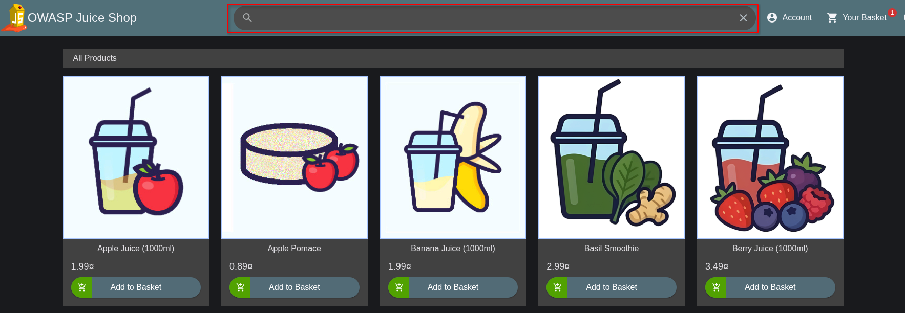
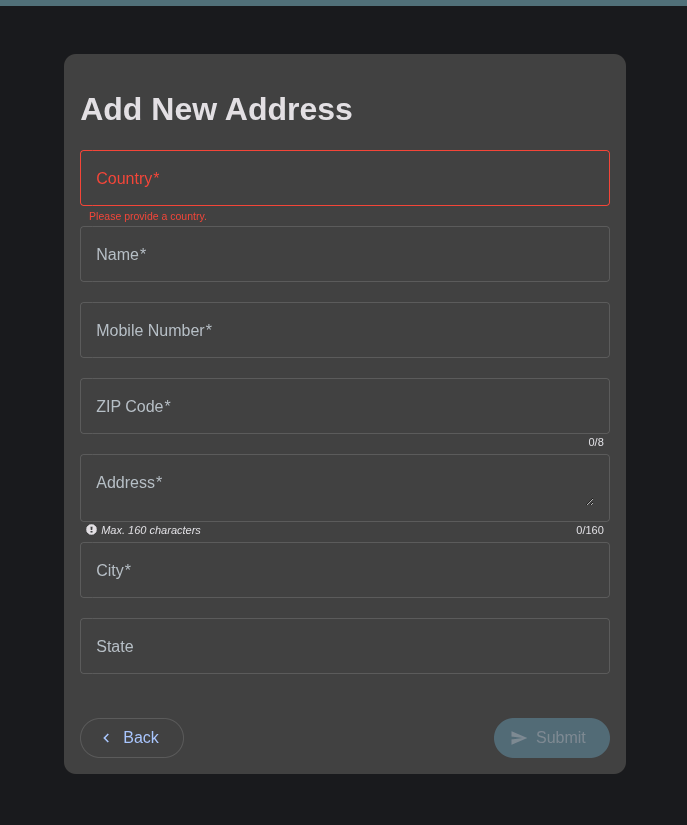
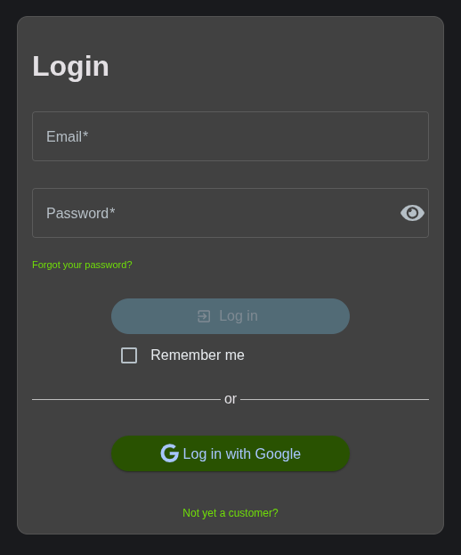
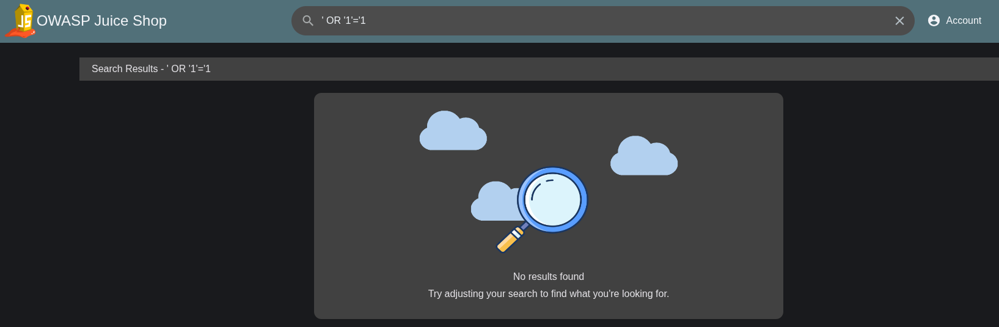
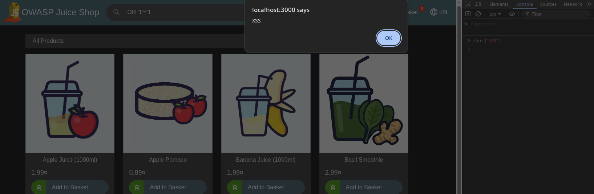
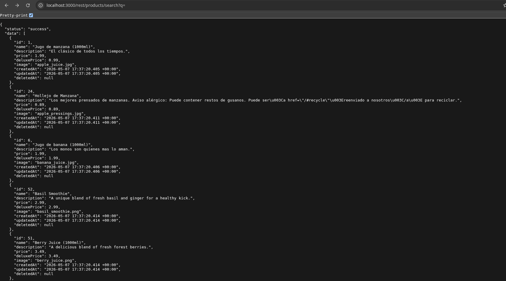
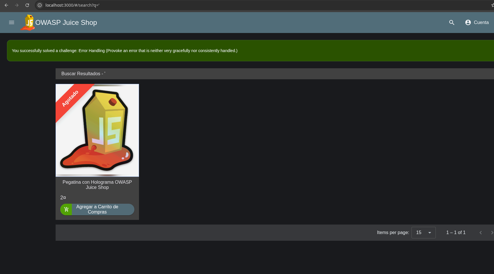

# Desarrollo

## Exploración de Superficies de Ataque



Al iniciar la aplicación, se pueden visualizar ciertos productos que se enfocan en la venta de jugos, tal como se observa en la figura \ref{startpage}.
Esta página fue desarrollada por OWASP.

En esta página vulnerable, se pueden visualizar barras de búsqueda (\ref{search}), formularios (\ref{form}) y autenticación (\ref{auth}).







Todos estos campos mostrados en las figuras \ref{search}, \ref{form} y \ref{auth} muestran campos de texto, principalmente etiquetas HTML:

```html
<input type="text" />

```

En todas estas es posible vulnerar el valor que se envía a estas páginas.

## _SQL Injection_

Para complacer el taller especificado, se ingresarán ciertos valores para comprobar si es posible vulnerar estos campos ingresando instrucciones para el motor de base de datos.
Esto con el fin de comprobar qué datos se envían y cuáles están ocultos al usuario.

### _SQL Injection_ en Barra de Búsqueda



Tal como se observa en la figura \ref{search_sql}, no se logró vulnerar completamente los productos y datos sensibles de usuarios.

Si existiese un error, lo ideal sería no trabajar directamente con SQL dentro de la aplicación, sino un DTO.

## Cross-Site Scripting (XSS)

Este tipo de ataque consiste en ingresar un _script_ dentro de la página web que permita ejecutar cierto código malicioso.
Esta página es insegura debido a que, como se observa en la figura \ref{alert_xss}, se pueden ejecutar algunos comandos dentro de la página.



## Configuración Insegura

Ya que la imagen fue instanciada en Docker, no se tiene un _shell_ especializado para revisar los archivos de configuración.
Sin embargo, es posible acceder a la API REST sin necesidad de validación de usuario, tal como se observa en la figura \ref{api_products}.





Además, se pueden visualizar algunos productos ocultos los cuales son parte de un error.
En la figura \ref{products_hidden} se observan los productos que han sido descartados.
Además, se puede apreciar un error encontrado dentro de la página, el cual estaba destinado a ser encontrado.
