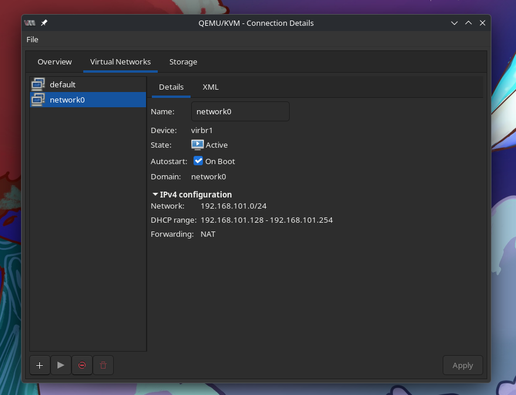
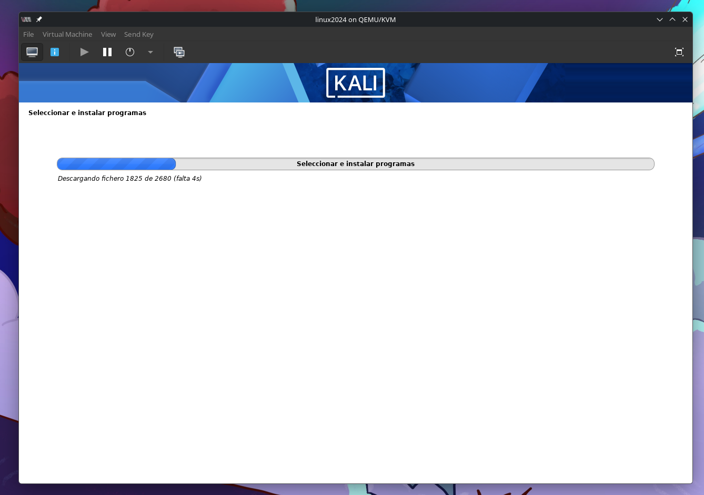
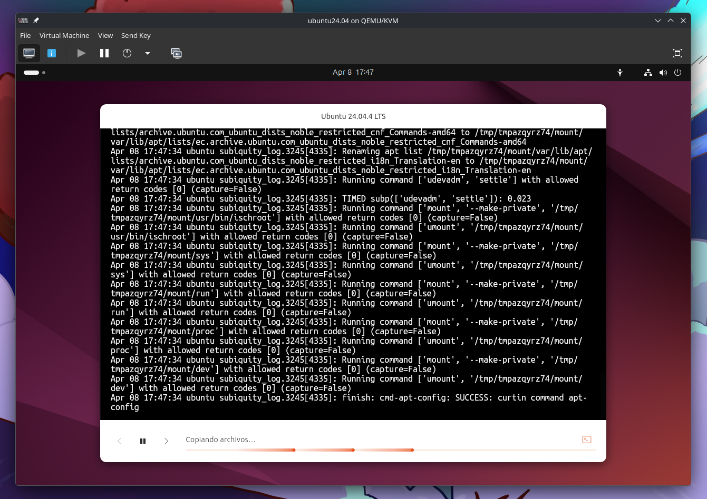
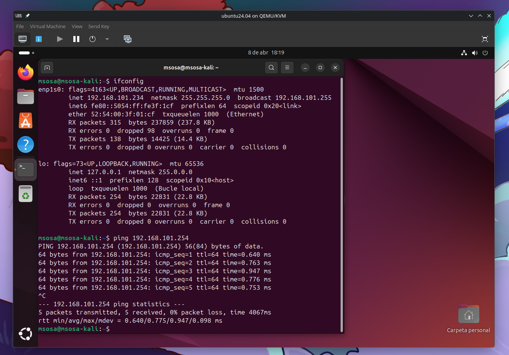
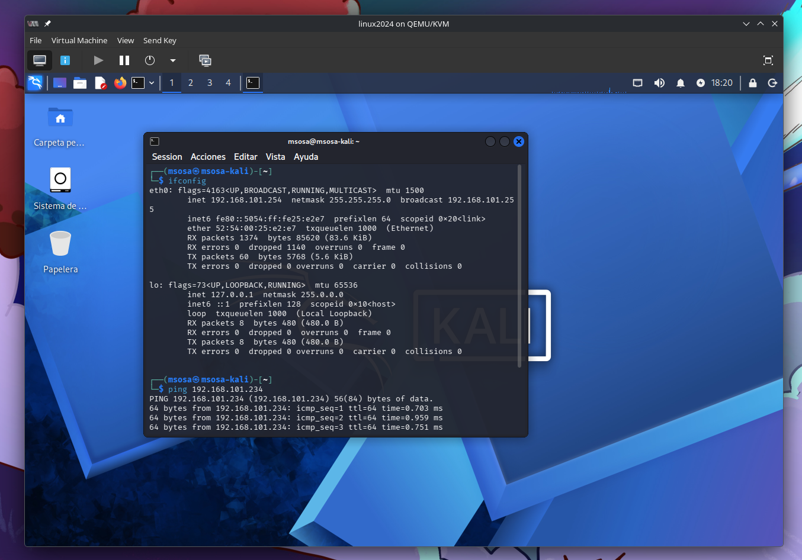
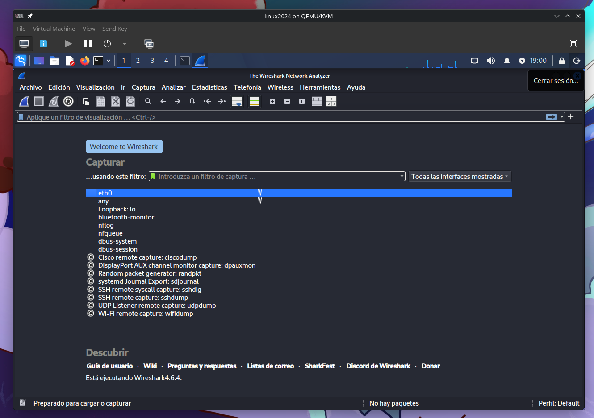
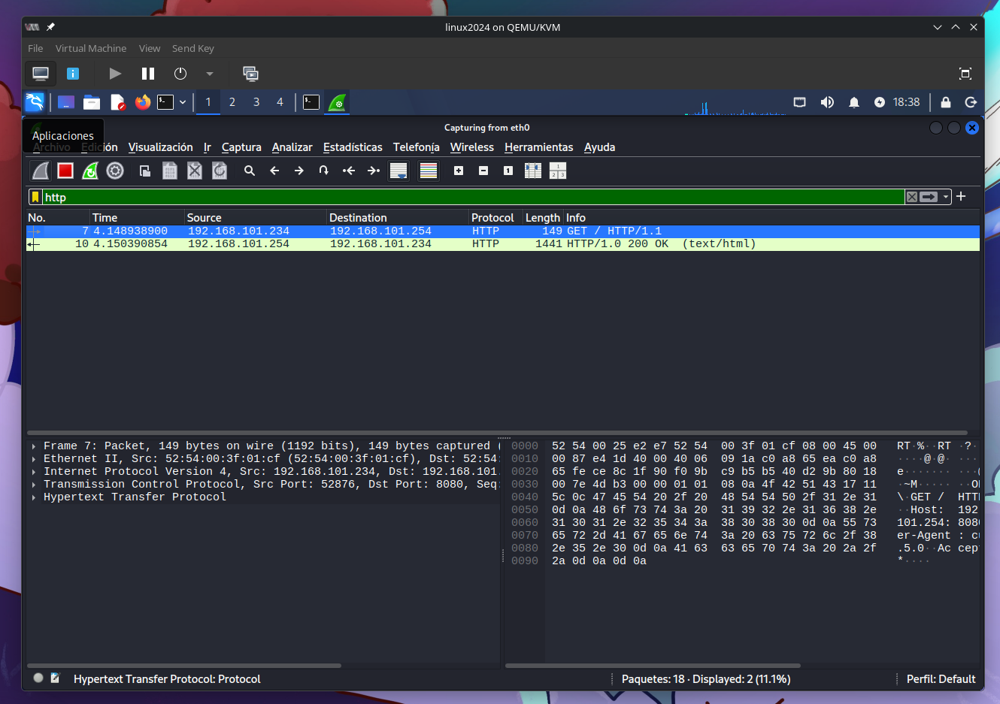

# Objetivos de Aprendizaje

Al finalizar esta práctica, usted será capaz de:

-   Comprender las diferencias entre los protocolos HTTP y HTTPS en términos de seguridad.
-   Capturar y analizar tráfico de red utilizando Wireshark.
-   Identificar información sensible transmitida en texto plano.
-   Reconocer cómo el cifrado protege la confidencialidad de los datos en tránsito.
-   Interpretar paquetes de red y extraer conclusiones de seguridad.

# Topología del experimento

-   VirtualBox o VMware
-   Máquina virtual con Ubuntu 24.04.4 LTS (Noble Numbat), generará tráfico web (navegador)
-   Máquina virtual con Kali Linux 2026.3, capturará y analizará el tráfico
-   Wireshark instalado en Kali Linux
-   Ambas máquinas en red interna conectadas vía Red NAT
-   Usted trabajará en un entorno controlado con dos máquinas virtuales

# Marco Teórico

El protocolo HTTP (HyperText Transfer Protocol) es un protocolo de
comunicación utilizado para la transferencia de información en la web.
Sin embargo, transmite los datos en texto plano, lo que significa que
pueden ser interceptados y leídos por terceros (Fielding et al., 1999).

Por otro lado, HTTPS (HyperText Transfer Protocol Secure) incorpora un
mecanismo de cifrado mediante TLS (Transport Layer Security), el cual
protege la información durante su transmisión, garantizando la
confidencialidad e integridad de los datos (Rescorla, 2018).

Herramientas como Wireshark permiten capturar y analizar paquetes de red
en tiempo real, lo que facilita la inspección del contenido de las
comunicaciones. En conexiones HTTP, es posible visualizar credenciales y
datos sensibles, mientras que en HTTPS, la información aparece cifrada e
ilegible (Orebaugh et al., 2007).

Este laboratorio permite evidenciar de manera práctica cómo el cifrado
contribuye a la seguridad de la información en redes.

# Desarrollo

Se procederá a conectar dos máquinas virtuales entre sí.
Para ello, se utilizarán las imágenes de Ubuntu LTS 24.04.4 y Kali Linux 2026.1.

El gestor de máquinas virtuales a utilizar dentro de esta práctica de laboratorio
es QEMU/KVM, las cuales son nativas en Linux y proporcionan mejor rendimiento al
momento de operar junto a ellas.

## Prerequisitos

Para poder empezar a utilizar las máquinas virtuales, será necesario configurarlas
para que puedan coexistir dentro de la misma red.

Para ello, se creará primeramente una red interna por la cual ambas podrán tener
conexión a internet y, lo más importante, conexión entre ellas mismas.



En la figura \ref{qemukvm_network} se puede observar la configuración utilizada
en QEMU para la red en máquinas virtuales.

```yaml
Name: network0
Network: 192.168.101.0/24
Forwarding: NAT

```

Además de ello, se deben configurar correctamente las máquinas virtuales que
se utilicen, tal como se puede ver en las figuras \ref{kali_install} y \ref{ubuntu_install}.





## Verificar Conectividad

Ya que se han configurado las máquinas virtuales con sus respectivas redes, es
preferible probar la conexión entre ambas para poder realizar las actividades
propuestas dentro del laboratorio.

Para ello, se utilizarán dos comandos esenciales:

```sh
# Para conocer la dirección asignada mediante DHCP
ifconfig

# Para comprobar la conectividad
ping x.x.x.x
```

En las figuras \ref{ubuntu_ping} y \ref{kali_ping} se pueden apreciar los comandos, con su
respectiva _IP_ asignada por el _DHCP_ y la conectividad entre ambas.





## Iniciar Captura en Wireshark

Para poder analizar el tráfico de la máquina de Ubuntu, es esencial usar la herramienta incluida
por defecto en Kali: ***Wireshark***.

Se puede acceder a la GUI de Wireshark (tal como se aprecia en la figura \ref{kali_wireshark}) mediante el comando:

```sh
wireshark

```



### HTTP

Para poder generar tráfico HTTP, es necesario que la información pase a través de Kali para comprobarla
y analizarla. Es por eso que, haciendo uso de _python_ y su librería _http.server_, es posible generar
un servidor HTTP para revisar datos y analizarlos.

En la figura \ref{kali_wireshark_http} se pueden apreciar los paquetes obtenidos.



Los datos importantes son:

```yaml
Method: GET
URL: 192.168.101.254:8080
Headers: NO
Content: plain-text

```

### HTTPS

Para poder generar tráfico HTTPS, es neceario generar un certificado por el cual se pueda generar
un servidor que permita la conexión entre Ubuntu y Kali. Para ello, usaremos `openssl` en el puerto
8443.

En la figura \ref{kali_wireshark_https} se pueden apreciar los paquetes obtenidos.


Ahora, los datos que se obtienen son:

```yaml
Handshake: TLS
Certificates: openssl
Content: plain-text

```

## Comparación

Para conocer cuál de las dos es mejor, se compararán ambos protocolos dentro de una tabla.

| Comparativa | HTTP | HTTPS |
| --- | --- | --- |
| Visibilidad de Datos | Completa | Ninguna (Cifrado) |
| Nivel de Exposición | Alto | Bajo |
| Seguridad | Baja o Nula | Alta |

# Conclusiones

-   HTTPS protege la confidencialidad de los datos.
-   HTTP expone información sensible.
-   Wireshark permite análisis pero no descifrado sin claves.
