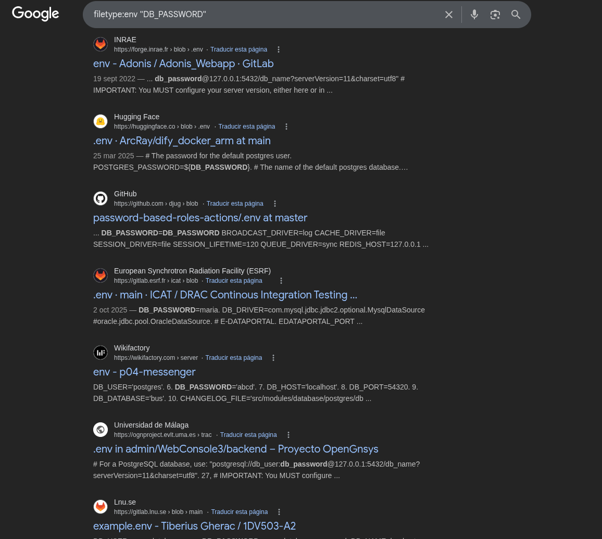

# Objetivos de Aprendizaje

Al finalizar esta práctica, usted será capaz de:

-   Comprender y aplicar técnicas de reconocimiento pasivo mediante
    operadores avanzados de búsqueda (Google Dorks).
-   Identificar información potencialmente sensible expuesta en la web.
-   Analizar vulnerabilidades derivadas de la exposición de información
    pública.
-   Relacionar los hallazgos con los principios de Confidencialidad,
    Integridad y Disponibilidad (CIA).
    
# Topología del experimento

-   Virtualización: VirtualBox o VMware
-   Máquinas virtuales:
    -   Ubuntu Desktop 24.04.5 LTS (Noble Numbat) --- ejecución de
        búsquedas y análisis
    -   Kali Linux 2026.3 --- apoyo en análisis de seguridad (opcional)
-   Herramientas:
    -   Navegador web (Firefox/Chrome)
-   Red: Ambas máquinas conectadas en red NAT (entorno controlado)
-   Nota: No se realizará captura ni análisis de tráfico de red en esta
    práctica

# Marco Teórico

El reconocimiento (*Footprinting*) constituye la primera fase del
*Ethical Hacking*, orientada a la recopilación de información pública
sin interacción directa con los sistemas objetivo. En este contexto, los
Google Dorks son operadores avanzados que permiten filtrar resultados de
búsqueda y localizar información sensible expuesta, como documentos,
credenciales o configuraciones inseguras.

El uso inadecuado de la publicación de información puede generar
vulnerabilidades que afectan los principios de:

-   Confidencialidad: Exposición de datos sensibles
-   Integridad: Posible manipulación de información
-   Disponibilidad: Riesgos derivados de accesos no autorizados

## 1. Operadores básicos de Google Dorks

| Operador | Función clave | Ejemplo práctico | Otro ejemplo |
|----------|--------------|------------------|--------------|
| `site:` | Restringe la búsqueda a un sitio específico | `site:example.edu` | `site:netflix.com "Caramelo"` |
| `filetype:` | Busca por tipo de archivo | `filetype:pdf inurl:confidential` | `site:netflix.com filetype:pdf` |
| `intitle:` | Busca palabras en el título de la página | `intitle:"index of"` | `site:.com intitle:"nomina"` |
| `inurl:` | Busca términos dentro de la URL | `inurl:admin` | `site:edu.ec inurl:login` |
| `intext:` | Encuentra palabras en el contenido | `intext:"password"` | `site:edu.ec intext:"usuario"` |
| `cache:` | Muestra versión en caché | `cache:example.com` | `cache:netflix.com` |
| `related:` | Encuentra sitios similares | `related:example.com` | `related:amazon.com` |

# Desarrollo

En el presente laboratorio se pretende hacer uso de operadores avanzados conocidos formalmente como **Google Dorks** para filtrar resultados de búsqueda e identificar información sensible expuesta.

## Seguridad Informática

### Objetivo

Encuentre archivos PDF sobre seguridad informática en el dominio _edu.ec_.

### Cadena de Búsqueda

```sh
site:edu.ec filetype:pdf "seguridad informática"

```

### Resultados


En la figura \ref{seguridad_informatica} se puede apreciar la búsqueda. En ella se pueden ver diversos documentos relacionados con la seguridad informática dentro de las páginas con _.edu.ec_.

### Análisis

| Tipo Información Identificada | Riesgo de Seguridad | Principios Triada CID | Medida de Mitigación |
| --- | --- | --- | --- |
| PDF | Bajo, todos los documentos proporcionados están públicos, generalmente proporcionados por universidades | Disponibilidad | Comprobar que las páginas realmente proporcionan esta información de forma pública |

## Cámaras IP Indexadas

### Objetivo

Identifique cámaras IP indexadas sin autenticación en línea (análisis conceptual).

### Cadena de Búsqueda

```sh
intitle:"Live View / - AXIS"

```

### Resultados


En la figura \ref{camaras_ip} se pueden apreciar muchas búsquedas sobre cámaras IP identificadas y publicadas sin ninguna verificación para su revisión. Es posible apreciar incluso en algunas de ellas una dirección IP en vez de una DNS, vulnerando incluso a la propia empresa que proporciona las cámaras.

### Análisis

| Tipo Información Identificada | Riesgo de Seguridad | Principios Triada CID | Medida de Mitigación |
| --- | --- | --- | --- |
| Video en Tiempo Real | Alto, probablemente sean cámaras sin seguridad | Confidencialidad & Disponibilidad | Añadir accesos puntuales a estas páginas |

## _Login_ Administración

### Objetivo

Busque páginas de login de administración en sitios educativos de Ecuador.

### Cadena de Búsqueda

```sh
site:edu.ec inurl:admin

```

### Resultados


En la figura \ref{login_administracion} se puede apreciar la vulnerabilidad de muchas páginas administrativas de universidades principalmente. Muchas de ellas ni siquiera disponen de un nombre adecuado, dando a entender que no están planeadas para ser vistas desde el buscador.

### Análisis

| Tipo Información Identificada | Riesgo de Seguridad | Principios Triada CID | Medida de Mitigación |
| --- | --- | --- | --- |
| Páginas Ocultas | Medio, aunque son páginas que no se planean ver, tienen la seguridad de registro | Disponibilidad | Comprobar que no existan usuarios de prueba que vulneren la seguridad |

## Credenciales en Excel

### Objetivo

Encuentre documentos Excel con posibles credenciales en sitios corporativos.

### Cadena de Búsqueda

```sh
filetype:xls OR filetype:xlsx "usuario" "contraseña"

```

### Resultados


En la figura \ref{credenciales_excel} se puede apreciar que, aunque la gran mayoría de páginas redirige a cierto login, de igual forma proporcionan el archivo `xlsx` donde se guardan todos los datos. Principalmente se vulneran páginas gubernamentales.

### Análisis

| Tipo Información Identificada | Riesgo de Seguridad | Principios Triada CID | Medida de Mitigación |
| --- | --- | --- | --- |
| `xlsx` o `xls` | Alto, se publica información confidencial | Confidencialidad | Utilizar bases de datos seguras |

## Archivos de Configuración

### Objetivo

Localice archivos de configuración expuestos públicamente.

### Cadena de Búsqueda

```sh
filetype:env "DB_PASSWORD"
```

### Resultados



En la figura \ref{archivos_configuracion} se pueden apreciar pocos resultados con archivos de configuración, pero publicando datos confidenciales de proyectos. En su gran mayoría, son proyectos pequeños y archivos subidos dentro de la plataforma de _GitHub_.

### Análisis

| Tipo Información Identificada | Riesgo de Seguridad | Principios Triada CID | Medida de Mitigación |
| --- | --- | --- | --- |
| `.env` | Medio, aunque no siempre, muchas veces se encuentran contraseñas de bases de datos en estos archivos | Confidencialidad | Mayor seguridad dentro de entornos de desarrollo |

## Archivos XLS

### Objetivo

Encuentre archivos XLS relacionados con nómina o roles de pago.

### Cadena de Búsqueda

```sh
filetype:xlsx "rol de pagos"

```

### Resultados


En la figura \ref{rol_pagos} se pueden apreciar muchas compañías cuyos roles de pagos están expuestos públicamente.

### Análisis

| Tipo Información Identificada | Riesgo de Seguridad | Principios Triada CID | Medida de Mitigación |
| --- | --- | --- | --- |
| `xlsx` | Medio, se vulnera información confidencial | Confidencialidad | Añadir protección a estos datos o enviarlos por un medio más seguro, como correo |

## Película "Hilo Rojo"

### Objetivo

Busque una película en Netflix llamada “Hilo rojo” utilizando operadores.

### Cadena de Búsqueda

```sh
site:netflix.com "Hilo rojo"

```

### Resultados


En la figura \ref{hilo_rojo} se pueden apreciar pocos resultados pero todos enfocados a la película "Hilo Rojo" o relacionados.

### Análisis

| Tipo Información Identificada | Riesgo de Seguridad | Principios Triada CID | Medida de Mitigación |
| --- | --- | --- | --- |
| Película | Bajo, la película mantiene seguridad de Login de Netflix | Integridad | Mantener la película en el formato propuesto |

# Conclusiones

-   El reconocimiento pasivo permite identificar vulnerabilidades sin
    interactuar directamente con los sistemas.
-   La exposición de información pública puede representar un riesgo
    significativo para organizaciones.
-   La aplicación de buenas prácticas de seguridad reduce la superficie
    de ataque.
