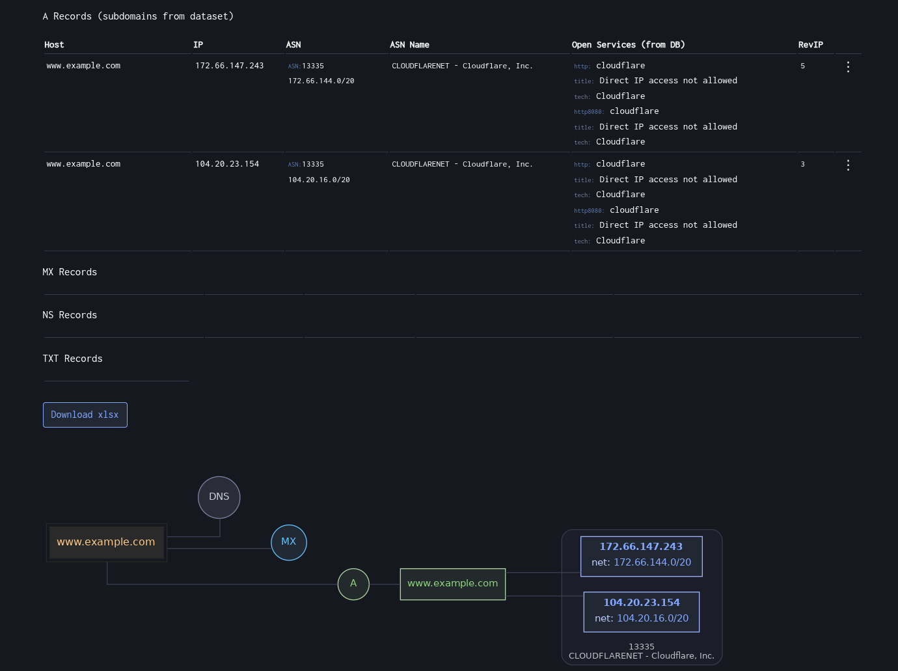
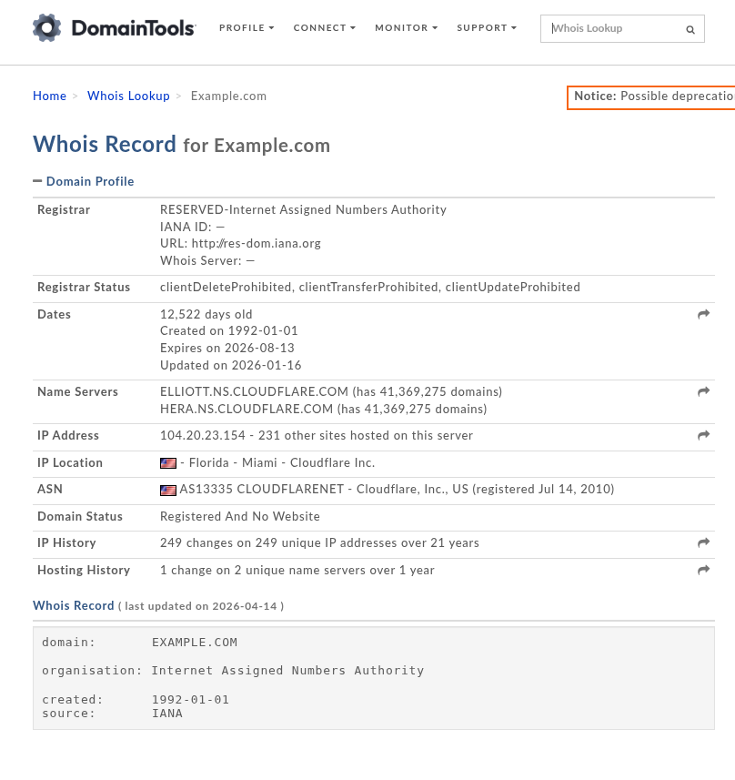
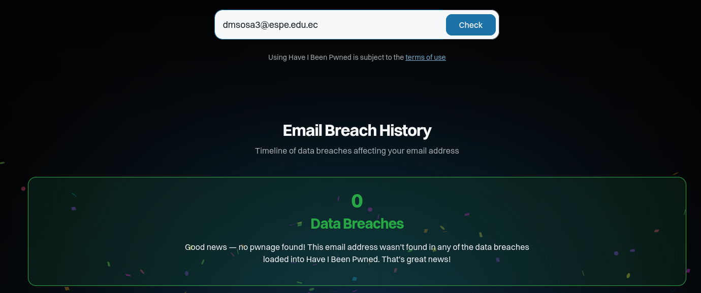

# Objetivos de Aprendizaje

Al finalizar esta práctica, usted será capaz de:

- Comprender y aplicar técnicas de reconocimiento pasivo mediante herramientas OSINT (Open Source Intelligence) y comandos en entornos Linux, como fase inicial del Ethical Hacking.
- Identificar y analizar información pública y potencialmente sensible (DNS, subdominios, direcciones IP y registrantes), evaluando posibles vulnerabilidades asociadas a su exposición.
- Verificar brechas de información utilizando fuentes abiertas y legales, interpretando los hallazgos en el contexto de la seguridad de la información.
- Elaborar informes técnicos con hallazgos y recomendaciones, relacionando los resultados con los principios de Confidencialidad, Integridad y Disponibilidad (CIA).

# Topología del experimento

- Virtualización: VirtualBox o VMware
- Máquinas virtuales:
  - Ubuntu Desktop 24.04.5 LTS (Noble Numbat) — ejecución de búsquedas y análisis
  - Kali Linux 2026.3 — apoyo en análisis de seguridad (opcional)
- Herramientas:
  - Navegador web (Firefox/Chrome)
- Red: Ambas máquinas conectadas en red NAT (entorno controlado)

# Marco Teórico

El reconocimiento (Footprinting) constituye la primera fase del Ethical Hacking, orientada a la recopilación de información pública sin interacción directa con los sistemas objetivo (OWASP, 2024). Su finalidad es conocer la superficie de exposición digital de una organización, identificando posibles puntos de riesgo.

El reconocimiento pasivo se apoya en herramientas OSINT (Open Source Intelligence) que extraen información de registros DNS, WHOIS, subdominios, direcciones IP y brechas públicas, respetando siempre la ley y la ética profesional.

El OSINT es el proceso de recolección y análisis de información proveniente de fuentes públicas disponibles en Internet. En ciberseguridad, se utiliza en la fase de reconocimiento pasivo para identificar infraestructura, servicios y posibles exposiciones sin interactuar directamente con sistemas internos.

| Herramienta/comando | Tipo | Descripción | Ejemplos |
|--------------------|------|-------------|----------|
| Whois | CLI | Consulta información del registrante, fechas y servidores de nombres | `whois google.com` / `whois espe.edu.ec` |
| Dig | CLI | Extrae registros DNS (A, MX, TXT, NS, etc.) | `dig google.com` / `dig google.com MX` |
| Nslookup | CLI | Permite resolver registros específicos | `nslookup google.com` / `nslookup -type=MX gmail.com` |
| Host | CLI | Muestra registros DNS de manera simple y rápida | `host google.com` / `host -t ns facebook.com` |
| dnsenum / dnsrecon | CLI | Enumeran subdominios y registros DNS asociados | `dnsenum google.com` / `dnsrecon -d example.com` |
| Whois Domain Tools | Web | Muestra información histórica y pública del dominio | Buscar: `google.com` / `amazon.com` |
| DNSDumpster | Web | Visualiza la infraestructura y subdominios públicos | Buscar: `microsoft.com` / `yahoo.com` |
| Have I Been Pwned | Web | Verifica exposición en brechas públicas | Buscar: `test@gmail.com` / `example.com` |

## Tipos de registro

**Dig:** herramienta de línea de comandos en Linux utilizada para consultar información DNS. Permite obtener registros A, MX, TXT y NS.

**Nslookup:** permite consultar servidores DNS y obtener información asociada a dominios.

**Host:** herramienta simple para consultar registros DNS de forma rápida.

| Tipo de registro | Descripción | Comando en dig | Comando en nslookup | Comando en host |
|------------------|-------------|----------------|---------------------|-----------------|
| A | Dirección IP del dominio | `dig google.com A` | `nslookup -type=A google.com` | `host -t A google.com` |
| MX | Servidores de correo | `dig google.com MX` | `nslookup -type=MX google.com` | `host -t MX google.com` |
| TXT | Información de verificación (SPF, DKIM, etc.) | `dig google.com TXT` | `nslookup -type=TXT google.com` | `host -t TXT google.com` |
| NS | Servidores de nombres | `dig google.com NS` | `nslookup -type=NS google.com` | `host -t NS google.com` |

**Nota:** SPF y DKIM ayudan a evitar suplantación de identidad y se publican como registros TXT.

## Subdominios y riesgos de seguridad

En el reconocimiento pasivo es común identificar subdominios asociados a un dominio principal.

Subdominios frecuentes:

- dev: entornos de desarrollo
- test: sistemas de prueba
- api: servicios backend
- mail: servidores de correo
- backup: sistemas de respaldo

Estos pueden representar riesgos si están expuestos, ya que suelen tener menor protección que entornos productivos.

# Desarrollo

## Análisis de DNS y Registrantes

### Registrante y Servidores

`whois example.com`

```yaml
Registrante: RESERVED-Internet Assigned Numbers Authority
Fecha-Creación: 1995-08-14T04:00:00Z
Fecha-Expiración: 2026-08-13T04:00:00Z
Servidores:
  - ELLIOTT.NS.CLOUDFLARE.COM
  - HERA.NS.CLOUDFLARE.COM

```


### Registros DNS

```sh
# Addresses
$ dig example.com A +short
172.66.147.243
104.20.23.154

# Mail Exchange
$ dig example.com MX +short
0 .

# Text
$ dig example.com TXT +short
"v=spf1 -all"
"_k2n1y4vw3qtb4skdx9e7dxt97qrmmq9"

# Name System
$ dig example.com NS +short 
hera.ns.cloudflare.com.
elliott.ns.cloudflare.com.

```


### `nslookup`

```sh
$ nslookup -type=mx example.com
Server:         192.168.101.1
Address:        192.168.101.1#53

Non-authoritative answer:
example.com     mail exchanger = 0 .

Authoritative answers can be found from:


$ nslookup -type=ns example.com
Server:         192.168.101.1
Address:        192.168.101.1#53

Non-authoritative answer:
example.com     nameserver = hera.ns.cloudflare.com.
example.com     nameserver = elliott.ns.cloudflare.com.

Authoritative answers can be found from:
hera.ns.cloudflare.com  internet address = 172.64.32.162
elliott.ns.cloudflare.com       internet address = 108.162.195.228
elliott.ns.cloudflare.com       internet address = 172.64.35.228
elliott.ns.cloudflare.com       internet address = 162.159.44.228
hera.ns.cloudflare.com  internet address = 108.162.192.162
hera.ns.cloudflare.com  internet address = 173.245.58.162


$ nslookup -type=txt example.com
Server:         192.168.101.1
Address:        192.168.101.1#53

Non-authoritative answer:
example.com     text = "_k2n1y4vw3qtb4skdx9e7dxt97qrmmq9"
example.com     text = "v=spf1 -all"

Authoritative answers can be found from:

```


### `host`

```sh
$ host -t ns example.com
example.com name server hera.ns.cloudflare.com.
example.com name server elliott.ns.cloudflare.com.

$ host -t txt example.com
example.com descriptive text "_k2n1y4vw3qtb4skdx9e7dxt97qrmmq9"
example.com descriptive text "v=spf1 -all"

```


## Enumeración de Subdominios y Análisis del Dominio

### Enumeración Local

Haciendo uso de los comandos `dnsenum` y  `dnsrecon -d`, se presentan una gran cantidad de dominios, pero la gran mayoría no tienen nada que ver con _dev_, _test_, _api_ o _backup_.

```txt
dns.google.com.                          324      IN    A           8.8.8.8
dns.google.com.                          324      IN    A           8.8.4.4
elections.google.com.                    134      IN    A        172.217.162.110
environment.google.com.                  129      IN    A        142.251.132.174
europe.google.com.                       129      IN    A        142.251.132.164
finance.google.com.                      129      IN    CNAME    www3.l.google.com.
www3.l.google.com.                       297      IN    A        172.217.30.206
health.google.com.                       64       IN    A        172.217.28.110
issuetracker.google.com.                 61       IN    A        172.217.30.206
jobs.google.com.                         70       IN    CNAME    www3.l.google.com.
www3.l.google.com.                       174      IN    A        172.217.30.206
mail.google.com.                         181      IN    A        172.217.29.5
map.google.com.                          63       IN    CNAME    maps.google.com.
maps.google.com.                         180      IN    A        172.217.28.110
mobile.google.com.                       63       IN    CNAME    mobile.l.google.com.

```

### Validación Rápida


No existe ningún registro A o MX para la dirección de _example.com_.
Aunque es una dirección de ejemplo, se mantiene segura.

### DNSDumpster



### WhoIs Domain Tools



```yaml
Registrant-Organization: Internet Assigned Numbers Authority
Registrar: http://res-dom.iana.org
IP-Address: 104.20.23.154
Name-Servers:
    - ELLIOTT.NS.CLOUDFLARE.COM
    - HERA.NS.CLOUDFLARE.COM
Last-Update: 2026-01-16
```

## Tabla

| Campo                   | Valor Encontrado                                   | Observación                                                              | Guía para el estudiante                                    |
| ----------------------- | -------------------------------------------------- | ------------------------------------------------------------------------ | ---------------------------------------------------------- |
| Registrant Organization | Internet Assigned Numbers Authority                | Organización que administra dominios de ejemplo y estándares de Internet | ¿Quién es el dueño del dominio? (empresa o persona)        |
| Registrar               | IANA (res-dom.iana.org)                            | No es un registrador comercial típico, ya que el dominio es reservado    | ¿Qué empresa registró el dominio? (ej. GoDaddy, Namecheap) |
| IP Address              | 104.20.23.154 / 172.66.147.243                     | IPs pertenecen a infraestructura de Cloudflare (CDN/proxy)               | Dirección IP asociada al dominio                           |
| IP Location             | Red distribuida (Cloudflare, global)               | No apunta a un país específico porque usa CDN                            | País o ciudad donde está alojado el servidor               |
| Name Servers            | hera.ns.cloudflare.com / elliott.ns.cloudflare.com | DNS gestionado por Cloudflare                                            | Servidores DNS que gestionan el dominio                    |
| Last Update             | 2026-01-16                                         | Última actualización registrada del dominio                              | Fecha de última modificación del dominio                   |

## Verificación Pasiva

Para el correo institucional (dmsosa3@espe.edu.ec), la revisión dentro de la página web en la figura \ref{haveibeenpwned} determinó que no existen ataques realizados a esta dirección de correo electrónico.



# Conclusiones

- Se aplicaron técnicas de reconocimiento pasivo utilizando herramientas como whois, dig, nslookup, host, dnsenum y dnsrecon.
- Se identificaron registros DNS A, MX, NS y TXT.
- El análisis de subdominios permitió identificar posibles superficies de ataque.
- La información pública puede revelar elementos críticos de la infraestructura.
- Herramientas como Whois Domain Tools y Have I Been Pwned amplían el análisis.

# Recomendaciones

- Analizar únicamente dominios autorizados o de laboratorio.
- Interpretar correctamente los registros DNS.
- Prestar atención a subdominios sensibles como dev, test, api o backup.
- Usar herramientas de forma ética y controlada.
- Evitar divulgar información sensible.
- Aplicar principios CIA en el análisis.
- Cumplir normativa legal vigente (Arts. 232–234 del COIP).
