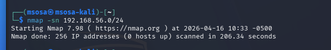
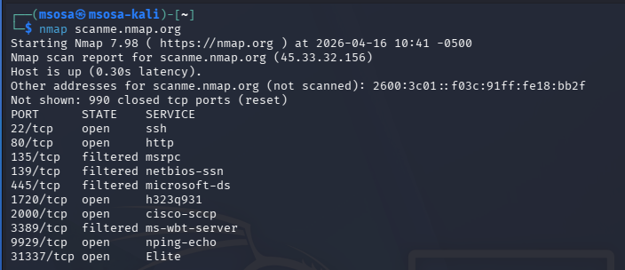
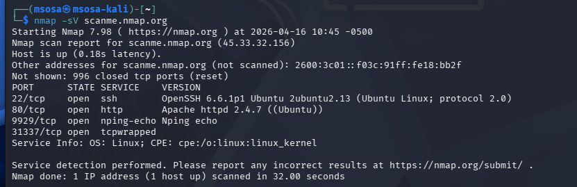
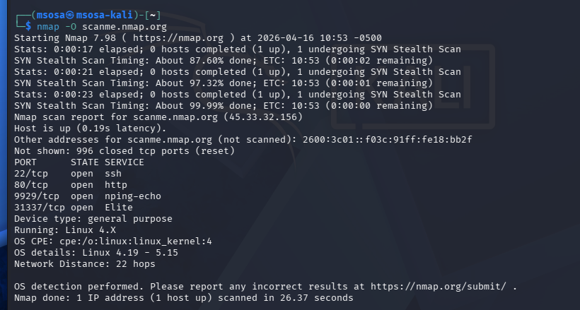

# Objetivos de Aprendizaje

Al finalizar esta práctica, usted será capaz de:

- Diferenciar entre reconocimiento pasivo y activo
- Aplicar escaneo de red con nmap
- Analizar información de un host público controlado: `scanme.nmap.org`
- Utilizar enum4linux en un entorno local controlado
- Identificar:
  - Puertos abiertos y servicios
  - Sistema operativo aproximado
  - Usuarios, grupos y recursos compartidos
  - Evaluar riesgos de exposición de información

# Topología del experimento

- Virtualización: VirtualBox o VMware
- Máquinas virtuales:
  - Ubuntu Desktop 24.04.5 LTS (Noble Numbat) — ejecución de búsquedas y análisis, objetivo local con servicios SMB habilitados
  - Kali Linux 2026.3 — apoyo en análisis de seguridad (opcional)
- Herramientas:
  - Navegador web (Firefox/Chrome)
- Red: Ambas máquinas conectadas en red NAT (entorno controlado)
- Objetivo público controlado: `scanme.nmap.org`

# Marco Teórico

El reconocimiento es la fase inicial en la evaluación de seguridad de redes y sistemas, cuyo objetivo es recopilar información relevante sobre la infraestructura objetivo, como hosts activos, puertos abiertos y servicios disponibles. Esta etapa es clave para comprender la superficie de ataque y posibles vectores de riesgo (Stallings, 2018).

Se distingue entre reconocimiento pasivo y activo. El reconocimiento pasivo obtiene información sin interactuar directamente con el sistema, mientras que el activo implica interacción mediante técnicas como escaneo de puertos o identificación de servicios, lo que permite mayor precisión, aunque con mayor probabilidad de detección (Bishop, 2018).

En este contexto, **Nmap** es una herramienta fundamental para el reconocimiento activo, ya que permite descubrir hosts, identificar puertos y servicios, y realizar análisis de red de forma eficiente (Nmap Project, 2024). Por otro lado, **enum4linux** se utiliza para la enumeración de sistemas que exponen servicios SMB, permitiendo obtener información como usuarios, grupos y recursos compartidos (Kali Tools, 2024).

El uso de entornos controlados como `scanme.nmap.org` permite practicar estas técnicas de forma segura.

| Herramienta | Tipo de reconocimiento | Descripción | Ejemplo de uso |
|------------|----------------------|-------------|----------------|
| `nmap -sn` | Pasivo / descubrimiento | Identifica hosts activos sin escanear puertos | `nmap -sn 192.168.56.0/24` |
| `nmap -sV` | Activo | Detecta servicios y versiones | `nmap -sV scanme.nmap.org` |
| `nmap -O` | Activo | Identifica sistema operativo | `nmap -O scanme.nmap.org` |
| `nmap` | Activo | Escaneo general del host | `nmap scanme.nmap.org` |
| `enum4linux -a` | Activo (SMB) | Extrae usuarios, grupos y recursos | `enum4linux -a 192.168.56.20` |
| `smbclient -L` | Activo | Enumera recursos compartidos | `smbclient -L //192.168.56.20 -N` |
| `who / w` | Local | Muestra usuarios conectados | `who` / `w` |
| `host / dig` | Pasivo | Consulta DNS | `dig scanme.nmap.org` |

: Tabla de herramientas, tipo de reconocimiento y descripción.

# Desarrollo

## Reconocimiento pasivo de red local

Dentro de la red local, se detectaron 254 posibles hosts, aunque ninguno activo.

La diferencia con el escaneo activo es que, en el reconocimiento pasivo únicamente se conoce qué dispositivos están conectados pasando desapercibidos, puesto que no se vulnera ningún servicio sino que se conocen sus puertos.

## Reconocimiento activo sobre objetivo público

Este host tiene 990 puertos cerrados, pero aquellos que mantiene abiertos son:

| Puerto | Estado | Servicio |
| --- |:---:| --- |
| 22/tcp   | ABIERTO   | ssh           |
| 80/tcp   | ABIERTO   | http          |
| 135/tcp  | FILTRADO  | msrpc         |
| 139/tcp  | FILTRADO  | netbios-ssn   |
| 445/tcp  | FILTRADO  | microsoft-ds  |
| 1720/tcp | ABIERTO   | h323q931      |
| 2000/tcp | ABIERTO   | cisco-sccp    |
| 3389/tcp | FILTRADO  | ms-wbt-server |
| 9929/tcp | ABIERTO   | nping-echo    |
| 31337/tcp| ABIERTO   | Elite         |

: Tabla de Puertos Abiertos en Página Web _ScanMe_

Además, se puede realizar un escaneo extendido:

Se puede observar que se tiene un sistema operativo Linux, manteniendo los siguientes servicios abiertos:

22/tcp
: ssh

80/tcp
: http

9929/tcp
: nping-echo

31337/tcp
: tcpwrapped

## Detección de sistema operativo

En esta imagen se puede apreciar el sistema operativo Linux 4.X.
Como bien se puede entender, la detección remota no llega a ser tan precisa debido a posibles intermitencias al tener que recibir los datos.
Es por ello que la información que tenemos del sistema operativo no es completa, sino que nos advierte de la versión general del kernel mas no la específica.

## Enumeración SMB en entorno local

Aquí puede observarse la IP a la que se refiere la máquina virtual de Ubuntu.
Se puede ver que no se tiene el usuario ni contraseña de la máquina, no se especificó en el comando utilizado.
Se pueden también observar los usuarios conocidos dentro de la máquina virtual.
La información advierte también que no existe ningún dominio o grupo de trabajo, o que no pudo detectarla.

# Conclusiones

- El reconocimiento es la fase inicial de cualquier ataque
- `scanme.nmap.org` permite practicar escaneo sin riesgo legal
- _SMB_ puede exponer información sensible si está mal configurado
- `nmap` y `enum4linux` permiten analizar la superficie de ataque
