# Objetivos de Aprendizaje

Al finalizar esta práctica, usted será capaz de:

- Comprender la diferencia fundamental entre el reconocimiento pasivo y activo, y la enumeración de servicios.
- Identificar los flags (`-sS`, `-sV`, `-O`, `-sU`) y las técnicas clave de Nmap para realizar un mapeo completo de un sistema objetivo.
- Aplicar herramientas de escaneo y enumeración (Nmap y Enum4linux) en un entorno controlado (laboratorio virtual).
- Analizar y documentar los hallazgos para determinar posibles vectores de ataque iniciales.
- Aplicar el script `nmap --script=vuln` para automatizar la identificación de vulnerabilidades conocidas (Common Vulnerabilities and Exposures, CVEs) y configuraciones débiles en los servicios activos.

# Topología del Experimento

El entorno debe ser aislado (red interna o Host-Only) para garantizar que el tráfico del taller no salga al exterior, cumpliendo con la ética profesional.

| Rol | Sistema Operativo (VM) | Propósito | Configuración de Red |
|-----|------------------------|-----------|----------------------|
| Atacante (Scanner) | Kali Linux (vía VirtualBox/VMware) | Ejecución de herramientas de escaneo y enumeración (Nmap, Enum4linux) | Adaptador de Red Interna (ej. 192.168.56.10) |
| Objetivo A (Víctima) | Metasploitable 2 (Linux vulnerable) | Host con múltiples vulnerabilidades y puertos abiertos, ideal para el escaneo | Adaptador de Red Interna (ej. 192.168.56.11) |
| Objetivo B (Simulación) | Ubuntu Desktop (o Windows Server de prueba) | Simula un entorno SMB/Samba para practicar la enumeración | Adaptador de Red Interna (ej. 192.168.56.12) |

# Marco Teórico

La Fase 2: Escaneo y Enumeración sigue al Reconocimiento (Footprinting) y busca interactuar activamente con el objetivo para extraer información detallada.

## Escaneo

Es la etapa donde se envían paquetes a la red objetivo para identificar:

1. **Hosts Activos:** Usando ICMP o barrido de ping.  
2. **Puertos Abiertos:** Utilizando técnicas como SYN Scan (`-sS`), que es más sigiloso que un escaneo de conexión (`-sT`) porque no completa el handshake TCP.  
3. **Servicios y Versiones:** Determinando qué software específico se ejecuta en cada puerto abierto (ej. Apache, OpenSSH).  

## Enumeración

Es el proceso de extracción intensiva de información de un servicio o sistema operativo específico. Se utiliza la información recopilada en la fase de escaneo para:

- Obtener nombres de usuario válidos y listas de grupos.  
- Identificar recursos compartidos (SMB/Samba).  
- Extraer políticas de seguridad a nivel de sistema.  

## Análisis de Vulnerabilidades

Utiliza los datos de la fase de escaneo y enumeración (servicios y versiones) para evaluar las debilidades de un sistema.

El script `nmap --script=vuln` es una herramienta esencial en esta fase. Permite:

- Detectar vulnerabilidades conocidas (CVEs).  
- Identificar posibles backdoors.  
- Verificar el uso de credenciales por defecto.  
- Detectar debilidades en protocolos como SMB, FTP o SSH.  

Al automatizar esta búsqueda, el ethical hacker puede priorizar objetivos para la siguiente fase: la explotación.

# Desarrollo

## Reconocimiento Inicial

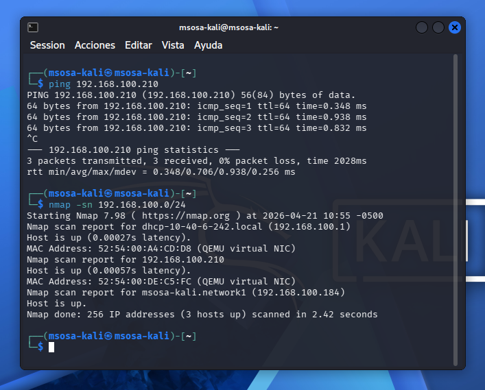

Para iniciar con el desarrollo, se debe constar una conexión entre ambos dispositivos, tal como se observa en la figura \ref{kali_step1}.

Se detectaron 3 dispositivos en la misma red.

## Escaneo de Puertos y Versiones

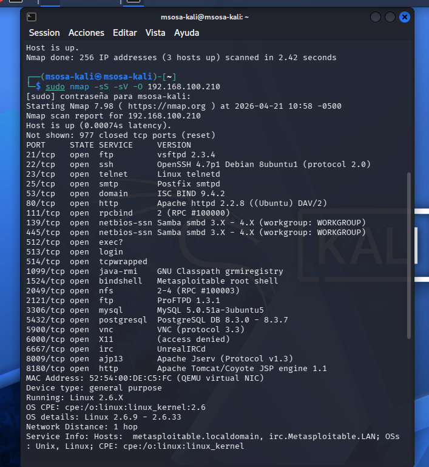

La figura \ref{kali_step2} detecta que la máquina virtual de Metasploitable etiene una versión de Linux 2.6.X, cuyo kernel es _linux\_kernel:2.6_.

## Enumeración de Servicios Específicos

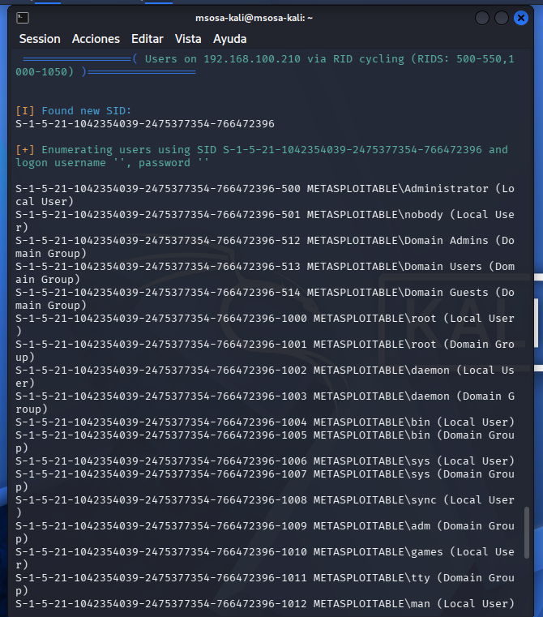

Como se puede observar en la figura \ref{kali_step3}, se hizo un ataque de fuerza bruta al objetivo, aunque no pudo encontrar ningún usuario o dominio.

## Script y Análisis de Vulnerabilidades

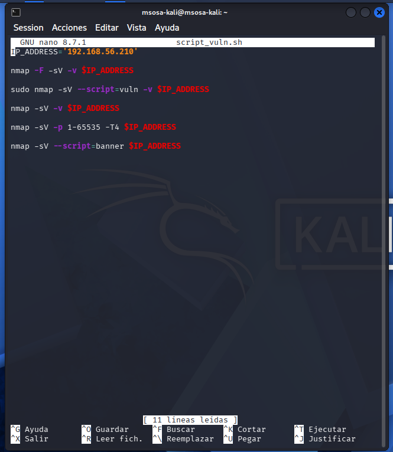

El script de vulnerabilidades es el siguiente:

```sh
# IP de Metasploitable
IP_ADDRESS='192.168.56.210'

# Comandos para vulnerar
nmap -F -sV -v $IP_ADDRESS

sudo nmap -sV --script=vuln -v $IP_ADDRESS

nmap -sV -v $IP_ADDRESS

nmap -sV -p 1-65535 -T4 $IP_ADDRESS

nmap -sV --script=banner $IP_ADDRESS

```

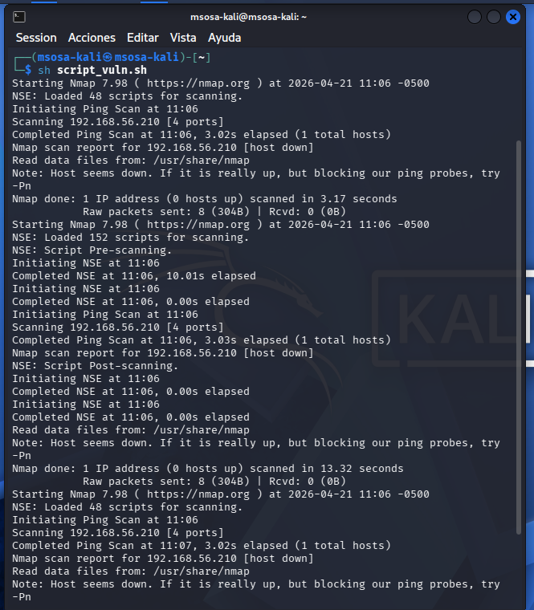

En la ejecución del script mostrada en la figura \ref{kali_step4_exec}, se aprecian los fallos de seguridad concretos de la máquina virtual.

# Ejercicios

## Escaneo general de vulnerabilidades

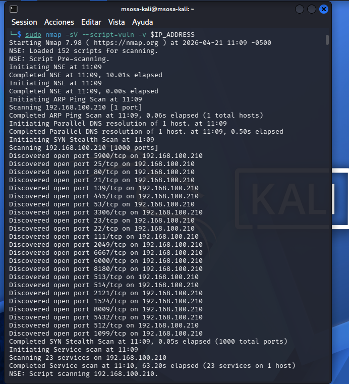

## Escaneo rápido masivo

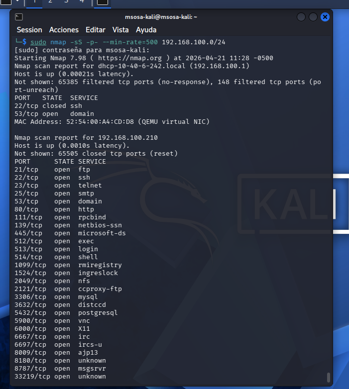

## _Fingerprinting_ y detección de versiones

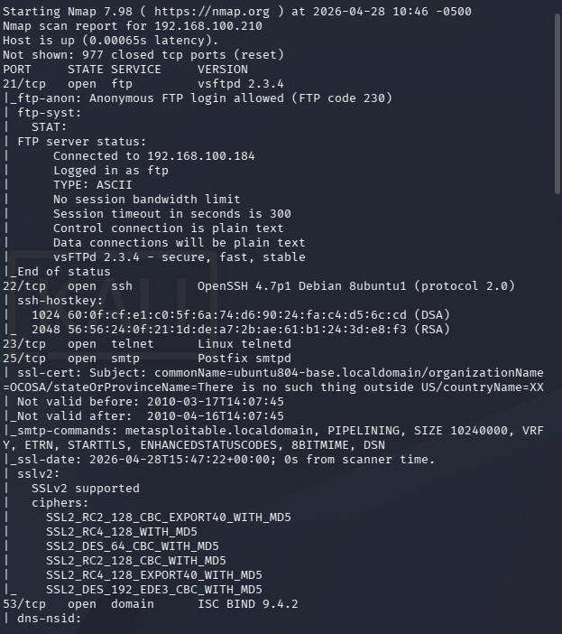

## Uso de Categorías NSE

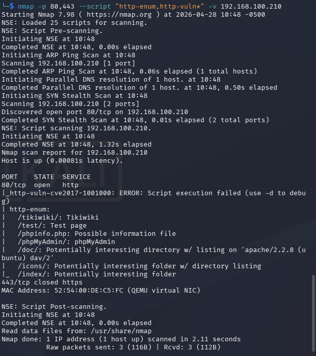

## Escaneo de vulnerabilidades SSL/TLS

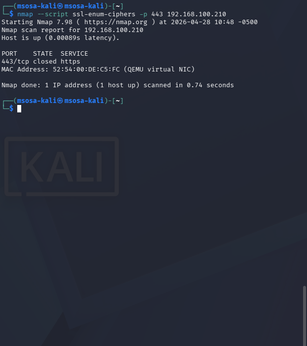

## Escaneo centrado en SMB/Windows

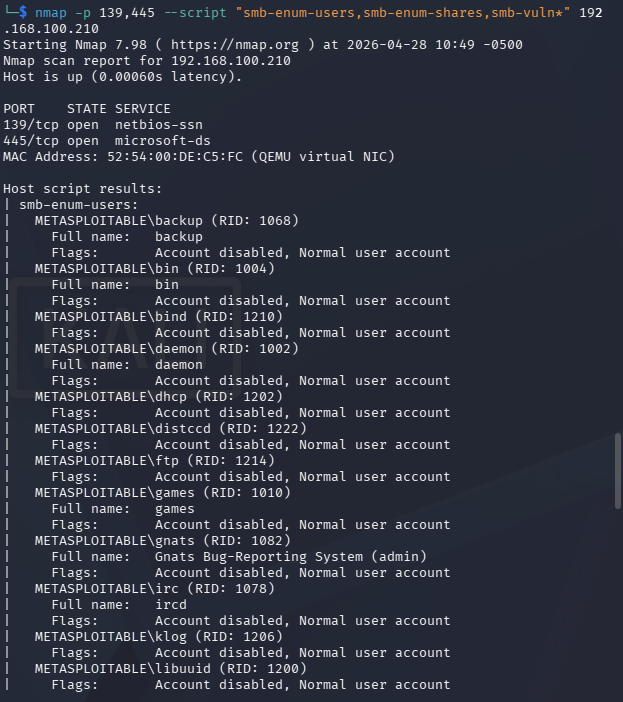

# Conclusiones

- La fase de escaneo representa la transición de reconocimiento pasivo a activo.
- La combinación `nmap -sS -sV -O` es un estándar para obtener información detallada del objetivo.
- La enumeración transforma datos generales (puertos abiertos) en información útil para explotación (usuarios, recursos).
- Todas las prácticas deben ejecutarse en entornos aislados, respetando principios éticos del hacking.
