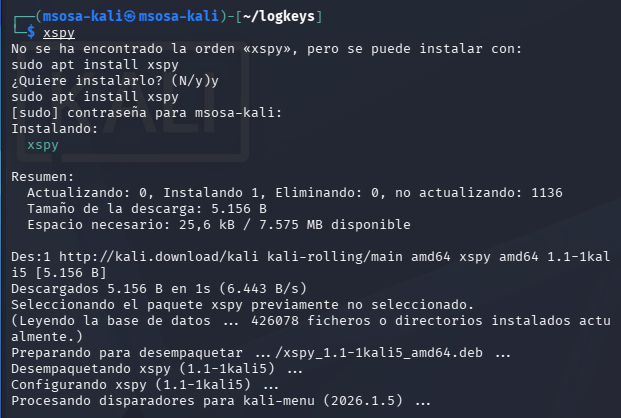

# Objetivos de aprendizaje

- Los estudiantes comprendan el funcionamiento de un keylogger y su implementación en un entorno controlado utilizando Kali Linux. 
- Los estudiantes aprenderán a configurar y ejecutar un keylogger, observarán su funcionamiento, y analizarán su impacto en la seguridad. 
- Los estudiantes abordarán aspectos éticos relacionados con el uso de este tipo de herramientas.

# Topología

1. Kali Linux (máquina atacante).
2. Windows o Linux (máquina víctima, puede ser una máquina virtual), o a su vez la VM Metasploitable 2.
3. Keylogger libre
4. Wireshark o iptraf (para análisis de red, opcional).

# Marco Teórico

## Introducción a los keylogger

Los keyloggers (registradores de teclas) son herramientas diseñadas para capturar las pulsaciones realizadas por un usuario en un dispositivo. Originalmente, estas tecnologías surgieron con fines legítimos, como la auditoría de sistemas, control parental y pruebas de usabilidad. Sin embargo, también son ampliamente utilizadas en el ámbito del malware para el robo de información sensible, como credenciales, datos bancarios y mensajes privados.
Desde la perspectiva de la ciberseguridad, los keyloggers se clasifican como una forma de software espía (spyware), ya que operan de manera oculta y recopilan información sin el consentimiento del usuario.

## Clasificación de los keyloggers

Los keyloggers pueden clasificarse según su implementación y nivel de operación.

### Keyloggers de software

Funcionan a nivel del sistema operativo y pueden implementarse mediante:

- Hooks del teclado (interceptación de eventos) 
- APIs del sistema 
- Modificación de controladores

Este tipo es común en entornos de desarrollo como Python debido a su facilidad de implementación.

### Keyloggers de hardware

Son dispositivos físicos conectados entre el teclado y la computadora. No requieren instalación de software y son más difíciles de detectar mediante herramientas tradicionales.

### Keyloggers basados en kernel

Operan a nivel del núcleo del sistema operativo, lo que les permite evadir muchos mecanismos de detección convencionales. Este tipo está asociado a técnicas avanzadas como rootkits.

### Funcionamiento de los keyloggers en sistemas operativos

En sistemas basados en Linux, como Kali Linux, los eventos de entrada del teclado son gestionados a través de subsistemas específicos del kernel (por ejemplo, /dev/input).

Un keylogger puede interceptar estos eventos mediante:

- Lectura directa de dispositivos de entrada 
- Uso de bibliotecas de captura de eventos 
- Intercepción en espacio de usuario 

En el caso de implementaciones en Python, se utilizan bibliotecas que permiten acceder a eventos del teclado, facilitando la creación de prototipos con fines educativos.

### Kali Linux en el análisis de seguridad

Kali Linux es una distribución de Linux orientada a pruebas de penetración y auditorías de seguridad. Incluye herramientas especializadas para:

- Análisis de malware 
- Pruebas de vulnerabilidades 
- Evaluación de seguridad en sistemas 

El uso de Kali Linux en esta práctica permite a los estudiantes comprender cómo se analizan herramientas potencialmente maliciosas en entornos controlados.

### Desarrollo de keyloggers con Python

Python es un lenguaje ampliamente utilizado en ciberseguridad debido a su simplicidad y gran ecosistema de bibliotecas. En el contexto educativo, permite:

- Comprender la lógica de captura de eventos 
- Simular comportamientos de software malicioso en entornos controlados 
- Analizar patrones de funcionamiento 

Es importante destacar que el desarrollo de este tipo de software debe realizarse únicamente con fines académicos y en entornos controlados.

### Detección y mitigación de keyloggers

La detección de keyloggers es un desafío debido a su naturaleza sigilosa. Algunas técnicas incluyen:

- Monitoreo de procesos sospechosos 
- Análisis del comportamiento del sistema 
- Uso de software antivirus y herramientas de análisis forense 
- Control de acceso a dispositivos de entrada

Las soluciones modernas se basan en el análisis de comportamiento más que en firmas, debido a la evolución constante del malware.

### Consideraciones éticas y legales

El desarrollo y uso de keyloggers sin consentimiento es ilegal en muchos países y constituye una violación grave de la privacidad. En el contexto académico, su estudio debe estar limitado a:

- Entornos controlados 
- Fines educativos 
- Análisis de seguridad

Es fundamental que los estudiantes comprendan las implicaciones éticas del uso de estas herramientas y promuevan prácticas responsables en ciberseguridad

# Desarrollo

## Instalación y Configuración del Keylogger

### Instalar Logkeys en Kali Linux



La instalación del paquete `keylogger` no está disponible en las últimas versiones del repositorio de Ubuntu.
La solución fue instalar un nuevo paquete llamado `xspy`, el cual permite conocer qué teclas se están presionando.

### Configurar Logkeys


Para configurar el LogKey, se optó por ponerlo en segundo plano para que no se detecte su salida.
El comando utilizado fue:

```sh
xspy > teclas.log 2>&1 &

```

donde se puede apreciar que se guarda en el archivo `teclas.log` e, incluso, guarda la salida del teclado y los errores que puedan darse.

### Verificar la ejecución del Keylogger


En la figura \ref{xspy_cat}, se puede apreciar el comando que se buscó, que en este caso fue un:

```sh
sudo systemctl status ssh

```

Como se puede observar en el output obtenido del archivo, está escrito el comando, mas no su ejecución, puesto que el programa `xspy` únicamente toma en cuenta las teclas presionadas.

# Conclusión de la práctica

Al final de esta práctica, los estudiantes habrán adquirido experiencia práctica con el uso de un keylogger en un entorno controlado, comprendiendo tanto su funcionamiento como las consecuencias de su uso en términos de seguridad informática. Así mismo aprenderá a programar un keylogger en Python a detectarlo y a mitigarlo. 

Se enfatiza la importancia de la ética en el campo de la ingeniería y la seguridad, especialmente cuando se trata de herramientas que pueden invadir la privacidad de las personas.
