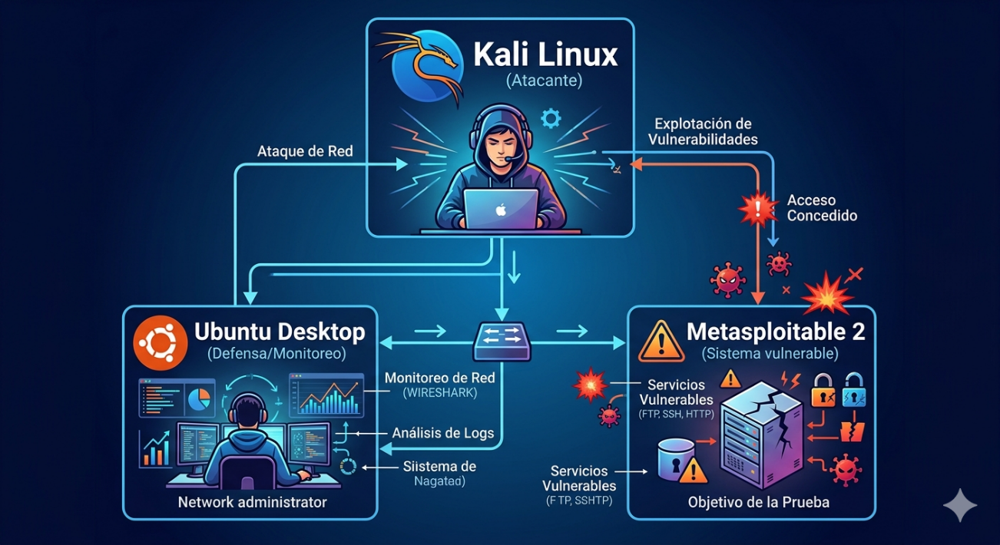
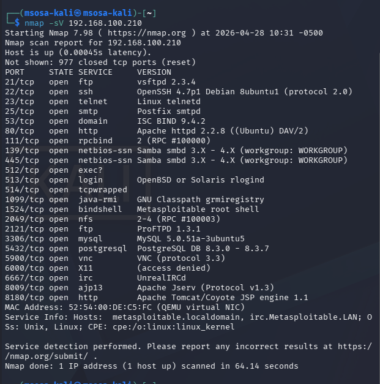
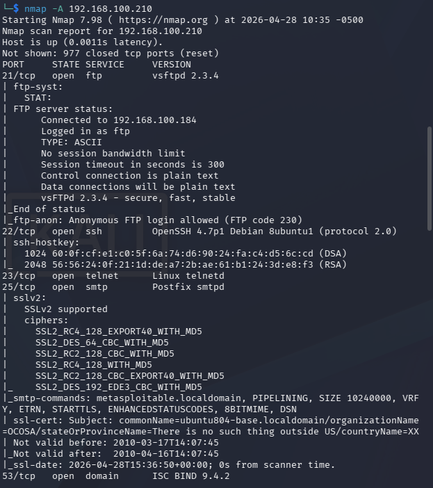
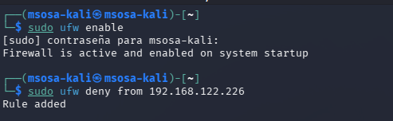
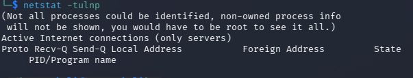
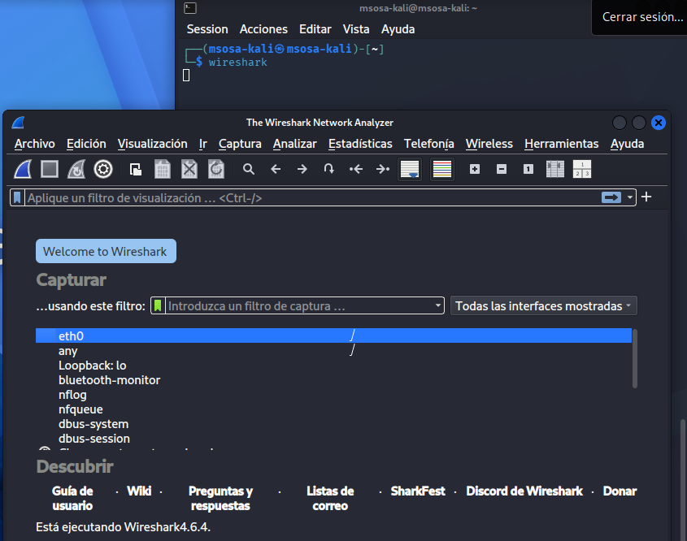
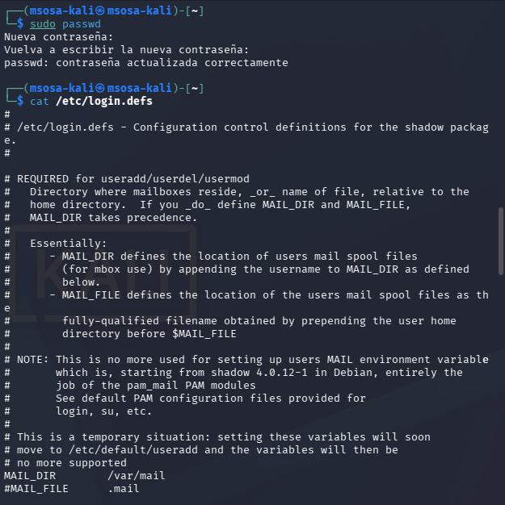
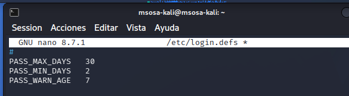
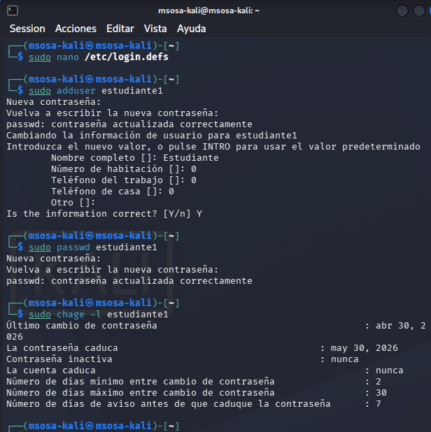
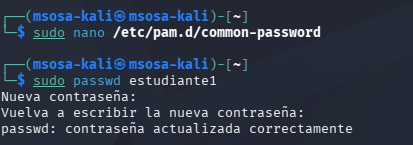

# Objetivos de Aprendizaje

Al finalizar esta práctica, usted será capaz de:

- Comprender e implementar controles básicos de seguridad basados en NIST
- Analizar vulnerabilidades en sistemas expuestos
- Aplicar mecanismos de monitoreo, autenticación y control de acceso
- Evaluar eventos de seguridad mediante análisis de logs
- Relacionar la práctica con dominios de seguridad como auditoría, autenticación y protección de sistemas

# Topología del experimento

La Figura \ref{topologia} representa un laboratorio de pruebas de penetración (pentesting), en el cual el atacante utiliza Kali Linux para ejecutar técnicas de reconocimiento y explotación sobre Metasploitable 2, una máquina virtual diseñada con vulnerabilidades intencionales.

De manera complementaria, la VM con Ubuntu Desktop cumple el rol de sistema de monitoreo y análisis, desde donde se emplean herramientas de inspección de tráfico y revisión de registros para identificar indicios de intrusión y evaluar la efectividad de los controles de seguridad implementados.

Para lograr una visibilidad adecuada del tráfico, este sistema debe configurarse en un entorno de red que permita la captura de paquetes o el acceso a los logs generados por los sistemas analizados.

# Software requerido

- VirtualBox / VMware
- Kali Linux
- Metasploitable 2
- Ubuntu Desktop

## Herramientas

- Nmap
- Wireshark
- Netstat
- UFW (firewall)

El estudiante deberá presentar en su informe de laboratorio:

- Evidencia del escaneo realizado (capturas de Nmap)
- Identificación de vulnerabilidades detectadas
- Configuración aplicada en el firewall
- Capturas del análisis de tráfico con Wireshark
- Análisis de logs generados durante la práctica

# Marco Teórico

El estándar **NIST SP 800-171** define un conjunto de controles mínimos para proteger información sensible en sistemas no federales. Estos controles se agrupan en dominios como:

- Control de acceso
- Auditoría
- Autenticación
- Integridad de la información

En entornos de laboratorio, estos principios pueden aplicarse mediante la simulación de ataques y la implementación de mecanismos de defensa en sistemas vulnerables.

## FIPS PUB 200

**FIPS** significa *Federal Information Processing Standards*. Es un conjunto de normas de seguridad publicadas por el gobierno de Estados Unidos a través del NIST.

Define cómo deben protegerse y procesarse los datos sensibles en sistemas informáticos.

En la práctica, **FIPS** establece reglas sobre:

- Cifrado de datos
- Autenticación segura
- Integridad de la información
- Requisitos de seguridad en hardware y software

# Desarrollo

## Reconocimiento

En la figura \ref{reconocimiento} se pueden apreciar los servicios activos en Metasploitable.
En listado, se pueden encontrar todos los puertos que mantiene abiertos.

## Simulación de Ataque

Con el comando `nmap -A 192.168.100.210` se puede comprobar toda la información de todos los puertos abiertos que mantiene Metasploitable.
Esto permite conocer qué servicios vulnerables tiene y cuáles podemos atacar.

## Implementación de Controles

En la figura \ref{kali_ufw} se puede apreciar que se hizo un bloqueo a la dirección IP de Metasploitable para que esta no pueda acceder a los mismos servicios a los que quiere acceder.

Además, en la figura \ref{kali_netstat} se puede apreciar cuáles son las conexiones activas que mantiene el dispositivo.

## Monitoreo de Tráfico

La aplicación de Wireshark permite conocer el tráfico que transita por el dispositivo, permitiendo entender cuáles y a dónde salen nuestros paquetes, además de conocer aquellos que se nos son enviados.

## Autenticación y Seguridad

Es posible además configurar aquellas políticas de seguridad y autenticación de usuarios dentro del dispositivo para que no sean vulnerables y la información sea accesible de forma controlada.

## Ejemplos

### Política de Contraseñas

En la figura \ref{kali_logindefs} se puede apreciar la modificación del archivo `/etc/login.defs` para cambiar cáda cuánto se debe actualizar las contraseñas, además de otras configuraciones importantes.

En la figura \ref{kali_login_test} se observa la ejecución y nueva información de la contraseña que se generó para un nuevo usuario.

### Política de Complejidad de Contraseñas

Al editar el archivo `/etc/pam.d/common-password` se puede exigir una contraseña con mayúsculas, números y longitud mínima, además de símbolos y ciertos requisitos para una contraseña mucho más segura.

# Conclusiones

- La seguridad requiere múltiples controles coordinados
- Kali Linux evidencia vulnerabilidades fácilmente explotables
- Ubuntu demuestra la importancia del monitoreo y control
- NIST proporciona una base sólida de seguridad
- El monitoreo continuo es clave para detectar amenazas
- La seguridad es un proceso dinámico que requiere mejora constante
