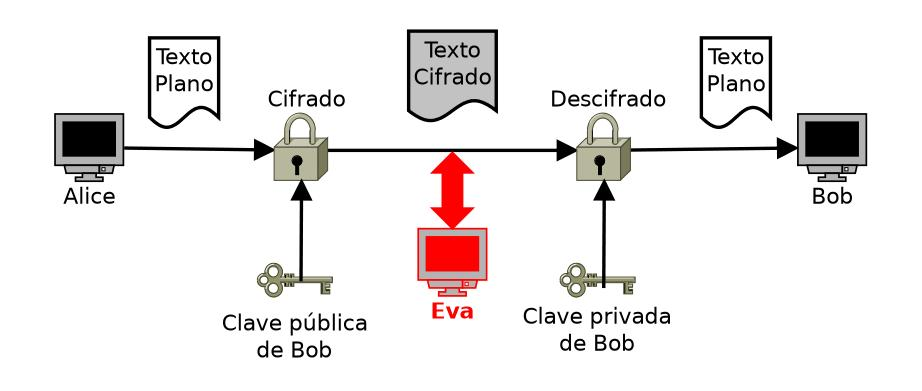

# 04 - Junio - 2026

## Objetivos de Aprendizaje

1. Criptografía Asimétrica
  - Protocolos
    - HTTPS
    - SSH
    - PGP
    - GPG
  - Algoritmos
    - RSA
    - EC
2. Práctica de Laboratorio: Criptografía Asimétrica con OpenSSL

## Meditación

### Mark Zuckerberg

Mientras estudiaba en la Harvard University, Zuckerberg creó en 2004 una plataforma destinada inicialmente a conectar a los estudiantes de la universidad. Este proyecto evolucionó rápidamente y se convirtió en Facebook, una red social que permitió a millones de personas compartir información, comunicarse y construir comunidades en línea. El crecimiento de la plataforma fue exponencial, expandiéndose desde los campus universitarios hasta convertirse en una de las redes sociales más utilizadas del mundo.

Bajo el liderazgo de Zuckerberg, la empresa amplió significativamente sus operaciones mediante la adquisición de plataformas como Instagram y WhatsApp. En 2021, Facebook cambió su nombre corporativo a Meta Platforms para reflejar su enfoque en el desarrollo del metaverso y tecnologías de realidad virtual y aumentada. Actualmente, Mark Zuckerberg es considerado una de las figuras más influyentes de la industria tecnológica debido a su impacto en las redes sociales, la comunicación digital y la innovación tecnológica.

- _"El mayor riesgo es no tomar ningún riesgo."_
- _"Muévete rápido y rompe cosas. Si nunca rompes nada, probablemente no te estás moviendo lo suficientemente rápido."_
- _"La gente no se preocupa por lo que dices, sino por lo que construyes."_

## Criptografía Asimétrica

Proceso de cirado y descifrado utilizando una clave pública y otra privada.
La clave pública sirve para encriptar.
La clave privada sirve para desencriptar.

### Algoritmos

RSA
: Basado en la factorización de números primos grandes

EC
: Curvas elípticas con operaciones matemáticas de curvas

### Acrónimos

HTTPS
: HyperText Transfer Protocol Secure

SSH
: Secure Shell

PGP
: Pretty Good Privacy

GPG
: GNU Privacy Guard

TLS
: Transport Layer Security

SSL
:Secure Sockets Layer

RSA
: Rivest-Shamir-Adleman

EC
: Elliptic Curves
