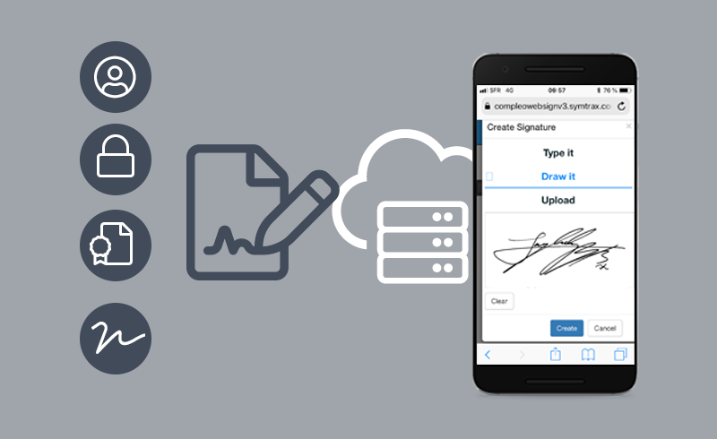

# 09 - Junio - 2026

## Objetivos de Aprendizaje

1. Aplicaciones de la Criptografía Asimétrica & Hash
  - Firma Digital
  - Firma Electrónica
  - Certificado Digital
  - Autoridad Calificadora
  - PKI (Infraestructura de clave pública)
2. Taller: RSA

## Meditación

La meditación fue el compartir.

## Firma Digital

La firma digital es un mecanismo criptográfico que permite garantizar la autenticidad, integridad y no repudio de un documento o mensaje electrónico. Se basa en el uso de criptografía asimétrica, donde el emisor utiliza su clave privada para generar una firma única asociada al contenido del documento. Posteriormente, cualquier persona con acceso a la clave pública correspondiente puede verificar la validez de dicha firma.

Las funciones hash desempeñan un papel fundamental en este proceso, ya que generan un resumen único del documento antes de ser firmado. Si el contenido es modificado, incluso mínimamente, el valor hash cambia y la firma deja de ser válida. Gracias a estas características, la firma digital es ampliamente utilizada en contratos electrónicos, transacciones financieras y sistemas de intercambio seguro de información.

## Firma Electrónica

La firma electrónica es un conjunto de datos electrónicos asociados a un documento que permiten identificar al firmante y expresar su aceptación o consentimiento sobre el contenido. A diferencia de la firma digital, la firma electrónica es un concepto más amplio que puede incluir diversos mecanismos de autenticación, desde contraseñas hasta sistemas biométricos o certificados digitales.

Su principal objetivo es facilitar la realización de trámites y procesos de manera digital, reduciendo la necesidad de documentos físicos. Dependiendo de la legislación de cada país, ciertos tipos de firmas electrónicas poseen la misma validez jurídica que una firma manuscrita, siempre que se garantice adecuadamente la identidad del firmante y la integridad del documento firmado.

## Certificado Digital

Un certificado digital es un documento electrónico que vincula la identidad de una persona, organización o sistema con una clave pública específica. Este certificado contiene información del titular, la clave pública asociada, el período de validez y la firma de una entidad certificadora que garantiza la autenticidad de los datos contenidos en el certificado.

Los certificados digitales permiten establecer confianza en entornos electrónicos al verificar que una clave pública realmente pertenece a la entidad que afirma poseerla. Son utilizados en aplicaciones como sitios web seguros, correos electrónicos firmados digitalmente, autenticación de usuarios y firma de documentos electrónicos, contribuyendo a la seguridad de las comunicaciones digitales.

## Autoridad Calificadora

La Autoridad Calificadora es una entidad de confianza encargada de emitir, administrar, renovar y revocar certificados digitales. Su función principal consiste en verificar la identidad de los solicitantes antes de emitir un certificado, asegurando que la relación entre la identidad y la clave pública sea legítima y verificable.

Al actuar como un tercero confiable, la Autoridad Calificadora permite que usuarios y organizaciones confíen en los certificados emitidos sin necesidad de conocerse previamente. Además, mantiene mecanismos de control como listas de revocación y validación de certificados para garantizar que únicamente se utilicen credenciales válidas y seguras dentro de los sistemas de comunicación electrónica.

## PKI (Infraestructura de Clave Pública)

La Infraestructura de Clave Pública (PKI, Public Key Infrastructure) es un conjunto de políticas, procedimientos, tecnologías y entidades que permiten gestionar de forma segura el uso de certificados digitales y pares de claves criptográficas. Su propósito es proporcionar mecanismos confiables para la autenticación, el cifrado de información y la firma digital en entornos digitales.

Dentro de una PKI participan diversos componentes, como autoridades certificadoras, autoridades de registro, repositorios de certificados y sistemas de validación. Gracias a esta infraestructura, organizaciones y usuarios pueden intercambiar información de manera segura, establecer relaciones de confianza y proteger la integridad de los datos en aplicaciones como comercio electrónico, banca en línea y gobierno digital.
