# Objetivos de Aprendizaje

Al finalizar esta práctica, usted será
capaz de:

1.  Comprender el proceso de encriptación y desencriptación mediante el
    cifrado César.

2.  Entender el funcionamiento del algoritmo implementado en Python.

3.  Repotenciar y mejorar el algoritmo básico del Código César.

4.  Aprender a utilizar CyberChef para realizar operaciones
    criptográficas básicas.

5.  Implementar comunicación cifrada entre máquinas virtuales utilizando
    Netcat (nc).

# Introducción

La criptografía es una disciplina fundamental en la seguridad
informática moderna. Desde los métodos clásicos hasta los sistemas
criptográficos actuales, el objetivo principal consiste en proteger la
información frente a accesos no autorizados.

Uno de los métodos históricos más conocidos es el Cifrado César,
utilizado por Julio César para proteger mensajes militares. Aunque
actualmente se considera inseguro frente a ataques modernos, sigue
siendo un excelente mecanismo didáctico para comprender conceptos
fundamentales de criptografía, cifrado y análisis criptográfico.

En esta práctica se implementará el algoritmo en Python, se analizará su
funcionamiento y se utilizará la herramienta CyberChef para experimentar
con procesos de cifrado y descifrado.

# Marco Teórico

**Criptología:** es la ciencia que estudia los métodos de protección y
análisis de información. Se divide principalmente en:

- Criptografía

- Criptoanálisis

**Criptografía:** consiste en desarrollar técnicas que permitan proteger
la información mediante algoritmos de cifrado. Su objetivo es
garantizar:

- Confidencialidad

- Integridad

- Autenticación

- No repudio

**Criptoanálisis:** El criptoanálisis estudia métodos para romper
sistemas criptográficos o descubrir información sin conocer la clave
utilizada.

**Cifrado César:** es un método de sustitución mono alfabética en el
cual cada letra del mensaje original se desplaza un número fijo de
posiciones en el alfabeto.

**Fórmula del cifrado:**

$$ C(x)=(x + n) \text{mod}26 (1) $$

$$ D(x)=(x - n) \text{mod}26 (2) $$

**Donde:**

- C: Cifrado

- D: Descifrado

- x: posición de la letra

- k: clave de desplazamiento

- 26: número de letras del alfabeto

**CyberChef:** es una herramienta web desarrollada por GCHQ utilizada
para transformar, analizar, codificar, decodificar y cifrar información.

**Características:**

- Interfaz gráfica intuitiva

- Soporte para múltiples algoritmos

- Conversión de formatos

- Operaciones criptográficas

- Análisis de texto y datos.

**Netcat (nc**): es una herramienta de red utilizada para:

- Escaneo de puertos

- Transferencia de archivos

- Comunicación cliente-servidor

- Envío y recepción de mensajes TCP/UDP

En esta práctica se utilizará para enviar mensajes cifrados entre máquinas virtuales.

## Topología de prueba

- Ubuntu Desktop: estación de trabajo del estudiante para desarrollo y
  pruebas.

- Metasploitable: Máquina objetivo de laboratorio.

- Kali Linux: máquina atacante / análisis y desarrollo

# Desarrollo

## Ejercicios de Cifrado

Cifrar manualmente las siguientes frases utilizando el Código César con un desplazamiento de 3 posiciones:

- SOFTWARE

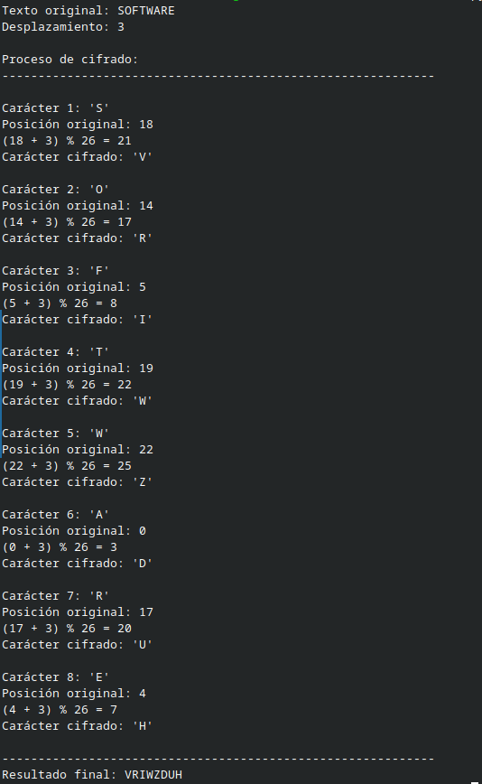

- SEGURIDAD

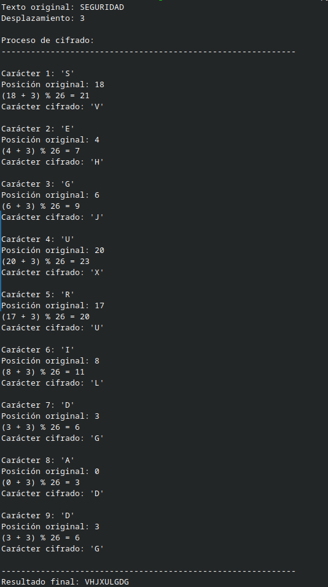

- CRIPTOGRAFIA

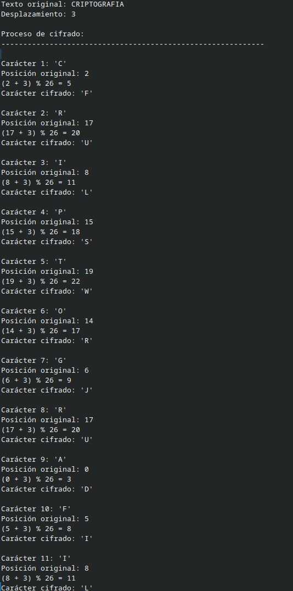

- I LOVE LINUX

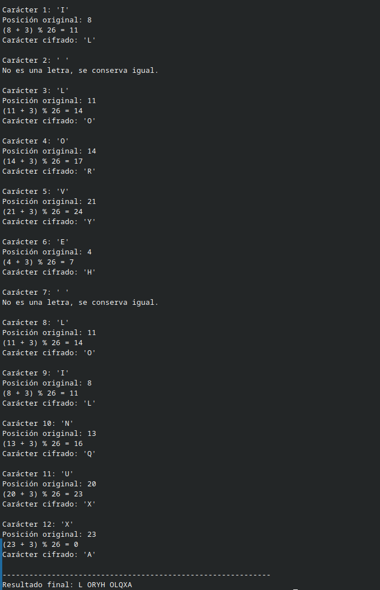

- GOD IS LOVE

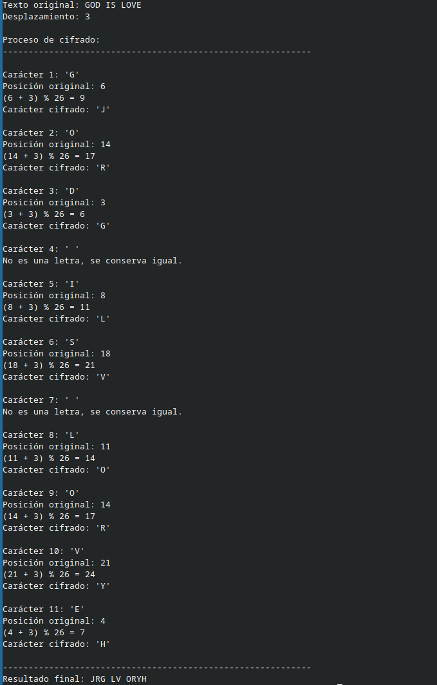

## Ejercicios de Descifrado

Descifrar los siguientes mensajes aplicando manualmente el
desplazamiento inverso del Código César:

- KROD PXQGR

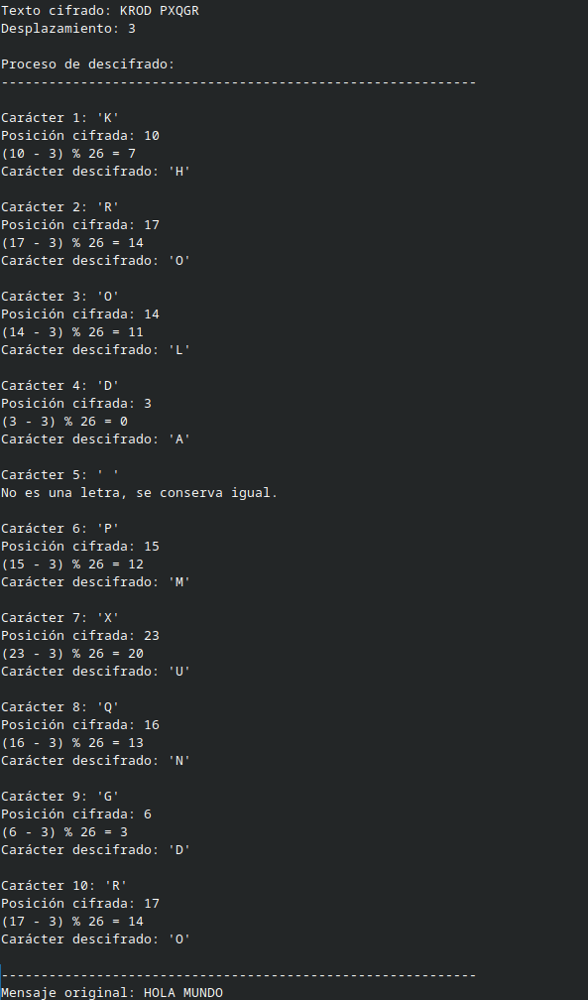

- FUBSWRVHJXULGDG

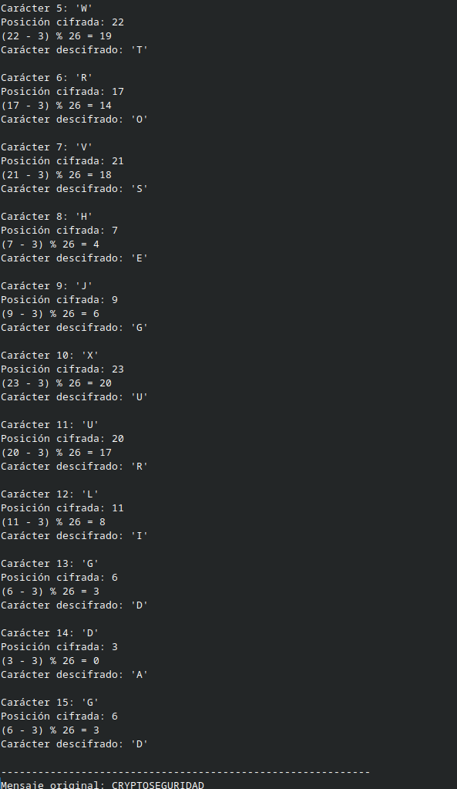

- SURJUDPDFLRQ HQ S BWKRQ

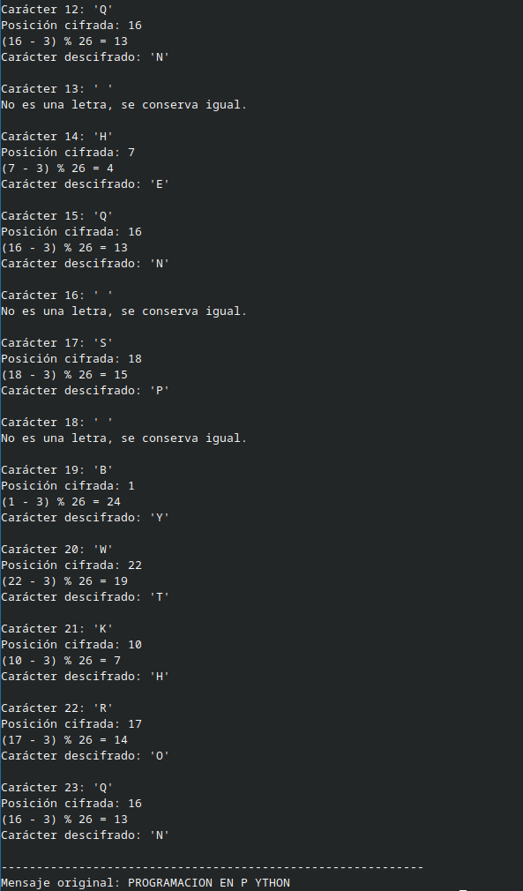

- OLQXA LV DZHVRPH

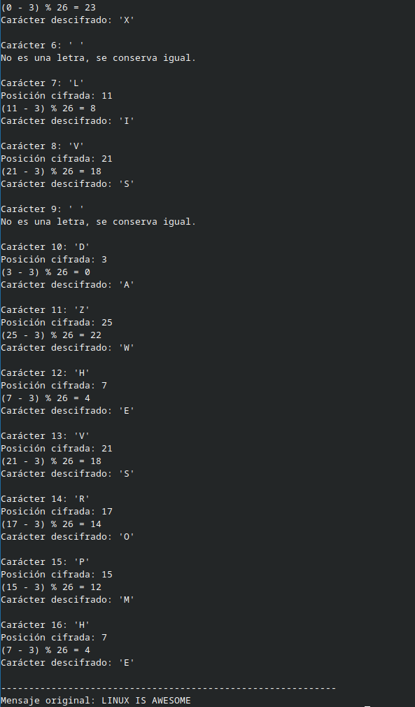

- VDIH QHWZRUN

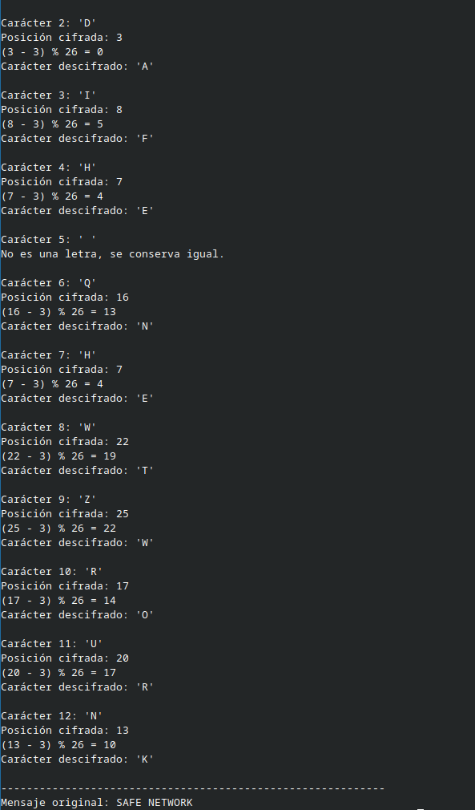

## Algoritmo en Python

Código Base:

```py
def cifrado_cesar(texto, desplazamiento):
    resultado = ""

    for caracter in texto:
        if caracter.isalpha():
            base = ord('A') if caracter.isupper() else ord('a')
            nuevo_caracter = chr(
                (ord(caracter) - base + desplazamiento) % 26 + base
            )

            resultado += nuevo_caracter
        else:
            resultado += caracter
    return resultado

mensaje = input("Ingrese el mensaje: ")
clave = int(input("Ingrese el desplazamiento: "))

texto_cifrado = cifrado_cesar(mensaje, clave)
print("Texto cifrado:", texto_cifrado)

```

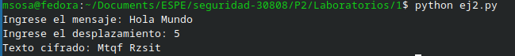

**Analizar el código y responder:**

1.  ¿Qué función cumple ord()?

Convierte un carácter en su código numérico Unicode (para letras inglesas coincide con ASCII).

2.  ¿Qué función cumple chr()?

Realiza la operación inversa de ord(): convierte un número Unicode en un carácter.

3.  ¿Qué representa % 26?

El operador % es el módulo (resto de una división).

4.  ¿Cómo funciona el desplazamiento?

El desplazamiento indica cuántas posiciones debe moverse cada letra dentro del alfabeto.

5.  ¿Qué ocurre con símbolos y espacios?

Los símbolos, espacios, números y signos de puntuación no se cifran.

## Comunicación Cifrada entre Máquinas Virtuales

### Ubuntu Desktop

Escuchar conexiones:

nc -lvnp 4444

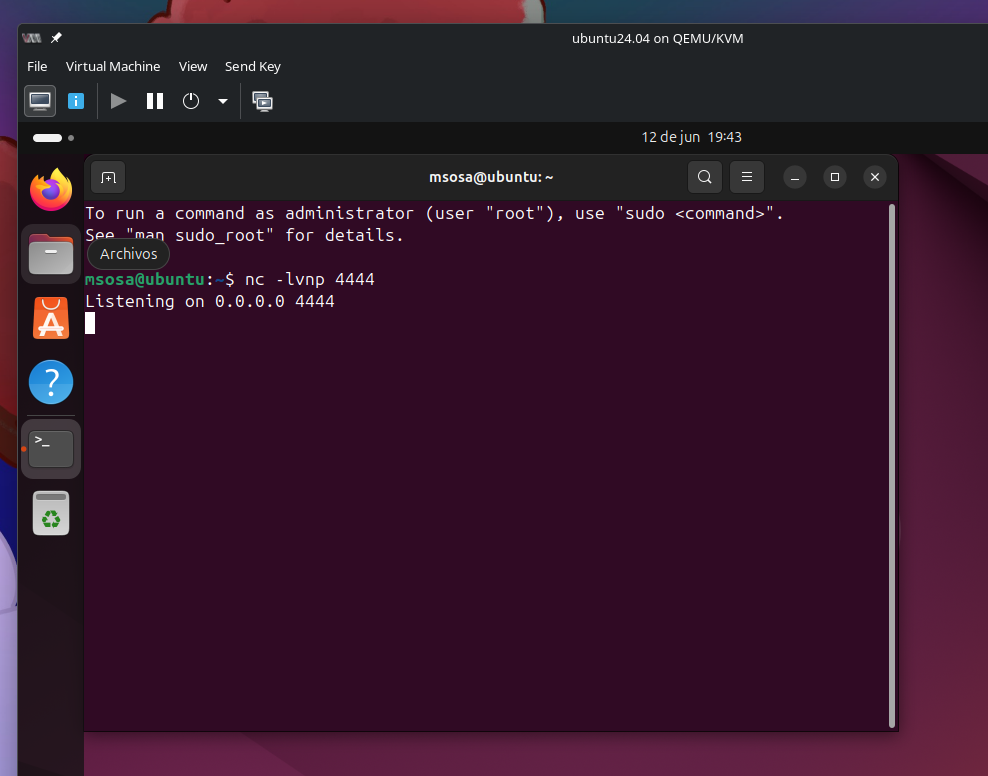

### Kali Linux

Enviar mensaje:

echo \"PHQVDMH HQFULSWDGR\" \| nc \<IP_UBUNTU\> 4444

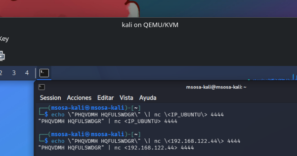

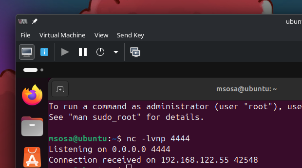

## Repotenciar el Algoritmo en Python

Modificar el programa para:

- Permitir cifrado y descifrado.

- Incorporar menú interactivo.

- Validar entradas incorrectas.

- Soportar mayúsculas y minúsculas.

- Manejar caracteres especiales.

- Ejecutar las pruebas de evaluación y validación correspondientes.

El nuevo programa es el siguiente:

```py
def cifrado_cesar(texto, desplazamiento):
    resultado = ""

    for caracter in texto:
        if caracter.isalpha():
            base = ord('A') if caracter.isupper() else ord('a')

            nuevo_caracter = chr(
                (ord(caracter) - base + desplazamiento) % 26 + base
            )

            resultado += nuevo_caracter
        else:
            # Mantener espacios, números y símbolos
            resultado += caracter

    return resultado


def descifrado_cesar(texto, desplazamiento):
    return cifrado_cesar(texto, -desplazamiento)


def obtener_desplazamiento():
    while True:
        try:
            valor = int(input("Ingrese el desplazamiento (entero): "))
            return valor
        except ValueError:
            print("Error: debe ingresar un número entero.")


def pruebas():
    print("\n=== PRUEBAS AUTOMÁTICAS ===")

    mensaje = "Hola Mundo"
    clave = 3

    cifrado = cifrado_cesar(mensaje, clave)
    descifrado = descifrado_cesar(cifrado, clave)

    print(f"Mensaje original : {mensaje}")
    print(f"Cifrado          : {cifrado}")
    print(f"Descifrado       : {descifrado}")

    assert descifrado == mensaje

    # Prueba de mayúsculas y minúsculas
    assert cifrado_cesar("ABC xyz", 2) == "CDE zab"

    # Prueba de caracteres especiales
    assert cifrado_cesar("Hola, Mundo! 123", 5) == "Mtqf, Rzsit! 123"

    print("Todas las pruebas fueron superadas.\n")


def menu():
    while True:
        print("\n===== CIFRADO CÉSAR =====")
        print("1. Cifrar mensaje")
        print("2. Descifrar mensaje")
        print("3. Ejecutar pruebas")
        print("4. Salir")

        opcion = input("Seleccione una opción: ")

        if opcion == "1":
            mensaje = input("Ingrese el mensaje: ")
            clave = obtener_desplazamiento()

            resultado = cifrado_cesar(mensaje, clave)
            print("Mensaje cifrado:", resultado)

        elif opcion == "2":
            mensaje = input("Ingrese el mensaje cifrado: ")
            clave = obtener_desplazamiento()

            resultado = descifrado_cesar(mensaje, clave)
            print("Mensaje descifrado:", resultado)

        elif opcion == "3":
            pruebas()

        elif opcion == "4":
            print("Programa finalizado.")
            break

        else:
            print("Opción inválida. Intente nuevamente.")


if __name__ == "__main__":
    menu()

```

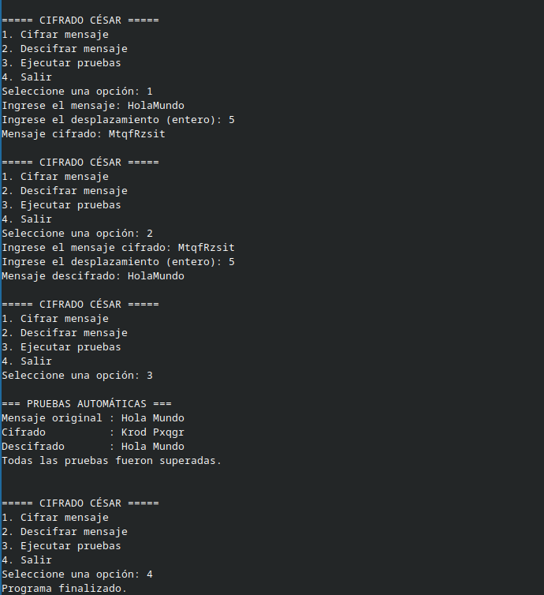

## Uso de CyberChef

Ingresar a: https://gchq.github.io/CyberChef/

Realizar las siguientes operaciones:

1.  ROT13

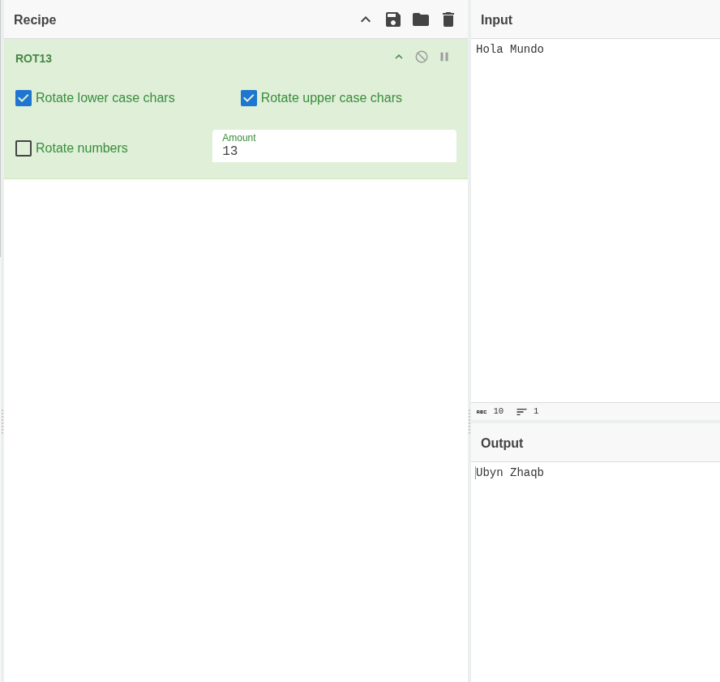

2.  Caesar Cipher

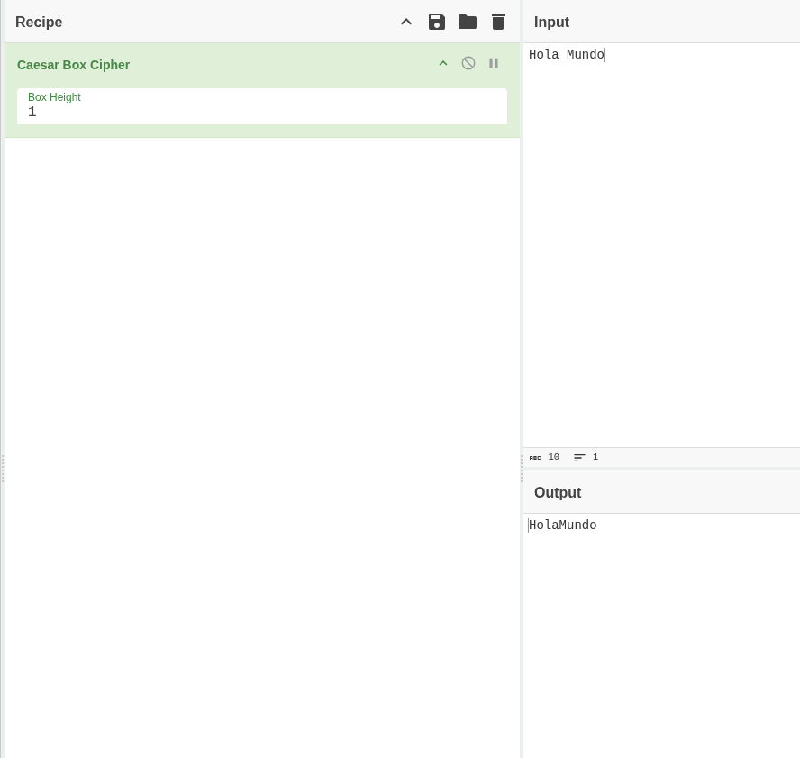

3.  Base64 Encode

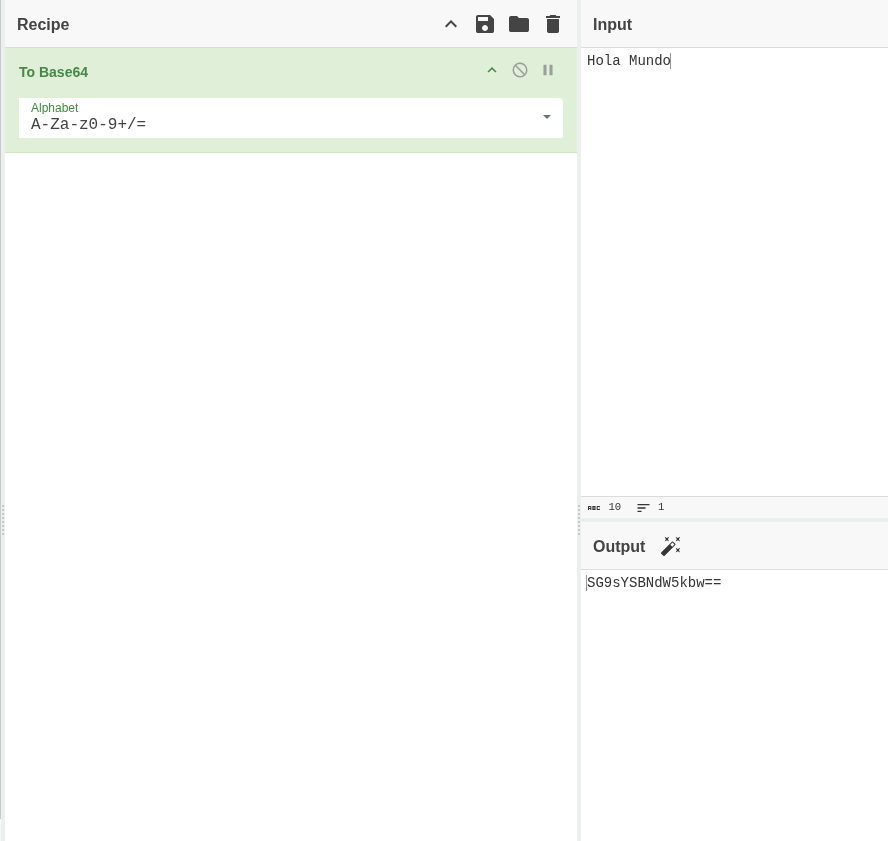

4.  Base64 Decode

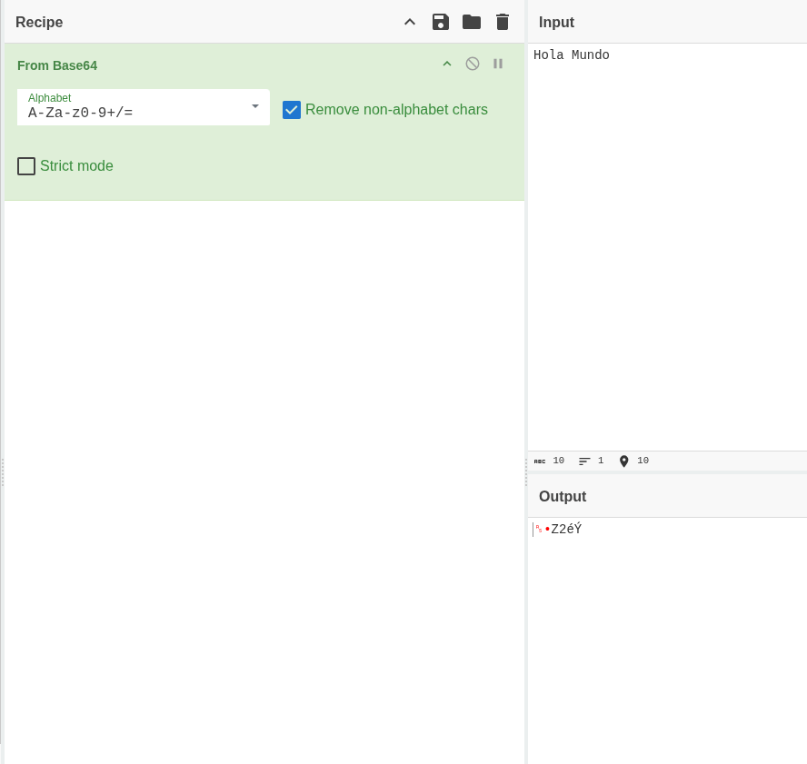

Investigar:

1.  ¿Qué otras herramientas ofrecen CyberChef?

CyberChef ofrece herramientas de cifrado, descifrado, codificación, decodificación, cálculo de hashes y conversión de formatos.

2.  ¿Qué ventajas presenta?

CyberChef es fácil de usar, gratuito y permite realizar múltiples operaciones sin programar.

3.  ¿Qué limitaciones tiene?

CyberChef puede ser lento con archivos grandes y no reemplaza herramientas especializadas.

4.  ¿Puede utilizarse en análisis forense?

Sí, CyberChef puede utilizarse para analizar, decodificar y transformar evidencias digitales.

# Conclusiones

- El cifrado César permite comprender fundamentos esenciales de la
  criptografía clásica.

- Python facilita la implementación y experimentación de algoritmos
  criptográficos.

- Las máquinas virtuales permiten realizar pruebas seguras en entornos
  controlados.

- Netcat facilita comprender procesos básicos de comunicación en red.

- CyberChef constituye una herramienta útil para análisis y
  transformación criptográfica.

- Los algoritmos clásicos presentan vulnerabilidades importantes frente
  a ataques modernos.

# Referencias Bibliográficas

- Stallings, W. (2017). Cryptography and Network Security: Principles
  and Practice. Pearson.

- Schneier, B. (2015). Applied Cryptography. Wiley.

- Menezes, A., van Oorschot, P., & Vanstone, S. (1996). Handbook of
  Applied Cryptography. CRC Press.

- Katz, J., & Lindell, Y. (2020). Introduction to Modern Cryptography.
  CRC Press.

- Singh, S. (2000). The Code Book. Anchor Books.

- Python Software Foundation. Python Documentation
