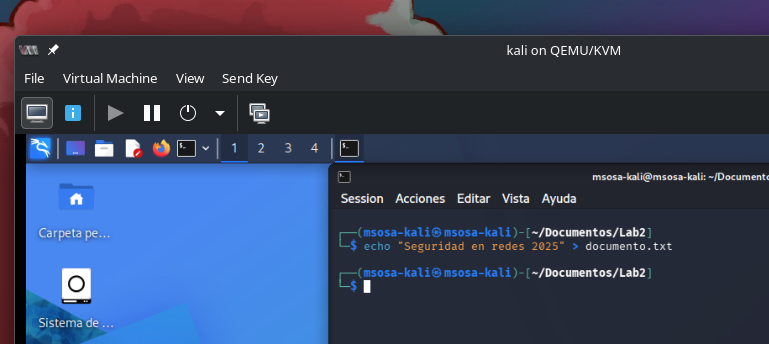
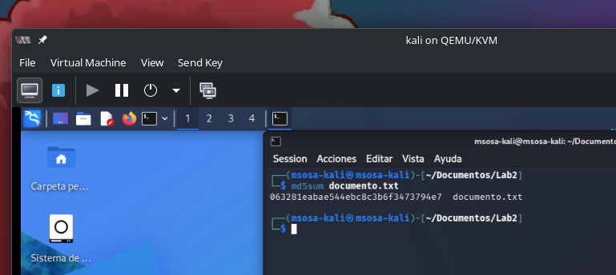
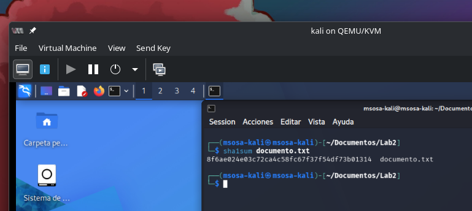
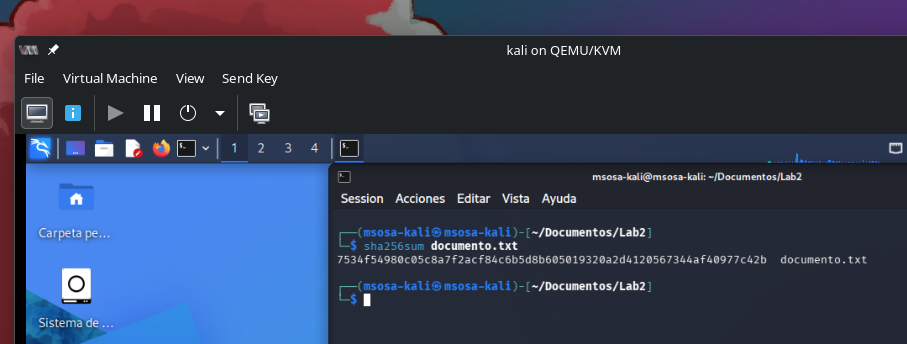
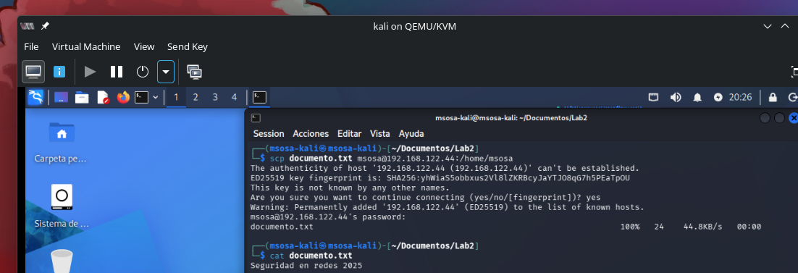
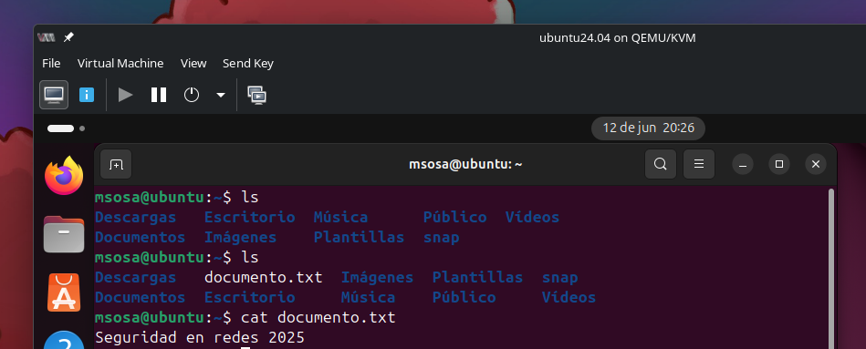
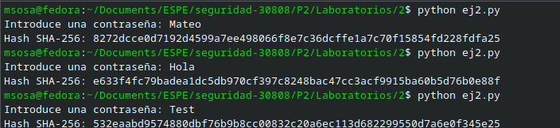
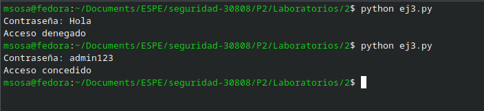

# Objetivos de Aprendizaje
Al finalizar esta práctica, usted será
capaz de:

1.  Comprender el funcionamiento de las funciones hash criptográficas.

2.  Utilizar comandos y herramientas en Linux para calcular hashes.

3.  Verificar la integridad de archivos mediante valores hash.

4.  Aplicar el hashing en scripts de Python para mejorar la seguridad
    del código.

5.  Identificar prácticas inseguras que pueden evitarse usando funciones
    hash.

6.  Investigar y aplicar conceptos de autenticidad, integridad y
    verificación mediante hashes.

# Marco Teórico

Las funciones hash criptográficas son funciones matemáticas que
transforman datos de tamaño arbitrario en una cadena de longitud fija.
Estas funciones tienen las siguientes propiedades:

- Unidireccionalidad: no se puede obtener el dato original a partir del
  hash.

- Determinismo: la misma entrada siempre produce la misma salida.

- Resistencia a colisiones: es computacionalmente difícil encontrar dos
  entradas distintas con el mismo hash.

- Avalancha: un pequeño cambio en la entrada produce un hash totalmente
  distinto.

En la práctica, los algoritmos hash son ampliamente usados para:

- Verificar la integridad de archivos.

- Guardar contraseñas de forma segura.

- Firmas digitales y certificados.

- Evitar la ejecución de código no autorizado.

Algunos algoritmos comunes incluyen MD5, SHA-1 y SHA-256, entre otros.
Aunque algunos (como MD5 o SHA-1) ya no se consideran seguros para
aplicaciones críticas, siguen siendo útiles para fines educativos o de
verificación básica.

# Topología de prueba

Se utilizarán las siguientes máquinas virtuales:

- Ubuntu Desktop: estación de trabajo del estudiante.

- Ubuntu Server: servidor de archivos.

- Kali Linux: entorno para validación de vulnerabilidades y pruebas de
  seguridad.

# Desarrollo

## Generación y Comparación de Hashes

En Ubuntu Desktop:

1.  Crear un archivo de texto:

```sh
echo "Seguridad en redes 2025" > documento.txt

```



2.  Generar el hash del archivo con diferentes algoritmos:

```sh
md5sum documento.txt

sha1sum documento.txt

sha256sum documento.txt

```







3.  Modificar el contenido del archivo (por ejemplo, cambiar una letra),
    volver a generar los hashes y observar cómo cambian.

4.  Transferir el archivo al servidor Ubuntu Server y verificar que no
    fue alterado:

```sh
scp documento.txt usuario@IP_SERVER:/home/usuario/ssh usuario@IP_SERVER

sha256sum documento.txt

```





## Hashing en Python

1.  Crear un script en Ubuntu Desktop llamado hash_script.py:

```py
import hashlib

def hash_password(password):
    return hashlib.sha256(password.encode()).hexdigest()

passwd = input("Introduce una contraseña: ")
print("Hash SHA-256:", hash_password(passwd))

```

2.  Ejecutar el script y probar con diferentes contraseñas para ver cómo
    cambia el hash.



## Vulnerabilidad y Protección con Hash

Código vulnerable en Python que compara contraseñas en texto plano:

```py
passwords = ["admin123", "qwerty"]
user_input = input("Contraseña: ")
if user_input in passwords:
    print("Acceso concedido")
else:
    print("Acceso denegado")

```



**Problema**: el almacenamiento y la comparación de contraseñas en texto
plano representa una grave vulnerabilidad de seguridad.

### Investigación

Los estudiantes deberán investigar y aplicar una solución para almacenar
y comparar contraseñas de forma segura usando funciones hash. Deberán
responder:

1.  ¿Qué riesgos presenta almacenar contraseñas en texto plano?

Almacenar contraseñas en texto plano permite que cualquier persona con acceso a la base de datos pueda verlas y utilizarlas directamente.

2.  ¿Qué ventajas ofrece el uso de hashing?

El hashing protege las contraseñas al almacenarlas como valores irreversibles, evitando que se conozca su contenido original.

3.  ¿Qué algoritmos de hash son recomendables para el almacenamiento de
    contraseñas?

Los algoritmos más recomendados son bcrypt, Argon2 y PBKDF2, ya que están diseñados específicamente para proteger contraseñas.

4.  ¿Cómo implementar una comparación segura de contraseñas en Python?

La comparación segura se implementa almacenando el hash de la contraseña y verificando la contraseña ingresada contra dicho hash mediante bibliotecas como `bcrypt` o `argon2`.

## **Conclusiones**

1.  Las funciones hash permiten asegurar la integridad y autenticidad de
    datos en entornos digitales.

2.  Son herramientas esenciales en la seguridad informática, tanto en
    redes como en desarrollo de software.

3.  El uso de hashes puede prevenir vulnerabilidades comunes como el
    almacenamiento inseguro de contraseñas.

4.  Entornos como Linux y lenguajes como Python ofrecen múltiples
    utilidades para aplicar criptografía hash de forma eficiente y
    didáctica.

## **Referencias Bibliográficas**

1.  Stallings, W. (2017). *Cryptography and Network Security: Principles
    and Practice*. Pearson.

2.  Paar, C., & Pelzl, J. (2010). *Understanding Cryptography: A
    Textbook for Students and Practitioners*. Springer.

3.  The Open Web Application Security Project (OWASP). (2024). *Password
    Storage Cheat Sheet*. https://cheatsheetseries.owasp.org

4.  Python Software Foundation. (2024). *Python 3 Standard Library:
    hashlib*. <https://docs.python.org/3/library/hashlib.html>

5.  Linux Man Pages. md5sum, sha1sum, sha256sum
