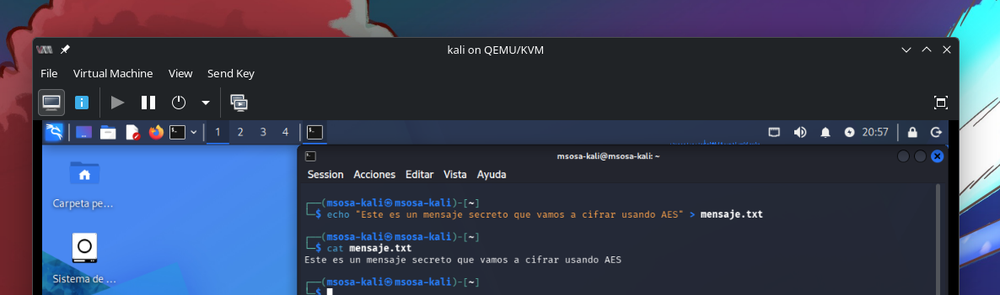
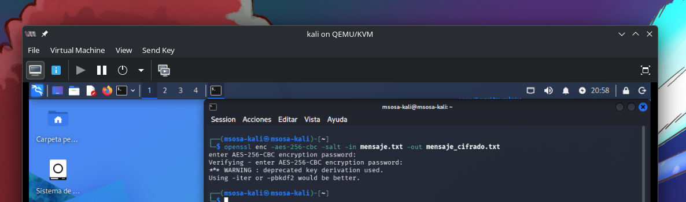
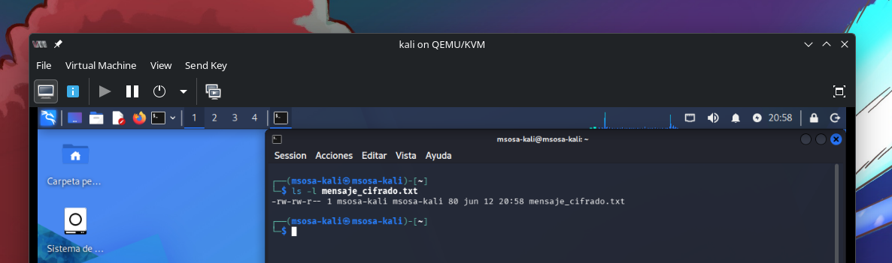
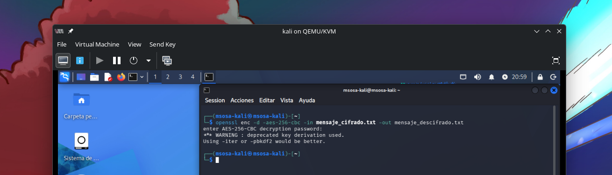
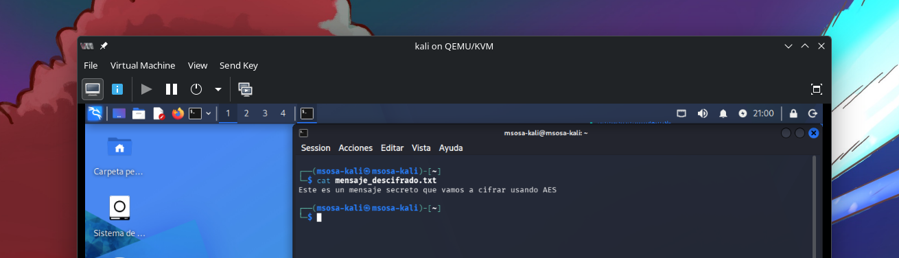
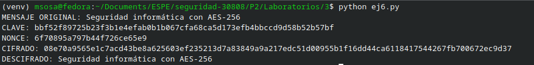
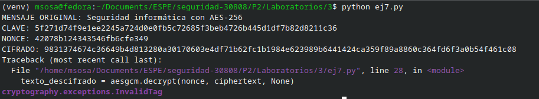
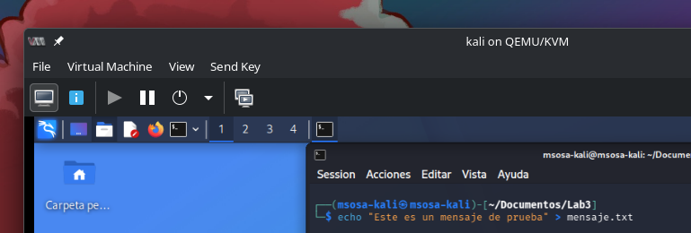
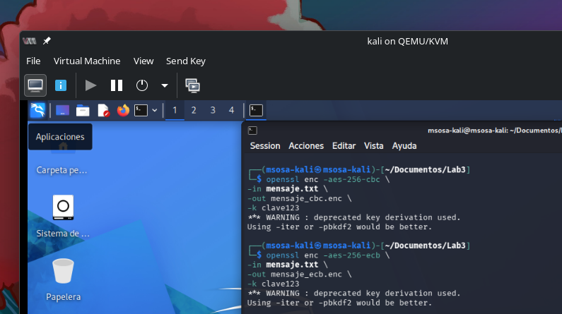

# Objetivo
Aplicar el cifrado simétrico utilizando el algoritmo **AES
(Advanced Encryption Standard)** en un entorno virtual controlado con
Kali Linux, comprendiendo su funcionamiento y seguridad.

# Topología de Prueba

Entorno Virtual de Red: Kali Linux y OpenSSL

# Objetivos de Aprendizaje

1.  Comprender el funcionamiento del algoritmo de cifrado simétrico AES.

2.  Analizar e implementar una versión básica de AES en Python.

3.  Probar el algoritmo con claves de 128, 192 y 256 bits.

4.  Aplicar AES en un contexto de red para proteger la información.

5.  Identificar posibles mejoras al código de cifrado implementado en
    Python.

6.  Simular ataques para evaluar la efectividad de las técnicas de
    cifrado.

# Marco Teórico

## AES

El AES (Advanced Encryption Standard) es un algoritmo de cifrado
simétrico adoptado como estándar por el NIST en 2001. Sustituyó al DES
debido a sus debilidades frente a ataques por fuerza bruta. AES está
basado en el algoritmo Rijndael, propuesto por Joan Daemen y Vincent
Rijmen, y emplea claves de 128, 192 o 256 bits con bloques fijos de 128
bits. Dependiendo del tamaño de la clave, realiza 10, 12 o 14 rondas de
operaciones criptográficas (Daemen & Rijmen, 2002; Stallings, 2017).

Las operaciones internas incluyen sustituciones, permutaciones y
combinaciones lineales a nivel de byte: SubBytes, ShiftRows, MixColumns
y AddRoundKey. En redes informáticas, AES se utiliza para cifrar
comunicaciones seguras entre hosts o dispositivos, siendo clave en
protocolos como TLS, IPsec y VPNs.

## Criptología

La criptología es la ciencia que estudia los métodos y técnicas
utilizadas para proteger la información mediante el uso de códigos y
cifrados, con el fin de garantizar la triada CID y el No repudio de los
datos. Abarca dos disciplinas principales: la criptografía (cifrado de
la información) y el criptoanálisis (estudio de la descodificación de
mensajes cifrados sin conocer la clave).

## Criptografía

La criptografía es una rama de la criptología que se enfoca en el diseño
y estudio de algoritmos matemáticos y protocolos que permiten
transformar la información en un formato seguro y protegido contra
accesos no autorizados.

## Criptoanálisis

El criptoanálisis es la parte de la criptología que se dedica al estudio
de sistemas criptográficos con el fin de encontrar debilidades en dichos
sistemas y romper su seguridad sin el conocimiento de información
secreta.

## Concepto de Criptografía Simétrica

La criptografía simétrica es un tipo de criptografía en la que se
utiliza la misma clave para cifrar y descifrar la información. Esto
significa que ambas partes (el remitente y el receptor) deben compartir
una clave secreta previamente acordada. El principal desafío de la
criptografía simétrica es la gestión de claves, ya que la clave debe ser
transmitida de forma segura sin ser interceptada.

**OpenSSL** es una herramienta de software de código abierto ampliamente
utilizada en sistemas Linux (y otros sistemas operativos) para la
implementación de funciones criptográficas. Ofrece una biblioteca
criptográfica robusta que proporciona un conjunto de algoritmos de
cifrado, funciones de seguridad y utilidades para la gestión de
certificados **SSL/TLS**, la generación de claves y la creación de
firmas digitales. Entre sus principales usos se tiene:

- OpenSSL permite realizar cifrado y descifrado de datos utilizando una
  variedad de algoritmos criptográficos, como **AES**, **DES**, **RSA**,
  **Blowfish**, entre otros.

- OpenSSL permite generar claves públicas y privadas para criptografía
  simétrica y asimétrica.

- OpenSSL permite generar certificados digitales utilizados en
  protocolos como **SSL/TLS** para asegurar la comunicación en redes.

# Topología de prueba

- **VM Cliente (Ubuntu Desktop):** Ejecutará un programa Python para
  cifrar y enviar un mensaje usando AES.

- **VM Servidor (Ubuntu Server):** Recibirá y descifrará el mensaje
  enviado por el cliente, también usando Python.

- **VM Atacante (Kali Linux):** Capturará el tráfico de red (usando
  Wireshark o tcpdump) e intentará analizar su contenido.

- **Python 3 instalado en cliente y servidor.**

- **Biblioteca PyCryptodome:**

# Desarrollo

## Preparación del entorno

1.  Inicie su máquina virtual Kali Linux y abra una terminal.

2.  Verifique que OpenSSL esté instalado en tu máquina. Para esto,
    escriba el siguiente comando en la terminal:

```sh
openssl version

# Si OpenSSL no está instalado, instálalo ejecutando:
sudo apt-get update
sudo apt-get install openssl

```


## Crear un archivo de texto para cifrar

1.  Cree un archivo de texto con el siguiente contenido:

```sh
echo "Este es un mensaje secreto que vamos a cifrar usando AES" > mensaje.txt

```

2.  Verifique que el archivo se haya creado correctamente:

```sh
cat mensaje.txt

```



## Cifrado con AES

1.  Para cifrar el archivo mensaje.txt usando **AES-256-CBC** (AES con
    un tamaño de clave de 256 bits y el modo de operación CBC), utilice
    el siguiente comando:

```sh
openssl enc -aes-256-cbc -salt -in mensaje.txt -out mensaje_cifrado.txt

```



El parámetro **-salt**: añade un valor aleatorio (sal) para mejorar la
seguridad del cifrado. Cuando se ejecute el comando, se pedirá que
ingreses una **contraseña** (que será la clave secreta para el
cifrado).

3.  Después de ingresar la contraseña, el archivo se cifrará y se
    guardará en mensaje_cifrado.txt.

4.  Verifique que el archivo cifrado haya sido creado:

```sh
ls -l mensaje_cifrado.txt

```



## Verificación del cifrado

1.  Para verificar que el archivo se cifró correctamente, intenta abrir
    el archivo cifrado con un editor de texto. Verás que el contenido no
    es legible:

```sh
cat mensaje_cifrado.txt

```


El archivo debe mostrar datos aparentemente aleatorios, como una
secuencia de caracteres binarios o texto no legible, lo que confirma
que el mensaje está cifrado.

## Descifrado del archivo

1.  Para descifrar el archivo, use el siguiente comando:

```sh
openssl enc -d -aes-256-cbc -in mensaje_cifrado.txt -out mensaje_descifrado.txt

```



Se te pedirá que ingreses la misma contraseña utilizada durante el
cifrado.

2.  Una vez completado el proceso, Verifique que el archivo haya sido
    descifrado correctamente:

```sh
cat mensaje_descifrado.txt

```



## Reflexión y análisis

1.  **Seguridad**: La criptografía simétrica es eficiente en términos de
    velocidad, pero su principal vulnerabilidad es la **gestión de
    claves**. Ambas partes que cifran y descifran deben compartir la
    misma clave, lo que puede generar problemas de seguridad si la clave
    es interceptada.

# Actividades complementarias

## Análisis y ejecución del algoritmo básico AES-256 en Python

**Objetivo:** Comprender el funcionamiento básico del cifrado simétrico
AES-256 en modo GCM, mediante la ejecución de un programa en Python que
permite cifrar y descifrar información.

Instalar la librería

```sh
pip install cryptography

```


```py
from cryptography.hazmat.primitives.ciphers.aead import AESGCM
import os

# Generación de clave AES-256 (32 bytes = 256 bits)
key = AESGCM.generate_key(bit_length=256)
aesgcm = AESGCM(key)

# Nonce (vector de inicialización)
nonce = os.urandom(12)

# Mensaje original
mensaje = "Seguridad informática con AES-256"
datos = mensaje.encode("utf-8")

# CIFRADO
ciphertext = aesgcm.encrypt(nonce, datos, None)

print("MENSAJE ORIGINAL:", mensaje)
print("CLAVE:", key.hex())
print("NONCE:", nonce.hex())
print("CIFRADO:", ciphertext.hex())

# DESCIFRADO
texto_descifrado = aesgcm.decrypt(nonce, ciphertext, None)
print("DESCIFRADO:", texto_descifrado.decode("utf-8"))

```



**Responder:**

- ¿Por qué la clave AES-256 tiene exactamente 32 bytes?

Porque AES-256 utiliza una clave de 256 bits y cada byte equivale a 8 bits, por lo que 256 ÷ 8 = 32 bytes.

- ¿Qué función cumple el nonce en el proceso de cifrado?

El nonce introduce aleatoriedad en el cifrado para que un mismo mensaje cifrado varias veces produzca resultados diferentes.

- ¿Qué ocurre si se utiliza la misma clave y nonce en dos mensajes
diferentes?

Se compromete la seguridad del cifrado, ya que un atacante podría obtener información sobre los mensajes y facilitar ataques criptográficos.

- ¿Por qué AES se considera un algoritmo simétrico?

Porque utiliza la misma clave tanto para cifrar como para descifrar la información.

- ¿Qué ventaja tiene el modo GCM frente a CBC?

GCM proporciona confidencialidad e integridad de los datos, mientras que CBC solo proporciona confidencialidad y requiere mecanismos adicionales para verificar la integridad.

## Actividad de modificación y mejoramiento del algoritmo propuesto

**Objetivo**: Modificar el programa base para analizar la robustez del cifrado
AES-256-GCM y comprender el impacto de cambios en sus componentes.

**Actividades propuestas**

Actividad 1: Manipulación del ciphertext

Modificar el código agregando:

```py
ciphertext = bytearray(ciphertext)
ciphertext[0] ^= 1
ciphertext = bytes(ciphertext)

```



### Pregunta

¿Qué ocurre al intentar descifrar el mensaje modificado?

Genera un error proveniente de la librería instalada al no conocer cómo poder descifrar el mensaje.

## Investigación

Investigue los modos de operación ECB (Electronic Codebook), CBC (Cipher
Block Chaining), CFB (Cipher Feedback), OFB (Output Feedback) **GCM
(Galois/Counter Mode)** en AES; cifre un archivo de texto utilizando al
menos dos de ellos con OpenSSL en Kali Linux; compare los resultados
visualmente con hexdump; y redacte una breve reflexión sobre las
diferencias observadas y su impacto en la seguridad de la información.

| Modo                        | Descripción                                                                  | Ventajas                                              | Desventajas                                                    | Uso recomendado                                          |
| --------------------------- | ---------------------------------------------------------------------------- | ----------------------------------------------------- | -------------------------------------------------------------- | -------------------------------------------------------- |
| ECB (Electronic Codebook)   | Cifra cada bloque de forma independiente.                                    | Simple y rápido.                                      | Bloques iguales producen cifrados iguales, revelando patrones. | No recomendado para datos sensibles.                     |
| CBC (Cipher Block Chaining) | Cada bloque depende del bloque anterior mediante un IV.                      | Oculta patrones y mejora la seguridad respecto a ECB. | Requiere IV y no permite paralelismo completo en el cifrado.   | Archivos y almacenamiento general.                       |
| CFB (Cipher Feedback)       | Convierte un cifrador de bloques en uno de flujo mediante retroalimentación. | Permite cifrar datos de tamaño variable.              | Un error puede propagarse temporalmente.                       | Comunicaciones en tiempo real.                           |
| OFB (Output Feedback)       | Genera un flujo de claves independiente del texto plano.                     | Los errores no se propagan.                           | Reutilizar IV compromete la seguridad.                         | Canales con ruido o transmisión de datos.                |
| GCM (Galois/Counter Mode)   | Combina cifrado en modo contador con autenticación.                          | Confidencialidad, integridad y alto rendimiento.      | Requiere manejo correcto de nonces.                            | Aplicaciones modernas, TLS, VPN y almacenamiento seguro. |






Al comparar los archivos cifrados mediante `hexdump`, se observa que todos los modos generan datos aparentemente aleatorios, pero ECB puede revelar patrones cuando existen bloques repetidos, mientras que CBC y GCM producen resultados más seguros al incorporar información adicional como IV o nonce. GCM destaca porque además de cifrar los datos garantiza su integridad, evitando modificaciones no autorizadas, por lo que es uno de los modos más utilizados actualmente en aplicaciones y protocolos modernos.

**Conclusiones:**

1.  Esta práctica ha proporcionado una introducción a la criptografía
    simétrica utilizando el algoritmo AES. A través de la utilización de
    **OpenSSL**, los estudiantes pudieron cifrar y descifrar un mensaje,
    aprendiendo los conceptos clave detrás de los **métodos de cifrado**
    y los **modos de operación** utilizados en criptografía moderna.
    Además, se destacó la importancia de la **gestión de claves** en
    criptografía simétrica.

2.  La criptografía simétrica es eficiente en términos de velocidad,
    pero su principal vulnerabilidad es la **gestión de claves**. Ambas
    partes que cifran y descifran deben compartir la misma clave, lo que
    puede generar problemas de seguridad si la clave es interceptada.

3.  AES es un algoritmo seguro, pero su seguridad depende de su correcta
    implementación.

4.  El manejo incorrecto de claves puede comprometer completamente el
    sistema.

**Referencias Bibliográficas:**

- Stallings, W. (2017). *Cryptography and Network Security: Principles
  and Practice* (7th ed.). Pearson.

- Ferguson, N., Schneier, B., & Kohno, T. (2010). *Cryptography
  Engineering: Design Principles and Practical Applications*. Wiley.

- OpenSSL Project. (n.d.). *OpenSSL Documentation*. Retrieved from
  [[https://www.openssl.org/docs/]{.underline}](https://www.openssl.org/docs/)

- Schneier, B. (1996). *Applied Cryptography: Protocols, Algorithms, and
  Source Code in C* (2nd ed.). Wiley.
