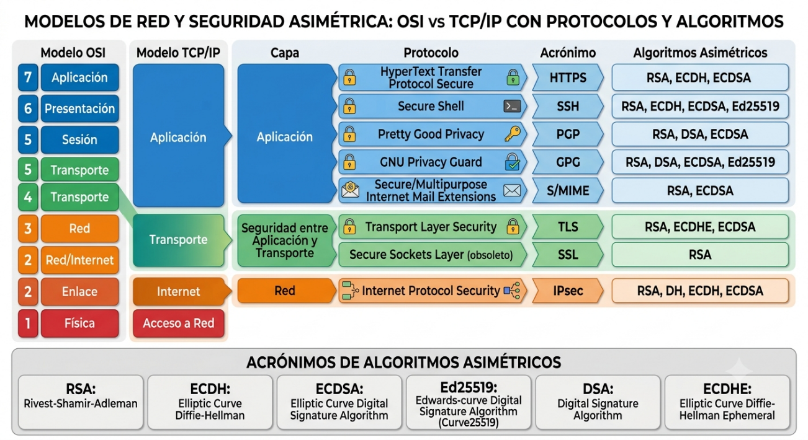
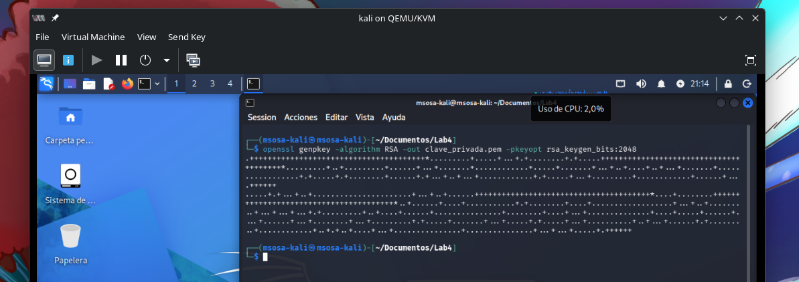
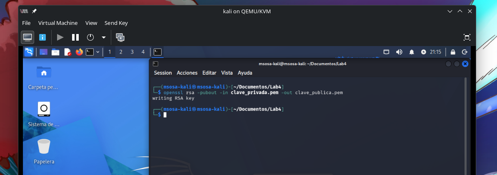
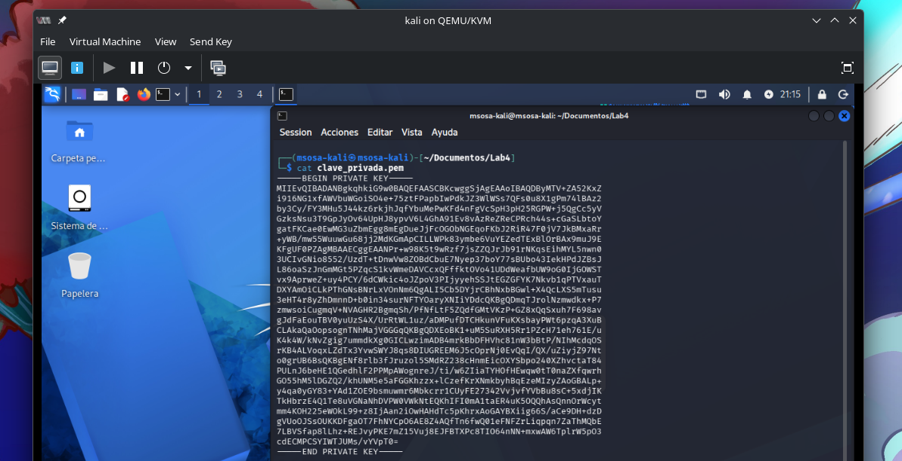
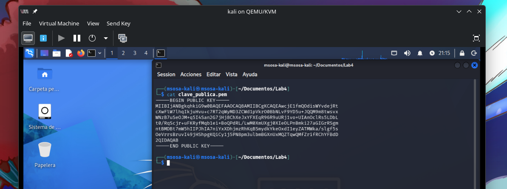
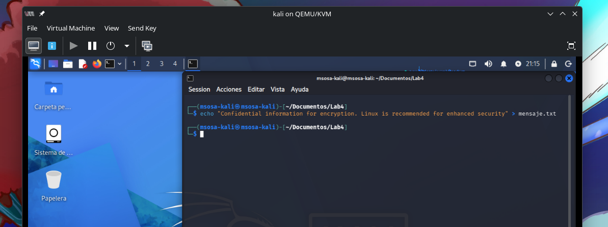
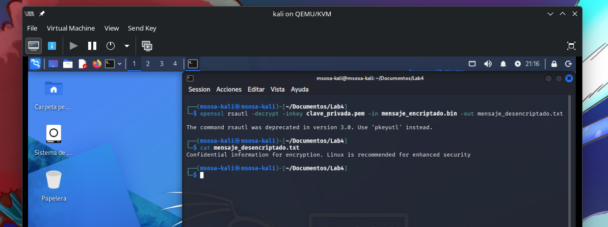
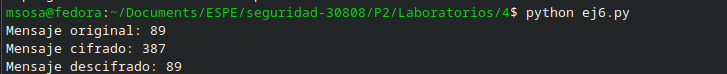

# Objetivos de Aprendizaje

Al finalizar esta práctica, usted será
capaz de:

- Comprender los fundamentos teóricos del algoritmo de encriptación
  asimétrica RSA.

- Generar y gestionar claves públicas y privadas RSA utilizando OpenSSL.

- Encriptar y desencriptar archivos mediante RSA.

- Analizar el funcionamiento del algoritmo RSA original y su
  implementación básica en Python.

- Aplicar pruebas básicas de seguridad y verificación sobre archivos
  cifrados.

- Identificar casos prácticos de uso de la encriptación asimétrica en
  sistemas reales.

# Marco Teórico

La encriptación asimétrica es un mecanismo criptográfico que utiliza un
par de claves: **una pública** (para cifrar) y **una privada** (para
descifrar). Uno de los algoritmos más conocidos en esta categoría es
**RSA** (Rivest-Shamir-Adleman), desarrollado en 1977 (véase Figura 1).



RSA basa su seguridad en la dificultad matemática de factorizar números
grandes (producto de dos números primos). Su uso se extiende desde la
protección de comunicaciones en Internet (TLS/SSL) hasta la firma
digital y almacenamiento seguro de datos.

OpenSSL es una herramienta de línea de comandos ampliamente usada para
gestionar certificados digitales, cifrar información, generar claves
RSA, y más. Permite implementar en la práctica muchos conceptos teóricos
de la criptografía.

Según Stallings (2020), RSA es fundamental para entender los mecanismos
de cifrado seguro y autenticación digital, gracias a su estructura
basada en la teoría de números.

# Entorno de laboratorio

- Máquina virtual con **Kali Linux** (como auditor de seguridad)

- Máquina virtual con **Ubuntu Desktop** (como cliente)

- Máquina virtual con **Ubuntu Server** (como servidor de pruebas)

- Herramienta: **OpenSSL**

# Desarrollo

## Generar claves RSA

En Ubuntu Desktop o Server:

```sh
openssl genpkey -algorithm RSA -out clave_privada.pem -pkeyopt rsa_keygen_bits:2048

openssl rsa -pubout -in clave_privada.pem -out clave_publica.pem

```





Verifique las claves:

```sh
cat clave_privada.pem

cat clave_publica.pem

```





## Crear un archivo de texto de prueba

```sh
echo "Confidential information for encryption. Linux is recommended for enhanced security" > mensaje.txt

```



## Encriptar el archivo con la clave pública

```sh
openssl rsautl -encrypt -inkey clave_publica.pem -pubin -in mensaje.txt -out mensaje_encriptado.bin

```


## Desencriptar el archivo con la clave privada

```sh
openssl rsautl -decrypt -inkey clave_privada.pem -in mensaje_encriptado.bin -out mensaje_desencriptado.txt

```

Verifique el contenido:

```sh
cat mensaje_desencriptado.txt

```



## Verificación de integridad del archivo

Compare los archivos original y desencriptado:

```sh
diff mensaje.txt mensaje_desencriptado.txt

```


**Actividad complementaria en clase (30 minutos)**

**Analizar e implementar RSA en Python**

Los estudiantes deberán analizar e implementar un script básico del
algoritmo RSA en Python (sin usar librerías externas como cryptography).
Se les entrega el siguiente código base:

```py
# RSA básico en Python (solo para fines educativos)
def gcd(a, b):
    while b != 0:
        a, b = b, a % b
    return a

def modinv(a, m):
    for x in range(1, m):
        if (a * x) % m == 1:
            return x
    return None

# Parámetros básicos (pequeños por simplicidad)
p = 17
q = 23
n = p * q
phi = (p-1)*(q-1)
e = 3
d = modinv(e, phi)

mensaje = 89
cifrado = pow(mensaje, e, n)
descifrado = pow(cifrado, d, n)

print(f"Mensaje original: {mensaje}")
print(f"Mensaje cifrado: {cifrado}")
print(f"Mensaje descifrado: {descifrado}")

```



**Preguntas de análisis (discusión en parejas):**

1.  ¿Qué rol cumple `e` y `d` en el cifrado y descifrado?

`e` es el exponente público utilizado para cifrar el mensaje, mientras que `d` es el exponente privado utilizado para descifrarlo.

2.  ¿Por qué se usa el módulo `n`?

El módulo `n` define el rango de los cálculos matemáticos de RSA y permite que el cifrado y descifrado funcionen correctamente.

3.  ¿Qué implicaciones tendría usar claves más grandes en este script?

Claves más grandes aumentan la seguridad del sistema, pero también requieren más tiempo y recursos para realizar los cálculos.

4.  ¿Cuáles son las principales aplicaciones?

RSA se utiliza principalmente para intercambio seguro de claves, firmas digitales, certificados digitales y comunicaciones seguras en protocolos como HTTPS.

# Conclusiones

1. La práctica permitió comprender de manera teórica y práctica el funcionamiento del algoritmo RSA, identificando el papel de las claves pública y privada dentro de un esquema de cifrado asimétrico.
2. Mediante el uso de OpenSSL se logró generar, administrar y verificar pares de claves RSA de 2048 bits, evidenciando la importancia de utilizar herramientas especializadas para la implementación segura de mecanismos criptográficos.
3. El proceso de cifrado y descifrado de archivos demostró que únicamente la clave privada correspondiente puede recuperar la información protegida con la clave pública, garantizando la confidencialidad de los datos transmitidos o almacenados.

# Referencias Bibliográficas

1.  Stallings, W. (2017). Cryptography and Network Security: Principles
    and Practice (7th ed.). Pearson.

2.  Ferguson, N., Schneier, B., & Kohno, T. (2010). Cryptography
    Engineering: Design Principles and Practical Applications. Wiley.

3.  OpenSSL Project. (n.d.). OpenSSL Documentation. Retrieved from
    [[https://www.openssl.org/docs/]{.underline}](https://www.openssl.org/docs/)

4.  Schneier, B. (1996). *Applied Cryptography: Protocols, Algorithms,
    and Source Code in C* (2nd ed.). Wiley.

5.  NIST. (2001). *Announcing the Advanced Encryption Standard (AES)*.
    Federal Information Processing Standards Publication 197. U.S.
    National Institute of Standards and Technology.

6.  Upadhyay, D., Sampalli, S., & Plourde, B. (2020). Vulnerabilities'
    assessment and mitigation strategies for the small Linux server,
    Onion Omega2. Electronics, 9(6), 967.
