# Topología de Prueba

**Entorno Virtual de Red**: **Kali Linux, Ubuntu Desktop, Ubuntu Server,
Metasploitable2 y OpenSSL**.

# Objetivos de Aprendizaje

**Objetivo 1:** Comprensión y Gestión de la PKI (Infraestructura de
Clave Pública): Al finalizar la práctica, el estudiante será capaz de
gestionar los componentes fundamentales de la Infraestructura de Clave
Pública (PKI) simulada, aplicando comandos de OpenSSL en Kali Linux para
la generación de claves privadas, la creación de Solicitudes de Firma de
Certificado (CSR) y el auto-firmado de certificados digitales
(self-signed certificates).

**Objetivo 2**: Aplicación de Algoritmos Criptográficos (Cifrado y
Descifrado): Demostrar la habilidad práctica para implementar y
verificar el cifrado y descifrado de datos sensibles, utilizando la
herramienta OpenSSL con diversos algoritmos criptográficos (como AES y
RSA), y contrastar la seguridad y eficiencia de los esquemas de
criptografía simétrica y asimétrica en un entorno de pruebas.

**Objetivo 3:** Verificación de Integridad y Autenticidad (Firmas
Digitales): Aplicar los mecanismos de seguridad criptográfica para
garantizar la integridad y autenticidad de archivos. Esto incluye
generar una firma digital sobre un archivo mediante la clave privada en
OpenSSL y, posteriormente, verificar la validez de dicha firma
utilizando el certificado digital correspondiente, identificando
cualquier manipulación del contenido original.

# Marco Teórico

## Certificado digital

Un certificado digital es un archivo o contraseña electrónica que
demuestra la autenticidad de un dispositivo, servidor o usuario mediante
el uso de criptografía de la infraestructura de clave pública (public
key infrastructure, PKI).

**OpenSSL** es una herramienta de software de código abierto ampliamente
utilizada en sistemas Linux (y otros sistemas operativos) para la
implementación de funciones criptográficas. Ofrece una biblioteca
robusta que proporciona un conjunto de algoritmos de cifrado, funciones
de seguridad y utilidades para la gestión de certificados SSL/TLS, la
generación de claves y la creación de firmas digitales. Entre sus
principales usos se tiene \[3\] :

- OpenSSL permite realizar cifrado y descifrado de datos utilizando una
  variedad de algoritmos criptográficos, como **AES**, **DES**, **RSA**,
  **Blowfish**, entre otros.

- OpenSSL permite generar claves públicas y privadas para criptografía
  simétrica y asimétrica.

- OpenSSL permite generar certificados digitales utilizados en
  protocolos como **SSL/TLS** para asegurar la comunicación en redes

# Desarrollo

## Creación y Gestión de Certificados digitales en Kali Linux

En este apartado se presenta el procedimiento básico para la creación y
gestión de certificados digitales en Kali Linux utilizando OpenSSL. Se
detalla, de forma práctica, la generación de la clave privada, la
creación de la solicitud de firma de certificado (CSR) y la emisión de
un certificado autofirmado. Este flujo permite comprender los elementos
fundamentales de una Infraestructura de Clave Pública (PKI) y la
relación entre la clave privada, la identidad digital y el certificado
resultante. A continuación, se muestra el conjunto de pasos y comandos
utilizados en el proceso.

+-----------------------------+------------------------------------------------------------+------------------------------------------------------------------+
| Tarea                       | Comando en Kali Linux                                      | Descripción de la Acción                                         |
+=============================+============================================================+==================================================================+
| 1.1. Generación de          | openssl genrsa -out server_private.key 2048                | Guarda la clave privada generada por genrsa en el archivo        |
| Clave Privada               |                                                            | server_private.key de 2048 bits para el servidor de prueba.      |
+-----------------------------+------------------------------------------------------------+------------------------------------------------------------------+
| 1.2. Generación del CSR     | openssl req -new -key                                      | Crea la Solicitud de Firma de Certificado (CSR), ingresando      |
|                             | server_private.key                                         | los datos de identidad.                                          |
|                             | -out server.csr                                            |                                                                  |
|                             |                                                            | req: Trabaja con solicitudes de certificados (CSR) y             |
|                             |                                                            | certificados X.509.                                              |
|                             |                                                            |                                                                  |
|                             |                                                            | -new: Indica que se va a crear una nueva CSR.                    |
|                             |                                                            |                                                                  |
|                             |                                                            | -key server_private.key: Usa la clave privada creada             |
|                             |                                                            | en el paso anterior para firmar la solicitud.                    |
|                             |                                                            |                                                                  |
|                             |                                                            | -out server.csr: Guarda la CSR generada en server.csr.           |
+-----------------------------+------------------------------------------------------------+------------------------------------------------------------------+
| 1.3. Auto-Firma del         | openssl x509 -req -days 365                                | x509: Trabaja con certificados X.509.                            |
| Certificado                 | -in server.csr                                             |                                                                  |
|                             | -signkey server_private.key                                | -req: Indica que la entrada es una CSR.                          |
|                             | -out server_certificate.crt                                |                                                                  |
|                             |                                                            | -in server.csr: CSR de entrada.                                  |
|                             |                                                            |                                                                  |
|                             |                                                            | -signkey server_private.key: Firma el certificado con            |
|                             |                                                            | esta clave privada.                                              |
|                             |                                                            |                                                                  |
|                             |                                                            | -out server_certificate.crt: Guarda el certificado               |
|                             |                                                            | generado.                                                        |
|                             |                                                            |                                                                  |
|                             |                                                            | Utiliza la clave privada local para firmar el CSR y crear        |
|                             |                                                            | un certificado digital válido por un año.                        |
+-----------------------------+------------------------------------------------------------+------------------------------------------------------------------+
: Procedimiento para la generación de certificados digitales autofirmados con OpenSSL en Kali Linux.

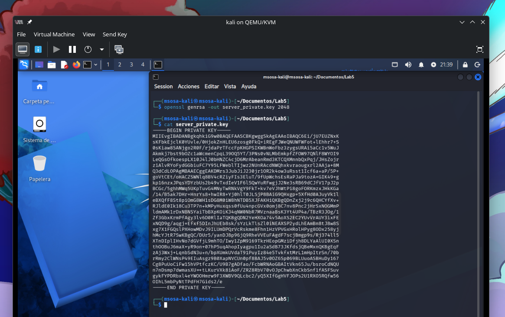

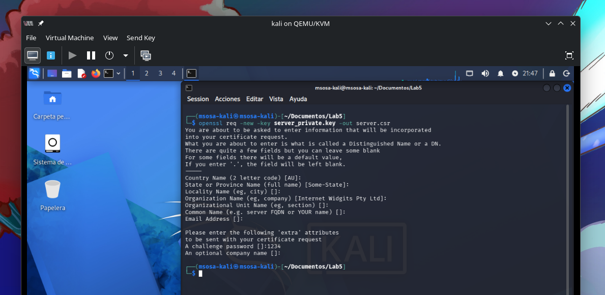

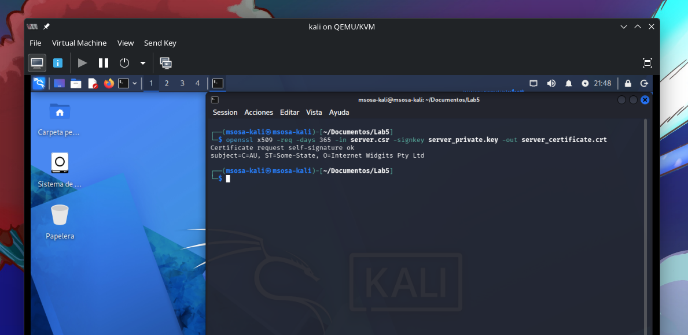

## Comandos básicos de administración y visualización de certificados digitales

Una vez generado un certificado digital, es importante conocer su estructura y los elementos que garantizan su autenticidad e integridad. Mediante herramientas como OpenSSL es posible inspeccionar la información contenida en un certificado X.509, incluyendo el propietario (Subject), la entidad emisora o Autoridad Certificadora (Issuer), la clave pública asociada, el período de validez y la firma digital que permite verificar su autenticidad. La visualización de estos componentes facilita la comprensión del funcionamiento de una Infraestructura de Clave Pública (PKI) y de los mecanismos de confianza utilizados en la seguridad informática moderna. A continuación, en la Tabla 2, se presentan algunos comandos básicos para examinar y validar certificados digitales en sistemas Linux.

+----------------------------+--------------------------------------------------------------+
| Componente                 | Comando                                                      |
+============================+==============================================================+
| Certificado completo       | openssl x509 -in cert.crt -text -noout                       |
+----------------------------+--------------------------------------------------------------+
| CA emisora                 | openssl x509 -issuer -noout -in cert.crt                     |
+----------------------------+--------------------------------------------------------------+
| Propietario                | openssl x509 -subject -noout -in cert.crt                    |
+----------------------------+--------------------------------------------------------------+
| Clave pública              | openssl x509 -pubkey -noout -in cert.crt                     |
+----------------------------+--------------------------------------------------------------+
| Huella digital             | openssl x509 -fingerprint -sha256 -noout -in cert.crt        |
+----------------------------+--------------------------------------------------------------+
| Verificar firma            | openssl verify -CAfile cert.crt cert.crt                     |
+----------------------------+--------------------------------------------------------------+
| Ver cadena PKI remota      | openssl s_client -connect sitio:443 -showcerts               |
+----------------------------+--------------------------------------------------------------+
| Ver CSR                    | openssl req -in server.csr -text -noout                      |
+----------------------------+--------------------------------------------------------------+
| Verificar clave a          | Comparar el modulus de la clave privada y del                |
| certificado                | certificado para comprobar que pertenecen al mismo par.      |
+----------------------------+--------------------------------------------------------------+
: Comandos OpenSSL para inspección de certificados X.509 y elementos de PKI.

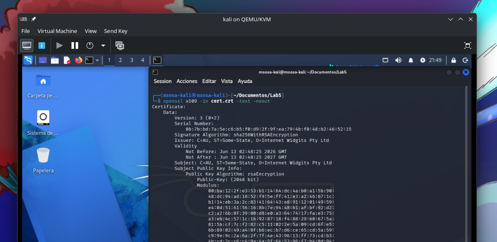

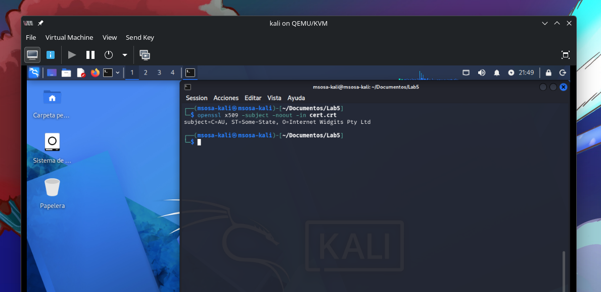

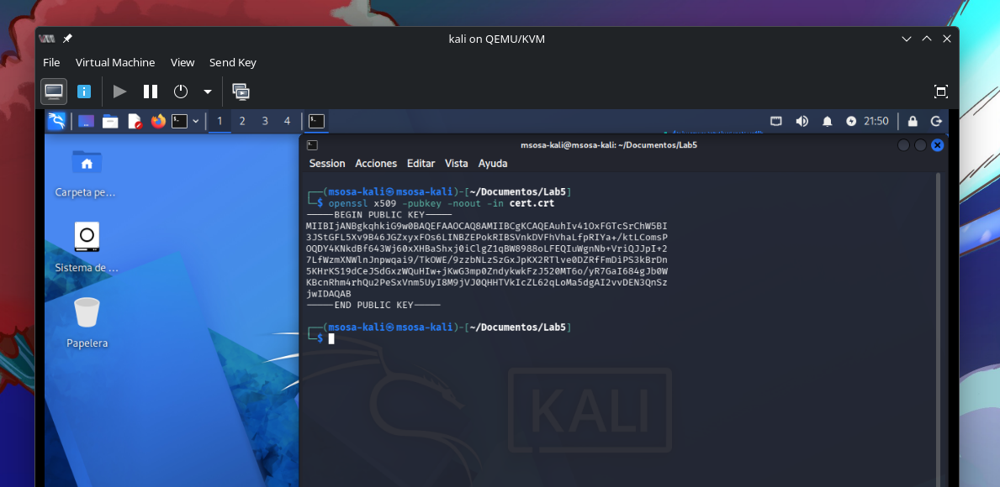

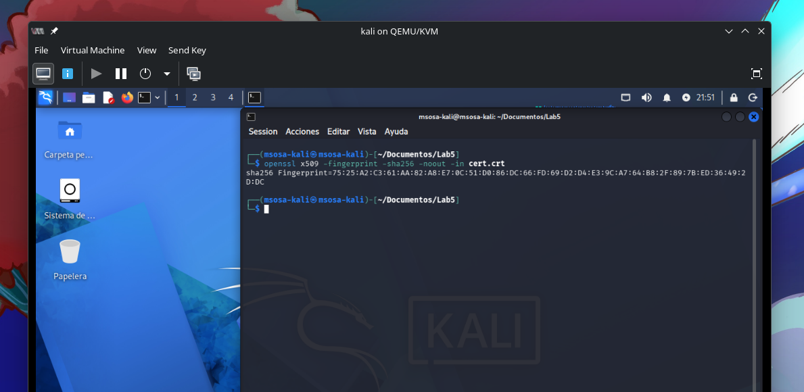

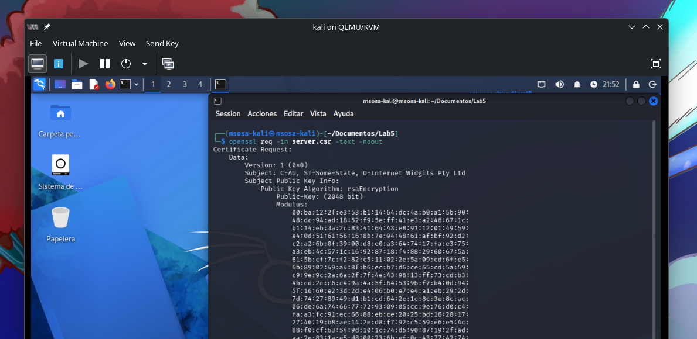

## Aplicación de criptografía simétrica y asimétrica en el contexto de certificados digitales (PKI)

En este apartado se extiende la práctica previa de generación y
visualización de certificados digitales en Kali Linux, incorporando su
aplicación en escenarios de cifrado de información. A partir de los
elementos fundamentales de una Infraestructura de Clave Pública (PKI),
como la clave privada, la clave pública y el certificado X.509, se
implementan mecanismos de protección de datos mediante criptografía
simétrica y asimétrica.

La Tabla 3 presenta un flujo integrado donde se relaciona la creación
del mensaje, el uso de claves derivadas del proceso de certificación y
la aplicación de algoritmos de cifrado. De esta manera, el estudiante
puede observar cómo los certificados digitales no solo permiten la
autenticación de identidades, sino que también constituyen la base para
el intercambio seguro de información en entornos Linux. \[OpenSSL,
2024\].

+------------------------------+--------------------------------+----------------------------------+
| Actividad                    | Comando en Kali Linux          | Tipo de Criptografía             |
+==============================+================================+==================================+
| 3.1. Creación del mensaje    | echo "Mensaje Asimétrico" >    | Asimétrica                       |
| a cifrar                     | asymmetric_message.txt         | (dato de entrada)                |
+------------------------------+--------------------------------+----------------------------------+
| 3.2. Generación de clave     | openssl genrsa -out            | Asimétrica                       |
| privada RSA (base del        | server_private.key 2048        | (clave privada del sistema PKI)  |
| certificado)                 |                                |                                  |
+------------------------------+--------------------------------+----------------------------------+
| 3.3. Extracción de clave     | openssl rsa -in                | Asimétrica                       |
| pública desde la clave       | server_private.key             | (clave pública asociada al       |
| privada del certificado      | -pubout -out                   | certificado)                     |
|                              | server_public.key              |                                  |
+------------------------------+--------------------------------+----------------------------------+
| 3.4. Visualización del       | openssl x509 -in               | PKI / X.509                      |
| certificado y verificación   | server_certificate.crt         | (inspección del certificado)     |
| de identidad (PKI)           | -text -noout                   |                                  |
+------------------------------+--------------------------------+----------------------------------+
| 3.5. Cifrado del mensaje     | openssl pkeyutl -encrypt       | Asimétrica                       |
| usando clave pública del     | -pubin -inkey                  | (cifrado con clave pública)      |
| certificado                  | server_public.key              |                                  |
|                              | -in asymmetric_message.txt     |                                  |
|                              | -out                           |                                  |
|                              | asymmetric_message.enc         |                                  |
+------------------------------+--------------------------------+----------------------------------+
| 3.6. Creación del mensaje    | echo "Credencial Secreta:      | Simétrica                        |
| para cifrado simétrico       | 1A2b3C4d" >                    | (dato de entrada)                |
|                              | confidential.txt               |                                  |
+------------------------------+--------------------------------+----------------------------------+
| 3.7. Cifrado simétrico del   | openssl enc -aes-256-cbc       | Simétrica                        |
| mensaje (AES)                | -salt -in                      | (cifrado con clave compartida)   |
|                              | confidential.txt -out          |                                  |
|                              | confidential.enc               |                                  |
+------------------------------+--------------------------------+----------------------------------+
| 3.8. Descifrado simétrico    | openssl enc -d                 | Simétrica                        |
| del mensaje (AES)            | -aes-256-cbc -in               | (verificación de integridad)     |
|                              | confidential.enc -out          |                                  |
|                              | decrypted.txt                  |                                  |
+------------------------------+--------------------------------+----------------------------------+
: Aplicación de criptografía simétrica y asimétrica en el contexto de certificados digitales en Kali.

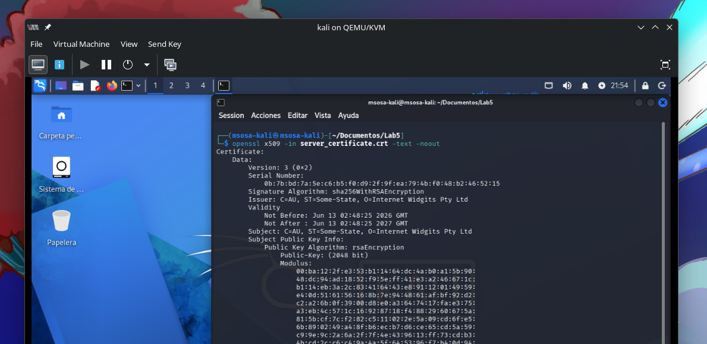

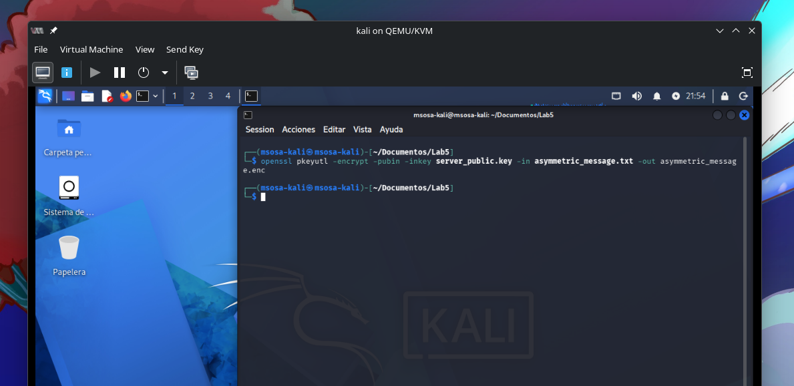

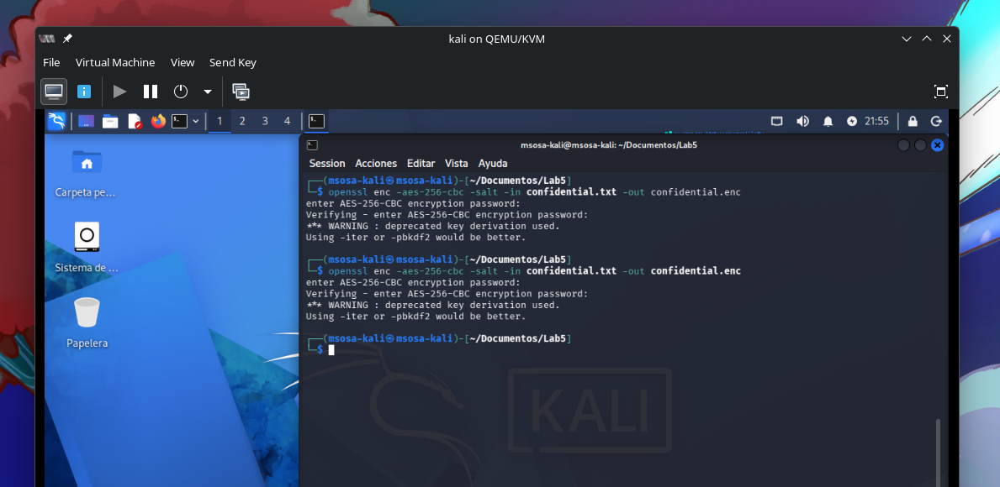

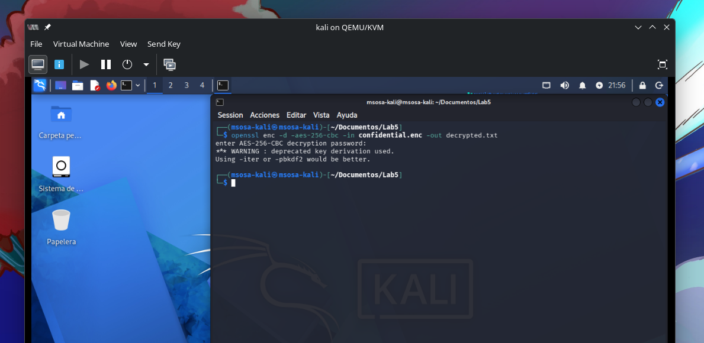

## Generación y Verificación de Firmas Digitales

En este apartado se presenta la aplicación práctica de la firma digital
como mecanismo fundamental dentro de una Infraestructura de Clave
Pública (PKI). A diferencia del cifrado, cuyo objetivo es proteger la
confidencialidad de la información, la firma digital permite garantizar
la integridad, autenticidad y no repudio de los datos.

La Tabla 4 muestra el proceso completo de generación de una firma
digital utilizando la clave privada asociada al certificado digital
previamente creado, así como su verificación mediante la clave pública
contenida en dicho certificado. Además, se incluye una prueba de
modificación del archivo para evidenciar cómo cualquier alteración
invalida la firma, demostrando así la importancia de la integridad en la
seguridad de la información.

+------------------------------+--------------------------------+----------------------------------+
| Tarea                        | Comando en Kali Linux          | Propósito de la Criptografía     |
+==============================+================================+==================================+
| 4.1. Documento a Firmar      | echo "Versión 1.0.0: Código    | Crear el archivo de prueba.      |
|                              | Auditado y Aprobado" >         |                                  |
|                              | code_release.txt               |                                  |
+------------------------------+--------------------------------+----------------------------------+
| 4.2. Generación de la Firma  | openssl dgst -sha256 -sign     | Crea la firma digital cifrando   |
|                              | server_private.key -out        | el hash SHA-256 del archivo      |
|                              | code_release.sig               | con la clave privada.            |
|                              | code_release.txt               |                                  |
+------------------------------+--------------------------------+----------------------------------+
| 4.3. Verificación de la      | openssl dgst -sha256           | Utiliza la clave pública         |
| Firma                        | -verify server_public.key      | asociada al certificado para     |
|                              | -signature                     | verificar la firma y comparar    |
|                              | code_release.sig               | el hash calculado con el hash    |
|                              | code_release.txt               | firmado.                         |
+------------------------------+--------------------------------+----------------------------------+
| 4.4. Prueba de Integridad    | (Modificar manualmente el      | Debe resultar en                 |
| (Fallo)                      | archivo code_release.txt)      | "Verification Failure",          |
|                              |                                | demostrando que la integridad    |
|                              | openssl dgst -sha256           | del documento fue alterada.      |
|                              | -verify server_public.key      |                                  |
|                              | -signature                     |                                  |
|                              | code_release.sig               |                                  |
|                              | code_release.txt               |                                  |
+------------------------------+--------------------------------+----------------------------------+
: Proceso de firma digital y validación de integridad con certificados X.509.

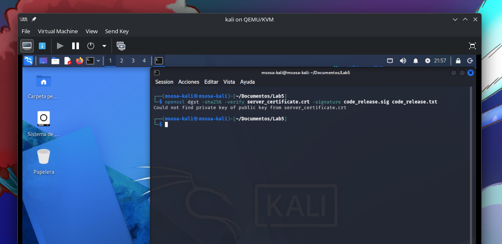

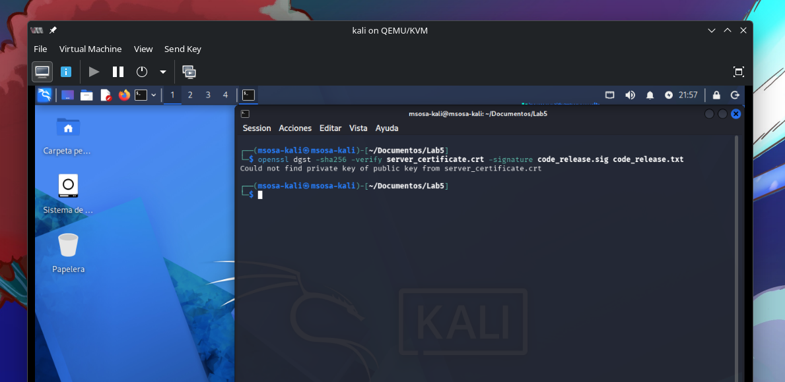

# Conclusiones Esperadas de la Práctica

Al finalizar el laboratorio, el estudiante debe ser capaz de elaborar
las siguientes conclusiones técnicas:

1.  **Confirmación de la PKI:** Se verificó que la **Infraestructura de
    Clave Pública (PKI)** se construye exitosamente a partir de un **par
    de claves** y una **solicitud de firma (CSR)**, siendo el
    certificado digital el archivo que valida la **clave pública** del
    propietario.

2.  **Diferenciación Criptográfica:** Se demostró que el cifrado
    **simétrico (AES)** es más adecuado para la encriptación de grandes
    volúmenes de datos por su velocidad, mientras que el cifrado
    **asimétrico (RSA)** es indispensable para el intercambio seguro de
    la clave simétrica y para funciones de autenticación.

3.  **Garantía de Integridad y No Repudio:** Se comprobó que la **firma
    digital** no solo asegura la **integridad** de un documento (al
    detectar cualquier alteración mediante el fallo de la verificación
    del *hash*), sino que también garantiza la **autenticidad** y el
    **no repudio**, ya que solo la clave privada del firmante pudo haber
    generado dicha firma.

# Referencias Bibliográficas

- OpenSSL. (2024). *OpenSSL Cryptography and SSL/TLS Toolkit*.
  <https://soporte.itlinux.cl/hc/es/articles/202497479-Comando-%C3%BAtiles-de-OpenSSL>.

- Stallings, W. (2020). *Cryptography and Network Security: Principles
  and Practice* (8th ed.). Pearson. (Referencia a los principios de PKI
  y firmas digitales).
