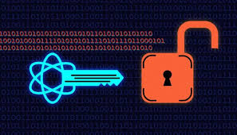

# 19 - Mayo - 2026

## Objetivos de Aprendizaje

1. Feedback del 1er Bimestre
    - Normas de Estilo de Edición Académica
2. Proyecto Final
3. Ruta de Capacitación
4. Unidad 2
    - Introducción a la Criptografía

## Meditación

### Película

- No estamos para tener gloria sino para honrar a Dios
- Amar a otros como a ti
- Honrarlo en relaciones, autoridad, en clases
- Para qué están viviendo?
- Actitud es el aroma del corazón
- Si piensas que fallarás, estás aceptando la derrota
- Dar siempre lo mejor para llegar más lejos
- Da tu mejor esfuerzo a pesar de la gente que no cree en ti
- No enfocarse en los obstáculos sino en los objetivos
- No desperdiciar el don que Dios nos da

## Feedback

### Normas de Estilo de Edición Académica

1. Escritura en prosa
    - Cuento
    - Escribir en tiempo pasado
2. Escritura en párrafos

Las figuras (capturas) y tablas deben tener su enumeración ascendente y rotuladas.
Deben ser, además, referenciados o citados en el manuscrito.

Todas las referencias bibliografías que están en el listado, deben ser citadas en el texto del manuscrito.
No escribir en 1era persona del singular o plural.

Evitar:
- Adverbios
- Gerundios
- Adjetivos
- Palabras Coloquiales

## Introducción a la Criptografía

La criptografía es la disciplina encargada de proteger la información mediante técnicas matemáticas y algoritmos que permiten transformar los datos en formatos seguros e ilegibles para personas no autorizadas. Su objetivo principal es garantizar la confidencialidad de la información, evitando que terceros puedan acceder o interpretar datos sensibles durante su almacenamiento o transmisión. Aunque sus orígenes se remontan a la antigüedad, la criptografía moderna se ha convertido en un componente fundamental de la seguridad informática y las comunicaciones digitales.

En la actualidad, la criptografía no solo protege la privacidad de los usuarios, sino que también proporciona mecanismos para asegurar la integridad, autenticidad y no repudio de la información. A través de técnicas como el cifrado simétrico, el cifrado asimétrico y las funciones hash, es posible verificar que los datos no han sido alterados, confirmar la identidad de los participantes en una comunicación y garantizar que una acción realizada no pueda ser negada posteriormente por su autor.

El crecimiento de Internet, el comercio electrónico, la banca digital y los servicios en la nube ha incrementado significativamente la importancia de la criptografía en la vida cotidiana. Tecnologías como las firmas digitales, los certificados digitales y las infraestructuras de clave pública permiten establecer entornos de confianza para el intercambio seguro de información. Gracias a estos mecanismos, organizaciones y usuarios pueden realizar transacciones y comunicaciones electrónicas con mayores niveles de seguridad y protección frente a amenazas cibernéticas.
