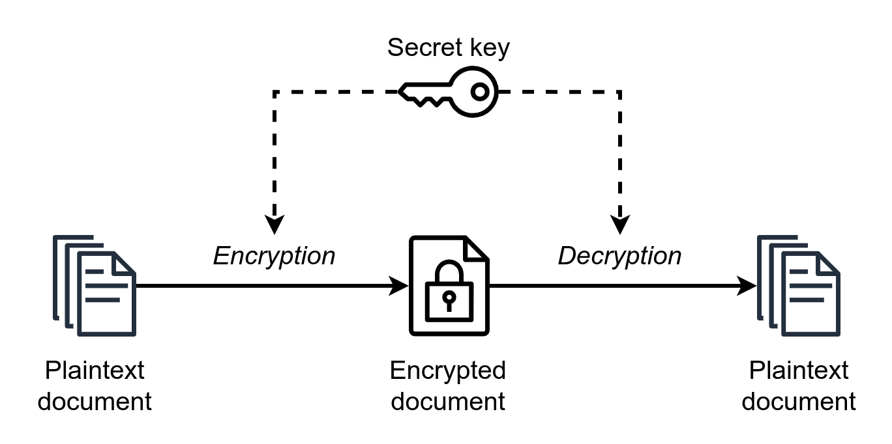

# 28 - Mayo - 2026

## Objetivos de Aprendizaje

1. Marco de Referencia ISO-27000
    - EGSI-VR
2. Criptografía Simétrica
3. Práctica de Laboratorio: Encriptación y Descifrado utilizando AES
    
## Meditación

### Steve Jobs

En 1976, Jobs y Wozniak fundaron Apple en el garaje de la familia Jobs. La compañía alcanzó un rápido crecimiento gracias al éxito de computadoras como la Apple II y posteriormente la Macintosh, una de las primeras computadoras personales con interfaz gráfica de usuario. Sin embargo, en 1985 Steve Jobs abandonó Apple tras desacuerdos con la dirección de la empresa y fundó nuevas compañías como NeXT y adquirió lo que más tarde se convertiría en Pixar.

En 1997 regresó a Apple cuando la empresa adquirió NeXT. Bajo su liderazgo, Apple lanzó productos innovadores como el iMac, iPod, iPhone y iPad, redefiniendo industrias enteras y convirtiéndose en una de las compañías más valiosas del mundo. Steve Jobs falleció el 5 de octubre de 2011, pero su legado continúa influyendo en el diseño, la innovación y el desarrollo tecnológico a nivel global.

- _"La innovación distingue a un líder de un seguidor."_
- _"Tu tiempo es limitado, así que no lo desperdicies viviendo la vida de alguien más."_
- _"Mantente hambriento, mantente alocado." (Stay hungry, stay foolish.)_

## Marco de Referencia ISO 27000

### ISO 27000

La familia de normas ISO/IEC 27000 constituye un conjunto de estándares internacionales orientados a la gestión de la seguridad de la información dentro de las organizaciones. Su propósito es establecer lineamientos, controles y buenas prácticas que permitan proteger los activos de información frente a riesgos, amenazas y vulnerabilidades, garantizando la confidencialidad, integridad y disponibilidad de los datos.

Estas normas proporcionan un marco estructurado para implementar, mantener y mejorar continuamente un Sistema de Gestión de Seguridad de la Información (SGSI). Gracias a su enfoque basado en la gestión de riesgos, ISO 27000 es ampliamente utilizada por organizaciones públicas y privadas para fortalecer su postura de seguridad y cumplir con requisitos regulatorios y de negocio.

### SGSI-VR

El SGSI-VR (Sistema de Gestión de Seguridad de la Información Basado en la Valoración de Riesgos) es un enfoque que integra los principios de la norma ISO 27001 con procesos sistemáticos de identificación, análisis y tratamiento de riesgos. Su objetivo es proteger los activos de información mediante la aplicación de controles de seguridad alineados con las amenazas y vulnerabilidades identificadas en el entorno organizacional.

La valoración de riesgos permite priorizar los recursos y esfuerzos de seguridad en función del impacto potencial que tendría un incidente sobre la organización. Este enfoque favorece una gestión más eficiente de la seguridad, ya que las decisiones se basan en el nivel de riesgo real al que están expuestos los procesos, sistemas y datos críticos.

## Criptografía Simétrica

La criptografía simétrica es un método de cifrado en el que se utiliza una única clave tanto para cifrar como para descifrar la información. Tanto el emisor como el receptor deben conocer y proteger la misma clave secreta, ya que cualquier persona que tenga acceso a ella podrá recuperar el contenido original de los datos cifrados.

Este tipo de criptografía se caracteriza por su alta velocidad y eficiencia computacional, lo que la hace ideal para proteger grandes volúmenes de información. Algoritmos como AES, DES y Triple DES son ejemplos representativos de criptografía simétrica y se utilizan ampliamente en aplicaciones como almacenamiento seguro, redes privadas virtuales (VPN) y comunicaciones protegidas. Sin embargo, uno de sus principales desafíos es la distribución segura de la clave entre las partes involucradas.

