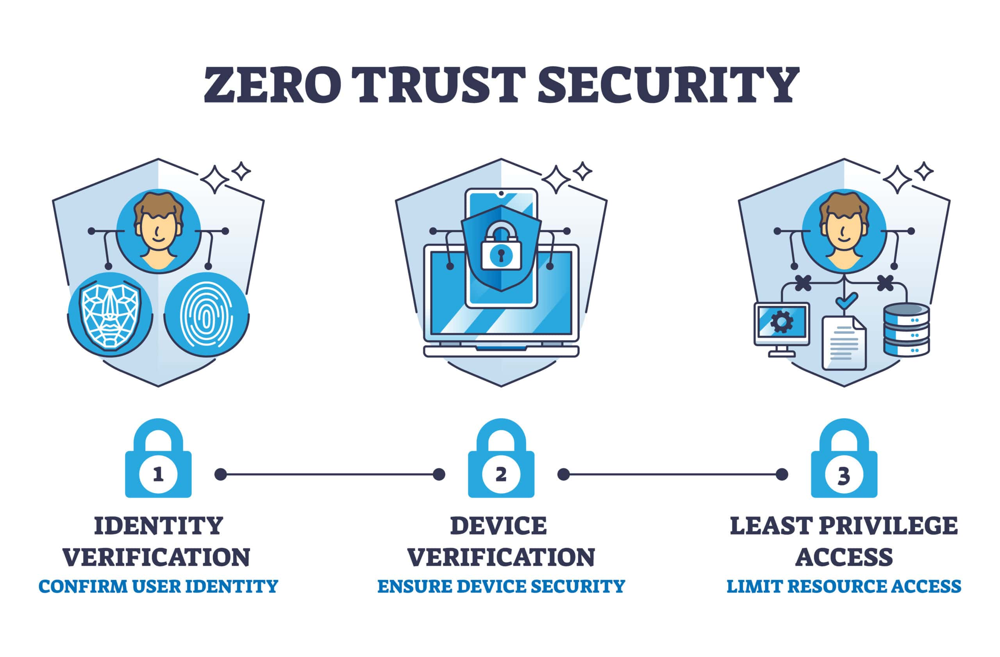
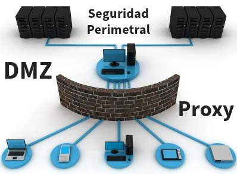

# 02 - Julio - 2026

## Objetivos de Aprendizaje

1. Seguridad en Redes
  - Zero Trust
  - Seguridad Perimetral
2. Tendencias Mundiales de Ciberseguridad
3. Práctica de Laboratorio: 

## Meditación

### Bill Gates

Bill Gates nació el 28 de octubre de 1955 en Seattle, Washington, Estados Unidos. Desde temprana edad mostró un gran interés por la informática y la programación, desarrollando sus primeras aplicaciones cuando aún era estudiante. En 1975, junto con su amigo Paul Allen, fundó Microsoft, empresa que revolucionó la industria del software al desarrollar sistemas operativos y herramientas que facilitaron el acceso de millones de personas a la computación personal. Su liderazgo permitió que Microsoft se consolidara como una de las compañías tecnológicas más influyentes del mundo.

Durante su trayectoria empresarial, Bill Gates impulsó el desarrollo de productos emblemáticos como MS-DOS y Windows, los cuales transformaron la forma en que las personas interactúan con las computadoras. Además de su visión tecnológica, destacó por promover la innovación y la estandarización del software, contribuyendo al crecimiento de la industria informática y al avance de numerosas empresas dedicadas al desarrollo tecnológico. Su trabajo influyó significativamente en la expansión de Internet, la productividad empresarial y la educación digital.

En años más recientes, Bill Gates ha dedicado gran parte de sus esfuerzos a la filantropía mediante la Fundación Bill y Melinda Gates, enfocándose en áreas como salud pública, educación, reducción de la pobreza e investigación científica. A través de diversas iniciativas ha apoyado programas de vacunación, desarrollo sostenible y acceso a oportunidades educativas en distintos países. Su legado combina tanto las contribuciones realizadas al mundo de la tecnología como su impacto en proyectos destinados a mejorar la calidad de vida de millones de personas alrededor del mundo.

## Seguridad en Redes

La seguridad en redes comprende el conjunto de políticas, tecnologías y procedimientos destinados a proteger la infraestructura de comunicación, los dispositivos conectados y la información que circula entre ellos. Su propósito es prevenir accesos no autorizados, detectar actividades maliciosas y garantizar la disponibilidad de los servicios frente a amenazas internas y externas. Para ello, se emplean mecanismos como firewalls, sistemas de detección y prevención de intrusiones, segmentación de redes y monitoreo continuo.

En la actualidad, la seguridad en redes debe adaptarse a entornos cada vez más distribuidos, donde el trabajo remoto, la computación en la nube y los dispositivos móviles incrementan la superficie de ataque. Por esta razón, las organizaciones implementan estrategias integrales que combinan controles técnicos, políticas de acceso y capacitación del personal para reducir riesgos y fortalecer la resiliencia frente a incidentes de ciberseguridad.

## Zero Trust

Zero Trust es un modelo de seguridad basado en el principio de "nunca confiar, siempre verificar". A diferencia de los modelos tradicionales, este enfoque asume que ningún usuario, dispositivo o aplicación debe considerarse confiable por defecto, incluso si se encuentra dentro de la red corporativa. Cada solicitud de acceso debe autenticarse, autorizarse y validarse continuamente antes de conceder permisos.

La implementación de Zero Trust requiere mecanismos como autenticación multifactor, control de acceso con privilegios mínimos, segmentación de la red y monitoreo permanente de las actividades de los usuarios. Este modelo reduce el impacto de posibles compromisos de seguridad y limita el movimiento lateral de los atacantes dentro de la infraestructura, convirtiéndose en una estrategia ampliamente adoptada por organizaciones modernas.

## Seguridad Perimetral

La seguridad perimetral consiste en proteger el límite entre la red interna de una organización y las redes externas, especialmente Internet. Tradicionalmente, esta estrategia se ha basado en la implementación de firewalls, proxies, sistemas de detección y prevención de intrusiones, así como filtros de tráfico que controlan el acceso hacia los recursos internos.

Aunque la seguridad perimetral continúa siendo un componente importante de la defensa informática, por sí sola ya no resulta suficiente frente a las amenazas actuales. La adopción de servicios en la nube, dispositivos móviles y acceso remoto ha impulsado la necesidad de complementar el perímetro con enfoques como Zero Trust, garantizando una protección más completa y adaptable a los entornos modernos.

## Tendencias Mundiales de Ciberseguridad

Las tendencias mundiales de ciberseguridad reflejan la constante evolución de las amenazas y de las tecnologías empleadas para proteger la información. Entre las principales tendencias destacan el incremento de ataques de ransomware, el uso de inteligencia artificial tanto para la defensa como para los ataques, la protección de infraestructuras críticas, la seguridad en entornos de nube y la adopción de arquitecturas Zero Trust.

Asimismo, las organizaciones están fortaleciendo sus estrategias mediante automatización, análisis avanzado de amenazas, respuesta temprana a incidentes y cumplimiento de estándares internacionales. Estas tendencias evidencian que la ciberseguridad se ha convertido en un aspecto estratégico para gobiernos, empresas e instituciones, requiriendo una actualización constante de conocimientos y tecnologías para enfrentar riesgos cada vez más sofisticados.
