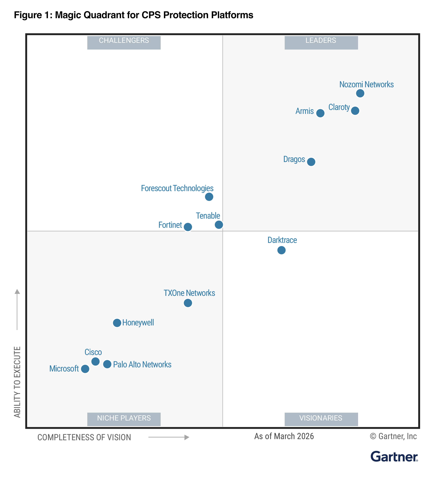
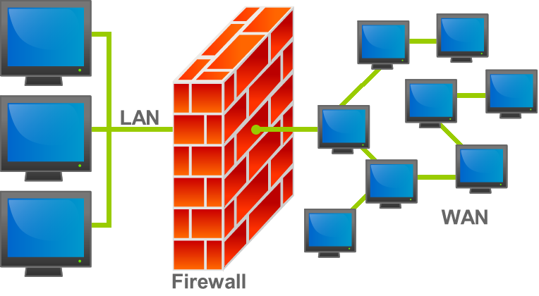

# 07 - Julio - 2026

## Objetivos de Aprendizaje

1. Seguridad en Redes
  - Seguridad profunda
  - IDS/IPS
    - Firewall
    - NewGenFirewall
    - Web Application Firewall
  - SIEM
  - UTM
  - Endpoints
2. Práctica de Laboratorio: Configuración de Firewalls en Linux

## Meditación

3 versículos de la biblia

1. Proverbios 1:8
2. Proverbios 22:6
3. Éxodo 20:12

## Mecanismos de seguridad

IDS: Instruction Detection System
IPS: Instruction Prevention System

Se definen políticas de acceso, detección y prevención.

## SNORT

## Cuadrante Mágico de Gartner UTM (Unified Threat Management) 2026

## Seguridad en Redes

La seguridad en redes comprende el conjunto de estrategias, tecnologías y procedimientos destinados a proteger la infraestructura de comunicación y los datos que circulan a través de ella. Su finalidad es garantizar la confidencialidad, integridad y disponibilidad de la información, previniendo accesos no autorizados, ataques cibernéticos y fallos que puedan comprometer la operación de los servicios. Para lograrlo, se implementan múltiples capas de protección que actúan de forma complementaria.

Las organizaciones modernas requieren una estrategia de seguridad integral debido al incremento de amenazas, la adopción de servicios en la nube y el trabajo remoto. En este contexto, la seguridad en redes combina herramientas de prevención, detección y respuesta que permiten identificar actividades sospechosas, contener incidentes y reducir el impacto de posibles ataques sobre la infraestructura tecnológica.

### Seguridad Profunda

La seguridad profunda, conocida también como Defense in Depth, es una estrategia que consiste en implementar múltiples capas de protección para evitar que una única vulnerabilidad comprometa todo el sistema. En lugar de depender de un solo mecanismo de defensa, este enfoque integra controles físicos, administrativos y tecnológicos que trabajan conjuntamente para dificultar el éxito de un ataque.

Este modelo contempla medidas como autenticación multifactor, segmentación de redes, cifrado de datos, monitoreo continuo, políticas de acceso y capacitación de usuarios. La combinación de estas capas incrementa la resiliencia de la organización, permitiendo detectar amenazas oportunamente y minimizar el impacto de incidentes de seguridad.

### IDS/IPS

Los sistemas IDS (Intrusion Detection System) e IPS (Intrusion Prevention System) son herramientas diseñadas para identificar actividades maliciosas dentro de una red informática. Mientras un IDS monitorea el tráfico y genera alertas cuando detecta comportamientos sospechosos, un IPS va un paso más allá al bloquear automáticamente el tráfico considerado peligroso antes de que alcance los sistemas protegidos.

Estos sistemas emplean firmas conocidas, análisis de comportamiento y técnicas de detección de anomalías para identificar ataques como escaneos de puertos, explotación de vulnerabilidades, malware o intentos de acceso no autorizado. Su integración con otras soluciones de seguridad fortalece la capacidad de respuesta ante amenazas y mejora la protección de la infraestructura tecnológica.

Firewall
: Dispositivo o software encargado de controlar el tráfico de red mediante reglas previamente definidas que permiten o bloquean conexiones según criterios de seguridad.

Next Generation Firewall (NGFW)
: Evolución de los firewalls tradicionales al incorporar funciones avanzadas.

Web Application Firewall (WAF)
: Mecanismo especializado en proteger aplicaciones web frente a ataques dirigidos contra el protocolo HTTP y HTTPS.

### SIEM

Security Information and Event Management (SIEM) es una plataforma que centraliza la recopilación, correlación y análisis de registros generados por servidores, aplicaciones, dispositivos de red y herramientas de seguridad. Su objetivo es proporcionar una visión unificada del estado de seguridad de una organización y facilitar la detección temprana de incidentes.

Los sistemas SIEM permiten automatizar alertas, generar reportes de cumplimiento normativo e identificar comportamientos anómalos mediante reglas de correlación y análisis avanzado de eventos. Estas capacidades mejoran la capacidad de respuesta de los equipos de seguridad y reducen el tiempo necesario para investigar y contener posibles ataques.

### UTM

Unified Threat Management (UTM) es una solución de seguridad que integra múltiples funciones de protección dentro de un único dispositivo o plataforma. Generalmente combina firewall, antivirus, filtrado web, VPN, sistemas IDS/IPS, control de aplicaciones y otras herramientas destinadas a simplificar la administración de la seguridad informática.

La principal ventaja de un UTM es centralizar la gestión de diferentes mecanismos de protección, reduciendo la complejidad operativa y facilitando el monitoreo de la infraestructura. Esta integración resulta especialmente útil para pequeñas y medianas organizaciones que requieren una solución completa sin administrar múltiples dispositivos independientes.

### Endpoints

Los endpoints son todos aquellos dispositivos finales que se conectan a una red, como computadoras, servidores, teléfonos móviles, tabletas e incluso dispositivos del Internet de las Cosas (IoT). Debido a que representan uno de los principales puntos de acceso para los atacantes, protegerlos constituye un aspecto esencial dentro de cualquier estrategia de ciberseguridad.

La seguridad de endpoints incluye el uso de antivirus, soluciones EDR (Endpoint Detection and Response), cifrado de discos, control de aplicaciones, administración de parches y monitoreo continuo. Estas medidas permiten prevenir infecciones por malware, detectar actividades sospechosas y responder rápidamente ante incidentes que puedan comprometer los dispositivos y la información que almacenan.
