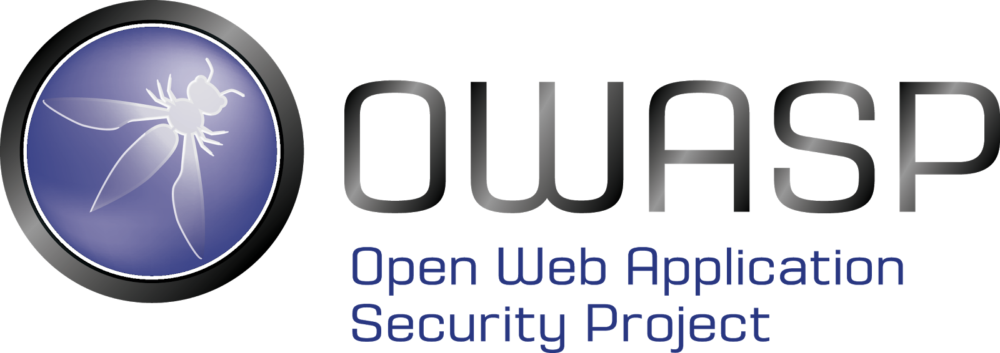
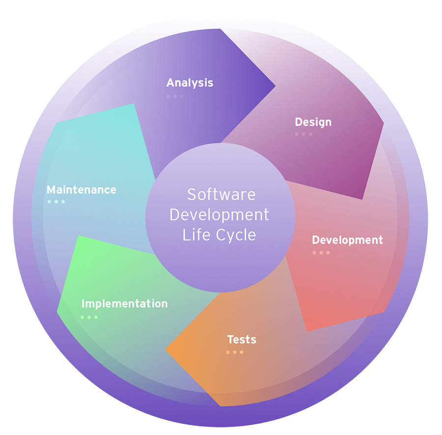

# 09 - Julio - 2026

## Objetivos de Aprendizaje

1. Seguridad en Aplicaciones
  - Web
    - OSAWP
    - Top Ten Attacks
    - WAF
    - Framework de NIST Desarrollo de Software Seguro
    - Ciclo de Vida del Desarrollo de Software Seguro
    - Pipelines CI/CD
2. Práctica de Laboratorio: SNORT + SQL Injection

## Meditación

### El amor exige tu mejor versión

El doctor fue a Caracas, Venezuela.

Hace tiempo, habló con el rector de la universidad para hacer un proyecto relacionado con Cisco.
El rector le cedió el permiso y los recursos necesarios para capacitarse.
Para poder capacitarse, los cursos fueron en Venezuela, por lo que fue con unos compañeros suyos.

Para poder conseguir un certificado, el doctor tuvo que realizar un curso de 33 niveles.
Por ello, el doctor tuvo que realizar un examen diario.

En el examen final, el doctor sacó una calificación insatisfactoria, por lo que se sintió muy mal.
Se retiró de la clase y llamó a su mujer.
Su mujer, por su parte, le colgó 3 veces diciéndole que no podía rendirse.
Que él era un ejemplo a seguir, no debería hacer un berrinche por ello.

Al terminar la 3ra llamada, se fue al curso nuevamente y vovió a esforzarse.

_Nosotros no somos perdedores ni somos "pobrecitos", sin dejar de ser humildes_.

## OWASP

OWASP
: Open Worldwide Application Security Project

OWASP (Open Worldwide Application Security Project) es una organización internacional sin fines de lucro dedicada a mejorar la seguridad del software mediante la creación de recursos abiertos para desarrolladores, empresas y profesionales de ciberseguridad. La organización publica documentación, herramientas, metodologías y proyectos que ayudan a identificar y mitigar vulnerabilidades presentes en aplicaciones web y otros sistemas informáticos.

Entre sus contribuciones más reconocidas se encuentra el OWASP Top 10, además de proyectos como ASVS, WebGoat, ZAP y Cheat Sheets. Estos recursos sirven como referencia para implementar buenas prácticas de desarrollo seguro, realizar pruebas de seguridad y capacitar a equipos técnicos. Gracias a su enfoque colaborativo y de libre acceso, OWASP se ha convertido en uno de los estándares más utilizados en la industria para fortalecer la seguridad del software.

## Top Ten Attacks

El OWASP Top 10 reúne las diez categorías de vulnerabilidades más críticas y frecuentes identificadas en aplicaciones web. Esta clasificación se basa en datos recopilados por expertos en seguridad y organizaciones de todo el mundo, proporcionando una guía para priorizar riesgos y enfocar los esfuerzos de protección durante el desarrollo de software.

Entre las vulnerabilidades más comunes se encuentran el control de acceso roto, fallas criptográficas, inyección, diseño inseguro, configuraciones de seguridad incorrectas y componentes vulnerables o desactualizados. Conocer estas amenazas permite a los desarrolladores implementar controles preventivos, realizar pruebas específicas y disminuir la probabilidad de que una aplicación sea comprometida por atacantes.

## WAF

Un Web Application Firewall (WAF) es un mecanismo de seguridad diseñado para proteger aplicaciones web filtrando, monitoreando y bloqueando tráfico HTTP o HTTPS malicioso antes de que alcance el servidor. A diferencia de un firewall tradicional, un WAF analiza las solicitudes considerando el comportamiento de la aplicación, permitiendo identificar ataques específicos dirigidos contra servicios web.

Los WAF pueden detectar intentos de inyección SQL, Cross-Site Scripting (XSS), ataques de fuerza bruta y otras amenazas comunes descritas por OWASP. Su implementación constituye una capa adicional de defensa que complementa las medidas de seguridad incorporadas en el desarrollo, aunque no reemplaza la necesidad de escribir código seguro y mantener una adecuada gestión de vulnerabilidades.

## Framework de NIST para Desarrollo de Software Seguro

El NIST Secure Software Development Framework (SSDF) es un marco de referencia que proporciona recomendaciones para integrar prácticas de seguridad durante todo el proceso de desarrollo de software. Su propósito es reducir la cantidad de vulnerabilidades presentes en los productos, mejorar la protección de la cadena de suministro de software y facilitar la respuesta ante incidentes de seguridad.

El SSDF organiza sus recomendaciones en prácticas relacionadas con la preparación de la organización, la protección del software, la producción de software seguro y la respuesta a vulnerabilidades. Estas directrices pueden adaptarse a diferentes metodologías de desarrollo y ayudan a establecer procesos consistentes que incrementan la calidad y seguridad de las aplicaciones.

## Ciclo de Vida del Desarrollo de Software Seguro

El Ciclo de Vida del Desarrollo de Software Seguro (SSDLC) amplía el ciclo tradicional de desarrollo incorporando actividades de seguridad en cada una de sus fases, desde el levantamiento de requisitos hasta el mantenimiento del sistema. Este enfoque busca identificar riesgos de forma temprana, disminuyendo el costo de corregir vulnerabilidades detectadas en etapas avanzadas.

Durante el SSDLC se realizan actividades como análisis de riesgos, modelado de amenazas, revisiones de código, pruebas de seguridad estáticas y dinámicas, validación de configuraciones y monitoreo posterior al despliegue. La integración de estas prácticas permite desarrollar aplicaciones más confiables y resilientes frente a amenazas emergentes.

## Pipelines CI/CD

Los pipelines de Integración Continua y Entrega Continua (CI/CD) automatizan las tareas de construcción, pruebas y despliegue de aplicaciones, permitiendo entregar nuevas versiones de manera rápida y consistente. La automatización reduce errores humanos, mejora la calidad del software y facilita la detección temprana de fallos durante el proceso de desarrollo.

Desde la perspectiva de la seguridad, los pipelines CI/CD permiten incorporar prácticas de DevSecOps mediante la ejecución automática de análisis de código estático, escaneo de dependencias, pruebas de vulnerabilidades y validación de configuraciones antes del despliegue. Integrar estos controles en el pipeline ayuda a prevenir la propagación de vulnerabilidades hacia ambientes de producción y fortalece el proceso de desarrollo seguro.
