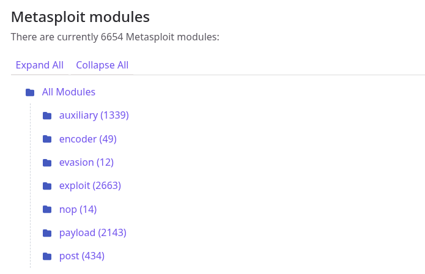

# 16 - Julio - 2026

## Objetivos de Aprendizaje

1. CIS Controls
2. Metasploit

## Meditación

### El Hijo Pródigo

## Módulos Metasploit

### Exploit

Los módulos Exploit contienen el código necesario para aprovechar una vulnerabilidad específica presente en un sistema, servicio o aplicación. Su objetivo es ejecutar una acción sobre el objetivo vulnerable, como obtener acceso remoto, ejecutar comandos o instalar una carga útil (payload) que permita continuar con la prueba de penetración.

### Auxiliary

Los módulos Auxiliary agrupan herramientas que no requieren explotar una vulnerabilidad para cumplir su función. Incluyen utilidades destinadas al reconocimiento, escaneo de puertos, enumeración de servicios, recopilación de información, ataques de fuerza bruta y comprobación de vulnerabilidades, entre otras tareas relacionadas con la evaluación de seguridad.

### Post

Los módulos Post se utilizan después de haber obtenido acceso a un sistema mediante un exploit exitoso. Su finalidad es realizar actividades de postexplotación como la recopilación de información del sistema, escalamiento de privilegios, extracción de credenciales, análisis de configuraciones y evaluación del impacto que tendría un atacante con acceso al equipo comprometido.

### Encoders

Los módulos Encoders permiten transformar o codificar un payload para modificar su representación sin alterar su funcionamiento. Originalmente fueron diseñados para evitar caracteres problemáticos durante la explotación y, en algunos casos, dificultar la detección por parte de ciertos mecanismos de seguridad.

### Evasion

Los módulos Evasion están orientados a generar cargas útiles capaces de evadir algunos mecanismos de detección implementados por soluciones de seguridad, como antivirus o sistemas de protección de endpoints, dentro de entornos de prueba autorizados. Estos módulos permiten evaluar la eficacia de los controles defensivos y detectar posibles debilidades en la infraestructura de seguridad.

### NOPS

Los módulos NOPS generan secuencias de instrucciones conocidas como No Operation (NOP), cuya función es preparar el entorno para la ejecución de un payload. Estas instrucciones no producen cambios en el sistema, pero ayudan a incrementar la probabilidad de que la ejecución alcance correctamente la carga útil durante determinados procesos de explotación.

## OWASP ZAP

OWASP ZAP (Zed Attack Proxy) es una herramienta de código abierto desarrollada por OWASP para realizar pruebas de seguridad en aplicaciones web. Funciona como un proxy de interceptación que permite analizar el tráfico HTTP y HTTPS entre el navegador y la aplicación, facilitando la identificación de vulnerabilidades como inyección SQL, Cross-Site Scripting (XSS), configuraciones inseguras y otros riesgos presentes en aplicaciones web.

Además de su capacidad para realizar análisis automáticos de vulnerabilidades, OWASP ZAP ofrece herramientas para pruebas manuales, inspección de solicitudes y respuestas, manipulación de parámetros y generación de reportes de seguridad. Gracias a su facilidad de uso y a su amplia comunidad de desarrollo, se ha convertido en una de las herramientas más utilizadas para apoyar auditorías de seguridad y procesos de desarrollo seguro.
