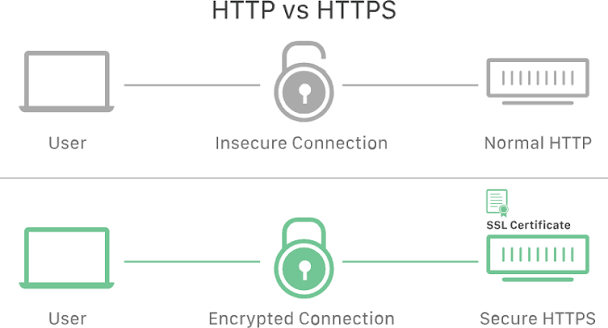
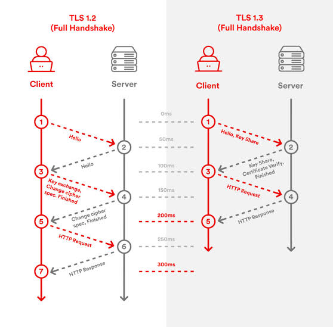

# 30 - Junio - 2026

## Objetivos de Aprendizaje

1. Evolución de Protocolos Criptográficos
  - SSL
  - TLS
    - TLS 3.0
  - Kerberos
2. Práctica de Laboratorio: Aplicación de Protocolos Criptográficos TLS/SSL
3. Unidad 3

## Meditación

El doctor obtuvo la beca de estudios en 2005.
En ese tiempo, pudo ir él pero no su familia ni hijos, pues la visa no les fue otorgada.

Su esposa le pidió que le haga 3 promesas ya que no podían estar juntos:

1. Si se reúne con alguna mujer que le pregunte dónde vive, él no lo diría.
2. En esas conversaciones, no ir diciendo su grado de estudios.
3. No decir que va becado y que dispone de dinero en su bolsillo.

Pasó cerca de un mes y el doctor enfermó por la ausencia de su familia.
Un amigo le invitó a un bar de peruanas, donde hubieron 3 escenarios:

1. Un restaurante donde comieron y se saciaron.
2. Un bar donde pudo cantar con emoción
3. La farra, donde el 90% de las personas eran mujeres. El doctor mejor decidió sentarse, sin embargo se encontró con una chica a la que le invitó una cerveza.

Ella le llevó al restaurante y le hizo unas preguntas, entre ellas:

- _¿Dónde vives?_, a la cual respondió _Con 16 personas_
- _¿Qué título tienes?_, a la que respondió _Albañil_
- _¿Cuánto ganas?_, a la que respondió _No tengo dinero_

## Seguridad en Redes

Gestionar datos durante la transferencia y su almacenamiento.

- Internet
- Dispositivos móviles
- Redes de datos
- Aplicaciones Web
- Redes celulares
- Infraestructuras de misión crítica

## Evolución de Protocolos Criptográficos

La evolución de los protocolos criptográficos ha sido fundamental para fortalecer la seguridad de las comunicaciones en redes y aplicaciones. A medida que surgieron nuevas amenazas y aumentó la capacidad computacional, los mecanismos de cifrado debieron actualizarse para corregir vulnerabilidades y ofrecer mejores garantías de confidencialidad, integridad y autenticación. Esta evolución permitió que las comunicaciones digitales fueran cada vez más seguras y confiables.

El desarrollo de nuevos protocolos también ha impulsado la adopción de estándares internacionales y mejores prácticas para la protección de la información. Comprender cómo han evolucionado estos protocolos permite identificar las limitaciones de tecnologías antiguas y valorar la importancia de mantener sistemas actualizados frente a los constantes avances en ciberseguridad.

## SSL

Secure Sockets Layer (SSL) fue uno de los primeros protocolos ampliamente utilizados para establecer comunicaciones cifradas entre clientes y servidores a través de Internet. Su principal objetivo era proteger la información transmitida mediante el uso de criptografía, evitando que terceros pudieran interceptar o modificar los datos durante la comunicación.

Con el paso del tiempo, se descubrieron diversas vulnerabilidades en SSL que comprometían su seguridad, como ataques relacionados con versiones antiguas del protocolo. Debido a estas debilidades, SSL fue reemplazado progresivamente por TLS, aunque su nombre aún es utilizado de forma coloquial para referirse a conexiones seguras, especialmente en el contexto de certificados digitales.

## TLS

Transport Layer Security (TLS) es el protocolo que sustituyó a SSL, incorporando mejoras significativas en los algoritmos criptográficos, el proceso de negociación de claves y la autenticación entre las partes. Su función es garantizar que la información intercambiada entre un cliente y un servidor permanezca protegida contra espionaje, manipulación e intentos de suplantación de identidad.

TLS es actualmente el estándar utilizado para proteger servicios como HTTPS, correo electrónico, VPN y numerosas aplicaciones de Internet. Gracias a su diseño modular y a la incorporación de algoritmos criptográficos modernos, ofrece un alto nivel de seguridad y continúa evolucionando para responder a nuevas amenazas y requisitos tecnológicos.

### TLS 1.3

TLS 1.3 representa la versión más reciente y segura del protocolo TLS, diseñada para simplificar el establecimiento de conexiones seguras y eliminar algoritmos criptográficos considerados inseguros. Esta versión reduce el número de intercambios necesarios durante el proceso de handshake, mejorando tanto la seguridad como el rendimiento de las comunicaciones.

Entre sus principales ventajas se encuentran el uso obligatorio de algoritmos criptográficos robustos, la eliminación de funciones obsoletas y una mayor protección frente a diversos tipos de ataques. Estas mejoras convierten a TLS 1.3 en el protocolo recomendado para proteger aplicaciones y servicios modernos que requieren comunicaciones rápidas y altamente seguras.

## Kerberos

Kerberos es un protocolo de autenticación de red que permite verificar la identidad de usuarios y servicios mediante el uso de tickets criptográficos, evitando el envío repetido de contraseñas a través de la red. Su funcionamiento se basa en un tercero de confianza denominado Key Distribution Center (KDC), encargado de emitir los tickets necesarios para autenticar a los participantes.

Este protocolo es ampliamente utilizado en entornos empresariales y redes corporativas debido a su capacidad para proporcionar autenticación mutua entre clientes y servidores. Además de incrementar la seguridad, Kerberos facilita la implementación de mecanismos de inicio de sesión único (Single Sign-On), permitiendo que los usuarios accedan a múltiples servicios utilizando una única autenticación.
