# Topología de Prueba

Entorno Virtual de Red: Kali Linux, Ubuntu Desktop, VM Metasploitable 2 y OpenSSL.

# Objetivos de Aprendizaje

- Aprender a gestionar perfiles de usuario, asignar permisos y configurar el control de acceso en un entorno Linux. 
- Crearán y gestionarán usuarios, configurarán permisos de acceso a archivos y directorios, y aplicarán el control de acceso mediante ACLs y SELinux.

# Materiales necesarios:

- 3 máquinas virtuales:
    - Ubuntu Desktop.
    - Kali Linux.
    - VM Metasploitable 2.

# Marco Teórico

La gestión de usuarios y el control de acceso son pilares fundamentales en la seguridad de los sistemas operativos, especialmente en entornos Linux, donde el modelo de seguridad está basado en el principio de mínimo privilegio, es decir, los usuarios y procesos solo deben tener los permisos estrictamente necesarios para ejecutar sus tareas.

## Perfiles de Usuario en Linux

En Linux, un perfil de usuario es una cuenta que representa a una entidad (persona, servicio o proceso) que interactúa con el sistema. Cada usuario posee un UID (User ID) único, un nombre de usuario, un grupo principal (GID) y, opcionalmente, grupos secundarios. La información básica de cada usuario se almacena en archivos del sistema como:

/etc/passwd
: contiene información básica del usuario (nombre, UID, GID, shell, home).

/etc/shadow
: almacena contraseñas cifradas y políticas de expiración.

/etc/group
: define grupos de usuarios.

Los perfiles de usuario permiten asignar permisos y restricciones individuales o colectivas (por grupo), lo que facilita la administración de la seguridad y la segmentación de accesos.

## Control de Acceso

El control de acceso se refiere a los mecanismos que determinan quién puede acceder a qué recursos y con qué privilegios. Linux utiliza varios modelos de control de acceso:

### Modelo DAC (Discretionary Access Control)

Es el modelo por defecto en Linux. Los propietarios de archivos/directorios pueden definir permisos para sí mismos, su grupo y otros usuarios. Los tres tipos básicos de permisos son:

r (read)
: leer el contenido.

w (write)
: modificar el contenido.

x (execute)
: ejecutar un archivo o acceder a un directorio.

Se gestionan con comandos como chmod, chown y chgrp.

### ACLs (Access Control Lists)

Permiten una gestión más granular de permisos que el modelo DAC clásico. Con ACLs, se pueden asignar permisos específicos a múltiples usuarios y grupos para un solo archivo o directorio. Los comandos más comunes para gestionarlas son:

getfacl
: visualizar las ACL.

setfacl
: configurar o modificar las ACL.

### SELinux (Security-Enhanced Linux)

Es una implementación del modelo MAC (Mandatory Access Control), que aplica políticas de seguridad más estrictas. SELinux define un sistema de etiquetas y roles que restringe las acciones incluso a usuarios root, basándose en políticas centralizadas y no modificables por el usuario final.

# Desarrollo

## Creación de perfiles de usuario

### 1. En VM Metasploitable 2

- Inicie sesión como root o como un usuario con privilegios de sudo.
- Cree un nuevo usuario llamado user1:

```sh
sudo adduser user1
```

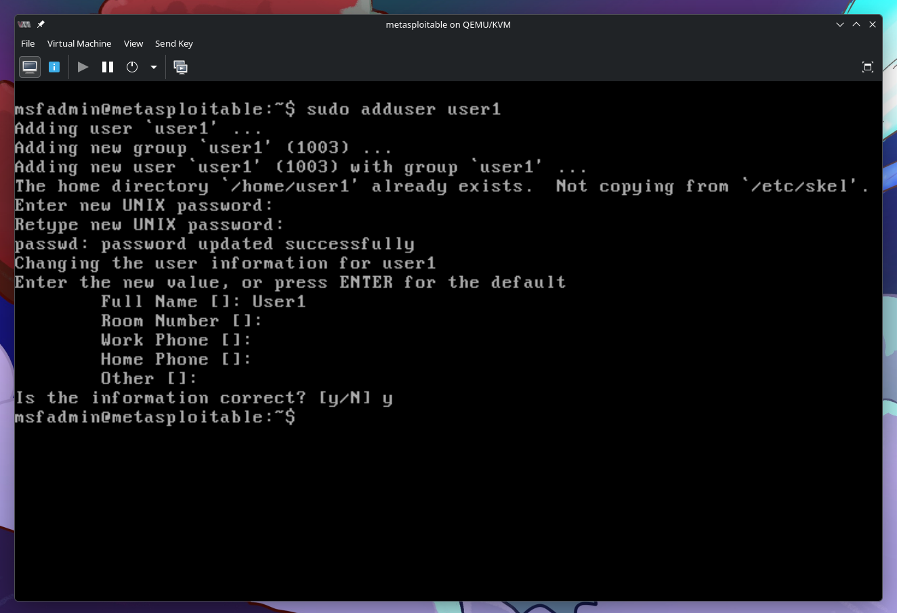

- Asigne una contraseña para el nuevo usuario.
- Añada user1 al grupo sudo para otorgarle privilegios administrativos:

```sh
sudo usermod -aG sudo user1
```

- Verifique que user1 pertenece al grupo sudo:

```sh
groups user1
```

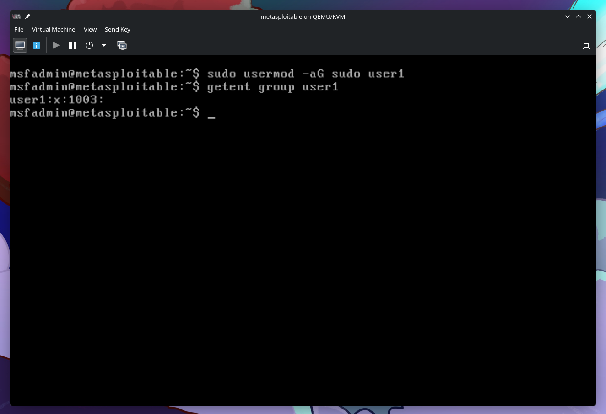

### En Ubuntu Desktop:

- Cree un usuario user2 utilizando la interfaz gráfica:
    - Abra "Configuración del sistema" → "Usuarios" → "Desbloquear" → "Añadir usuario".
    - Complete los campos necesarios.
    - Seleccione la opción "Permitir al usuario administrar este equipo" para otorgar permisos de administrador si es necesario.

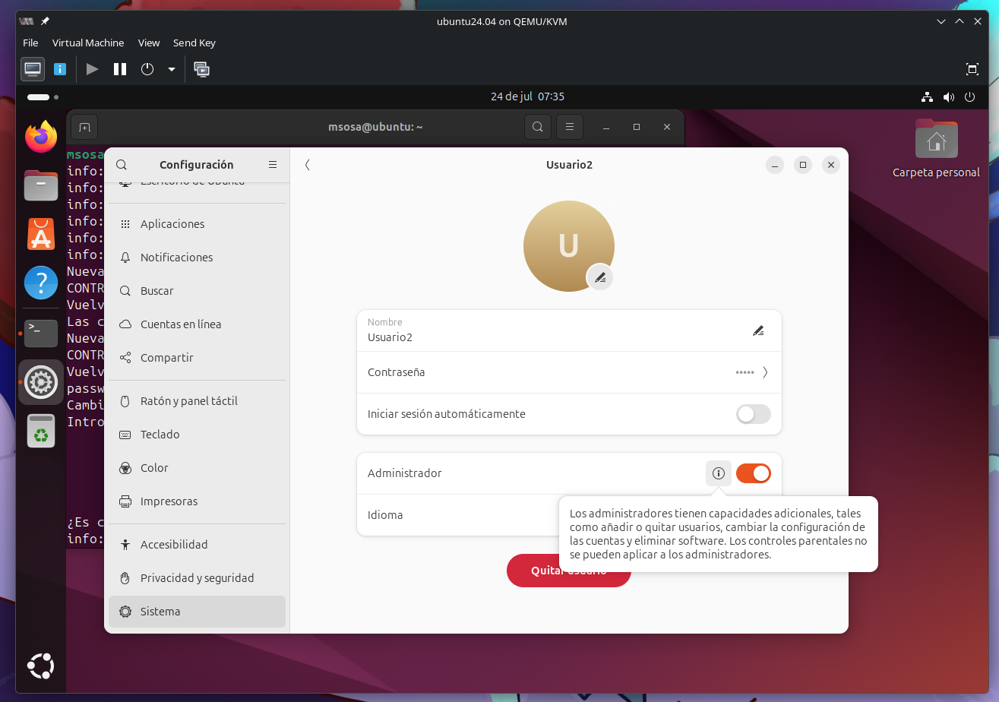

### En Kali Linux:

- Cree un usuario user3 desde la terminal:

```sh
sudo adduser user3
```

- Asigne una contraseña al usuario y confirme su creación.

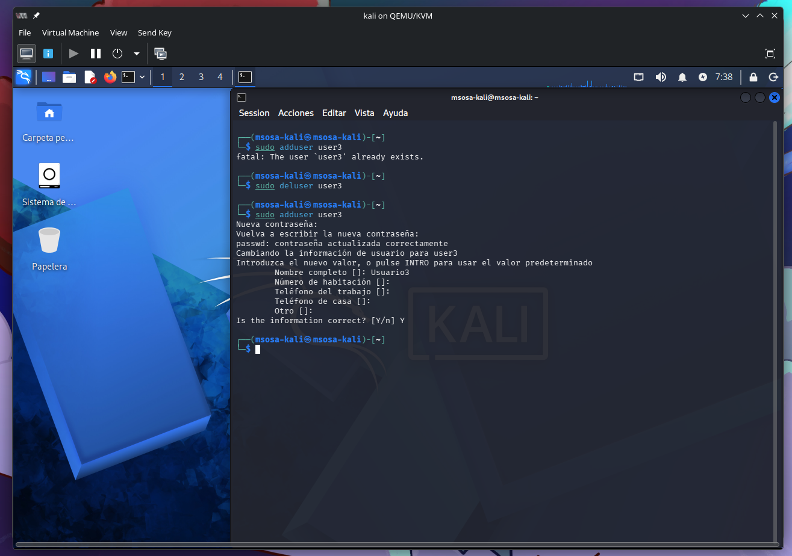

## Asignación de permisos y grupos

### En VM Metasploitable 2

- Cree un directorio llamado /data:

```sh
sudo mkdir /data
sudo chmod 770 /data
```


Esto asegura que solo el propietario y el grupo tengan permisos de lectura, escritura y ejecución.
        
- Cambie el propietario del directorio a user1 y asigné el grupo sudo al directorio:

```sh
sudo chown user1:sudo /data
```

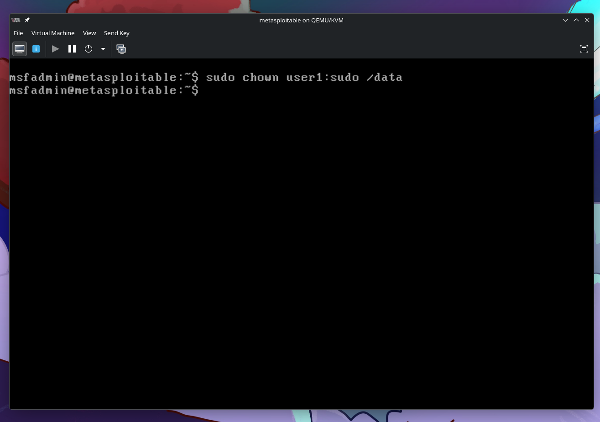

- Verifique los permisos de /data:

```sh
ls -ld /data
```

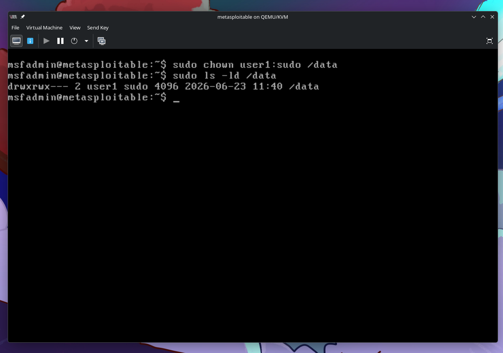

### En Ubuntu Desktop

- Asegúrese de que user2 tenga permisos de acceso al directorio /data en VM Metasploitable 2:
    - Desde Ubuntu Desktop, abra una terminal y monte la carpeta compartida data usando Samba o SSHFS.
    - Una vez montada, verifique los permisos con:

```sh
ls -ld /data
```

### En Kali Linux

- Intente acceder a /data desde Kali Linux con user3:

```sh
ls -ld /data
```

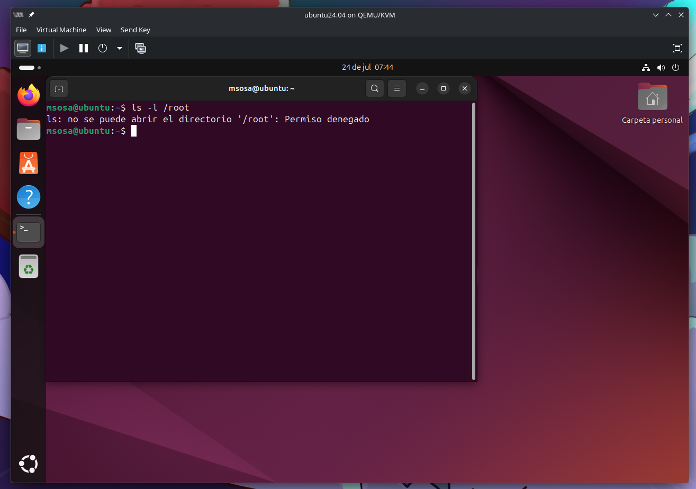

Esto debería fallar porque user3 no tiene permisos. Luego, intente acceder con user1 o user2, que tienen permisos adecuados.

## Implementación de un Modelo de Control de Acceso

### En VM Metasploitable 2

- Habilite SELinux en el sistema (si no está activado):

```sh
sudo apt-get install selinux-utils
sudo setenforce 1
sudo sestatus

```

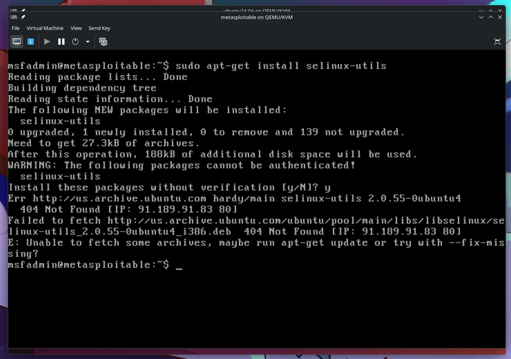

Verifique que SELinux esté en modo Enforcing.

- Cambie el contexto de seguridad del directorio /data utilizando SELinux:

```sh
sudo chcon -t user_home_t 
```

Esto aplicará un contexto de seguridad más restrictivo al directorio.

### En Kali Linux:

- Realice una auditoría de acceso utilizando ls para revisar los archivos y directorios a los que user3 tiene acceso. Luego, verifique si SELinux está impactando el acceso al directorio /data.
- Use herramientas de auditoría de seguridad de Kali, como auditd:

```sh
sudo auditctl -w /data -p rwxa
sudo ausearch -f /data
```

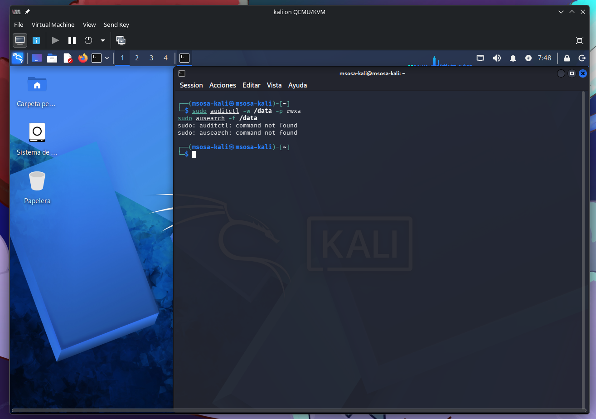

## Control de acceso con ACLs

### En VM Metasploitable 2:

- Instale ACL si aún no está instalado:

```sh
sudo apt-get install acl
```


- Configure permisos más granulares sobre el directorio /data usando ACLs. Por ejemplo, otorgue solo permisos de lectura a user2:

```sh
sudo setfacl -m u:user2:r /data
sudo getfacl /data
```

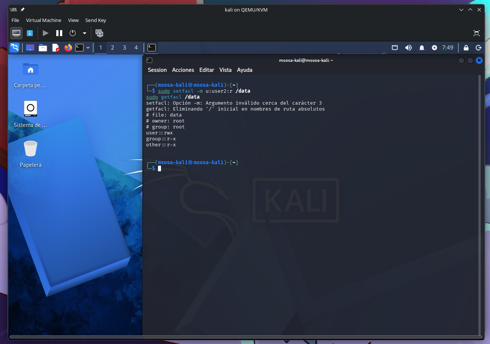

### En Kali Linux:

- Verifique si user3 tiene permisos para acceder a /data después de aplicar ACLs:

```sh
ls -ld /data
```

Si todo está correctamente configurado, user3 no podrá acceder al directorio.

### Verificación en Ubuntu Desktop:

- En Ubuntu Desktop, use el comando getfacl para verificar la configuración de ACL:

```sh
getfacl /data
```

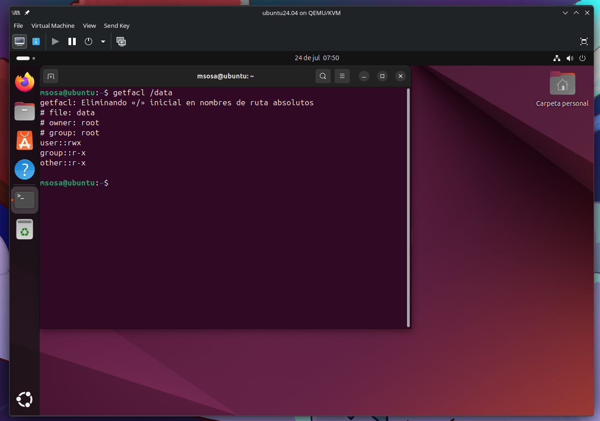

# Tarea para el estudiante

Investigue y responda brevemente lo siguiente:

_¿Cuál es la diferencia conceptual y práctica entre los modelos de control de acceso DAC (Discretionary Access Control), MAC (Mandatory Access Control) y RBAC (Role-Based Access Control)?_

| Modelo                                 | Concepto                                                                                      | Característica principal                                                                      |
| -------------------------------------- | --------------------------------------------------------------------------------------------- | --------------------------------------------------------------------------------------------- |
| **DAC (Discretionary Access Control)** | El propietario de un archivo o recurso decide quién puede acceder a él.                       | Los permisos pueden ser modificados libremente por el dueño del recurso.                      |
| **MAC (Mandatory Access Control)**     | El acceso es controlado por una política de seguridad centralizada definida por el sistema.   | Ni siquiera el propietario del recurso puede cambiar las reglas establecidas por la política. |
| **RBAC (Role-Based Access Control)**   | Los permisos se asignan a roles y los usuarios obtienen permisos según el rol que desempeñan. | Facilita la administración de permisos en organizaciones con múltiples usuarios.              |

: Comparativa de Movelos de Control de Acceso

_¿Qué herramientas o mecanismos específicos implementan cada uno de estos modelos en Linux?_

| Modelo   | Herramientas o mecanismos                                                                                                     |
| -------- | ----------------------------------------------------------------------------------------------------------------------------- |
| **DAC**  | `chmod`, `chown`, `chgrp`, permisos tradicionales (`rwx`), ACL mediante `setfacl` y `getfacl`.                                |
| **MAC**  | **SELinux**, **AppArmor**, Smack y TOMOYO Linux.                                                                              |
| **RBAC** | `sudo`, **PolicyKit (polkit)**, grupos de usuarios (`groupadd`, `usermod`) y, en SELinux, el propio mecanismo RBAC integrado. |

: Mecanismos y herramientas de cada modelo de control de acceso

_¿En qué casos sería más recomendable usar MAC en lugar de DAC?_

MAC es preferible cuando se requiere una seguridad más estricta y se desea impedir que los usuarios, incluso siendo propietarios de sus archivos, puedan otorgar permisos que comprometan el sistema.

_Explique con un ejemplo técnico (real o hipotético) cómo se podría aplicar RBAC usando sudo o policykit._

Supongamos una empresa con tres roles:

- Administrador
- Desarrollador
- Operador

Los desarrolladores necesitan reiniciar únicamente el servicio de Apache, pero no deben poder administrar el sistema completo.

En este caso:

- El rol es pertenecer al grupo `developers`.
- El permiso asociado al rol es reiniciar Apache.
- No se conceden privilegios adicionales, aplicando el principio de mínimo privilegio.
