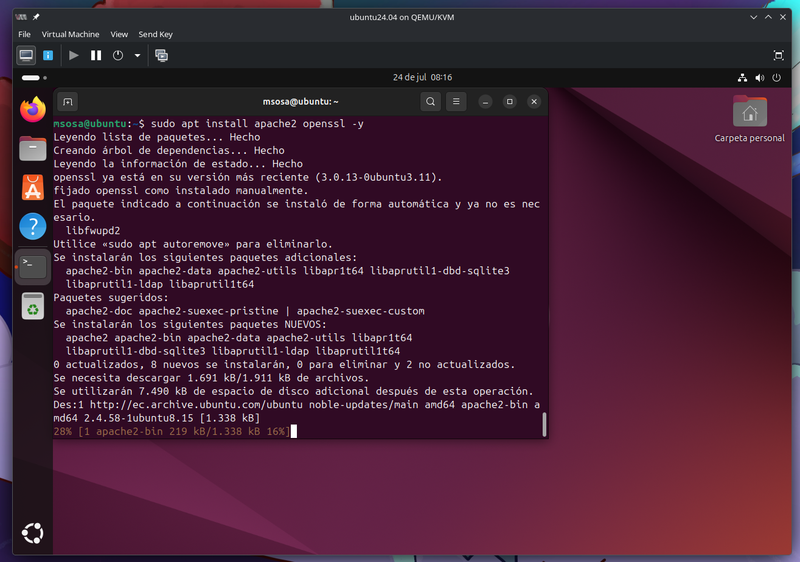
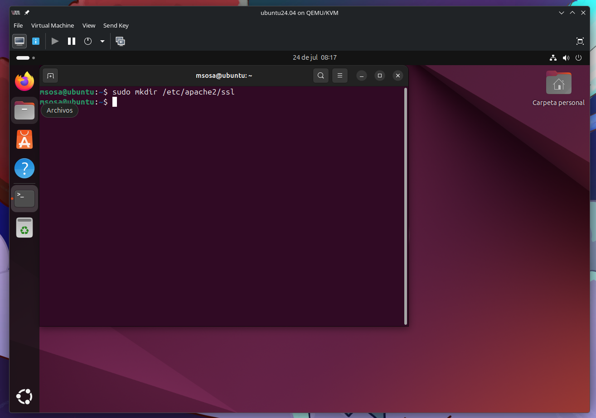
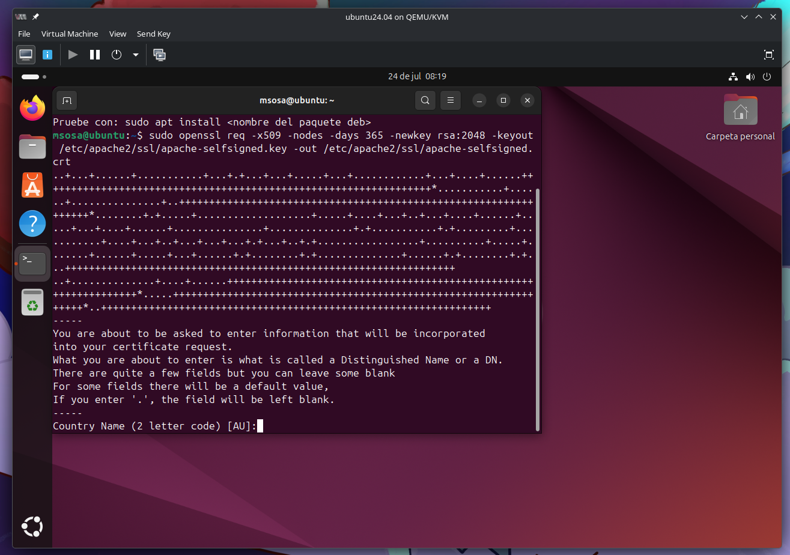
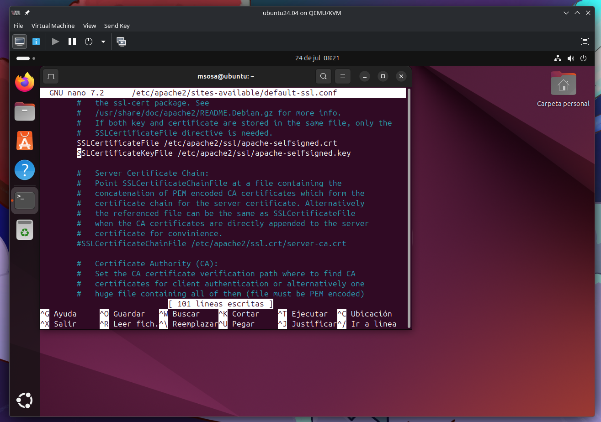
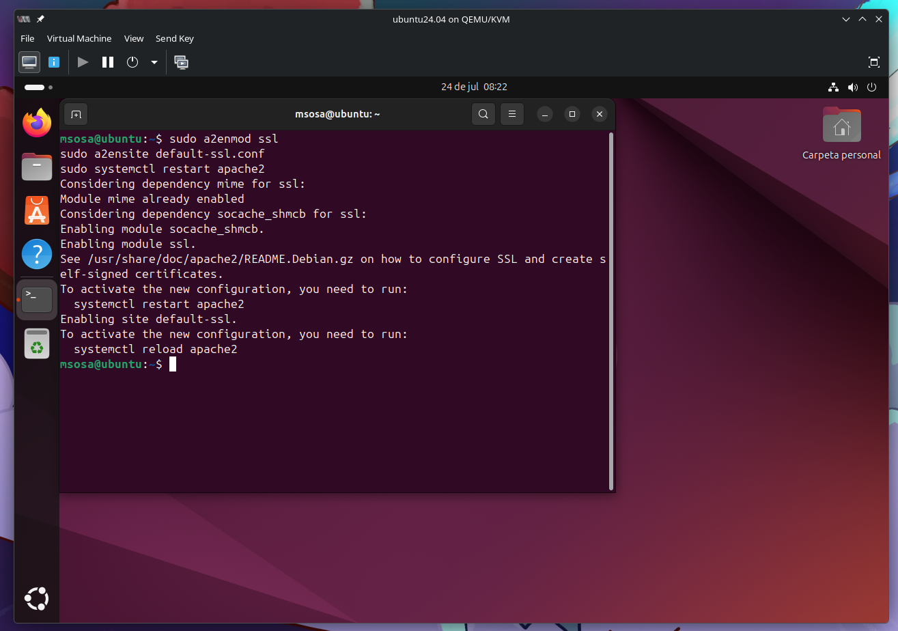
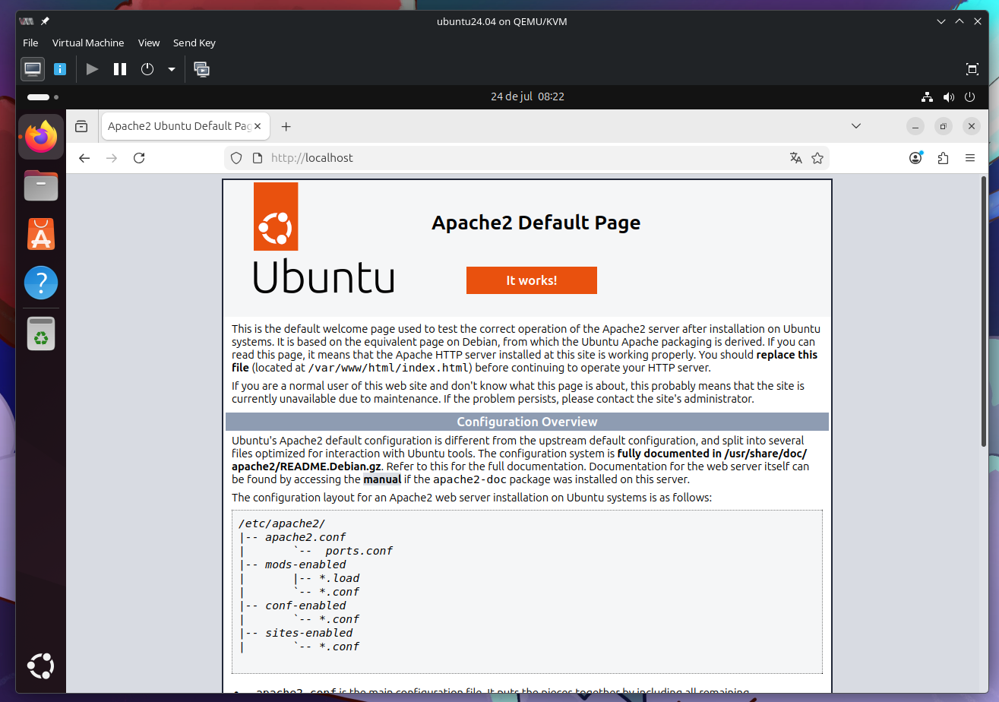
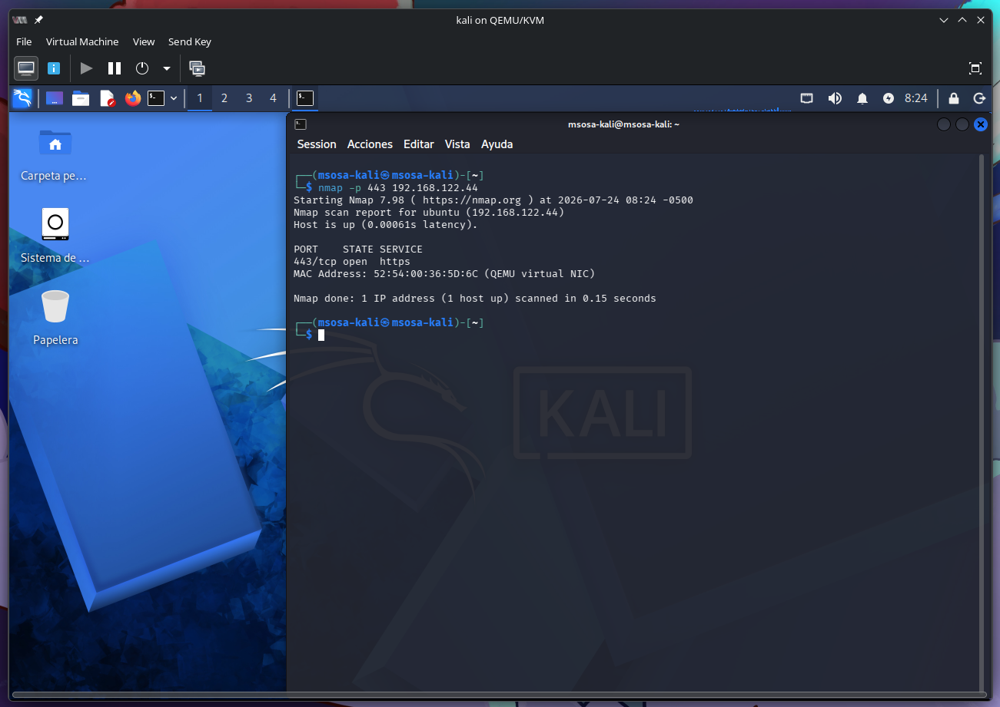
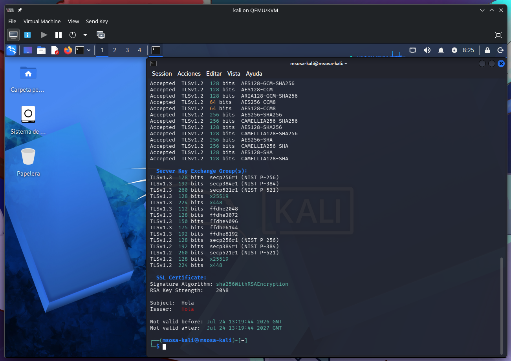

# Topología de Prueba

Entorno Virtual de Red: Kali Linux, Ubuntu Desktop, VM Metasploitable 2 y OpenSSL.

# Objetivos de Aprendizaje

- Comprender los conceptos fundamentales de TLS/SSL.
- Implementar y configurar un servidor web seguro con Apache en VM Metasploitable 2.
- Verificar y probar la seguridad de la conexión utilizando Ubuntu Desktop y Kali Linux.

# Marco Teórico

## TLS/SSL

TLS (Transport Layer Security) y su predecesor SSL (Secure Sockets Layer) son protocolos criptográficos que proporcionan comunicaciones seguras a través de redes informáticas. TLS/SSL garantiza la confidencialidad, integridad y autenticidad de los datos transmitidos mediante el uso de certificados digitales y criptografía asimétrica y simétrica. TLS es ampliamente utilizado en la protección de servicios web, como HTTPS, correo electrónico seguro y otros protocolos de aplicación (Kurose & Ross, 2020).

## OpenSSL

OpenSSL es una biblioteca de software robusta que proporciona implementaciones de protocolos TLS/SSL y funciones criptográficas. Es una herramienta esencial para la generación de certificados, claves privadas y configuraciones seguras de servidores web. Su uso es fundamental para proteger las comunicaciones en aplicaciones de servidor y cliente (Stallings, 2020).

## Certificado auto firmado

Es un certificado digital que es firmado por la misma entidad que lo emite, en lugar de una autoridad de certificación (CA) de confianza. Es decir, la entidad emisora del certificado también es la que lo valida. Estos certificados se utilizan principalmente en entornos donde no se requiere la validación por parte de una CA externa, como en entornos de prueba o desarrollo.

## Offensive Security

Offensive Security es una organización especializada en ciberseguridad ofensiva y conocida por desarrollar y mantener Kali Linux, una distribución basada en Debian utilizada para pruebas de penetración y auditorías de seguridad. Kali Linux incluye una amplia gama de herramientas para el análisis de redes, pruebas de vulnerabilidad y explotación de sistemas, como Nmap, sslscan y Wireshark (Offensive Security, 2024).

# Desarrollo

## Configuración del Servidor Web con TLS/SSL

### En la máquina VM Metasploitable 2:

Inicie sesión y actualice el sistema:

```sh
sudo apt update && sudo apt upgrade -y
```

Instale Apache y OpenSSL:

```sh
sudo apt install apache2 openssl -y
```



Cree un directorio para almacenar los certificados:

```sh
sudo mkdir /etc/apache2/ssl
```



Genere un certificado autofirmado:

```sh
sudo openssl req -x509 -nodes -days 365 -newkey rsa:2048 \
-keyout /etc/apache2/ssl/apache-selfsigned.key \ 
-out /etc/apache2/ssl/apache-selfsigned.crt 
```

Complete la información solicitada:

Country Name (nombre del país)
: EC

State or Province (estado o provincia)
: Some-State

Locality (ciudad)
: Quito

Organization Name (nombre de la organización)
: ESPE

Common Name (dominio o IP del servidor)
: Hola



### Configure Apache para usar TLS/SSL:

Edite el archivo de configuración del sitio seguro:

```sh
sudo nano /etc/apache2/sites-available/default-ssl.conf
```

Modifique las siguientes líneas para apuntar a los archivos de certificado y clave:

```txt
SSLCertificateFile /etc/apache2/ssl/apache-selfsigned.crt
SSLCertificateKeyFile /etc/apache2/ssl/apache-selfsigned.key
```



### Active el módulo SSL y el sitio seguro:

```sh
sudo a2enmod ssl
sudo a2ensite default-ssl.conf
sudo systemctl restart apache2
```



## Verificación de la Conexión Segura

### En la máquina Ubuntu Desktop:

Abra el navegador web e ingrese la dirección del servidor utilizando HTTPS:
https://<IP_DEL_SERVIDOR>

Debería aparecer una advertencia indicando que el certificado no es confiable debido a que es autofirmado. Ignore la advertencia y continúe.

Verifique que la conexión esté cifrada revisando el icono de candado en la barra de direcciones.



## Pruebas de Seguridad con Kali Linux

### En la máquina Kali Linux:

Realice un escaneo de puertos para verificar que el puerto 443 está abierto:

```sh
nmap -p 443 <IP_DEL_SERVIDOR>
```



Debería mostrar que el puerto 443 está abierto y que el servicio HTTPS está activo.
Utilice `sslscan` para obtener información detallada sobre la configuración TLS/SSL:

```sh
sslscan <IP_DEL_SERVIDOR>
```



Revise los resultados para verificar los protocolos admitidos y posibles vulnerabilidades.
Capture y analice el tráfico HTTPS con Wireshark o iptraf para observar el cifrado.

# Resultados Esperados:

1. El servidor debe responder con una página web segura accesible vía HTTPS.
2. El escaneo de puertos debe confirmar que el puerto 443 está abierto.
3. sslscan debe mostrar los detalles del certificado y los protocolos de cifrado soportados.

# Tareas adicionales:

_¿Cuál es la importancia de utilizar TLS/SSL en servidores web?_

TLS (Transport Layer Security), anteriormente conocido como SSL, protege la comunicación entre el cliente y el servidor mediante el cifrado de los datos transmitidos.

Sus principales beneficios son:

Confidencialidad
: evita que terceros puedan leer la información transmitida.

Integridad
: garantiza que los datos no sean modificados durante la transmisión.

Autenticación
: permite verificar que el cliente se está comunicando con el servidor legítimo mediante un certificado digital.

Protección contra ataques
: reduce el riesgo de ataques como la interceptación de tráfico (Man-in-the-Middle).

_¿Cuáles son las limitaciones de un certificado autofirmado?_

- No es confiable por defecto para los navegadores y sistemas operativos.
- Genera advertencias de seguridad al acceder al sitio web.
- No permite verificar la identidad del propietario del servidor.
- Es vulnerable a ataques de suplantación si los usuarios ignoran las advertencias del navegador.
- Requiere instalar manualmente el certificado en cada cliente para que sea considerado confiable.

_¿Qué medidas adicionales podrían implementarse para mejorar la seguridad del servidor?_

- Utilizar certificados emitidos por una Autoridad Certificadora confiable.
- Deshabilitar versiones antiguas de SSL y TLS (SSLv2, SSLv3, TLS 1.0 y TLS 1.1).
- Habilitar únicamente cifrados (ciphers) seguros.
- Configurar HTTP Strict Transport Security (HSTS) para obligar el uso de HTTPS.
- Implementar un firewall y restringir únicamente los puertos necesarios.
- Mantener actualizado el sistema operativo y el servidor web.
- Deshabilitar servicios y módulos innecesarios.
- Implementar autenticación multifactor (MFA) para el acceso administrativo.
- Configurar registros (logs) y monitoreo continuo.
- Aplicar el principio de mínimo privilegio a usuarios y servicios.

_Elabore una matriz paso a paso con el funcionamiento del protocolo HTTPS._

| Paso                                | Cliente                                                                                                              | Servidor                                                                              | Resultado                                                                     |
| ----------------------------------- | -------------------------------------------------------------------------------------------------------------------- | ------------------------------------------------------------------------------------- | ----------------------------------------------------------------------------- |
| **1. Solicitud**                    | El navegador solicita acceder al sitio mediante `https://`.                                                          | Espera conexiones seguras.                                                            | Se inicia la comunicación HTTPS.                                              |
| **2. Client Hello**                 | Envía la versión de TLS soportada, algoritmos criptográficos y un número aleatorio.                                  | Recibe la información del cliente.                                                    | Comienza el proceso de negociación (handshake).                               |
| **3. Server Hello**                 | Espera respuesta.                                                                                                    | Selecciona la versión de TLS, el algoritmo de cifrado y envía su certificado digital. | El cliente obtiene el certificado del servidor.                               |
| **4. Verificación**                 | Comprueba que el certificado sea válido, vigente y emitido por una CA confiable.                                     | Espera la validación.                                                                 | Se autentica la identidad del servidor.                                       |
| **5. Intercambio de claves**        | Genera el secreto compartido utilizando el mecanismo acordado (por ejemplo, ECDHE) y envía la información necesaria. | Calcula el mismo secreto compartido.                                                  | Ambas partes obtienen la misma clave de sesión sin transmitirla directamente. |
| **6. Creación de la sesión segura** | Deriva las claves de cifrado de la sesión.                                                                           | Hace el mismo proceso.                                                                | Se establece un canal cifrado mediante TLS.                                   |
| **7. Comunicación cifrada**         | Envía solicitudes HTTP cifradas.                                                                                     | Responde con datos también cifrados.                                                  | La información viaja protegida contra lectura y modificación.                 |
| **8. Finalización**                 | Cierra la conexión cuando termina la comunicación.                                                                   | Libera los recursos asociados a la sesión TLS.                                        | Finaliza la sesión HTTPS de forma segura.                                     |

: Funcionamiento del protocolo HTTPS por pasos
