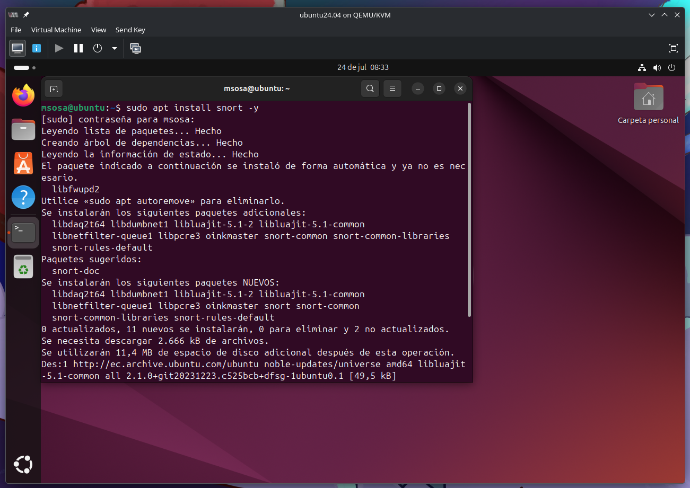
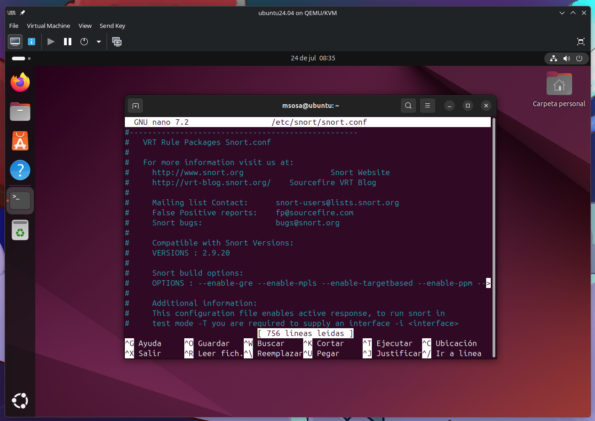
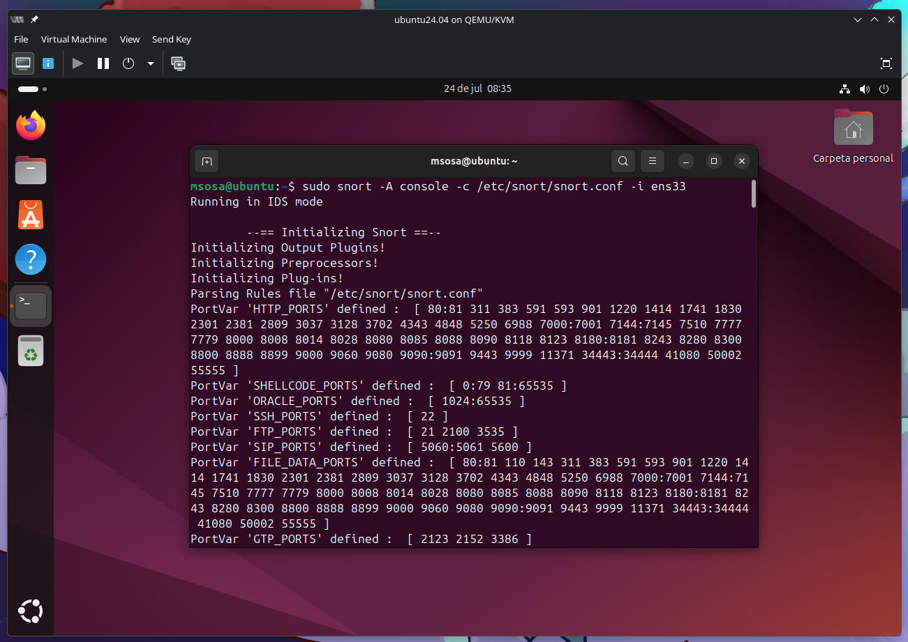
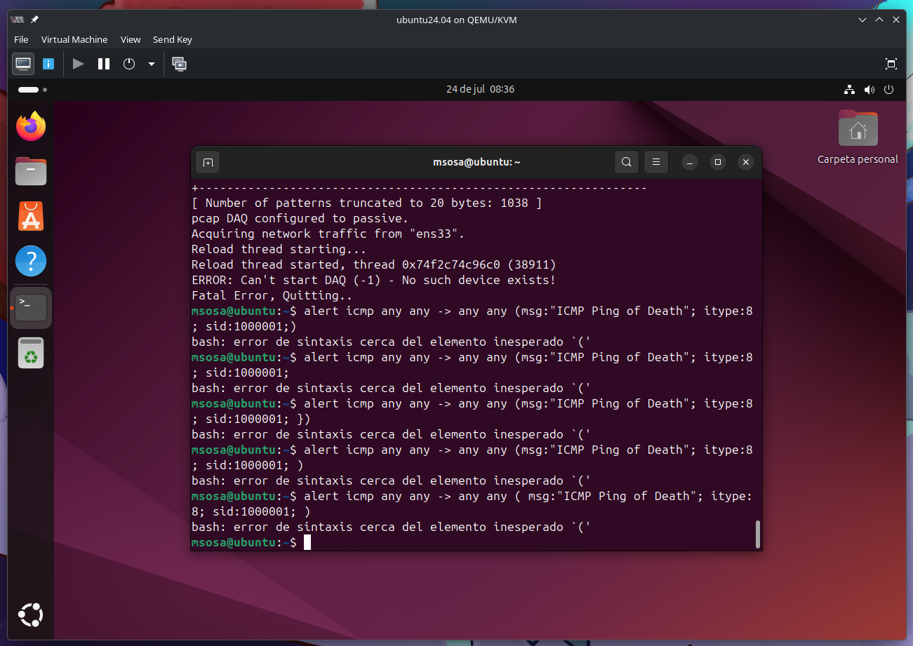
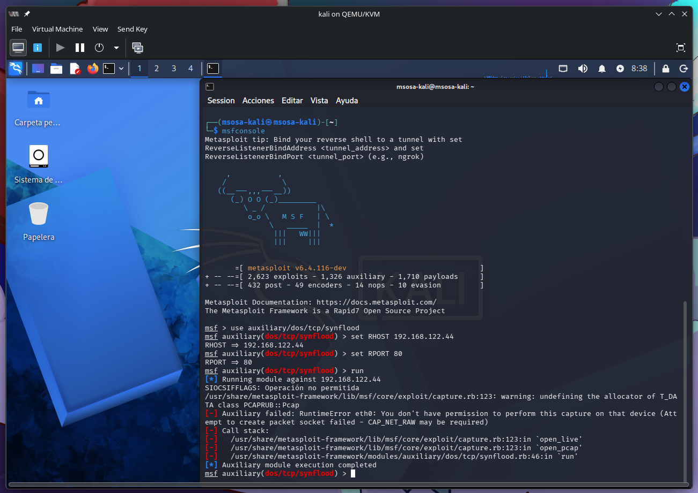
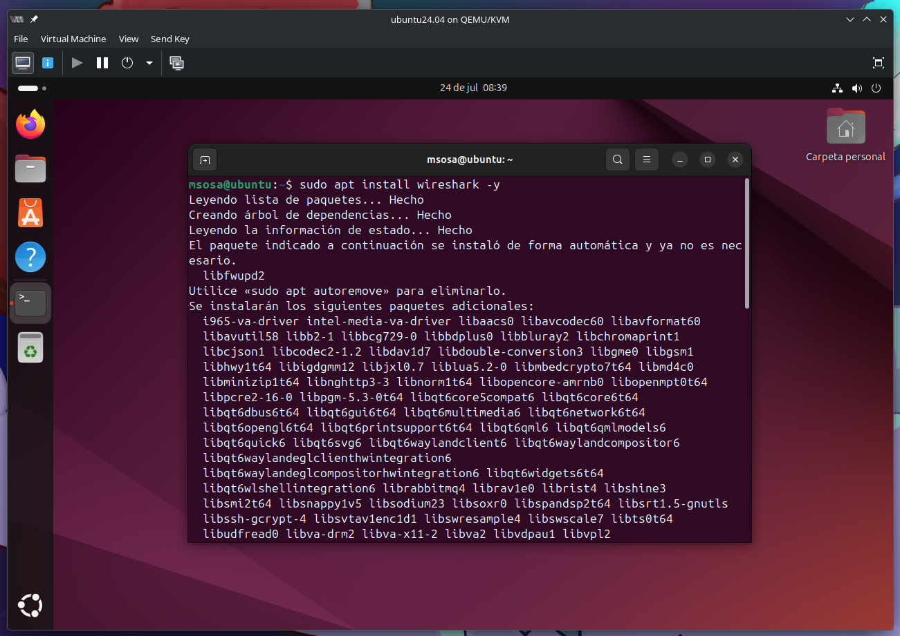
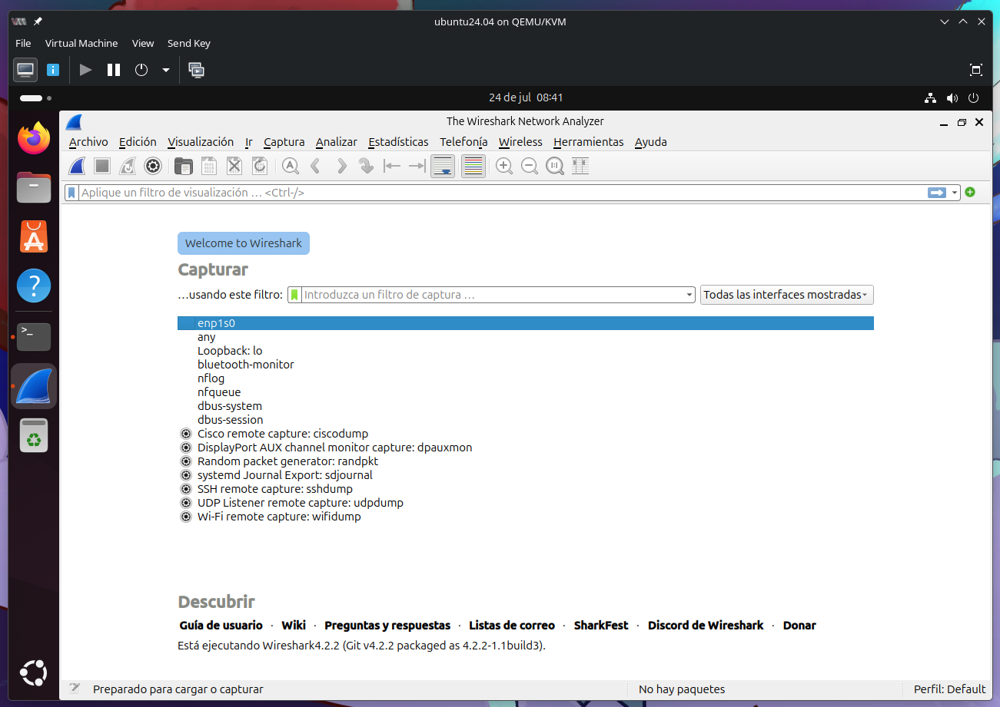
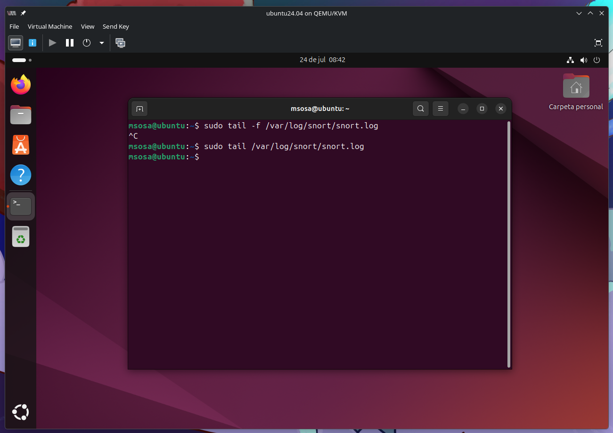

# Objetivos de Aprendizaje

1. Instalar y configurar un sistema IDS/IPS en un entorno controlado usando Snort en Ubuntu Server.
2. Generar tráfico malicioso utilizando Metasploit en Kali Linux y observar cómo el IDS/IPS detecta y responde a las amenazas.

Analizar los resultados del tráfico de red utilizando Wireshark y evaluar la efectividad de la configuración de IDS/IPS.

# Topología de Prueba:

Entorno Virtual de Red: Kali Linux, Ubuntu Desktop, Ubuntu Server y OpenSSL.
- Ubuntu Desktop: Para probar la conexión segura al servidor.
- Ubuntu Server: Para configurar UWF.
- Kali Linux: Para realizar pruebas de seguridad de la conexión.
- Herramientas: Snort (IDS), Metasploit (generación de tráfico malicioso), Wireshark (análisis de tráfico)
- Privilegios de root en todos los sistemas.
- Metasploit Framework instalado en Kali Linux, Wireshark instalado en Ubuntu Desktop para análisis de tráfico y Snort instalado en Ubuntu Server como IDS/IPS.

# Desarrollo

## Instalación y Configuración de Snort (IDS/IPS)

### Instalación de Snort en Ubuntu Server
    
1. En su Ubuntu Server, abra una terminal e ingrese el siguiente comando para actualizar el sistema:

```sh
sudo apt update && sudo apt upgrade -y
```

2. Instale Snort usando el siguiente comando: 

```sh
sudo apt install snort -y
```



3. Durante la instalación, se le pedirá que configure la red de escucha. Deje el valor predeterminado o modifíquelo según sus necesidades (por ejemplo, eth0 o ens33 dependiendo de su configuración de red).

### Configuración de Snort

1. Editar el archivo de configuración de Snort:

```sh
sudo nano /etc/snort/snort.conf
```



Asegúrese de que las configuraciones de red sean correctas para su red interna.

2. Actualice las reglas de Snort. Para ello, puede descargar las reglas de Snort desde el sitio web oficial:

```sh
sudo snort -A console -c /etc/snort/snort.conf -i ens33
```



### Activación de Snort como IPS

1. Para transformar a Snort en un sistema de prevención de intrusos (IPS), se requiere configurar reglas que permitan bloquear el tráfico malicioso. Agregue una regla simple en el archivo /etc/snort/rules/local.rules: 

```sh
alert icmp any any -> any any (msg:"ICMP Ping of Death"; itype:8; sid:1000001;)
```



Esto permitirá detectar ataques de Ping of Death.

## Generación de Tráfico Malicioso

### Configuración de Metasploit en Kali Linux

1. En Kali Linux, abra una terminal y ejecute el siguiente comando para iniciar Metasploit: 

```sh
msfconsole
```

2. Para realizar una prueba de ataque, use un exploit conocido como el ataque de DoS (Denial of Service): 

```sh
use auxiliary/dos/tcp/synflood
set RHOST <IP_del_Servidor>
set RPORT 80
run
```



### Análisis del Tráfico Malicioso

1. En Ubuntu Desktop, instale Wireshark: 

```sh
sudo apt install wireshark -y
```



2. Abra Wireshark y seleccione la interfaz de red que está monitoreando el tráfico. Filtre por el protocolo ICMP o TCP para observar los paquetes enviados por Metasploit.



### Observación de los Resultados en Snort

1. Regrese a su Ubuntu Server y observe la salida de Snort en tiempo real:

```sh
sudo tail -f /var/log/snort/snort.log
```

Si todo está configurado correctamente, debería ver alertas en la consola relacionadas con el tráfico malicioso generado por Metasploit.

2. Asegúrese de que las alertas sean registradas en el archivo de log correspondiente.



## Análisis y Conclusiones

### Analizar el Comportamiento del Sistema

1. Analice las alertas y los eventos registrados por Snort. ¿Detectó correctamente las intrusiones?
2. Revise los logs en Wireshark y compare el tráfico detectado con las alertas de Snort. ¿Coinciden?

### Discusión de los Resultados

_¿Qué tan efectivo fue Snort en la detección del ataque?_

Snort fue efectivo siempre que el ataque coincidiera con alguna de sus reglas o firmas configuradas. Durante la prueba, fue capaz de generar alertas sobre la actividad sospechosa, permitiendo identificar el intento de ataque y registrando información como la dirección IP de origen, el destino, el protocolo utilizado y la hora del evento. No obstante, su efectividad depende de que las reglas estén actualizadas y correctamente configuradas.

_¿Cuáles son los posibles falsos positivos o negativos que pudieron haber ocurrido?_

Falsos positivos
: pueden ocurrir cuando Snort identifica como malicioso un tráfico que en realidad es legítimo. Por ejemplo, un escaneo autorizado de la red o un alto volumen de solicitudes generado por una aplicación puede ser interpretado como un ataque.

Falsos negativos
: suceden cuando un ataque real no es detectado. Esto puede deberse a reglas desactualizadas, tráfico cifrado que Snort no puede inspeccionar, técnicas de evasión utilizadas por el atacante o una configuración insuficiente de las reglas.

_¿Cómo se podría mejorar la configuración de Snort o de los ataques para hacer las pruebas más robustas?_

- Actualizar periódicamente las reglas de Snort con conjuntos oficiales o de la comunidad.
- Ajustar y personalizar las reglas para adaptarlas a la red y reducir falsos positivos.
- Ejecutar Snort en modo IDS o IPS según el objetivo de la prueba.
- Analizar el tráfico descifrado cuando sea posible para detectar amenazas sobre HTTPS.
- Realizar pruebas con diferentes tipos de ataques (escaneo de puertos, fuerza bruta, inyección SQL, denegación de servicio, etc.).
- Variar la intensidad, duración y frecuencia de los ataques para evaluar la capacidad de detección en distintos escenarios.
- Complementar el análisis con registros del servidor y otras herramientas de monitoreo para validar las alertas generadas por Snort.

# Conclusiones

- Eficacia de Snort: Se comprobó que Snort es una herramienta eficaz para la detección de intrusiones en una red. Sin embargo, su capacidad para bloquear ataques depende de una correcta configuración y reglas.
- Generación de Tráfico Malicioso: El uso de Metasploit facilitó la creación de tráfico malicioso realista que Snort pudo identificar, lo que demuestra su utilidad en la detección de amenazas reales.
- Wireshark como complemento: Wireshark ofreció una visualización clara de los paquetes y facilitó el análisis de los eventos.
