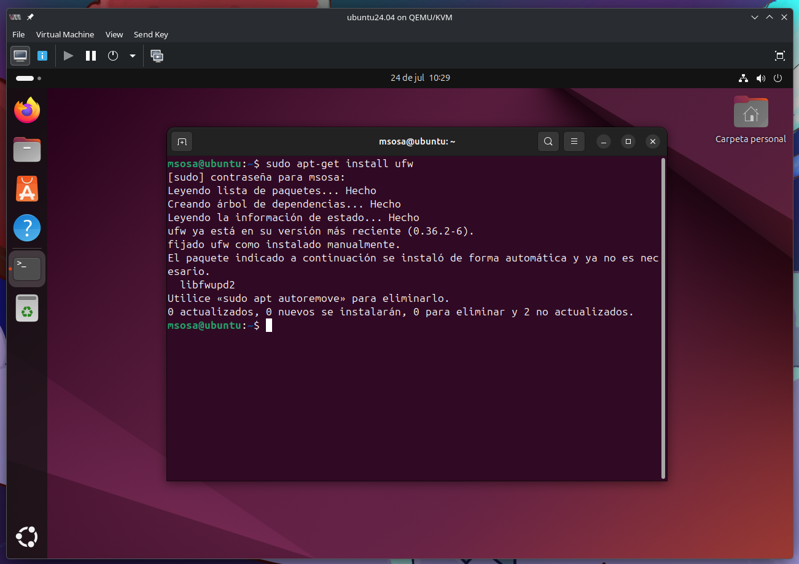
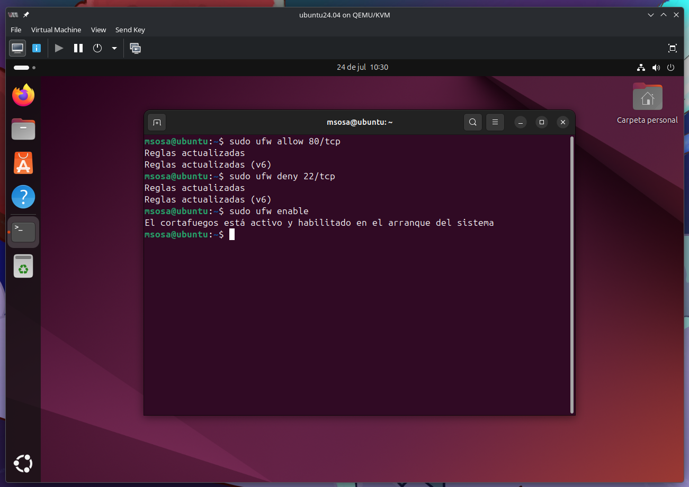
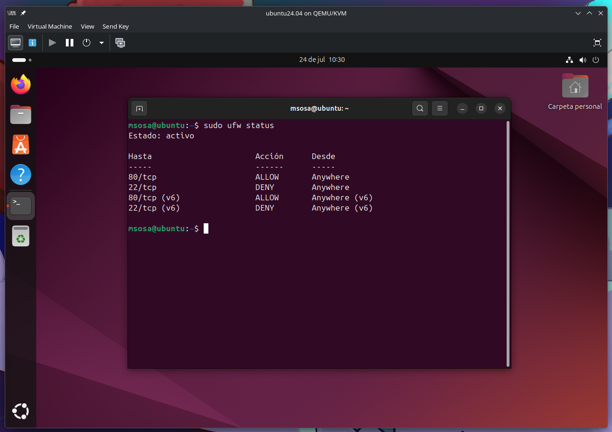
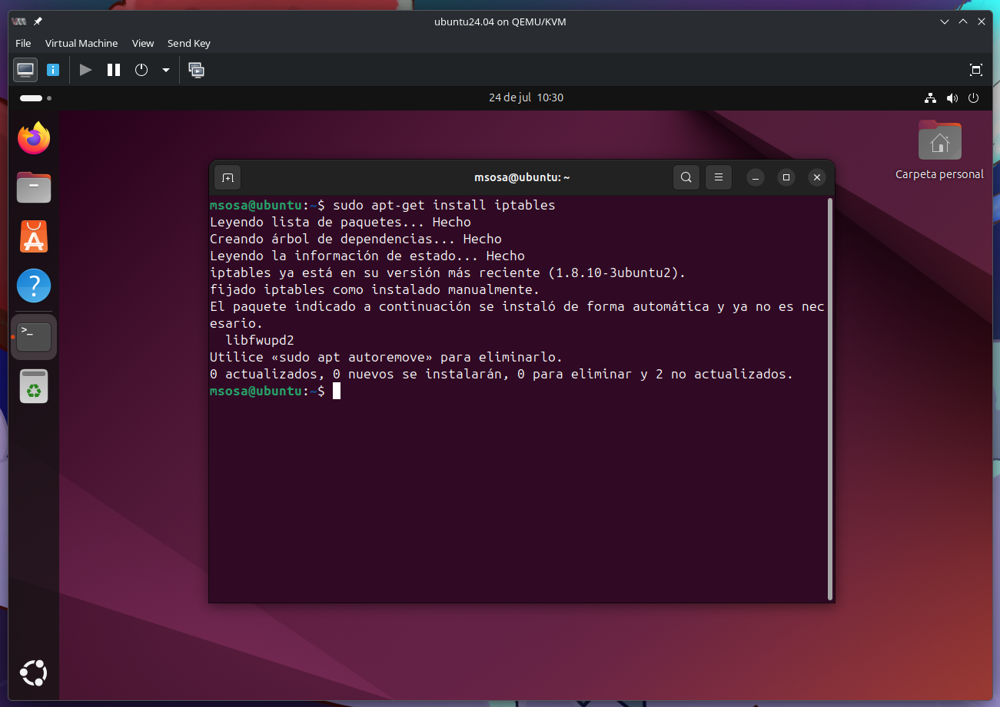
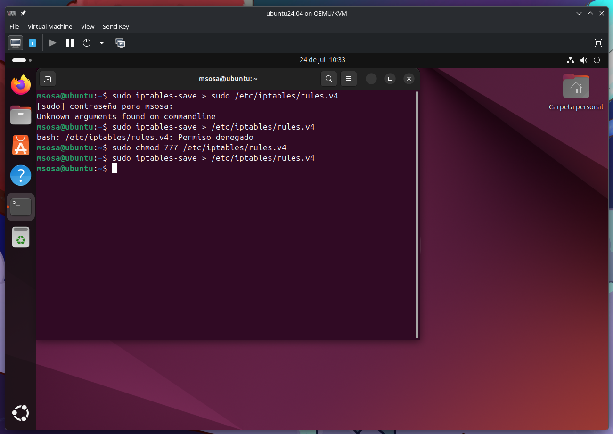
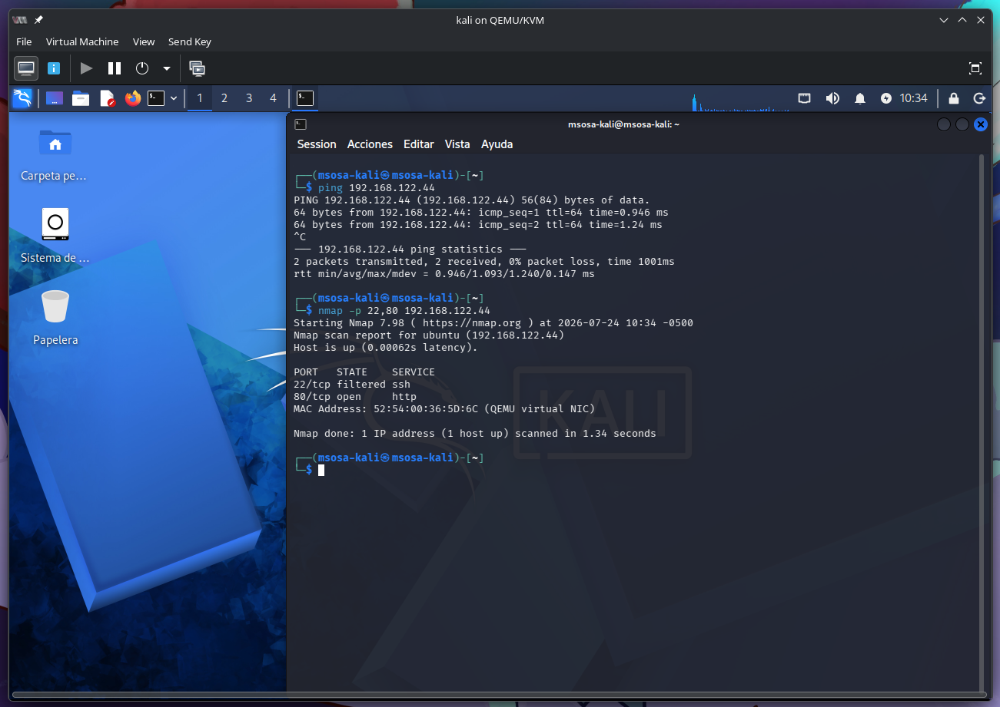

# Topología de Prueba

Entorno Virtual de Red: Kali Linux, Ubuntu Desktop, Ubuntu Server y OpenSSL.

- Ubuntu Desktop: Para probar la conexión segura al servidor.
- Ubuntu Server: Para configurar UWF.
- Kali Linux: Para realizar pruebas de seguridad de la conexión.

# Objetivos de Aprendizaje

1. Configurar y gestionar un firewall en Linux utilizando herramientas nativas como ufw (Uncomplicated Firewall) en Ubuntu e iptables en Ubuntu Server.
2. Implementar reglas de filtrado de tráfico para asegurar que solo el tráfico legítimo llegue a las aplicaciones y servicios habilitados en un servidor.
3. Simular ataques y realizar pruebas de penetración en un entorno controlado utilizando Kali Linux para comprobar la efectividad de las configuraciones de firewall.

# Marco Teórico

En el ámbito de la administración de sistemas y la seguridad de la información, un firewall es una barrera de protección que controla el tráfico entre redes, bloqueando o permitiendo la comunicación según las reglas predefinidas. En Linux, existen diversas herramientas para gestionar los firewalls, siendo ufw (Uncomplicated Firewall) una de las más accesibles en distribuciones como Ubuntu Desktop e iptables una herramienta más avanzada en distribuciones como Ubuntu Server y Kali.

1. UFW (Uncomplicated Firewall):
    - Descripción: Es una herramienta que facilita la configuración de iptables para administradores novatos y usuarios que requieren una gestión sencilla del firewall. Está orientada a facilitar la activación, desactivación y gestión de reglas de acceso de forma más amigable.
    - Comandos básicos: 
        - `sudo ufw enable` – Activa el firewall.
        - `sudo ufw status` – Muestra el estado actual del firewall.
        - `sudo ufw allow 80/tcp` – Permite tráfico HTTP.
        - `sudo ufw deny 22/tcp` – Bloquea tráfico SSH.
2. IPTABLES:
    - Descripción: Es la herramienta de firewall más poderosa y flexible en Linux. A diferencia de UFW, iptables permite un control granular de las conexiones de red, gestionando reglas para distintos tipos de tráfico (entrante, saliente, de reenvío, etc.).
    - Comandos básicos: 
        - `sudo iptables -L` – Muestra las reglas actuales.
        - `sudo iptables -A INPUT -p tcp --dport 80 -j ACCEPT` – Permite tráfico HTTP.
        - `sudo iptables -A INPUT -p tcp --dport 22 -j REJECT` – Bloquea tráfico SSH.
3. PRUEBAS DE PENETRACIÓN:
    - Kali Linux es una distribución orientada a pruebas de seguridad. En esta práctica, utilizaremos Kali Linux para simular ataques (como un escaneo de puertos o un ataque DoS) y validar la efectividad de las reglas configuradas en el firewall de Ubuntu.

# Desarrollo de la Práctica:

## Preparación del Entorno Virtual

1. Inicie las tres máquinas virtuales (Ubuntu Desktop, Ubuntu Server y Kali Linux).
2. Asegúrese de que las máquinas puedan comunicarse entre sí a través de la red interna (Bridge o Red NAT).
3. Acceda a la terminal de Ubuntu Desktop (cliente), Ubuntu Server (servidor) y Kali Linux (máquina atacante).

## Configuración del Firewall en Ubuntu Desktop

1. Instalar UFW en el sistema operativo Ubuntu Desktop si no está instalado:

```sh
sudo apt-get update
sudo apt-get install ufw
```



2. Habilitar UFW y configurar reglas básicas de acceso: 
    - Permitir tráfico HTTP (puerto 80/tcp): `sudo ufw allow 80/tcp`
    - Bloquear tráfico SSH (puerto 22/tcp): `sudo ufw deny 22/tcp`
    - Activar UFW: `sudo ufw enable`



3. Verificar el estado del firewall: 

```sh
sudo ufw status
```



## Configuración del Firewall en Ubuntu Server

1. Instalar iptables si no está instalado:

```sh
sudo apt-get update
sudo apt-get install iptables
```



2. Configurar reglas de filtrado de tráfico: 
    - Permitir tráfico HTTP (puerto 80/tcp): `sudo iptables -A INPUT -p tcp --dport 80 -j ACCEPT`
    - Bloquear tráfico SSH (puerto 22/tcp): `sudo iptables -A INPUT -p tcp --dport 22 -j REJECT`
    - Guardar las reglas para que se apliquen tras el reinicio: `sudo iptables-save > /etc/iptables/rules.v4`



## Simulación de Ataques desde Kali Linux

1. Desde Kali Linux, realice un escaneo de puertos para comprobar si las reglas del firewall en el servidor y el cliente están funcionando correctamente: 
    - Escaneo de puertos en Ubuntu Server: `nmap -p 80,22 [IP_del_Servidor]`
    - Verifique que el puerto SSH (22) esté bloqueado y el puerto HTTP (80) esté abierto.
    - Utilice Nmap para realizar el escaneo de vulnerabilidades, las redes inalámbricas, el sistema operativo, los firewalls.
    - Utilice nikto (Kali Linux) para repetir el proceso



# Conclusiones:

Durante esta práctica, los estudiantes aprendieron a configurar y gestionar un firewall en un entorno Linux mediante herramientas como UFW e iptables. A través de la simulación de ataques utilizando Kali Linux, los estudiantes podrán verificar la efectividad de sus configuraciones y reforzar sus conocimientos en seguridad informática. La implementación de un firewall adecuado es esencial para proteger los servidores y sistemas ante posibles accesos no autorizados.
