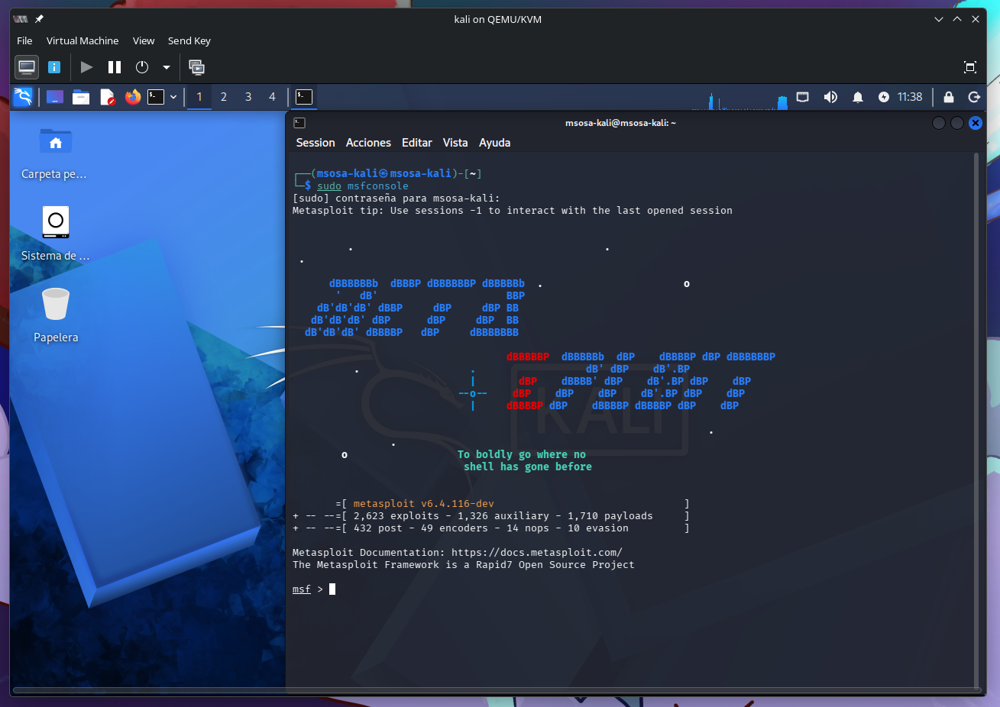
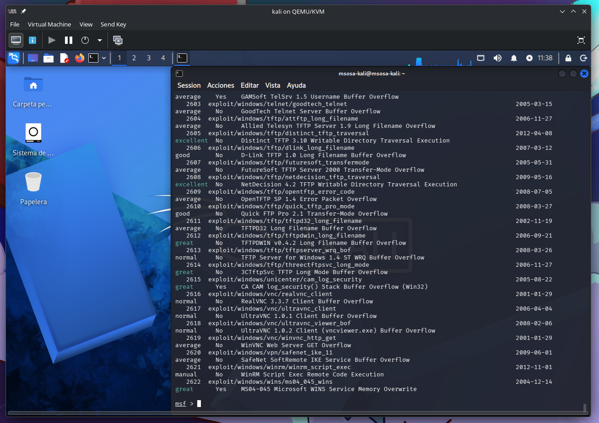
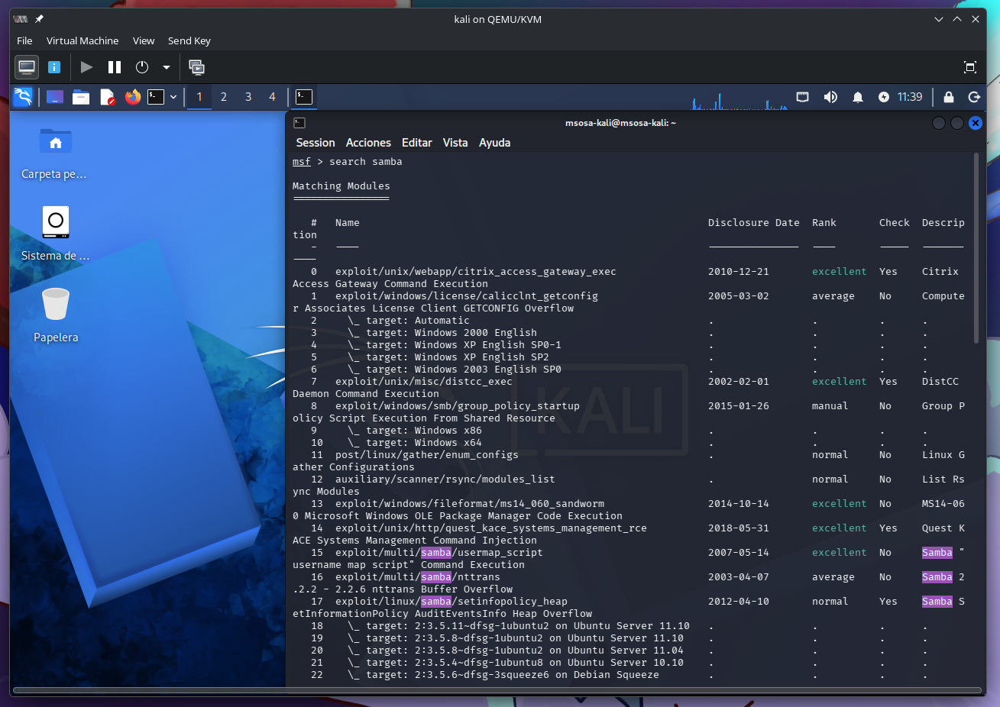
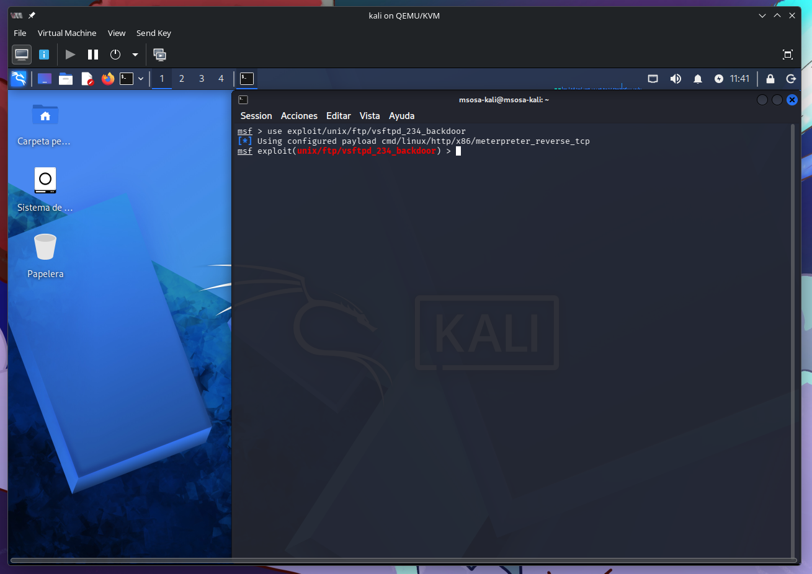
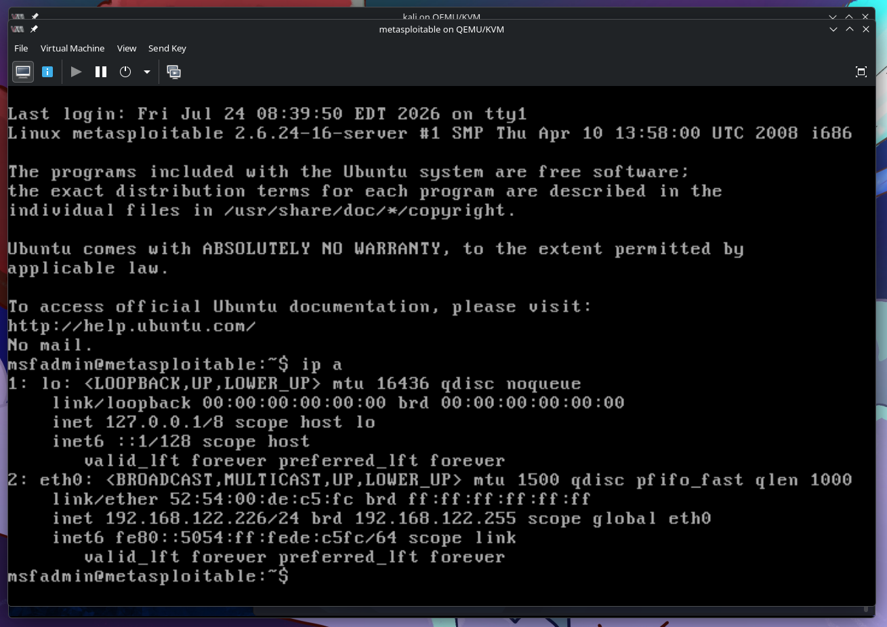
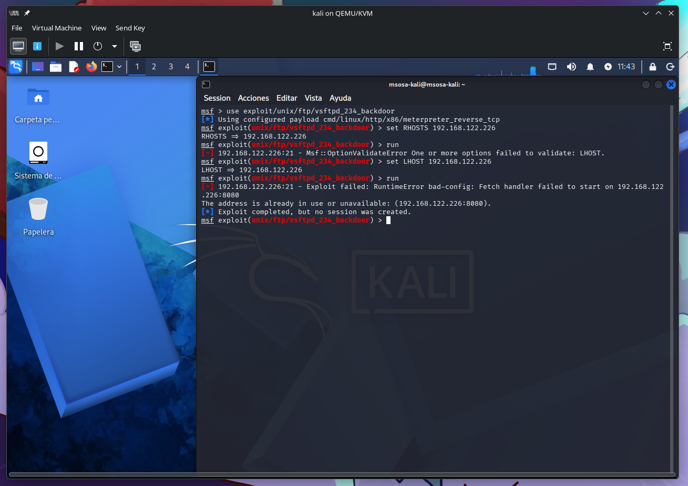

# Objetivos de Aprendizaje

Al finalizar esta práctica, el estudiante será capaz de:

1. Comprender el concepto y uso de exploits y CVEs en el contexto de ciberseguridad.
2. Buscar y analizar exploits usando Metasploit Framework.
3. Reutilizar exploits conocidos de forma ética en sistemas vulnerables dentro de una red local simulada.
4. Aplicar prácticas éticas al ejecutar ataques controlados en un entorno educativo.
5. Comparar plataformas de entrenamiento en seguridad ofensiva (DVWA, TryHackMe, Hack The Box, Metasploitable2).

# Topología de Prueba

- Kali Linux,  herramienta ofensiva, con Metasploit Framework.
- Ubuntu Desktop, objetivo de pruebas simulando una estación de usuario.
- Ubuntu Server,  objetivo de pruebas con servicios como SSH, FTP, Apache.
- VM Metasploitable 2, máquina virtual sin niveles de seguridad intencionalmente configurada.

Las VMs están conectadas en red interna (modo "Red Nat").

# Marco Teórico

## ¿Qué es un Exploit?

Un exploit es un fragmento de código o software que se aprovecha de una vulnerabilidad en un sistema para ejecutar comandos no autorizados o alterar el funcionamiento normal del software (Skoudis & Liston, 2006).

## ¿Qué es un CVE?

CVE (Common Vulnerabilities and Exposures) es un sistema estandarizado para nombrar vulnerabilidades públicas. Ejemplo: CVE-2017-0144 corresponde al exploit EternalBlue usado por WannaCry (MITRE, 2024).

## ¿Qué es Metasploit Framework?

Metasploit es una herramienta de código abierto usada para:

- Buscar vulnerabilidades conocidas
- Lanzar exploits
- Automatizar pruebas de penetración

## ¿Qué es Metasploitable2?

Es una máquina virtual diseñada para contener vulnerabilidades reales con fines educativos. Permite practicar explotación sin comprometer sistemas reales.

## Plataformas recomendadas para prácticas éticas

| Plataforma | Descripción | Acceso |
| --- | --- | --- |
| DVWA | Aplicación web vulnerable para pruebas de XSS, SQLi, CSRF, etc. | Local |
| TryHackMe | Plataforma educativa con laboratorios virtuales guiados. | Online |
| Hack The Box | Retos avanzados de hacking en VMs vulnerables. | Online |
| Metasploitable2 | Máquina vulnerable local para prácticas generales. | Local |

: Plataformas Recomendadas, con descripción y tipo de acceso

# Desarrollo

## Iniciar Metasploit

Desde la terminal de Kali Linux:

```sh
sudo msfconsole
```



Comandos a explorar:

- `search` (buscar exploits)
- `show exploits`
- `use`
- `info`
- `set`
- `run`



## Buscar Exploits por nombre o CVE

Ejemplos:

```sh
search samba
search cve:2017-0144
```



Elegir un exploit y obtener sus detalles:

```sh
use exploit/unix/ftp/vsftpd_234_backdoor
```



## Reutilizar un Exploit 

1. Verificar la IP del objetivo (Ubuntu Server):

```sh
ip a
```



2. En Kali Linux, configurar y lanzar el exploit:

```sh
set RHOSTS 192.168.56.105
run
```



3. Observar si se obtiene acceso (shell remota, servicio caído, etc.).

## Automatizar análisis

Usar módulos auxiliares:

```sh
use auxiliary/scanner/ftp/anonymous
set RHOSTS 192.168.56.105
run
```


Este tipo de escaneo es útil para mapear servicios antes de lanzar exploits.

## Discusión ética

_¿Qué diferencias existen entre pruebas en entornos simulados y reales?_

| Entornos simulados                                                  | Entornos reales                                                                            |
| ------------------------------------------------------------------- | ------------------------------------------------------------------------------------------ |
| Se realizan en laboratorios o máquinas virtuales controladas.       | Se ejecutan sobre sistemas en producción o infraestructuras reales.                        |
| No afectan servicios ni usuarios reales.                            | Un error puede afectar la disponibilidad, integridad o confidencialidad de la información. |
| Permiten experimentar libremente con ataques y configuraciones.     | Requieren autorización, planificación y medidas para minimizar riesgos.                    |
| Son ideales para aprendizaje, pruebas y validación de herramientas. | Permiten evaluar la seguridad frente a condiciones reales de operación.                    |

: Comparativa entre entornos simulados y reales

_¿Qué obligaciones tiene un ingeniero de software frente a la seguridad?_

- Diseñar aplicaciones siguiendo principios de seguridad desde el diseño (Security by Design).
- Validar y sanitizar las entradas para prevenir vulnerabilidades como inyección SQL o XSS.
- Implementar mecanismos de autenticación y autorización adecuados.
- Proteger la información mediante cifrado y comunicaciones seguras (HTTPS/TLS).
- Mantener el software y sus dependencias actualizados.
- Realizar pruebas de seguridad y corregir las vulnerabilidades detectadas.
- Aplicar el principio de mínimo privilegio para usuarios y servicios.
- Cumplir las políticas de seguridad y las normativas de protección de datos de la organización.

_¿Qué malas prácticas de desarrollo permiten estos ataques?_

- No validar ni sanitizar las entradas del usuario.
- Construir consultas SQL mediante concatenación de cadenas (favoreciendo la inyección SQL).
- Almacenar contraseñas en texto plano o utilizar algoritmos de hash inseguros.
- Utilizar configuraciones por defecto o credenciales débiles.
- No aplicar controles de autorización adecuados.
- No mantener actualizado el sistema operativo, las bibliotecas y las dependencias.
- Exponer información sensible en mensajes de error o registros.
- No utilizar HTTPS para proteger las comunicaciones.
- Asignar permisos excesivos a usuarios, procesos o aplicaciones.
- No realizar pruebas de seguridad ni revisiones periódicas del código.

# Conclusiones

- Metasploit Framework es una herramienta poderosa para la investigación de vulnerabilidades reales.
- Un entorno virtual seguro permite practicar sin comprometer sistemas reales.
- Conocer y practicar la explotación de CVEs ayuda a formar profesionales responsables en ciberseguridad.
- Comparar distintas plataformas permite evaluar recursos de aprendizaje y desafíos reales en el ámbito ofensivo.
