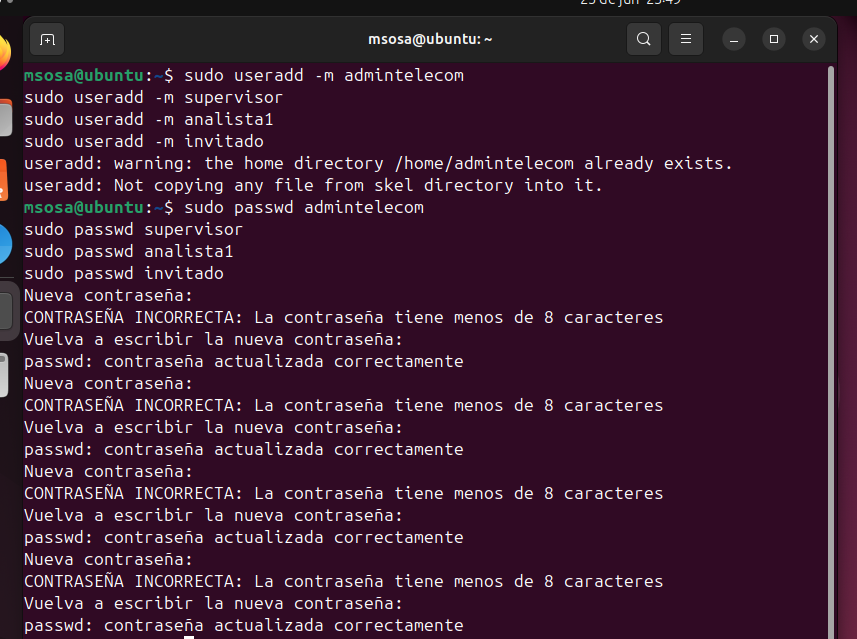
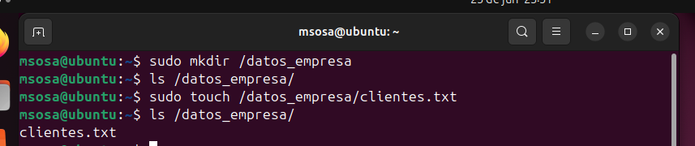
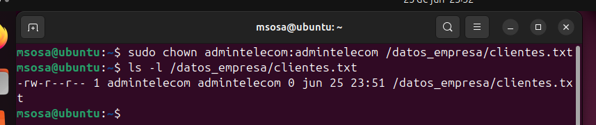
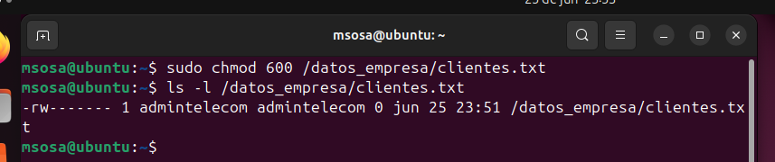
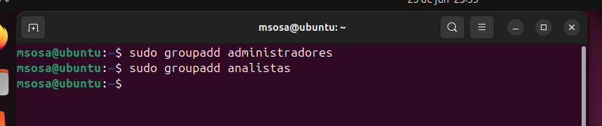
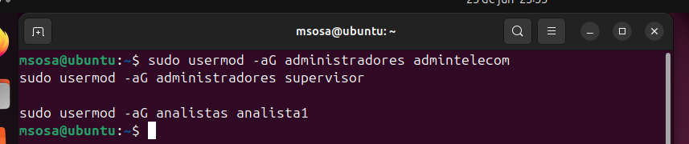
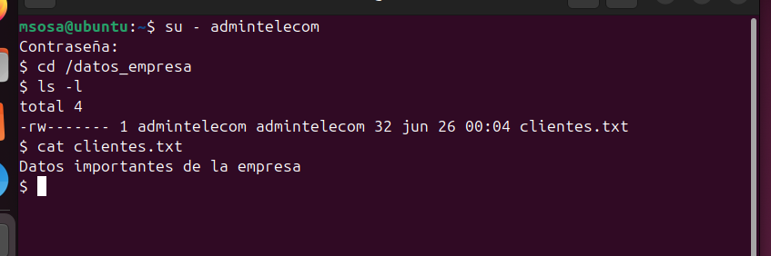
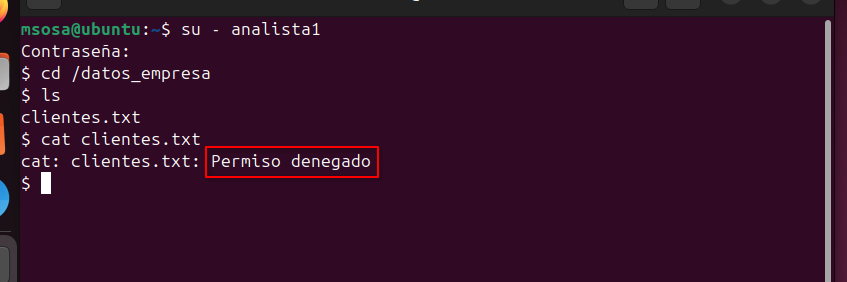

# Actividad Extra

##  Descripción del escenario

### Tipo de organización

La organización corresponde a una **empresa de Telecomunicaciones**, dedicada a brindar servicios de telefonía móvil, telefonía fija, internet por fibra óptica y televisión por suscripción. La empresa administra información de miles de clientes y cuenta con diferentes departamentos, como Soporte Técnico, Operaciones, Atención al Cliente y Administración de Infraestructura.

### Información crítica que debe protegerse

La empresa almacena información sensible, entre la que se encuentra:

- Base de datos de clientes.
- Información personal (nombres, direcciones, teléfonos y correos electrónicos).
- Contratos y facturación.
- Configuraciones de equipos de red.
- Credenciales de acceso a servidores.
- Reportes internos y documentación técnica.

### Riesgos asociados al acceso no autorizado

Si un usuario no autorizado accede a la información, podrían presentarse los siguientes problemas:

- Robo de información personal de clientes.
- Modificación o eliminación de configuraciones críticas.
- Interrupción de los servicios de telecomunicaciones.
- Pérdidas económicas.
- Incumplimiento de normativas de protección de datos.
- Daño a la reputación de la empresa.

## Definición de usuarios y roles

### Usuarios & Roles

| Usuario | Rol |
|:---:|:---:|
| _admintelecom_ | Administrador |
| _supervisor_ | Analista |
| _analista1_ | Analista |
| _invitado_ | Analista |

: Clasificación de Usuarios en base a su Rol \label{table_roles}


Administrador
: Tiene acceso a todas las funcionalidades del sistema.

Analista
: Puede realizar consultas sobre ciertos datos de ciertas tablas, pero no puede modificarlos ni revisar tablas sensibles.

## Aplicación de modelos de control de acceso

### Crear usuarios

```bash
sudo useradd -m admintelecom
sudo useradd -m supervisor
sudo useradd -m analista1
sudo useradd -m invitado

sudo passwd admintelecom
sudo passwd supervisor
sudo passwd analista1
sudo passwd invitado
```



### Crear directorio y archivo confidencial

```bash
sudo mkdir /datos_empresa
sudo touch /datos_empresa/clientes.txt
```



### Asignar propietario

```bash
sudo chown admintelecom:admintelecom /datos_empresa/clientes.txt
```



### Configurar permisos

Solo el propietario podrá leer y escribir.

```bash
chmod 600 /datos_empresa/clientes.txt
```

Verificar permisos:

```bash
ls -l /datos_empresa/clientes.txt
```



### Crear grupos

```bash
sudo groupadd administradores
sudo groupadd analistas
```



### Asignar usuarios a los grupos

```bash
sudo usermod -aG administradores admintelecom
sudo usermod -aG administradores supervisor

sudo usermod -aG analistas analista1
```



## Pruebas de funcionamiento

### Usuario autorizado



### Usuario sin permisos



## Análisis

### ¿Qué ventajas ofrece DAC en este escenario?

El modelo DAC permite que el propietario de los archivos controle directamente quién puede acceder a ellos. Es sencillo de implementar y adecuado para proteger recursos específicos cuando el propietario necesita administrar los permisos de forma individual.

### ¿Qué ventajas ofrece RBAC?

RBAC simplifica la administración de permisos al asignarlos a grupos o roles en lugar de configurarlos usuario por usuario. Esto facilita el mantenimiento, reduce errores administrativos y mejora la escalabilidad cuando existen muchos empleados.

### ¿Cuál modelo recomendarían implementar en una organización real y por qué?

Se recomienda implementar principalmente **RBAC**, ya que una empresa de telecomunicaciones posee numerosos empleados con diferentes responsabilidades. La administración mediante roles facilita la incorporación de nuevos usuarios, reduce errores en la asignación de permisos y fortalece la seguridad. El modelo DAC puede utilizarse de manera complementaria para proteger archivos específicos que requieran permisos personalizados.

### ¿Qué vulnerabilidades podrían existir si los permisos estuvieran mal configurados?

Una configuración incorrecta de permisos podría ocasionar:

- Acceso no autorizado a información confidencial.
- Modificación o eliminación accidental de archivos críticos.
- Escalada de privilegios.
- Robo de datos de clientes.
- Alteración de configuraciones de la infraestructura.
- Interrupción de servicios esenciales.
- Incumplimiento de políticas y normativas de seguridad.
